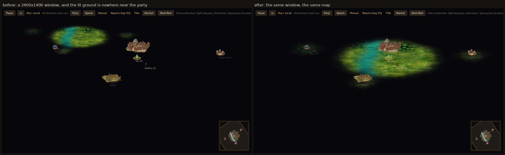

# Bug fixes, 2026-09-16 — three filed issues, and what each one actually was

Issues #58, #55 and #56 off the in-game reporter. Two of the three were caused
by work that landed the same day, which is the useful part of the pattern: both
were right on the machine they were built on.

## #58 — "fog mechanic completely lost after campaign tiles changed"

Not the fog. The map's **projection**, on any window that is not 1280x800.

`assets/world/ground/ground.gdshader` (PR #49) replaced the per-cell tile draw
with one pass that projects every pixel back to world space and looks the ground
kind and the fog up there. It started that projection from `FRAGCOORD`, which is
a coordinate in real framebuffer pixels — while `_origin`, `_zoom` and
`_pix()/_unpix()` in `scenes/world/world.gd` are in the *stretched canvas's*
units, because `project.godot` sets `window/stretch/mode="canvas_items"` over a
1280x800 base. At the default size the two agree exactly, so this looked right
everywhere it was checked. On the reporter's 3840x2118 window the factor is
~2.65: every screen pixel resolved to a world point two and a half times further
from the camera than the one actually under it, so the painted ground and its
circle of sight sat off behind the party while the party stood on unlit black.
Walking did not help — the fog was not failing to record anything, it was being
drawn somewhere else.

The shader now takes `rect_size` (the map control's own size, which `world.gd`
feeds it) and starts from `UV * rect_size`: the same coordinate `_unpix()`
speaks, at any window size, and relative to the control rather than the window,
so an inset map would be right too.

`test_world_ground` grew the check that would have caught it: the shader's
projection, replayed in GDScript from the uniforms the live material carries,
has to land within half a world unit of `_unpix()` across the control — at a
size deliberately unlike the default — and the shader has to be *fed* the
control's coordinate rather than a framebuffer pixel.

## #55 — "travel pop up should only show one picture, and one after the decision is made"

The approach card (`scenes/world/approach_card.gd`) showed the picture of the
way **under the mouse**. Reading four rows meant four paintings flipping through
one banner, and then the outcome card behind it made a fifth — a handful of
pictures for a single meeting on the road.

One picture now, chosen when the card opens and fixed for its life: the band
coming up the road (`event-approach-engage`), or the friendly version of the
same shot (`event-approach-greet`) when the two no-roll ways are all that is
offered. The way's own art keeps its job on the *other* side of the decision —
the event card `world.gd` opens next still shows that way's pass/fail frame. One
for the question, one for the answer.

## #56 — "barks are still old sounds"

True, and the only set left: PR #44/#45 replaced all 43 stings with ElevenLabs
takes, `assets/audio/barks/` stayed the oscillator-and-filter set
`tools/gen_audio.py` writes. All twelve are model takes now — three each for
hero, gruff, deep and squeak, from the prompts already written down in
`tools/gen_audio_elevenlabs.py`, through that file's own post-pass (silence
trimmed, DC centred, peak-normalized to 28480 like every other sound in the
game).

Two things the barks needed that the stings did not, both now in the tool:

* **A length cap.** `duration_seconds` is a request — takes came back at 2s and
  3s against the 0.8s asked. A bark is a stinger under one line of text, fired
  from an 8-voice round-robin while the fight moves on; a roar that holds a
  voice for two and a half seconds is still going when the next character
  speaks. `BARK_MAX_SECONDS` cuts at 1.0s.
* **A tail fade.** `tools/check_audio.py` fails a one-shot whose last 10 ms are
  still loud, and it was right to: several takes end mid-shout, which is a voice
  stopping rather than a sound finishing. Every bark gets a squared 120 ms fade,
  cut or not.

`tools/check_audio.py` passes on all 94 files, and the four archetypes are still
four: measured zero-crossing pitch runs 71–188 Hz for `deep`, ~500–640 Hz for
`hero` and `gruff`, and 1100–1950 Hz for `squeak`.
