# sorcmerc → CRPG expansion — plan

Turns the tactical-combat prototype into a roguelite: build characters on D&D
5.5e rules, form a party, cross a node map (combat / treasure / merchant / rest),
drop into the existing combat screen for fights, carry results back.

## The source

`~/dnd-maintainer` is a 2024 5.5e **campaign manager** (React / TS / Supabase).
Its `src/lib/` is a ~30k-line **grant + resolver engine**: classes / species /
backgrounds / feats emit typed *grants* (hit-die, proficiency, feature,
resource-pool, spell, choice); a resolver materializes a character (HP, AC,
speed, skills, spellcasting, resource pools) from a build + those grants. Data
is in `src/lib/sources/*.ts` and `scripts/data/5e-SRD-*.json`.

It is not a library we can import — it's TS, coupled to React/Zod/Supabase, and
covers 20 levels / multiclassing / hundreds of feats & spells that a small-party
tactical game will never use.

## The fork — how much of D&D to bring over

**A. Full port.** Reimplement the grant/resolver engine in GDScript, extract all
data. Faithful, enormous, most of it dead weight here. Weeks, high risk.

**B. Curated subset.** Extract only the *data we use* to JSON (the classes,
species, spells, gear the game ships with, levels 1–~6), and write a *small*
GDScript character model + level-up chooser that reads it. dnd-maintainer becomes
a data source, not a code dependency. Days–weeks.

**C. Curated subset, extensible schema (recommended).** B, but the exported JSON
schema mirrors dnd-maintainer's grant shape closely enough that adding a class or
raising the level cap later is a data change, not a code change. Same effort as B.

## Sub-projects & dependency graph

```
F1 export ─┬─> F2 character model ─┬─> F3 action economy ─┬─> T7 combat↔campaign
           │                       ├─> T1 character creator │
           │                       ├─> T2 level-up          │
           │                       ├─> T3 profile manager    │
           │                       └─> T4 party manager ─> T5 campaign map ─> T6 node types ─┘
```

| ID | Sub-project | Owns | Depends on |
|----|-------------|------|------------|
| **F1** | **Data export** — a Node script in dnd-maintainer emitting `sorcmerc/data/{classes,species,backgrounds,feats,skills,weapons,armor,spells}.json` with mechanical fields (hit die, proficiencies, per-level features & resources, spell slots, weapon dice/properties, spell save/damage/shape). | `dnd-maintainer/scripts/export-sorcmerc.mjs`, `sorcmerc/data/*.json` | — |
| **F2** | **Character model** — `core/character.gd` + `core/rules.gd`: abilities, proficiency bonus, skills, class/level, features (a set), resources, inventory; derived AC/HP/init/speed/attacks computed from F1 data. Replaces the ad-hoc fields in `combatant.gd`; a `Character` *is* a `Combatant` for the resolver. | `core/character.gd`, `core/rules.gd`, `core/combatant.gd` | F1 schema |
| **F3** | **Action economy** — real action / bonus / reaction / move per turn in `combat.gd`; feature- and resource-driven verbs (Rage, Action Surge, Sneak Attack, spell slots) sourced from the character's features; conditions from data. | `core/combat.gd`, `core/ai.gd` | F2 |
| **T1** | **Character creator** — Godot scene, steps species → class → abilities (point-buy / standard array) → skills → background → equipment, driven by F1 data; outputs a `character.gd`. | `scenes/creator/*` | F2 |
| **T2** | **Level-up** — given character + target level, surface the choices in F1 data (ASI/feat, subclass at 3, skill/expertise, spells) and apply grants. | `core/leveling.gd`, `scenes/creator/levelup.gd` | F2, F1 |
| **T3** | **Profile manager** — scene: view/edit stats, view/equip inventory, spend/restore resources. | `scenes/profile/*` | F2 |
| **T4** | **Party manager** — a roster (built via T1), pick the active ≤4, shared gold + stash. | `core/party.gd`, `scenes/party/*` | F2 (T1 for the create button) |
| **T5** | **Campaign map** — node graph (start → branching combat/treasure/merchant/rest → boss), party token moves node→node, per-node resolution; combat nodes hand off to the combat scene and await an outcome. | `core/campaign.gd`, `scenes/campaign/*` | T4 |
| **T6** | **Node types** — merchant (buy/sell vs SRD prices), treasure (loot tables), rest (short/long rest recovery). | `core/nodes/*`, `scenes/campaign/*` | T5, F1 |
| **T7** | **Combat ↔ campaign integration** — `encounter.gd` builds an encounter from a spec + the live party instead of hardcoding; combat returns deaths / loot / XP; the combat UI takes party characters. | `core/encounter.gd`, `scenes/main.gd` | F3, T5 |
| **T8** | **Encounter scaler / difficulty** — given the live party (levels, gear, features, resources → a power budget), generate the enemy roster for a node. Difficulty tiers tuned so autopilot party win-rate is ~90% (easy) / ~75% (normal) / ~50% (hard); tune enemy count, HP, AC, to-hit, damage, and kit, verified against the 200-seed sweep in `tests/test_combat.gd`. Must accept a quest-bias hint from T9 (see below). | `core/scaler.gd`, `core/encounter.gd` | F2, F3, T7 |
| **T9** | **Quest system + quest log panel** — see design below. A simple, linear, node-scoped quest layer: a merchant node can offer a kill-count or item-collect quest; later combat nodes on the same route bias their spawns toward an unfulfilled quest's target monster; a quest log panel on the campaign screen shows active/complete quests and progress. | `core/quest.gd`, `core/quest_log.gd`, `scenes/campaign/quest_panel.gd` | T4 (party holds the log), T5 (hosts the panel), T7 (spawn bias hook), T8 (folds the bias into the roster) |

## Realistic phasing (what can actually run in parallel)

1. **F1** — 1 agent. Standalone (a script in the other repo). Defines the schema everything else reads.
2. **F2** — 1 agent. Everything waits on the character model.
3. **F3 · T1 · T3 · T4** — 4 agents in parallel (disjoint files once F2's interface is fixed).
4. **T2 · T5** — 2 agents (T5 after T4).
5. **T6 · T7** — 2 agents.

Not "12 agents now" — the shared character model forces phases 1–2 to be serial.
Each phase ends with a review gate before the next starts.

## Scope decisions (locked 2026-09-10)

- **Port scope: A — full port.** Reimplement the grant + resolver engine in
  GDScript; export dnd-maintainer's entire catalog.
- **Roster: all 12 PHB classes, ~6 species** (Human, Elf, Dwarf, Halfling, Orc,
  Tiefling), all backgrounds, the full feat & spell catalog dnd-maintainer carries.
- **Level cap: 20** (multiclassing an open question — default single-class unless
  cheap to include).
- **Heroes:** Vera / Pike / Ilsa are rebuilt through the creator as preset builds;
  a new game starts by building your own party.

## T9 design sketch — quests (locked 2026-09-10, kept deliberately simple)

**Quest shape** (`core/quest.gd`, a plain data class, matches the `resolved.gd`/
`grants.gd` style — no inheritance hierarchy for two quest types):
```
id, giver_node_id, title, kind: "kill_count" | "collect_item",
target_monster_id, target_item_id (only for collect_item — the drop the kills yield),
required: int, progress: int, state: "offered" | "active" | "complete" | "turned_in",
reward: {gold: int, item_id: String (optional)}
```
- **kill_count** — progress += 1 per kill of `target_monster_id`, tracked from combat's
  outcome (kill log already exists in `combat.gd`'s log; T7's write-back is where this
  taps in).
- **collect_item** — `target_item_id` drops from `target_monster_id` at a drop chance
  (a new small table, e.g. `data/loot-drops.json`, or a flat rate to start — 50%);
  progress is actual items collected, not kills, so "I killed 5 goblins but only have
  3 ears" is the intended, expected texture, not a bug.

**Offer/turn-in:** merchant nodes (T6) can offer one canned quest from a short curated
list (hand-authored, not procedurally generated — "bring me N goblin ears", "clear N
wolves from the road"); accepting adds it to the party's quest log (`core/party.gd`
gains a `quests: Array` — T4's file, small additive change) in `"active"` state.
Turning in (back at the giver, or a follow-up node) needs `progress >= required`;
pays the reward, sets `"turned_in"`.

**The spawn-bias hook (the part that touches encounter generation):** a node's combat
spec (T7) checks the party's active quests before building its roster; if an active
quest's `target_monster_id` isn't yet fulfilled, the scaler (T8) is told to include
extra copies of that monster in the next 1-2 combat nodes on the route — a bias
weight, not a hard override, so it composes with difficulty tuning rather than
fighting it. `core/scaler.gd` takes an optional `quest_bias: {monster_id: weight}`
parameter; T9 supplies it, T8 just has to honor it.

**Quest log panel** (`scenes/campaign/quest_panel.gd`, part of T5's screen): active
quests with "N/required", complete-but-not-turned-in flagged, a turned-in history
collapsed by default. Programmatic UI, same dark theme as the other new scenes.

**Deliberately not built:** branching dialogue, quest chains/prerequisites, failure
states, timed quests, procedurally generated quest text. If the curated list runs dry
that's a content problem to solve with more entries, not a generator.

## Execution

Phase 0 (now, parallel):
- **F1** — full data export (agent, works in `~/dnd-maintainer`).
- **A0** — GDScript rules-engine architecture spec (agent): how grants / choice
  keys / resolver passes map to GDScript, `Character` vs `Combatant`, the data
  schema F1 must hit. Output: `docs/superpowers/specs/*-rules-engine-design.md`.

Phase 1: **F2** implement the engine against A0 + F1. Review gate.

Phase 2+: F3 / T1 / T3 / T4 parallel, then T2 / T5, then T6 / T7 / T8 — per the
graph above. Each phase gated on review.

### Status log
- 2026-09-10: Phase 0 dispatched — F1 (data export) and A0 (engine architecture
  spec) running as parallel background agents.
- 2026-09-10: F1 complete, committed (`25b8d06`) — `data/*.json` + `SCHEMA.md`.
- 2026-09-10: A0 complete, committed (`329c3ec`) —
  `docs/superpowers/specs/2026-09-10-rules-engine-design.md`.
- 2026-09-10: F2 (engine implementation, 9-step build sequence per the spec's
  §10, each step tested + committed) dispatched as a background agent.
- 2026-09-10: F2 complete — all 9 steps done and committed (`680202d`..`dfb0bf1`).
  `core/rules/*` (catalog, grants, choice, bundles, resolved, resolve, 7 passes,
  effects, power), `core/character.gd`, `core/adapter.gd`, `core/presets.gd`,
  `data/monsters.json`, `data/third-caster-slots.json`, `data/effects/*.json`,
  `tests/test_rules.gd` (499 assertions). Full suite green: hex 66 / combat 597 /
  rules 499. Sheet-built party vs hand-authored: 187W/13L @ 8.4 rounds (93.5%) vs
  186W/14L @ 8.8 (93.0%) — close enough to call re-baselined, not regressed.
  Fixed the two §11 structural debts (combat.gd no longer preloads encounter.gd;
  board is now a required Combat.new arg carrying reach_melee/cone_burning_hands/
  region_at). `Combatant` kept, not replaced — `Adapter.to_combatant` /
  `from_monster` / `write_back` are the seam T7/T8 build on.
  Pushed to origin (`github.com/EgecanOzcakar/sorcmerc`, private).
- 2026-09-10: Phase 2 dispatched — F3 (action economy), T1 (character creator,
  owns the character save/load format), T3 (profile manager, in-memory Character
  input until T1's format lands), T4 (party manager, same caveat) running in
  parallel as background agents. Each instructed not to touch the others' files
  and to report status here rather than editing this doc directly.
- 2026-09-10: Phase 2 complete. T1/T3/T4 landed clean. F3 replaced the whole
  action-economy surface: `Combatant.econ` (action/bonus/reaction/move/attacks),
  `combat.available/legal_target/perform` as the one verb interface (monsters and
  heroes both shop it — nothing in `combat.gd` names a class or spell by id
  anymore), real pool/slot spend + short/long rest, auto-resolved reactions,
  concentration. `scenes/main.gd`'s menu now renders `cb.available(h)` directly.
  Verified locally: 1641 assertions across 6 suites green, `drive_ui` +
  `drive_creator` clean. **200-seed sweep is now 200W/0L @ 8.1 rounds** — the
  party finally using its real kit (actual Cure Wounds, repeatable Second Wind)
  made the hand-tuned Sunken Shrine trivial. This is the headline reason T8
  (scaler) is next, not a follow-up. Pushed.
  Known content gaps carried forward: `healing-word` isn't in the F1 export
  (Ilsa's heal is Cure Wounds — an action at touch range, not a bonus at 60ft);
  hex-targeted AoE spells (Fireball-shaped) are dropped at the adapter for lack
  of an aiming mode; `data/monsters.json` only has the four Sunken Shrine foes —
  T8 scales counts/numbers on those, a real bestiary is future content work.
- 2026-09-10: Phase 3 dispatched — **T7+T8** (encounter-from-spec + difficulty
  scaler, combined for interface coupling: `Encounter.build(spec, party, board)`
  and `Scaler.roster_for(party, difficulty, quest_bias)` are the contracts T5/T9
  build against next) and **T2** (level-up, reusing creator.gd's generic
  pending-choice renderer) running in parallel. T5+T9 (campaign map + quests)
  wait for T7+T8's real interface before dispatch, rather than stubbing a guess.
- 2026-09-10: T2 (level-up) and T7+T8 (encounter/scaler) complete, verified,
  pushed. **1925 assertions across 9 suites green.**
  - T2: `core/leveling.gd` + a level-up overlay reusing the creator's generic
    pending-choice renderer; preview-then-confirm; HP defaults to average.
  - T7: `Encounter.build(spec, party_combatants, board={}) -> Combat` and
    `Encounter.resolve_outcome(cb, party) -> {outcome, xp, gold, loot, deaths,
    kills}` — `kills` is monster ids, added for T9's kill-count quests. `spec =
    {"monsters":[{"id","count","mult"}], "mult", "seed"}`. XP/gold report, don't
    bank (T5's job); loot is `[]` until T6 adds a loot table.
  - T8: `Scaler.roster_for(party_characters, difficulty, quest_bias={}) ->
    spec` (quest_bias weights an id into the mix, doesn't replace it). Tuned:
    L3 preset party — easy 94% / normal 78% / hard 50.5% (targets 90/75/50,
    close enough). L8 — 88% / 66% / 38% (curve degrades with only 4 monster
    archetypes; documented ceiling in `scaler.gd` — a real bestiary fixes it,
    not more constants).
  - `scenes/main.gd` now takes injectable `party` / `spec` / `difficulty` and
    fills `result` on fight end — this is T5's hook to launch combat and read
    the outcome back.

- 2026-09-10: Phase 4 dispatched — **T5+T9** (campaign map + quest system,
  combined; includes a minimal/lite T6 — simple treasure/merchant/rest node
  resolution, not a full SRD shop economy, which stays future content work)
  running as one background agent. This is likely the last agent of this
  session's run; it's the capstone screen exercising the whole game loop.

- 2026-09-10: Dispatched **F1b — bestiary expansion** (background agent): check
  dnd-maintainer for monster/statblock data first; if absent, source a 2024 SRD
  monster dataset from GitHub. Data-only — extracts to a drop-in-compatible
  superset of `data/monsters.json`'s current schema, CR 0–10ish, basic-attack
  numbers for everything with special abilities mapped to `data/effects/
  features.json` only where cheap. Reports (doesn't implement) the wiring change
  `scaler.gd`/`encounter.gd` need to pick it up.
  **Amendment mid-task:** every monster must carry a `faction`/group tag
  (goblinoid, undead, beast, cultist, dragon, etc.) so a future scaler revision
  can compose only ecologically/thematically coherent rosters — no dragon
  sharing a fight with a goblin. This is a requirement for whoever next revises
  `core/scaler.gd`'s monster selection (currently draws from a small flat pool;
  T8's 4-archetype version had nothing to be incoherent about) — record it as
  an open follow-up, not yet implemented.

- 2026-09-10: Rest-mechanics audit (done directly, not dispatched — read-heavy,
  small contained fix). Checked every class's short/long-rest resource against
  the real 2024 rules. Found and fixed a real bug: **Warlock Pact Magic slots
  were computed by `pass_spells.gd` but never read by `adapter.to_combatant`**
  — a Warlock had zero castable leveled spells in combat (cantrips only). Fixed
  by merging pact slots into the normal 9-level slots array at `pact.slotLevel`
  (`Adapter._full_slots()`), and made them refill on a short rest too (the one
  real 5e exception). Also fixed: synthetic pools for features the export gives
  no resource-pool grant for (Second Wind/Action Surge/Channel Divinity/Wild
  Shape — correctly short-rest; Bardic Inspiration/Arcane Recovery — were
  wrongly defaulting to short-rest, now long-rest). Confirmed correct and
  untouched: Rage/Sorcery Points (long-rest), Ki-aka-Focus-Points/Paladin
  Channel Divinity (short-rest, real pool grants in the data). Separate,
  pre-existing gap noted but not built: Bardic Inspiration and Arcane Recovery
  have no mechanical effect at all yet (flavour-only, SCHEMA gap #4). 13 new
  assertions in `tests/test_rest_mechanics.gd`. Pushed.

- 2026-09-10: **T5+T9 complete** — `core/campaign.gd` (5-stage route: combat/
  merchant/rest/treasure nodes, boss at the end) + `core/quest.gd` (4 curated
  quests, kill-count and item-collect, spawn-bias proven end to end through
  `Campaign.combat_spec()`) + `scenes/campaign/campaign.gd` (map, quest log
  panel, shop, rest, combat handoff via `scenes/main.gd`'s injectable party/
  spec/difficulty). `core/party.gd` gained one field, `quests: Array`. Not
  done: XP banked on the run not the character (no xp field on `Character`
  yet — Leveling wiring is the follow-up), no campaign-progress save/load, shop
  is a flat-price stub, no loot rarity, deaths bench rather than kill.
  **F1b complete** — `data/bestiary.json`, 316 SRD monsters (5e-bits/5e-database,
  OGL 1.0a, CR 0–10), every entry tagged `faction`+`habitat` per the coherence
  requirement (no dragon sharing a roster with a goblin). Kept separate from
  `data/monsters.json` (the 4 hand-tuned originals) — wiring one-liner
  documented in `data/SCHEMA.md`, not yet made. `scaler.gd` still only draws
  from the original 4; using the bestiary + faction-gating the draw is a real
  follow-up tuning pass, not done here.
  2455+ assertions green across 12 suites; `drive_ui`/`drive_creator`/
  `drive_campaign` all clean. Pushed.
- 2026-09-10: Researched Bardic Inspiration + Arcane Recovery via the BG3 wiki
  (user's ask) and implemented both per the user's picks: Bardic Inspiration =
  flat use-counts by level tier (3/4/5 at L1/5/10, not Charisma-modifier-based),
  die 1d6→1d8→1d10, long-rest until L5 then short-rest (Font of Inspiration).
  Arcane Recovery = a charge pool (`ceil(wizard level/2)`, long-rest refill, 1
  charge per slot level restored, capped at slot 5) — mathematically identical
  to tabletop RAW, just phrased as BG3's "charges." Along the way, found and
  fixed a second real bug: `combat.gd`'s `perform()` had no case at all for the
  `"ally_buff"` verb kind (it was offerable/targetable but silently did
  nothing) — added, with auto-apply-and-consume on the bearer's next attack/
  save (no reaction prompt, matching the engine's design). Arcane Recovery has
  no UI yet (needs a "pick which slots" control) — flagged for the profile
  screen. 37 assertions in `tests/test_rest_mechanics.gd` (was 13). Pushed.

## T10 — XP economy, death/resurrection, autosave, shop pricing (locked 2026-09-10)

Closes gaps T5+T9 flagged. Decisions:

- **XP** is banked per `Character` (`ch.xp`), split evenly among the party members
  active in that fight when `resolve_outcome.xp` is banked. The real 5e cumulative
  XP table gates `Leveling.can_level_up(ch)` — Level Up is disabled until crossed.
- **Death**: a `Character.dead` flag, set from `resolve_outcome.deaths`. A dead
  character is benched and can't be reactivated into the active party normally.
  Revival: (a) **Revivify** — already in the spell export — cast by any active
  party member who knows it and has a free 3rd-level+ slot, or (b) a new
  **Scroll of Resurrection** consumable (same effect; purchasable at merchants +
  occasional treasure drop). Both cost **300gp** from the party stash (Revivify's
  real material cost, abstracted to gold, no diamond item) and bring the target
  back at 1 HP. **Any character still dead when a run concludes (win or lose)
  is auto-revived for free** — death is a within-run cost, not permanent across
  runs.
- **Shop pricing**: mundane weapons/armor already carry an SRD `cost` that's
  power-correlated within their one rarity tier (common) — reuse it directly
  rather than inventing a parallel power formula. Magic items have no structured
  power data (F1 gap), so they price by **rarity tier alone**, polynomially
  between tiers (tier index → price ∝ index^E for a documented constant E and
  base — tune for plausible gp bands, artifacts not for sale). Sell price stays
  a flat fraction of buy price (`SELL_RATE`, already built).
- **Autosave**: after every state-mutating `Campaign` method (enter/leave a
  node, combat resolved, rest taken, shop transaction, quest accept/turn-in) —
  a single rolling `user://` slot, not a save-slot manager. `CampaignSave.
  load_latest()` for the load path; since there's no top-level hub scene yet,
  `scenes/campaign/campaign.gd` gets a minimal Continue-vs-New-Game choice at
  its own entry point (a real main menu is separate future work).

**T10 amendment, folded in (locked 2026-09-10):** inventory becomes **one pool
for the whole party** (`core/party.gd`'s `stash`, which already exists), not a
per-character list. `Character.inventory` is dropped entirely; `Character.
equipped` stays (what that character currently has worn/wielded). Equip pulls
an item out of the party's shared stash onto the viewed character; unequip
returns it to the shared stash. This is T3's profile-screen inventory panel
rewritten to read/write `party.stash` instead of `ch.inventory`, plus the
matching `character_save.gd` schema change. Bundled into the same T10 dispatch
as the XP/death/shop/autosave work since both already touch `character.gd` and
`party.gd` — two agents editing those concurrently would collide.

## T12 — randomized map routes (locked 2026-09-10, dispatched now that T11 has landed)

`STAGES` becomes a **pool** of node templates per stage-position (early/mid/
late), each tagged with kind (combat/merchant/treasure/rest) and a board theme
(reusing T11's 6 registered themes — including city-square and merchant-shop,
currently authored but unused). `Campaign.new(party, seed)` seed-picks 2-3
eligible templates per stage from the pool (same `RNG` convention as the rest
of the game — deterministic per seed) instead of always offering the one fixed
list. Invariants preserved: 5 stages, the last is always exactly the boss (not
a choice), at least one merchant appears before the boss (quests need a
giver), difficulty/gold/gear flavor stays in the spirit of what T11/T5+T9
authored. Pool should be meaningfully larger than today's node count so two
seeds produce visibly different routes.

## T13 — magic item identification (locked 2026-09-10, dispatched now that T10 has landed)

Unidentified on pickup **from treasure only** — a merchant sells you a labeled
item, so shop purchases are pre-identified; only loot is mysterious.
Unequippable while unidentified (`party.stash` entries for magic items gain an
`identified: bool`; mundane weapons/armor have no such state, always usable).
Two ways to identify: **(a)** the real 5e optional rule — DC 15 Intelligence
(Arcana) check, made "during a short rest spent examining the item," so this
only offers at a **rest node**, using the examining character's real Arcana
skill from their resolved sheet; **(b)** a new **Identification Scroll**
consumable (buyable at merchants + occasional treasure drop, matching the
Scroll of Resurrection precedent T10 just built) — instantly identifies one
item, usable any time, not gated to a rest node. An unidentified item shows as
a mystery (rarity hint only, no name/effect) in the profile's stash panel.

- 2026-09-10: T12 and T13 dispatched in parallel (both blockers, T11 and T10,
  had landed and been verified). Both touch `core/campaign.gd` in different
  functions (T12: route generation/`STAGES`; T13: treasure-loot identification
  flag, rest-node Identify action, shop stock) — same file-sharing discipline
  as the T10/T11 pair, flagged explicitly to both agents.
- 2026-09-10: Identification DC made rarity-dependent (done directly, small):
  target success rate by tier (uncommon 90%, rare 80%, very-rare 60%,
  legendary 35%, artifact 15%), DC solved backward from the target against
  the examining character's real Arcana bonus. Scroll path unaffected
  (always succeeds, no roll). `Campaign.identify_dc(item_id, bonus)`.

## T16 — bestiary special attacks + full bestiary in the scaler (locked 2026-09-10, dispatched now)

Expanded per the user's follow-up ask: almost every monster should have more
than a basic attack, checked against the real source data, not invented —
folded into one dispatch with the scaler wiring since both touch
`data/bestiary.json` and running them concurrently would collide.

**Phase 1 — special/condition-inflicting attacks.** F1b's own extraction
already documents exactly what was flattened away per monster (each entry's
`_notes` field: poison, paralysis, frightful presence, grapple/constrict, web,
stunning, charm, breath weapons, regeneration, pack tactics, etc.) — that's
the worklist. Re-fetch the same source F1b used (`5e-bits/5e-database`, the
commit pinned in `data/SCHEMA.md`'s bestiary section) into `/tmp` to read each
monster's real ability text rather than inventing effects. Don't hand-author
316 bespoke abilities — D&D's own special attacks cluster into a fairly small
set of recurring patterns, so build a **reusable template library** in
`data/effects/features.json` (extending what's already there —
`monster-multiattack-2/3`, `monster-surprise-attack`, `goblin-nimble-escape`)
for the common patterns (poison bite/sting, paralytic touch, frightful
presence, grapple+constrict, web/entangle, stunning strike, charm gaze/song,
regeneration, pack tactics, a simple innate ranged save-attack for casters),
using T14's existing `save_effect`/`apply_condition` machinery — then tag a
broad set of `bestiary.json` entries with the matching template ids in their
`features` array. Report actual coverage achieved honestly rather than
claiming "almost every" if the pass falls short — breadth over exhaustive
depth, matching F1b's own stated ceiling.

**Phase 2 — wire the (now more dangerous) bestiary into the scaler.**
`core/scaler.gd` still only draws from the 4 original hand-tuned monsters.
Wire them in:
- `Scaler.roster_for()` gains an optional faction/theme hint; with none given
  it seed-picks one coherent faction from the bestiary and builds the roster
  from monsters within that faction only (never mixing, e.g., a dragon with a
  goblin) — reusing the existing bodies+multiplier tuning methodology (`power.
  gd`'s estimate, the same win-rate-targeting approach T8 already validated),
  not reinventing it.
- Board theme ↔ faction pairing: T11's per-node `theme` (goblin-camp, frozen-
  cave, city-square, ...) suggests a natural faction filter (goblin-camp →
  goblinoid, etc.) — wire that mapping so a themed board usually gets a
  thematically matching roster.
- **The Sunken Shrine boss fight stays pinned to its original 4 monsters** —
  the 200-seed sweep and every difficulty target this session tuned against
  is anchored there; don't disturb it. Bestiary variety applies to every other
  combat node.
- Re-run and report the difficulty-tier win-rate sweep after wiring this in —
  a broader, multiattack-carrying monster pool changes the curve T8 tuned
  against 4 simple archetypes; retune the multiplier constants if needed.

## T19 — local achievements (locked 2026-09-10, dispatched now, model-only)

Simple, locally-tracked achievements (unlocked/timestamped, persisted to
`user://achievements.json` — this machine's user profile, not per-save, not
online) for milestones like first combat won, a character reaching level 5/20,
equipping a legendary item, resurrecting a fallen ally, identifying a magic
item, completing a full run, winning a hard fight clean (nobody downed), etc.
**Model + a standalone viewer panel only, dispatched now** — building the
model is fully additive (`core/achievements.gd`, a new scene), no collision
risk. **Wiring the actual unlock calls into `combat.gd`/`campaign.gd`/
`leveling.gd`/`party.gd` is deliberately deferred** until T15 and T16 (both
actively editing those files right now) land, to avoid a third concurrent
editor on the same files — the agent reports back the exact trigger points
(file, call site, achievement id) as a worklist for a quick follow-up once
the dust settles.

## T20 — weapon mastery mechanics (locked 2026-09-10, dispatched now)

F2's original port scoped weapon mastery to "which masteries a character
knows" only — the eight 2024 mastery properties (Cleave, Graze, Nick, Push,
Sap, Slow, Topple, Vex) were never mechanically wired. Same shape as T14's
condition engine: a generic reader off each weapon's `mastery` field (already
in the `weapons.json` export), auto-applied on a weapon attack's resolution
(no reaction prompt, matching this engine's whole design) — Cleave (hit a
second adjacent creature), Graze (still deal ability-mod damage on a miss),
Nick (a second light-weapon attack folded into the same Attack action, not a
bonus action), Push (shove 10ft on hit), Sap (disadvantage on the target's
next attack), Slow (-10ft speed until your next turn), Topple (CON save or
prone), Vex (advantage on your next attack against that target). `combat.gd`
is currently free (T16 finished touching it in Phase 1) — safe to run now.

## T21 — AI prioritizes special attacks (locked 2026-09-10, **held until T16 lands**)

`core/ai.gd`'s monster turn logic (`_use_kit`/`_foe_turn`) should reach for a
strong/special verb (a condition-inflicting attack, an AoE, a buff) over a
plain basic attack when one is legally available and tactically sound, not
default to basic-attack-always. **Held until T16's Phase 1 (special-attack
tagging) and Phase 2 (scaler) both fully land** — the AI needs the final,
stable set of what monsters can actually do, not a partial pass still being
authored underneath it.

- 2026-09-10: **T16 complete, both phases.** Phase 1: 20 reusable ability
  templates authored from the real SRD text (re-fetched, not invented),
  250/316 bestiary entries now have something beyond a basic attack (184
  gained a real condition/special attack this pass) — coverage reported
  honestly as short of "almost every," with the remainder mostly CR-0 trivial
  statblocks. Fixed a real bug as a byproduct: `apply_condition` had no
  duration handling at all, so a monster's paralyze/stun could lock a PC out
  permanently — round-durationed conditions now lapse at the bearer's next
  turn. Phase 2: `Scaler.roster_for()` draws one coherent faction from the
  full bestiary, theme-paired to board (goblin-camp→goblinoid, etc.), quest
  bias still gets its named monster mixed in; the Sunken Shrine boss node is
  untouched and the 200-seed sweep is byte-identical (200W/0L, 8.1 rounds).
  Retuned difficulty constants and posted new measured win rates in
  `core/scaler.gd`'s header (the bestiary is meaningfully deadlier per power
  point than the 4 originals were). T20 (weapon mastery) still actively
  editing `combat.gd`/`combatant.gd` — dispatching T17/T18/T21 now since none
  of them touch those two files.

## T22 — progression: species/class/subclass unlocks (locked 2026-09-10, model-only dispatch now)

Full spec from the user, all ids verified against the real data:

**Starting open — species:** `human`, `orc` ("half-orc"), `elf`, `dwarf`, each with
every one of their lineages already open (`elf` has `drow`/`high-elf`/`wood-elf`;
the other three have none, so this is a no-op for them). **Locked, cost lifetime
XP:** `aasimar`, `dragonborn`, `gnome`, `goliath`, `tiefling` — unlocking one opens
all of its lineages too, no separate lineage currency.

**Starting open — classes**, each with exactly 2 of its 4 subclasses pre-chosen:
`cleric` (`lifedomain`, `lightdomain`) · `warlock` (`archfeypatron`, `fiendpatron`)
· `wizard` (`abjurer`, `evoker`) · `barbarian` (`berserker`, `zealot`) · `ranger`
(`gloomstalker`, `hunter`). **Locked, cost lifetime XP:** `bard`, `druid`,
`fighter`, `monk`, `paladin`, `rogue`, `sorcerer` — note Fighter and Rogue (the
original MVP heroes' classes) are *not* in the starting set; the presets/creator
will need to treat them as already-unlocked for existing save compatibility, see
below. **Species cost less than classes** — every species threshold sits below
every class threshold, not just paired lower.

Thresholds (lifetime XP — accumulates across every character/run ever played,
not one character's level track, so these are deliberately multi-run goals):
- Species: 3,000 / 6,000 / 9,000 / 12,000 / 15,000 (order: pick one, document it
  as tunable — no ordering was specified).
- Classes: 20,000 / 30,000 / 40,000 / 50,000 / 60,000 / 70,000 / 80,000 (same).

**Subclass unlocks, two-tier:** unlocking a class for the first time (starting
*or* via lifetime XP) lets the player choose 2 of its 4 subclasses for free, as
part of that same unlock. The other 2 cost a new **class experience** currency —
a per-class counter, separate from lifetime XP, fed by playing that class (a
character's normal XP gain also adds to their class's class-XP pool). Flat
5,000 class-XP per remaining subclass, either order, for every class (the 5
starting classes' un-chosen 2 subclasses included — e.g. Cleric's Trickery/War
domains cost class-XP from the start, even though Cleric itself needs no unlock).

**Scope for this dispatch:** the model and a standalone viewer only —
`core/progression.gd` (lifetime XP tracking is separate from `Character.xp`;
it's a `user://progression.json` local total, same file-format convention as
`core/achievements.gd`), unlock/threshold logic for species/classes, per-class
class-XP tracking and subclass unlock logic, a viewer panel. **Wiring the
actual gates into `scenes/creator/creator.gd`'s pickers (grey out locked
options, "unlocks at N XP") is deferred** until T17 (still in flight, reuses
the creator as a child scene) lands — same deferred-hook pattern T19 used.
Also flag, don't silently fix: existing character saves / the 3 presets use
Fighter (Vera) and Rogue (Pike), which aren't in the starting-open class list —
the model should treat an already-existing character's class as always valid
regardless of unlock state (never retroactively invalidate a save), only the
*creator's* class picker enforces the gate on new characters.

## T18 — a boss pool (locked 2026-09-10, spec'd now, **held until T16 lands**)

`core/campaign.gd`'s `BOSS` is a single fixed node (T12 flagged this itself).
Two boss archetypes, per the user: **(a)** a rarer/stronger bestiary monster
that already carries a real special attack from T16's Phase 1 tagging — picked
from CR bands appropriate to a run's climax, not the same tier as regular
combat nodes; **(b)** an "elite" version of an ordinary monster (their own
example: a goblin archer) pumped up via the scaler's existing `mult` stat-
multiplier mechanism (already how difficulty scaling works — reuse it, don't
build a second buff system) plus maybe an extra action or two, so a familiar
early threat can return as a genuine capstone fight. Build a small boss pool
(mixing both archetypes), seed-picked the same deterministic way the rest of
the route already is, replacing the single fixed `BOSS` node.

**Held until T16 lands** — this needs T16's Phase 1 tagging to know which
bestiary monsters actually carry a special attack worth spotlighting as a
boss, and needs to reuse whatever difficulty-multiplier constants T16's
Phase 2 retunes. Dispatching now would mean rebuilding on top of numbers
that are about to change under it.

## T17 — the New Game flow (locked 2026-09-10, spec'd now, **held until T15 lands**)

Every piece exists (creator, party manager, campaign map, combat) but nothing
routes them into one playable loop — `project.godot`'s entry point is still
the raw combat screen with a demo party. Design: a new top-level scene becomes
the real entry point — Title/Continue (autosave detection, already half-built
in `campaign.gd`'s Resume/New-Run choice, hoisted up a level) → party setup
(create via the creator, or manage an existing roster) → confirm → the
campaign map → play → one of three end states: **Victory** (boss beaten),
**Retire** (a new player-initiated "leave the dungeon with what you have"
option, available only between nodes — a new `Campaign` state, not available
mid-node/mid-combat, banks everything as-is and auto-revives like a win does),
**Defeat** (whole party dead — the existing "lost" state) — all three funnel
to a run-summary screen, then back to the hub with the roster persisted for
next time.

**Held, not dispatched, because T15 (UI polish) is actively editing all five
screens right now** — a routing/navigation pass touches the same five files
for a different reason, and running both concurrently is a much worse
collision than anything managed so far this session. Dispatch once T15 reports.

## T15 — UI/graphics polish pass (locked 2026-09-10)

"Top notch" visual polish across the existing shape-based (no sprites)
language, explicitly **not** character portraits/models — those are added
manually later. Scope: a shared icon/glyph system (`core/ui_icons.gd` or
similar) — a distinct glyph per class (extending the 3-class glyph idea
already in `main.gd`'s combat tokens to all 12), a glyph per spell school (8),
a glyph per condition/status (the 15 from T14, several already have ad-hoc
unicode marks scattered around — consolidate), and a **rarity color ramp**
(common/uncommon/rare/very-rare/legendary/artifact) applied everywhere an
item's name renders (shop, stash, profile) — plus a typography/spacing
consistency pass across all 5 screens (combat, creator, profile, party,
campaign), which were built by different agents across this session and may
have drifted despite sharing `Creator.dark_theme()`.

- 2026-09-10: **T12 and T13 complete.** T12: `STAGES` replaced by a 35-template
  `POOL` + a fixed `BOSS`, seed-generated per run (route RNG is a separate
  stream off the same seed, so it doesn't perturb combat/loot rolls); both
  previously-idle board themes (`city-square`, `merchant-shop`) now see use.
  It also root-caused and fixed T13's flagged flakiness: `scenes/campaign/
  campaign.gd` was building unseeded runs, so routes (and therefore
  `drive_campaign`) weren't reproducible — now reads `SORCMERC_SEED` like
  `main.gd` does. T13: `party.gd` stash entries gained `identified` (defaults
  true; false only for fresh magic-item treasure); identify via DC 15 Arcana
  at a rest node (auto-picks the party's best Arcana, one try per camp) or a
  new 256gp Scroll of Identification (instant, no roll, stocked everywhere).
  **Investigated T12's remaining flag** (an unseeded `drive_campaign` can rarely
  burn its whole step budget inside one fight): ran 14 fresh unseeded attempts,
  0 reproduced a stall. Root cause is understood and benign — the test driver's
  greedy walk-toward-nearest-foe pathing is inefficient on the newer boards'
  obstacles, and the outer loop is bounded (`MAX_STEPS`), so this is a slow,
  self-terminating test run, not a hang or a production combat bug. Logged as
  a low-priority test-driver quality item, not chasing further.
  **Full suite verified clean: 2960 assertions across 16 test files, 0
  failures.** Pushed.

## Post-T5+T9 gap survey — dispositions (locked 2026-09-10)

- **Meta-progression across runs**: explicitly a TODO, not implemented yet.
  Note it as a future roguelike-unlock layer (persistent currency/unlocks that
  survive a run ending) — no design committed, just don't let it get lost.
- **Narrative/dialogue layer**: explicitly a TODO, not implemented yet. Quests
  stay mechanical-only for now.
- **Map variety**: to be randomized — each campaign generates a different
  route/order rather than always playing the one fixed `STAGES` sequence.
  **Queued as T12, dispatched after T11 lands** (T11 is mid-flight authoring
  per-node `theme` keys against the current fixed `STAGES` shape; randomizing
  route generation changes that shape and would collide if run concurrently).
- **Magic item identification**: unidentified on pickup; unequippable until
  identified via a relevant DC check or an Identification Scroll (buyable or
  found as treasure). **Queued as T13, dispatched after T10 lands** (T10 is
  mid-flight rewriting the shared-stash item shape and the profile screen's
  equip flow right now — identification adds an `identified` flag to that same
  shape, so it has to build on T10's landed work, not race it).
- **Settings/options overlay**: toggleable, doesn't touch T10/T11's files —
  dispatched now, in parallel, see below.
- Bestiary→scaler wiring, per-node terrain (T11 is doing this now), equip-from-
  stash (T10 is doing this now), multiclassing, tutorial/onboarding, magic-item
  identify (see above — now scoped), status effects beyond the combat flag set:
  tracked, most already queued into a named sub-project above.

## T14 — status conditions engine (dispatched now, parallel to T10/T11)

The user asked to verify the real 2024 condition meanings and implement the
mechanics. Good news: `data/conditions.json` (F1's export) already holds
exactly the 15 official 2024 conditions with accurate prose, matched against
the real rules by inspection — no re-research needed. Better news:
`data/effects/conditions.json` (sorcmerc-authored, already exists) already has
every condition's *structured* mechanical numbers (attacks-against adv/dis,
own-attacks dis, auto-fail-saves, no-action/bonus/reaction, speed-zero,
resist-all, auto-crit-within-reach, exhaustion's per-level d20/speed penalty).
**What's missing is `combat.gd` actually reading that data** — today only
prone/dodging/hidden/helped are hand-coded ad-hoc; the other 11 conditions'
structured effects are inert. T14 wires them into `_attack_mode`,
`_saving_throw`, action/bonus/reaction gating in `available()`/`perform()`,
speed/movement, damage resistance, and exhaustion's roll penalty + level-6
death — a generic reader over `data/effects/conditions.json`, not per-condition
special-case code. combat.gd isn't touched by T10 or T11, so no file conflict.

## Settings overlay (dispatched now, parallel to T10/T11)

A toggleable panel, reachable from the combat and campaign screens: animation-
speed (the existing `SORCMERC_FAST`-style tween toggle, promoted to a real
in-game setting), default difficulty for new campaigns, a "clear autosave"
utility action. Persisted to `user://settings.json`. No audio settings — there's
no sound system yet, a volume slider would control nothing.

## T11 — combat board variety + interactables (locked 2026-09-10)

Right now every fight uses the one hand-authored Sunken Shrine room. Design:

- **5-6 board themes**, each a hex layout + palette: keep Sunken Shrine (ruin/
  dungeon) as-is; add Goblin Camp (enemy camp — open clearing), City Square
  (urban — stalls as cover), Forest Clearing (trees as cover/blocking, dense
  undergrowth as rough terrain), Frozen Cave (ice as rough/hazard terrain,
  stalactites as cover), Merchant Shop Interior (tight room, shelves as cover)
  — the last matching the user's own example scenes.
- **Interactables**, generalized from the existing brazier: a board carries a
  list of typed objects. **Barrel/crate**: a destructible obstacle (blocks
  movement, has HP, attackable) — an `explosive: bool` flag reuses the existing
  shove-into-brazier fire mechanic (2d6 fire in a radius) when destroyed, so no
  new damage mechanic is invented, just generalized. **Torch**: purely
  decorative (a lit, pulsing hex, matching the brazier's existing glow
  animation) — no new mechanic; a `ponytail:` note flags "could ignite adjacent
  flammable terrain" as a future addition, not built now.
- **Board selection per node**: each combat node in `campaign.gd`'s route gets
  a `theme` hint (simple, authored, not derived dynamically from monster
  habitat — that coupling isn't worth it yet) that `Encounter.build()` uses to
  pick the board instead of always defaulting to the Sunken Shrine.
- Rendering: `Board._draw()` generalizes its single hardcoded brazier-drawing
  path into "draw each interactable by type," with a distinct shape/color per
  type — still shapes, no sprites, matching this project's established look.

Dispatched alongside T10; both touch `core/campaign.gd` in different, additive
regions (T10: autosave calls at the end of state-mutating methods; T11: a
`theme` field read in `combat_spec()`) — flagged to both agents to keep it that
way, reconciled by hand if they collide.

- 2026-09-10: T10 (xp/death/resurrection/shared inventory/shop pricing/autosave)
  and T11 (board variety + interactables) dispatched in parallel — file
  ownership split explicitly (T10: character.gd, party.gd, adapter.gd, profile
  inventory panel, campaign shop/rest/xp/death; T11: encounter.gd boards,
  campaign STAGES theme keys only, main.gd board rendering).
- 2026-09-10: T14 (status conditions engine) and the settings overlay dispatched
  in parallel with T10/T11 — 4 agents running concurrently. Corrected T14
  mid-flight: T11 also touches `combat.gd` (interactables/objects/smash verb),
  not T14 alone as first briefed — sent as an amendment, both should still land
  additively in different regions of the file.
- 2026-09-10: **T11 and T14 complete.** T11: 6 board themes, barrel/torch/
  brazier interactables generalized (`Encounter.board_for(theme)`), a `smash`
  verb; `adjacent_to_brazier` renamed `adjacent_to_hazard`/`adjacent_hazard`
  (API change, noted). T14: all 15 real 2024 conditions wired generically off
  `data/effects/conditions.json`; deafened and blinded's sight-check half are
  legitimately inert (no ability-check system exists to fail). Flagged two open
  design calls rather than deciding silently: prone had no stand-up action
  (closed same day, see below), and "down" is deliberately not aliased to
  "unconscious" (would change death dynamics).
- 2026-09-10: **Prone auto-stand implemented directly** (not dispatched — small,
  well-scoped, combat.gd was free): standing is automatic at the top of your
  turn, costs half speed, discountable via a data-driven `stand_cost_mult` on
  a feature (none grants one yet — a test fixture proves the hook works).
- 2026-09-10: **Settings overlay complete.** `user://settings.json`, reachable
  via `F1` in combat / a footer button in the campaign screen. Animation-speed
  toggle wired into `main.gd`'s real tween timing (env var still wins for
  headless tests). Gracefully degrades its "clear autosave" button while
  `campaign_save.gd` didn't exist yet (T10 was still building it).
- 2026-09-10: **T10 complete** — all 5 sections landed: per-character XP +
  real 5e level-up gating; death/resurrection (Revivify or a new
  Scroll-of-Resurrection item, both 300gp, auto-revive at run end);
  `Character.inventory` deleted, profile screen equips from the shared
  `party.stash`; shop pricing (SRD cost for mundane gear; magic items
  `4 * (tier+1)^6` — sanity-checked: uncommon 256gp, rare 2916gp, very-rare
  16384gp, legendary 62500gp, artifacts not for sale); `core/campaign_save.gd`
  autosaves after every state-mutating `Campaign` method, a Resume/New-Run
  choice on the campaign screen. Caught and fixed one thing T10 correctly
  flagged as not its own bug: a test-fixture feature entry from the same-day
  prone-auto-stand commit failed the effects validator (missing `kind`) —
  fixed by renaming to the established `_`-prefix "not a real entry" convention.
  **Full suite verified clean after all five agents' work merged: 2946
  assertions across 16 test files, 0 failures.** `drive_ui`/`drive_creator`/
  `drive_campaign` all clean. Pushed.

- 2026-09-10: **T17, T18, T20, T21, T22 all complete**, landing in quick
  succession after T16. T17 (new game flow): `scenes/game/game.gd`+`.tscn` is
  now the top-level scene (`project.godot`'s `run/main_scene` repointed),
  routing Title → Party Setup → Campaign → one of Won/Retired/Lost →
  Summary → hub; `Campaign.retire()` added (guarded to `state=="picking"`,
  reuses the existing auto-revive-at-end path). T18 (boss pool): 6 bosses —
  the original Sunken Shrine plus 3 bestiary monsters (oni, assassin,
  mammoth) and 2 "elite simple creature" bosses (arrow chief, shop captain)
  built by buffing an ordinary statblock, reusing the scaler's existing
  multiplier knob (`boss_for()`, `BOSS_LEAD_SHARE`, `BOSS_MULT_MAX`). T20
  (weapon mastery): all 8 2024 mastery properties (Cleave, Graze, Nick*,
  Push, Sap, Slow, Topple, Vex) wired as a rider dispatcher in `combat.gd`;
  *Nick explicitly not implemented — it needs a two-weapon-fighting system
  this codebase doesn't have yet, tracked as a follow-up, not silently
  dropped. T21 (AI special-attack priority): monsters now prefer any
  available non-basic verb (spell/feature/mastery rider) over a plain
  attack; caught its own bug pre-ship — a naive filter let Shove win out
  over real attacks, hard-mode win rate cratered to ~50%, fixed by
  excluding `BASIC` verbs from the "special" candidate pool, back to parity.
  T22 (meta-progression unlocks): `core/progression.gd`, spec exactly as the
  user gave it — human/half-orc/elf/dwarf (+ their existing lineages) and
  cleric(life/light)/warlock(archfey/fiend)/wizard(abjurer/evoker)/
  barbarian(berserker/zealot)/ranger(gloom stalker/hunter) start open;
  everything else costs lifetime XP (species cheaper than classes, gnome
  3000 up through goliath 12000; rogue 20000 up through sorcerer 80000);
  first unlock of a class grants a pick of 2 subclasses free, the rest cost
  a per-class "class experience" resource (5000 each). Model + a standalone
  viewer scene only — **not yet wired into gameplay**: nothing calls
  `add_lifetime_xp`/`add_class_xp` from `campaign.gd`'s XP split, and
  `creator.gd`'s pickers don't gate on it yet. Same for T19 (achievements,
  landed earlier this wave): tracking/persistence exists but no `unlock()`
  call sites exist in combat/campaign/leveling/party yet. Both are the
  natural next dispatch, flagged rather than started.
  **Full suite verified clean with all of T16–T22 merged: 22 test files,
  3754 assertions, 0 failures.** All four `drive_*` headless smoke scripts
  (`drive_ui`, `drive_creator`, `drive_campaign`, `drive_game`) pass against
  the fully-merged tree.

- 2026-09-10: **Boss XP scaling, fantasy enemy names, and both deferred hookups
  complete.** Boss fights now pay bonus XP scaled by how much harder they play
  than the curve's middle (`avg(easy, hard)` measured win rate over the boss's
  own, capped 1.0–2.5x — `Campaign.BOSS_REF_WIN_RATE`/`BOSS_XP_MULT_CAP`).
  Humanoid foes (`data/bestiary.json` `type=="humanoid"`) spawn as
  "<name> the <Species>" out of a faction-keyed fantasy name pool
  (`core/enemy_names.gd`), deterministic per seed/spawn so a reload names the
  same goblin the same thing. T19 (achievements) and T22 (progression) are
  both wired into real gameplay now, not just modeled: victory unlocks
  first_victory/hard_flawless/campaign_clear/etc., death-saves/resurrection/
  identification/spending all fire their achievement ids, and campaign XP
  banks account-wide lifetime XP plus per-class class-XP into `Progression`,
  with `creator.gd` greying out locked species/classes/subclasses and showing
  their real unlock cost, including the "pick 2 free subclasses" flow on a
  class's first unlock. One achievement (`equip_legendary`) still needs a
  one-line hook in `scenes/profile/profile.gd`'s `toggle_equip()`, not yet
  added — flagged, not done. **Full suite: 23 test files (test_bestiary
  reports OK, not a count), 0 failures; all four `drive_*` smoke scripts pass.**

## T23 — power.gd control-underpricing retune (locked 2026-09-10, dispatched now)

Known ceiling since T16/T18: `Power.estimate()` scores raw damage/HP/AC well
but undervalues a save-or-suffer control effect (stun, paralyze, restrain,
frighten, knock-prone, grapple) relative to a monster that just hits harder —
that's why the boss pool's measured win rates spread from 8% (shop-captain,
an escort-heavy elite) to 68% (arrow-chief) despite all being budgeted the
same way. Add a control-effect bonus to the score (scaled by how much of the
target's turn it denies — a full lockout like stun/paralyze scores highest,
a save-negates-half debuff like frightened scores lowest), then re-run the
existing 40-seed sweeps (scaler.gd's own TUNING method) for easy/normal/hard
AND the boss pool, retuning `TIER`/`CURVE`/`MULT_*` and each `BOSS_POOL`
`win_rate` to hit the same 90/75/50% targets with a tighter boss spread.
Update scaler.gd's header comment with the new measured numbers.

File ownership: `core/rules/power.gd`, `core/scaler.gd`, `tests/test_scaler.gd`,
and ONLY the `"win_rate"` leaf values inside `campaign.gd`'s `BOSS_POOL`
entries (feeds `Campaign.BOSS_REF_WIN_RATE`'s XP-multiplier math directly) —
nothing else in campaign.gd, which T25 (settlements) is editing concurrently
in unrelated regions.

## T24 — Nick weapon mastery + two-weapon fighting (locked 2026-09-10, dispatched now)

The last unimplemented 2024 mastery property. Needs minimal two-weapon
fighting first: a character may equip a second *light* weapon off-hand; the
bonus-action off-hand attack deals no ability-mod damage bonus unless a
feature grants one (standard 2024 TWF rule). Nick's actual effect: if the
main-hand weapon has the Nick property, the off-hand attack folds into the
Attack action itself (once per turn) instead of costing the bonus action —
reuse the `opts["free"]` pattern Cleave's second swing already established
in `combat.gd` rather than inventing a new mechanism. Player characters only;
monster statblocks that already hint at two attacks use their own
`attacks` array and don't need this system.

File ownership: `core/combat.gd` (mastery dispatcher + off-hand verb),
`core/character.gd` (an off-hand equip field), `core/adapter.gd` (off-hand
verb generation), a minimal equip-UI touch in `scenes/profile/profile.gd` if
the existing equip flow doesn't already generalize, `tests/test_weapon_mastery.gd`.

## T25 — settlements: sized NPC services (locked 2026-09-10, spec from the user, dispatched now)

The existing "merchant" node kind (`wayside-camp`, `hollow-market`,
`pack-mule`, `tinkers-wagon`, `shuttered-shop`, `caravanserai`) becomes a
sized settlement: every one has a **Generalist** (today's flat `STOCK` list,
unchanged); a **village** adds one specialist; a **town** adds two to three.
Specialists: **Weaponsmith** (full `data/weapons.json`), **Armorsmith** (full
`data/armor.json`), **Alchemist** (`potions-of-healing` + the general potion
list off `data/magic-items.json`), **Librarian** (the three scroll ids, plus
a discounted/no-roll identify-on-request using the existing `identify_check`
flow), **Healer** (flat gold for an instant full heal + clear-all-conditions,
distinct from a free rest node), **Innkeeper** (the quest-giver role —
replaces the hardcoded `GIVER_IDS` constant; any settlement carrying an
Innkeeper can `offer()` a quest, and `_ensure_giver()`'s "one giver before
the boss" invariant, already tested, must keep holding). Hand-author size +
services per existing node to fit its flavor (a "camp" stays a Generalist
only; "hollow-market"/"caravanserai" read as the two towns) — the agent has
discretion on the exact assignment as long as sizes strictly nest
(Generalist ⊂ village's add ⊂ town's add) and at least one Innkeeper survives
early enough for `_ensure_giver()`. Each NPC gets one short hand-authored
flavor line shown in their shop tab — flavor only, no branching, not the
narrative system (still explicitly not being built). UI: the existing
merchant panel gains a tab per service present, Generalist first; buy/sell
still routes through the existing `item_price()`/`buy()`/`sell()`.

File ownership: `core/campaign.gd` (POOL merchant entries, new
service/catalog data, buy/offer logic — but NOT the `BOSS_POOL` `win_rate`
values, T23 owns those), `scenes/campaign/*` (the shop panel), `core/quest.gd`
if the giver check is cleaner to move there, `tests/test_campaign.gd` +
`tests/test_quest.gd`.

## T26 — combat flavor: party/enemy barks (locked 2026-09-10, spec from the user, dispatched now)

One-line, hand-authored bark pools (NOT the narrative system — no branching,
no state) keyed by trigger: landing a hit, a crit, a kill, dropping to low
HP, going down, winning the fight. Separate party/foe pools; foe barks reuse
the T16 faction tags for cheap variety (a goblinoid bark reads differently
from a bandit's). `combat.gd` fires a bark at the relevant trigger points
through a small queue/callback the board scene drains each frame — never
gates or slows combat resolution. Fire probabilistically (~15–25% per
trigger, not every hit — that's spam), seeded off the combat's own RNG
stream so headless/test runs stay reproducible; skip entirely under
`SORCMERC_FAST`/headless, matching how this codebase already gates other
cosmetic-only systems. UI: a short-lived floating label over the
combatant's hex sprite (plain Label, no bubble art — matches the project's
"shapes, not sprites" placeholder aesthetic), a few seconds then cleared.

File ownership: `core/combat.gd` (trigger hookpoints) + a new small bark data
file, and the combat board's rendering script — READ scenes/game/*.gd and
scenes/main.gd first to find which one actually owns hex-sprite rendering
post-T17 rather than assuming; don't touch `core/campaign.gd` (T25's) or
`core/rules/power.gd` (T23's).

## T27 — procedural sound: SFX + adaptive environment/combat music (locked 2026-09-10, dispatched now)

Placeholder audio, generated not sourced (same "shapes, not sprites" ceiling
as every other asset in this project — real audio can replace it later, same
as character models). A one-time Python script (stdlib `wave` only, no deps)
synthesizes short WAV files, committed as binary assets under
`res://assets/audio/{sfx,music}/`.

**SFX** — one-shot stings for: attack hit, crit, kill, spell cast, heal,
level-up, victory fanfare, defeat stinger, UI click/confirm, shop buy,
identify success, quest complete, item pickup, rest chime. Reuse T26's
EXISTING bark trigger points in `combat.gd` (`Combat.bark(c, trigger)` —
hit/crit/kill/low_hp/down/victory) as the SFX trigger points too, rather than
adding a second, parallel set of hookpoints for the same moments — additive
calls alongside the existing bark calls, not a rewrite of them.

**Music** — not N separate full tracks. ONE short ambient loop per
environment (the 6 combat board themes from T11, plus a settlement/hub loop
and a title-screen loop — reuse `Encounter.THEMES` as the theme list, don't
invent a new one) as the constant "bed," plus ONE shared combat-tension
layer (percussion/bass ostinato) that fades in on top of whichever bed is
currently playing when state is actively fighting, and fades out otherwise
— so combat music is "the current place, now under threat," not a hard cut
to a different track. Crossfade beds on a theme change (leaving one node's
board for another's).

**Playback** — an autoload singleton (Godot-idiomatic: register it in
`project.godot`'s `[autoload]` section) since `core/*.gd` is pure logic
exercised headlessly by the test suite and can't itself hold
`AudioStreamPlayer` nodes. MUST no-op safely under a headless test run —
verify this explicitly (Godot's null audio driver should tolerate `play()`
calls with no output, but confirm rather than assume) and MUST NOT change
what any existing test asserts.

**Settings** — `core/settings.gd` gains `sfx_volume`/`music_volume` (0-100,
default ~80 each), persisted the same way `anim_speed_multiplier` already is;
two Godot audio buses ("SFX", "Music") so the sliders just set bus
`volume_db`. Add two sliders to the existing settings overlay next to the
animation-speed control.

File ownership: a new `tools/gen_audio.py` (or `scripts/`, agent's call) +
the generated asset files, a new autoload singleton script (`core/audio.gd`
or similar), `project.godot`'s `[autoload]` section, `core/settings.gd`
(additive fields), the settings overlay scene (2 new sliders), and additive
calls in `core/combat.gd` alongside T26's existing bark call sites (do not
restructure those) plus `core/campaign.gd` for node-arrival music-theme
switching and victory/defeat/level-up stingers — campaign.gd already has 3
agents' worth of accumulated changes this session; keep this diff additive
and narrow, don't reformat surrounding code.

- 2026-09-10: **T23–T27 all complete.** T23: `power.gd` now prices save-or-suffer
  control by denial severity (stun/paralyze full weight down to deafened
  near-zero) instead of a flat constant; retuned `scaler.gd`'s `TIER`/
  `BOSS_LEAD_SHARE` back to the 90/75/50% targets, boss win-rate spread
  tightened from 60 points (8–68%) to 45 (15–60%). Honestly surfaced a new
  ceiling instead of papering over it: mammoth (60%) vs shop-captain (15%) is
  a "chaff vs. chunk" mispricing — a lone tough bruiser prices for a fight it
  doesn't survive — needs a survival/attrition scoring term, logged as the
  next tuning target, not improvised. T24: two-weapon fighting (an off-hand
  light-weapon slot, a no-ability-mod bonus-action off-hand attack) plus Nick
  mastery folding that attack into the Attack action via the same `free`
  mechanism Cleave uses — the last of the 8 2024 weapon masteries. T25: the
  6 merchant nodes are now sized settlements (camp/village/town) with real
  service tabs — Generalist everywhere, Weaponsmith/Armorsmith/Alchemist/
  Librarian/Healer/Innkeeper spread across village/town per node, one
  flavor line per NPC, `GIVER_IDS` replaced by "has an Innkeeper." T26:
  hand-authored one-line combat barks (hit/crit/kill/low-HP/down/victory),
  faction-flavored for foes, floating over the hex sprite in `scenes/main.gd`'s
  `Board`, 20% fire rate off a private reproducible RNG stream so seeded runs
  never desync, fully skipped under headless/fast mode. T27: procedurally
  synthesized placeholder audio (`tools/gen_audio.py`, stdlib only) — 14 SFX
  stings reusing T26's exact bark trigger points, plus one ambient loop per
  environment theme with a shared combat-tension layer that fades in/out on
  top of it; `sfx_volume`/`music_volume` sliders in the settings overlay.
  Also fixed directly: the `equip_legendary` achievement hookup T19 had
  flagged as out of its file scope. **Full suite: 23 test files (test_bestiary
  reports OK), 0 failures; all four `drive_*` smoke scripts pass.** Pushed.

## T28 — combat UI overhaul: layout, icons, animation, log color (locked 2026-09-11, spec from the user, dispatched now)

Five pieces, all in `scenes/main.gd` (one agent, one file — splitting would just
cause merge pain), reported together as one "the combat screen is getting hard
to read" complaint:

1. **Layout, to stop overlap when zoomed.** The action log moves from a
   centered top panel to a **left sidebar** (fixed-width column). The turn
   order bar moves to the **top**, rendered as icons (not the current plain
   name-and-number text) — larger, with each combatant's short name under
   its icon, current turn visually marked. Root layout goes from a single
   `VBoxContainer` to an `HBoxContainer` (log sidebar | right column: order
   bar → board → actor status → action buttons).
2. **Token icons over initials.** The hex board currently draws two-letter
   initials on each token (`_initials(c.cname)`); replace with
   `Icons.class_glyph(class_id)` for party members and
   `Icons.combatant_glyph(c)` for foes — both already exist in
   `core/ui_icons.gd`, this is a rendering swap, not new icon data. Sized
   larger than the initials were.
3. **A more obvious "your turn" indicator.** `Board._draw()` already pulses
   a gold ring around the current combatant (`sin(Time...)`-driven line
   width) — make it a real blink (alpha or scale pulsing on the ring/token
   itself), it reads as too subtle currently.
4. **Attack animations.** Nothing currently animates a hit beyond the
   existing dice-reveal popup and floating damage numbers — enemy actions
   are hard to track turn-to-turn as a result. Add three kinds, keyed off
   whatever `resolve_attack()`/`cast()` already return to the UI layer
   (the same data `show_reveal()` already consumes, extended if needed):
   melee (a brief lunge — tween the attacker's token toward the target and
   back), ranged (a projectile dot/line traveling attacker → target),
   spell (a radial flash at the target, or swept along a cone's hexes for
   an AoE). Keep these cosmetic-only and skip them under
   `SORCMERC_FAST`/headless, matching how T26/T27's cosmetic systems
   already gate on that.
5. **Log colorization.** `_logbox` is already a `RichTextLabel` with
   `bbcode_enabled = true` — a plain line with no bolded/colored word
   (an actor name, a move, a plain narration line) is hard to visually
   parse against ones that already highlight hits/damage. Add a
   presentation-layer colorizer applied when combat's own log lines are
   copied into `_logbox` (wherever `_flush_log()` reads `cb.log` today) —
   NOT in `core/combat.gd`, which stays plain-text/bbcode-free as a model
   layer. Recognize and tint: combatant names, dice notation (`d20[...]`,
   `NdM`), numbers immediately before "damage"/"HP"/"gold", and a small
   set of verbs (hits/misses/CRITS/moves/casts/uses).

File ownership: `scenes/main.gd` only (its `Board` inner class included).
Do not touch `core/combat.gd`'s log content/format — only how the UI layer
renders lines already produced. `core/ui_icons.gd` may gain a helper if
useful but its existing glyph functions should already cover this.

- 2026-09-11: **T28 complete.** Root layout is now an `HBoxContainer`: a
  fixed-width gold-bordered action log sits as a left sidebar (was a
  centered top panel prone to overlap when zoomed), the right column runs
  title → turn-order strip → board → actor status → buttons. The turn
  order strip is icon tiles (class glyph for heroes, a new creature-type
  glyph map for foes — `Icons.combatant_glyph()` extended, 9 types so far,
  falls back to a plain melee/ranged mark) with the name and initiative
  underneath, current turn gold-boxed, dead/downed dimmed. Board tokens
  swapped two-letter initials for the same glyphs, larger. The current-turn
  ring is now a real blink, not just a pulsing line width. Attack FX added
  (melee lunge, ranged projectile, spell ring), cosmetic-only and skipped
  under `SORCMERC_FAST`/headless like T26/T27's systems — AI turns fire one
  FX per combatant that lost HP that turn (a HP-snapshot heuristic, not a
  true per-attack event, flagged as the honest ceiling: AI has no attack
  callback to hook precisely). The log now colorizes combatant names, dice
  notation, damage/HP/gold numbers, and hit/miss/crit/move/cast verbs —
  purely presentational, `core/combat.gd`'s log text is untouched.
  **Full suite: 24 test files (new `test_ui_log.gd`, 25 checks), 0 failures;
  all four `drive_*` smoke scripts pass.** Pushed.

## T29-T31 — feedback batch round 2 (locked 2026-09-11, dispatched now)

A large batch of direct user feedback. Handled directly already (separate
commit): hidden-mover-no-OA, Help-revives-downed-ally-1HP, magic item price
retune (common in 20-30gp, exponent 6→4), opening stage combat-only, rest
capped at 2 short/1 long per run, lifetime/class XP thresholds halved. Also
already-confirmed-correct-as-is, no change needed: ranged disadvantage when
adjacent (already implemented), attack-FX kind already keyed off the verb's
own type not the caster's class, BG3 does not revive on long rest either
(researched — it's a paid NPC/scroll/spell action there too, matching this
project's existing model).

Remaining, split by file ownership into 3 parallel dispatches:

**T29 — combat screen round 2** (`scenes/main.gd`, following directly on
T28's sidebar/icon/animation work):
- Turn-order strip shows current HP instead of initiative number.
- The floating combat-result popup shows HIT/MISS/save-result or the
  damage number as the primary readout, not the raw d20 value (the dice
  breakdown can stay as secondary/smaller if it still fits).
- Action buttons that overflow the bottom bar must stay reachable (scroll
  or wrap) instead of becoming invisible/unplayable past some count.
- Number-key hotkeys must still work to switch between different actions
  while in targeting/aiming mode, not just before it.
- A dramatic defeat animation/effect when the party is wiped (state
  becomes "lost"), not just a plain text/state change.
- Hide the debug-only "Replay seed" / "New encounter" buttons whenever
  `OS.is_debug_build()` is false (a real exported release build).
- Melee vs. ranged attack toggle: a character carrying both a melee and a
  ranged weapon option should be able to pick which one their basic
  Attack verb uses, rather than being locked to whichever one `adapter.gd`
  happened to put in `attacks[0]`.
- General pass on how spellcaster resources (slots, pools) are shown —
  the ask was open-ended ("generally improve"), use judgment.
- Add the missing action/spell tooltip descriptions this session's own
  earlier tooltip pass (`_verb_tooltip`) left uncovered, and make sure
  every tooltip that deals damage shows its actual dice notation, not
  just a mechanical summary with the number buried in it.

**T30 — route variety + post-combat/treasure opportunities**
(`core/campaign.gd`, `core/quest.gd`):
- Much more route/node variety — the `POOL` constant's template count is
  the lever; add meaningfully more combat/merchant/rest/treasure templates
  (varied titles/flavor, following the existing hand-authored style) so a
  route doesn't feel like the same handful of stops reshuffled.
- After combat, or in treasure rooms, add skill-check-gated opportunities
  (a Survival/Perception/etc. check unlocking a bonus find, a shortcut, a
  warning about the next fight, your call on the concrete shape) — reuse
  the existing check-roll patterns already in this file (`identify_check`
  is one) rather than inventing a new one.

**T31 — Don't-Starve-style barks** (`core/audio.gd`, `core/barks.gd`,
whichever scene plays them per T26/T27):
- The existing text barks (T26) get a paired short "symphonic gibberish"
  stinger (procedurally synthesized, matching T27's synthesis approach —
  a brief pitched warble/blip per bark, not real voice acting) instead of
  firing silently. Reuse `tools/gen_audio.py`'s approach for any new
  audio assets needed.

File ownership is split cleanly (main.gd / campaign.gd+quest.gd / audio.gd
+barks.gd) so these three can run fully in parallel with no collision.

- 2026-09-11: **T29-T31 complete**, plus the opportunity-check UI wiring/
  persistence T30 flagged as its own gap. T29: turn-order tiles show
  initiative *and* HP (HP-only was tried, corrected back per direct
  feedback — the strip's actual sequence was always initiative order,
  cb.order, never touched either way), attack-result popups lead with
  HIT/MISS/CRIT/SAVED over the raw d20, action buttons scroll instead of
  overflowing, number hotkeys work mid-targeting, a real defeat animation
  (board shake, red wash, shockwave ring), debug buttons hidden outside
  `OS.is_debug_build()`, a melee/ranged weapon toggle, per-slot-level
  caster resource pips, and tooltips now show prose *and* real damage
  dice for every verb that was missing either. T30: POOL nearly doubled
  (35→62 templates), a Perception/Survival opportunity check after combat
  or in a treasure room (bonus gold, or a preview of the next stage's
  fights), wired into the visiting-node UI and carried by
  campaign_save.gd. T31: every text bark (T26) now pairs with a short
  synthesized "symphonic gibberish" stinger (4 voice archetypes x 3
  variants, Don't Starve-style), reusing T27's synthesis approach and the
  existing bark trigger points — no new hookpoints. **Full suite: 24 test
  files, 0 failures; drive_ui/drive_campaign both pass.** Pushed.

## T32 — a guided tutorial fight (locked 2026-09-11, dispatched now)

A first-time-friendly on-ramp: one small, hand-authored, easy combat encounter,
reachable directly from the title screen, with a step-by-step walkthrough of
the combat GUI before/during the first couple of turns.

**The fight itself:** deliberately simple and safe — a single weak, low-CR
foe (a lone goblin or similar, easy difficulty, no special mechanics the
tutorial hasn't explained yet), a small 1-2 character party (reuse existing
presets rather than inventing new characters), on a plain board. The goal is
a fight nobody can meaningfully lose while they're still reading callouts,
not a real difficulty test.

**Entry point:** `scenes/game/game.gd`'s title screen gets a "Tutorial"
option alongside "New run" that launches straight into the fixed encounter
(no party setup screen — party is pre-made).

**The walkthrough:** a step-based overlay in the combat scene (gated behind
a flag, off by default for every normal fight) that highlights and explains,
in order: the action log (what it's for, where it lives now — left sidebar
per T28), the turn-order strip (whose turn, HP, what the icons mean), the
hex board (movement, targeting, the blue move-field, the odds chip), a
combatant's HP bar/status glyphs, the action button row (hotkeys, cost tags,
the tooltips T29 already added), and the actor status line (action/bonus/
move economy). Each step: a short explanation, a "Next" (and "Skip
tutorial") control, blocking normal play input until dismissed. Once the
walkthrough finishes, the fight plays exactly like a normal one — same
combat.gd, same rules, nothing special about how it resolves.

File ownership: `scenes/game/game.gd` (title screen entry), `scenes/main.gd`
(the walkthrough overlay — additive, gated behind a flag, must not change
default combat behavior), and a small new data/const block for the fixed
tutorial encounter (in campaign.gd or a new small file, agent's call).

- 2026-09-11: **T32 complete.** A "❖ Tutorial" button on the title screen
  launches straight into a fixed, pre-made fight — Vera (fighter) + Ilsa
  (cleric) vs. one 7-HP goblin, on forest-clearing (the one theme with no
  objects/hazards to also explain) — no party setup, skipped entirely. A
  6-step walkthrough overlay dims everything but the region it is
  explaining (action log → turn order → hex board/targeting → reading a
  combatant's HP/status → the action button row/tooltips/hotkeys → the
  actor's action economy line), gold-outlined, blocking input and holding
  the goblin's AI turn until dismissed; Skip drops straight into ordinary
  play at any point, and once finished the fight resolves through the
  exact same combat.gd everything else uses — nothing about resolution is
  tutorial-specific. `core/tutorial.gd` (new) holds the fixed spec/party/
  steps as pure data. **Full suite: 24 test files, 0 failures;
  drive_ui/drive_game both pass.** Pushed.

- 2026-09-16: **The walkthrough re-cut against the action bar as it is now.**
  The one card that explained the buttons was written against the bar T32
  shipped over, and the bar has moved under it twice since. Spells no longer
  open by level: `[2]` is one flat list, cantrips first, and a spell castable
  from more than one slot opens its own tier picker (`★2`, `★3`) with
  Shift+key jumping straight there. A list slot holding a single thing now
  fires that thing instead of opening a list of one — which is what Ilsa's
  `[4]` Channel Divinity is on the tutorial's own party. A list longer than
  nine pages on `[9]`. And the economy line has read `Ⓐ Ⓑ ➤ n` since T29,
  not `[action] [bonus]`. The action step is therefore two cards now — the
  fixed nine slots, the badges, the greying and Tab/Space on one; lists,
  spell levels and the two-press confirm on the other — so the walkthrough is
  seven steps rather than six, and the greying explanation names the two
  slots that are genuinely grey on turn one (Attack and Help & Shove, with
  nobody in reach yet) instead of leaving the player to wonder.
  `tests/test_action_bar.gd` now reads `Tutorial.STEPS` and fails if the card
  stops naming all nine slots, by key, in the order `_slotted()` lays them
  out, so the prose and the layout cannot drift apart again in silence.

  Rendering the cards to check them (`tests/shot_tutorial.gd`, new — one PNG
  per step, the proof a PR touching this file owes) turned up the reason the
  drift was invisible: **the walkthrough was not opening over the bar it
  describes at all.** `_ready` showed step 1 the instant the screen existed,
  which is before the fight has settled — so the card about the nine slots
  was landing over an empty bar while the goblin took the first turn, or,
  when the party won its Stealth roll, over T39's deployment bar reading
  "Swap Vera Kord", "Swap Ilsa Vane", "Begin the ambush". Three fixes:
  the overlay is armed in `_ready` and opened by `_advance()` on the first
  hero turn, when there is a bar to explain; the guided fight keeps the free
  round surprise buys it but skips the deployment phase, which is a mechanic
  no card explains; and the overlay moved onto `_hud_layer` (above
  `_hud_overlay`, carrying the screen's theme, since a CanvasLayer breaks
  both the draw order and the theme chain) because T-hud's HP bars and
  condition glyphs are on a CanvasLayer and were painting straight through
  any card parked over a token. `tests/test_game_flow.gd` now waits for the
  overlay rather than assuming frame one, and asserts the bar underneath it
  is the eleven-button one and not a deployment phase.

- 2026-09-17: **The cards that name an action now let you do it.** Every
  step was read-only: the overlay was one full-screen `MOUSE_FILTER_STOP`
  Control and `_unhandled_key_input` dropped every key while it was up, so
  "click one to move there", "hover any token for the full stat card",
  "the popup you get by hovering it" and "pressing one opens its list"
  were all instructions you could only follow after the walkthrough was
  over. The four steps that name an action now carry a `try` block in
  `core/tutorial.gd` (`act`, `hint`, `done`, and `keys` for the one that is
  about key presses), and while such a step is up **its own region is
  live**: `Walk._has_point` cuts the spotlight out of the overlay, so the
  click, the hover and the tooltip fall straight through to the board or
  the bar on the canvas below, while everything outside the ring stays
  blocked and the goblin still waits. The practice is the ordinary code
  path — `board_hex_clicked`, `board_hex_hovered`, `_open_list`, the bar's
  own `mouse_entered` — reporting to `_walk_try()`, so nothing is faked or
  duplicated for the tutorial: the move is a real move off a real movement
  budget. Doing it turns the card's `▸ Try it` line into a green `✓` line;
  nothing is a gate, and `Next` leaves any card whether or not anybody
  tried. The keys a card lets through are now a small allowlist
  (`_walk_key_ok`): the view controls always, the number row / Tab / Esc
  only on a step that asks for them, and Space or `[0]` never — a turn
  handed over under a card would stall in `_advance()`'s hold on the AI.
  Leaving a step puts the bar back on its nine slots, so practice cannot
  hand the next card (or ordinary play, after Skip) a half-open list or an
  aim with the board behind the dim. The live ring is brighter and breathes
  while its practice is outstanding, which is the only thing on screen that
  can say "this half is yours again". `tests/test_game_flow.gd` pushes a
  real click at the viewport — not at the handler — over the same board hex
  under a read-only card and under the live one, and asserts it goes
  nowhere in the first case and moves the hero in the second.

## T33 — author combat mechanics for the missing spells (locked 2026-09-11, dispatched now)

Of the 146 catalogued spells, only 8 have a hand-authored combat mechanics
override (`data/effects/spells.json`) and 50 more have usable *raw* mechanics
(the regex prose-parse happened to produce something), so a caster's action
bar silently drops roughly 88 spells — several of them common, expected
combat/support picks: Bless, Aid, Shield of Faith, Spiritual Weapon, Magic
Weapon, Fire Shield, Revivify, Mass Cure Wounds, Greater/Lesser Restoration,
Confusion, Faerie Fire, and more. `Effects.spell_verbs_for` already silently
skips anything `Effects.spell()` can't merge into a `cost` + damage/heal/
conditions dict — that's correct behavior for a genuinely non-combat spell
(Message, Scrying, Disguise Self, ...), the bug is that it's ALSO silently
eating spells that should be castable.

Scope this in two tiers:
1. **Straightforward** — damage spells (single-target or AoE, save-or-half
   or spell-attack) and enemy-debuff spells (a save inflicting a real
   condition from `data/effects/conditions.json`'s 15) fit the existing
   `cast()`/`_spell_hit()` shape exactly like `scorching-ray`/`burning-hands`
   already do. Author these directly, following `data/effects/spells.json`'s
   existing entries and its own `_note` header for the schema.
2. **Needs new plumbing, do NOT force it** — ally-targeted buffs (Bless,
   Shield of Faith, Aid raising max HP, Magic Weapon enchanting a weapon for
   its duration) don't fit `cast()`'s current model at all (`_spell_hit`'s
   conditions branch assumes a save-or-suffer effect on an ENEMY, not a
   granted buff on a cast target); summons, and anything with a duration
   that outlives one cast, are the same story. List these explicitly in the
   report rather than half-implementing a buff system under this task's
   scope — that's real design work for a follow-up, not something to
   improvise inside a content-authoring pass.

File ownership: `data/effects/spells.json` (additions only, don't touch the
8 existing entries), and `tests/test_rules.gd`/`tests/test_combat.gd` for
coverage. Touch `core/combat.gd`/`core/rules/effects.gd` ONLY if a
straightforward (tier 1) spell genuinely needs a trivial, already-established
extension (e.g. a new `shape` value already handled elsewhere) — anything
bigger belongs in the tier-2 follow-up list, not this pass.

- 2026-09-11: **T33 complete**, plus a repo-health audit and its fixes. T33
  found a bigger problem than the one it was sent for: the ~50 spells
  believed to already have "usable raw mechanics" actually didn't — the SRD
  export writes `dice`/`halfOnSave`/`area`, `_spell_verb` reads `count`/
  `sides`/`half_on_save`/`shape`, so Lightning Bolt, Blight, Cone of Cold,
  Guiding Bolt and more were silently resolving as 1d6 single-target with no
  shape. Fixed those plus a genuine engine gap (`cast()` ignored `conditions`
  entirely, so no damage-less save-or-condition spell did anything) and
  authored 19 new spells with real SRD numbers — 8 cantrips, 8 leveled
  damage spells (single/AoE, both save types), 3 save-or-condition. Cataloged
  a long, honest tier-2 list of what still needs real new plumbing (ally
  buffs, summons, multi-target heals, resurrection, persistent battlefield
  areas, line-shaped AoE, multi-turn control) rather than forcing any of it
  in. Separately: a read-only repo audit found 5 items, 4 fixed directly (an
  unknown-equipped-item now warns instead of silently going inert, a stale
  progression.gd comment, a fully rewritten README reflecting the actual
  current scope, a superseded-banner on the old pre-expansion improvements.md)
  and 1 confirmed non-issue-for-now and documented (concentration-break
  cleanup — checked against what T33 actually shipped: nothing outlives a
  broken concentration today, since every condition it grants is already
  capped at one round). **Full suite: 24 test files, 0 failures; drive_ui
  passes.** Pushed.

## T34 — let an already-made choice be revisited (locked 2026-09-11, dispatched now)

The request was "enable back stepping during character creation phases."
Checked first, empirically (not just by reading the code): `scenes/creator/
creator.gd`'s top-level step wizard (basics → class → abilities → skills/
background → equipment) ALREADY has a working Back button — verified with a
headless probe that species/state survive going back and forward. That is
not the gap.

The real gap: every generic pending choice (skill-choice, feat-choice,
subclass, ASI, spell-choice, weapon-mastery-choice, ...) is rendered by
iterating `sheet.pending` — the resolver's list of choices NOT YET made.
The moment `ch.decide(key, ...)` records a complete decision, that key drops
out of `pending` and its picker widget vanishes from the screen entirely, in
BOTH `creator.gd`'s step panels and `levelup.gd`'s flat choice form (which
shows every pending choice as a toggle-group already — so within a still-
pending choice you CAN already freely change your pick; the gap is only
choices that have already resolved and disappeared). There is currently no
way to reopen and change an already-made generic choice short of restarting
the whole character.

**The fix has to start below the UI.** `core/rules/resolve.gd`/`grants.gd`
would need to expose the full set of choice points a build has ever
encountered — decided or not — not just the unresolved ones, so creator.gd/
levelup.gd can render an already-decided choice as an editable widget
(pre-populated with the current picks, clicking toggles it the same way an
unresolved one does) instead of it just vanishing. Read `core/rules/
resolve.gd`, `grants.gd`, and `Resolved`'s `pending` field construction
before touching anything — understand exactly how "pending" is computed
today before adding a sibling "all choice points" list next to it.

File ownership: `core/rules/resolve.gd`, `core/rules/grants.gd` (if the
choice-point enumeration genuinely needs to move there), `scenes/creator/
creator.gd`, `scenes/creator/levelup.gd`. Keep the change additive — pending
computation itself must not change, only what ELSE gets exposed alongside it.

## T35 — measure the melee-closes-instantly problem, don't fix it blind (locked 2026-09-11, dispatched now)

Diagnosed directly from the numbers before dispatching anything: standard
speed is 30 ft = 5 hexes/turn (`core/adapter.gd`'s `FT_PER_HEX := 6`), boards
are 5-9 hexes wide (`core/encounter.gd`'s `board_for`/theme boards), foes
spawn only `SPAWN_GAP := 3` hexes from the party at minimum. A single move
can close nearly the whole board, so ranged range (capped at
`RANGE_CAP := 8` hexes) rarely gets a real window before everyone is
adjacent. User's own framing: "most ranged spells and ranged attacks should
work for under 3 hex unit distance, or the combat map can be enlarged" —
and explicitly wants **measured results before deciding**, not a live
balance change picked blind.

This is a measurement spike. Build a small seeded sweep (follow the existing
pattern `tests/test_scaler.gd`/`core/scaler.gd`'s TUNING sweeps already use)
that measures, across ~100+ seeds of real fights (`AI.take_turn` on both
sides, like `autoplay.gd`/the scaler's own win-rate sweeps already do):
how many rounds until every combatant is adjacent to an enemy at least once,
what fraction of a fight's total attacks happen at range 2+ vs. melee range,
and party win rate — for:
1. **Baseline** (current numbers, unchanged) — the control.
2. **Candidate A — tune the hex/foot conversion.** Increasing
   `FT_PER_HEX` shrinks movement speed in hex terms WITHOUT touching
   `RANGE_CAP` (ranged is already cap-bound at 8, so its effective hex
   range barely moves), which should slow how fast melee closes distance
   relative to a board's width — try one or two concrete values and
   measure them, don't guess one number and call it done.
2. **Candidate B — enlarge the boards.** Widen the existing theme board
   layouts (`core/encounter.gd`) by some amount and re-measure with
   `FT_PER_HEX` left at its current value.
3. Optionally, a combination of both, if the two candidates individually
   under-shoot.

Report the measured numbers for baseline vs. every candidate side by side —
this task's job is to hand back data for a decision, not to make the
decision. Whatever candidate code changes were made to take the
measurements should be left in the working tree, clearly separable (or on
their own throwaway commit) so the orchestrating session can pick one,
adjust it, or discard all of them — do not silently land a chosen value as
if it were final.

File ownership: a new measurement script under `tests/` (not a permanent
`test_*.gd` — name it clearly as a one-off, e.g. `tests/sweep_range.gd`),
`core/adapter.gd` (`FT_PER_HEX` only, for candidate A), `core/encounter.gd`
(board hex layouts only, for candidate B). Do not touch combat resolution
logic, weapon/spell data, or anything else — this is range/movement/board-
size tuning only.

- 2026-09-11: **T34 and T35 complete.** T34: `Resolved.choice_points` sits
  alongside `pending` (built by re-running the same pending-resolution pass
  with an empty choices dict and keeping decided-or-pending entries — no new
  enumeration code, `pending` itself untouched byte-for-byte), and creator.gd/
  levelup.gd render an already-decided choice as a `✓`-marked, still-clickable
  widget instead of it vanishing once answered. Verified downstream safety
  empirically (swapping a subclass re-resolves clean) and caught a real
  either-or-pair bug in the process (an ASI and its paired feat-choice could
  otherwise both get satisfied at once). T35 (a measurement spike, explicitly
  not a balance change to ship): 150-seed sweeps found the melee-closes-fast
  problem's premise doesn't hold up — ~80% of attacks by combatants that
  actually HAVE a ranged option already happen at 2+ hexes, at baseline and
  under every candidate tried (FT_PER_HEX 8/10, wider boards, a SPAWN_GAP
  diagnostic). The 32.5% *overall* ranged-attack share is roster composition
  (most bestiary bodies are melee-only), not geometry — confirmed by a 15%
  (forest-clearing, all-beast) to 46% (goblin-camp, archers) per-theme spread
  on the SAME board size. Neither candidate moved the ranged-share needle;
  FT_PER_HEX just made fights longer with a 7-point win-rate cost, wider
  boards were geometrically inert because `_foe_spots` spawns foes at exactly
  `SPAWN_GAP` regardless of how much room exists past that. Real numbers
  handed back, nothing adopted — see the branches `t35-candidate-a-ft8`,
  `t35-candidate-a-ft10`, `t35-candidate-b-wide-boards`,
  `t35-diagnostic-spawn-gap` (each one commit, cherry-pick or discard).
  **Full suite: 25 test files, 0 failures; all four `drive_*` smoke scripts
  pass.** Pushed (T34 + T35's throwaway sweep script only — the candidate
  branches are not merged, by design).

## T36 — measure starting distance alone (locked 2026-09-11, dispatched now)

A follow-up to T35, same rules: measurement only, nothing adopted
automatically. T35's one SPAWN_GAP data point (`t35-diagnostic-spawn-gap`,
3→6) was confounded — it ran ON TOP OF the wider-boards candidate, not in
isolation, and was explicitly flagged as outside that task's own scope. This
task isolates the one variable: increasing `SPAWN_GAP` (`core/encounter.gd`
— how close a foe may spawn to the nearest party member at combat start)
alone, boards and `FT_PER_HEX` left at their current values.

Reuse `tests/sweep_range.gd` (already on master from T35 — do not rebuild
the measurement tooling) exactly as T35 ran it, varying only `SPAWN_GAP`.
Try at least 2-3 values spanning a real range (e.g. 4, 6, 8 — use judgment,
but don't test only one value and call it decided). Report the same metrics
T35 did (rounds to universal adjacency, overall ranged-attack share, ranged
share among attackers who have a ranged option, party win rate, fight
length, and the never-fully-closed fight count) side by side against T35's
already-published baseline row.

File ownership: `core/encounter.gd` (`SPAWN_GAP` only), reusing
`tests/sweep_range.gd` unmodified unless it genuinely needs a small
extension to report the same breakdown cleanly. Leave the tree back at
baseline when done, one commit per value tested on its own branch, matching
how T35 organized its candidates — do not land a chosen value on master.

- 2026-09-11: **T36 complete** (measurement only, nothing adopted). Isolated
  the one variable T35's own SPAWN_GAP diagnostic confounded (that run had
  wider boards active at the same time). Baseline confirmed exact match to
  T35's published numbers on all six metrics — tooling verified sound.
  Tested SPAWN_GAP 4/6/8 alone, boards/FT_PER_HEX untouched: ranged share is
  flat-to-slightly-down as the gap triples (32.5% → 31.4%), confirming T35's
  read cleanly with the confound removed — the low ranged-attack share really
  is roster composition, not geometry. The real, unambiguous effect is a
  **difficulty** one: party win rate jumps 74.7% → 80.7% at gap 4 (more free
  ranged rounds before melee lands), then plateaus by gap 6 (81.3%, no
  further change at gap 8) — current board sizes (5-9 hexes wide) saturate
  past that point; going further needs bigger boards first. Branches
  `t36-spawn-gap-4/6/8`, one commit each, none merged.
  **Full suite: 25 test files, 0 failures.**

## T37 — measure starting distance + slower movement together (locked 2026-09-11, dispatched now)

A further follow-up to T35/T36, same rules: measurement only, nothing
adopted automatically. Individually: T35 found `FT_PER_HEX` (slower
per-turn movement) barely touches ranged share and costs ~7 points of win
rate; T36 found `SPAWN_GAP` (starting distance) alone also barely touches
ranged share but is a genuine difficulty lever (+6-7 points of win rate,
saturating around gap 6 on current board sizes). Neither alone moved the
actual ranged-usage needle. This task measures them TOGETHER — same
mechanism (more approach turns before melee lands) stacking from two
directions might compound differently than either alone, particularly on
the ranged-share metric where both individually landed flat.

Reuse `tests/sweep_range.gd` (on master, unmodified unless it needs a small
extension) exactly as T35/T36 ran it. Combine one of T36's effective
`SPAWN_GAP` values (4 or 6 — pick based on its own findings: gap 6 already
saturates board size on most themes, so consider whether gap 4 + slower
movement is the more informative combination, or test both) with one of
T35's `FT_PER_HEX` values (8 or 10). Measure at least 2 combinations, not
just one, and include T35's and T36's already-published baseline/candidate
rows in your final side-by-side table for direct comparison — the point is
whether the combination is additive, sub-additive, or does something
neither predicts alone.

File ownership: `core/encounter.gd` (`SPAWN_GAP` only) and `core/adapter.gd`
(`FT_PER_HEX` only), reusing `tests/sweep_range.gd`. Leave master at
baseline when done (both constants untouched), one branch/commit per
combination tested, matching how T35/T36 organized their candidates — do
not land a chosen combination on master.

## T38 — retune scaler.gd's TIER after adopting SPAWN_GAP=6 (locked 2026-09-11, dispatched now)

`core/encounter.gd`'s `SPAWN_GAP` was just raised 3 → 6 on master, adopting
T36's measured best single difficulty lever (+6.6 win-rate points, no
fight-length cost, real numbers from a 150-seed sweep — see the T35/T36/T37
entries above). That measurement is honest about what it does: it's a
difficulty shift, and `core/scaler.gd`'s `TIER`/`CURVE` constants were
calibrated (T23) against the OLD gap of 3. `tests/test_scaler.gd`'s
calibrated win-rate sweeps confirm the drift directly: normal now measures
86.5% against a 75%±10 target, hard 68.5% against 50%±10 — both outside
band.

Retune `TIER` (and `CURVE`/`MULT_*` only if `TIER` alone can't bring all
three difficulty bands back in range) the same way T23 did: real 200-seed
sweeps via `tests/test_scaler.gd`'s own existing sweep method (do not
build new tooling, that test file already measures exactly what's needed),
targeting 90/75/50% for easy/normal/hard with SPAWN_GAP now fixed at 6.
Also re-sweep and update every `BOSS_POOL` entry's `win_rate` field in
`core/campaign.gd` (feeds `Campaign.BOSS_REF_WIN_RATE`'s XP-bonus math
directly) since boss fights are affected by the same spawn-distance change.
Update `core/scaler.gd`'s header TUNING comment with the new measured
numbers, matching its own established documentation style.

File ownership: `core/scaler.gd`, `tests/test_scaler.gd`, and ONLY the
`"win_rate"` leaf values inside `core/campaign.gd`'s `BOSS_POOL` entries
(nothing else in that file — it has several other agents' worth of
accumulated work in unrelated regions).

**T36/T38 completion (2026-09-11):** SPAWN_GAP raised 3→6 and TIER retuned
in the same push (`526cc2d`, `0547d51`, pushed to master). 200-seed sweeps
after retune: easy 91.0% (target 90), normal 74.0% (target 75), hard 51.5%
(target 50) — all in band. Level-8 sweep still ordered (91.7/73.3/58.3).
Boss pool 24.0% pooled (in the 15–85% climax band); TIER moved
0.85/1.06/1.50 → 1.00/1.35/1.80, nothing else changed. Full 32-file
headless suite green. Two items flagged, not fixed (outside T38's scope):
`Campaign.BOSS_REF_WIN_RATE` (0.698) is stale against the new easy/hard
average (0.7125) — cosmetic, feeds an XP-bonus comment; and the
`sunken-shrine` boss node measures a real outlier at 6.0% (was 24.5%)
because it maps to no faction and always fields `MAX_FOES` of the
hand-tuned MIX — a `THEME_FACTION`/`MAX_FOES` fix, not a `TIER` one.
Neither blocks anything; picked up later if it matters in play.

## T39 — Surprise + Scouting → deployment control (locked 2026-09-11, dispatched now)

Closes a real 5e rules gap (Surprise was never implemented) and gives T30's
existing scouting flavor a mechanical payoff, per direct user request
("go ahead with 1+2" on the two recommended options together).

**Surprise (5e 2024 rule, adapted):** at the moment a combat node is
entered, roll a single group Stealth check for the party (highest-Stealth
member's roll, matching how other party-wide checks in this codebase are
resolved — reuse whatever pattern T30's scouting check already uses, don't
invent a new one) against the encounter's average foe passive Perception
(10 + their Perception mod, averaged across the spawned roster, matching
how `core/scaler.gd`/`core/encounter.gd` already aggregate roster stats
elsewhere). Beat it: party is unseen at combat start. This is a **surprise
round**, not RAW's "surprised combatants act last" — simplest to build on
this engine's existing initiative/turn-order in `core/combat.gd`: the foe
team skips its first turn entirely (no free attacks against it to hand
back later, no bonus-action edge cases). Miss it: normal combat start, no
effect either way (not a penalty — 5e doesn't punish a failed Stealth
check beyond "no surprise").

**Scouting integration:** if the party already passed T30's Survival
scouting check for this node, that guarantees the Stealth check succeeds
outright (skip the roll, go straight to "party unseen") — a successful
scout should never be worse than not scouting, and this makes scouting
worth doing instead of pure flavor text.

**Deployment control (the actual payoff):** when the party is unseen at
combat start (whether by guaranteed scout or a lucky Stealth roll), let
the player freely place party members among the party's normal starting
hexes (swap positions) before round 1 begins — not new hexes, just control
over which party member stands where relative to the (still-hidden-intent)
foe layout. No UI for arbitrary placement; a simple "swap two party
members" control on the existing pre-combat screen is enough. When the
party is NOT unseen, skip straight to combat as today (no regression).

File ownership: new logic lives in `core/encounter.gd` (the Stealth-vs-PP
check, an `unseen: bool` on the build result) and `core/combat.gd` (skip
the foe team's first turn when unseen) — do not touch `core/scaler.gd` or
`core/campaign.gd`'s `BOSS_POOL` (T38 just landed there). UI: whichever
scene currently handles the pre-combat screen (likely `scenes/main.gd` or
a campaign/encounter-entry scene — locate it, don't guess) gets the swap
control, gated on `unseen`. Add tests alongside the existing
`tests/test_encounter.gd`/`tests/test_combat.gd` suites, seeded like
everything else in this codebase.

## T40 — retune win-rate targets to 95/85/75 (locked 2026-09-11, dispatched now)

Direct user request: raise the calibrated win-rate targets in
`tests/test_scaler.gd`'s `TARGET` (currently `{"easy": 90.0, "normal": 75.0,
"hard": 50.0}`, just re-hit by T38) to **easy 95%, normal 85%, hard 75%**.
Easier across the board, not a shape change — same `BAND := 10.0` unless
the new targets can't fit inside it (report if so rather than silently
widening the band).

Method: identical to T38/T23 — real 200-seed sweeps via
`tests/test_scaler.gd`'s own existing `_sweep`, retune `core/scaler.gd`'s
`TIER` (and `CURVE`/`MULT_*` only if `TIER` alone can't hit all three),
update the header TUNING comment with the new measured numbers. Also
re-sweep and update `core/campaign.gd`'s `BOSS_POOL` `win_rate` leaves
(bosses get relatively easier too) and flag `Campaign.BOSS_REF_WIN_RATE`
(T38 already found this stale — fold the fix in here). Level-8 sweep must
stay ordered and neither end a foregone conclusion, same as `test_win_rates`
requires today.

File ownership: `core/scaler.gd`, `tests/test_scaler.gd` (`TARGET` values
and the sweep), and ONLY the `"win_rate"` leaves + `BOSS_REF_WIN_RATE` in
`core/campaign.gd`. T39 (Surprise/deployment) is running concurrently in
`core/encounter.gd`/`core/combat.gd`/`scenes/main.gd`/
`scenes/campaign/campaign.gd` — disjoint files, no coordination needed;
`test_scaler.gd`'s sweep calls `Encounter.build` directly and never sets
an "unseen" flag, so it doesn't exercise T39's surprise-round logic either
way.

**T39 completion (2026-09-11):** landed as `bba1873`. `core/combat.gd` gained
`unseen`/`skips_turn(c)`/`begin_surprise_round()`, riding the existing
dead/stable skip loop in `end_turn()` so every driver honors it uniformly.
`core/encounter.gd` gained `surprise_check(cb, scouted_ahead)`: best-party
Stealth vs. average foe passive Perception, rolled off a seed-derived
stream so it never perturbs the fight's own RNG; `scouted_ahead` (read from
`Campaign.scouted` before `run.enter()` clears it) auto-succeeds. `scenes/
main.gd` added a `"deploy"` mode with swap-position buttons before combat
starts when unseen. Full 25-file suite green (0 failures); `drive_deploy.gd`
added as a scene-driver smoke test (not in the automated test loop, run
explicitly). One known gap, left out of scope: reloading a saved mid-combat
node loses the guaranteed-ambush-from-scouting, since `Campaign.scouted` is
already cleared by then and isn't persisted separately — flagged, not
blocking, revisit if it matters in play.

**T40 completion (2026-09-11):** landed as `741a91b`. `TIER` moved
1.00/1.35/1.80 → **0.96/1.10/1.32** (from T38's numbers); `CURVE`/`MULT_*`/
`BAND` untouched. 200-seed (level-3) / 60-seed (level-8) measured win
rates: easy 94.5/95.0%, normal 83.5/88.3%, hard 75.0/78.3% — all within
1.5 points of the 95/85/75 target, level-8 order preserved. Boss pool
45.0% pooled (was 24.0%, still inside the 15–85% band); `sunken-shrine`'s
outlier jumped 6.0%→47.0% as a side effect (still not "fixed" per T38's
note — the `THEME_FACTION` gap remains, just less painful at this TIER).
`Campaign.BOSS_REF_WIN_RATE` corrected 0.698→0.8475 with a comment to
re-derive it on every future TIER retune, closing the staleness T38
flagged. Full suite: 25 files, 4930 checks, 0 failures.

## T41 — bug/gap cleanup: drive_campaign failures, shrine outlier, scout persistence (locked 2026-09-11, dispatched now)

Three real, previously-flagged-but-not-fixed items, bundled since they're
small and disjoint:

1. **`drive_campaign`'s 8 failures** — reported "pre-existing" and waved
   through by three separate agents (T34, T38, T40) without ever being
   root-caused. Run `SORCMERC_SEED=5 SORCMERC_FAST=1 godot --headless
   --path . -s tests/drive_campaign.gd` and actually chase why: "the quest
   never made it into the party log as active", "never bought anything",
   "never rested", ending `state=lost` at stage 0/5. Find the real cause
   (a driver script bug vs. an actual campaign-flow bug) and fix it, or
   report back precisely why it can't be fixed if it turns out to be a
   stale/obsolete driver script.
2. **`sunken-shrine` boss node win-rate outlier** — flagged by T38, still
   present after T40 (bounced 6.0%→47.0% purely as a side effect of the
   TIER retune, never actually addressed). It maps to no `THEME_FACTION`
   and so always spawns `Scaler.MAX_FOES` of the hand-tuned `MIX` with the
   whole difficulty budget poured into `mult`. Give it a real faction/
   habitat mapping (or a dedicated smaller roster) so it scales like the
   other boss nodes instead of swinging wildly with every TIER change.
3. **T39 scout-guarantee lost on reload** — `Campaign.scouted` is cleared
   by `run.enter()` before a mid-combat save's reload re-reads it, so a
   guaranteed ambush from a prior successful scout doesn't survive a save/
   load. Persist whatever's needed (likely a small addition to
   `core/campaign_save.gd`) so reloading a scouted combat node still
   guarantees the surprise check.

File ownership: `tests/drive_campaign.gd` (read/diagnose, fix only if the
driver itself is wrong), `core/campaign.gd`, `core/scaler.gd` (item 2
only — coordinate with nothing else since no other agent currently owns
it), `core/campaign_save.gd`. Full suite + all `drive_*` smoke tests green
before reporting done.

**T41 completion (2026-09-11):** landed as `777e0e0`. All three items were
real, root-caused, not just papered over:
1. `drive_campaign`'s 8 failures were the driver's own fault, not a
   campaign bug — its hand-rolled fighter (walk + `] Attack`, no spells,
   no heals) lost the now-unavoidable stage-0 combat (T12 made stage 0
   combat-only) and the run never got past it. Fixed by driving the fight
   with the real `AI.take_turn` instead; also handles T39's deploy mode.
   Now reaches stage 5/5, state=won.
2. `sunken-shrine` had no `THEME_FACTION` entry, so it always fell
   through to the hand-tuned MIX (max foes, full budget into mult) —
   the actual cause of its wild swings across every TIER retune. Mapped
   to `"undead"` (measured against `"cultist"`, rejected): 47.0%→64.5%,
   mid-range against hard's 75% target. `BOSS.win_rate` and both TUNING
   comments updated to match.
3. Scout-guaranteed-ambush now survives save/load: `Campaign.node_scouted`
   is computed before `scouted` is cleared, persisted in
   `campaign_save.gd`, and both combat-launch sites read it directly
   instead of threading a local through a call argument.

Full suite green (25 test files, 0 failures) and all 5 `drive_*` smoke
tests OK, `drive_campaign` included (previously always lost at stage 0).

## Open-world campaign map (locked 2026-09-11) — replaces the linear route as the default

Direct user request: replace the linear node-route campaign (`core/campaign.gd`,
`scenes/campaign/*`, T5/T6/T7/T9/T12 etc.) with a Mount & Blade-style open
world — several settlements across a free 2D map, NPC/monster parties that
roam and fight each other or the player, settlements belonging to factions
whose opinion of the player rises or falls with what the player does near
them. The linear campaign is **not deleted** — it stays wired up behind a
debug flag (same pattern as `SORCMERC_SEED`/`SORCMERC_FAST`) because its
determinism is exactly what the rest of this project's testing discipline
depends on; normal play only ever sees the open world once O8 lands.

Design decisions locked with the user (2026-09-11 Q&A), each with the
alternative considered and rejected:
- **Movement**: real-time with pause, not turn/day ticks — closer to the
  M&B reference; a `WorldClock` node drives it, pausable at any time.
- **Map shape**: a free continuous 2D map (`Vector2` positions, no hex
  grid), not the existing Hex utilities — settlements/parties sit at
  arbitrary points, movement is steering-toward-goal, not hex pathing.
  The hex grid stays exactly where it already is: inside a single combat.
- **Sim depth**: a real economy computed on-visit (not a background tick
  for every settlement every frame) plus roaming monster-faction parties
  that can fight NPCs or the player — explicitly **not** full faction
  diplomacy/war between "civilized" factions; conflict is monsters/bandits
  vs. settlements and the player, not settlements vs. each other.
- **Off-screen battles**: resolved instantly with the existing seeded
  `AI.take_turn` autoplay loop (the same one every `test_scaler.gd` sweep
  already uses) — no visible fight, no new AI to write.
- **Scale**: small first pass — 5-8 settlements, 3-6 roaming parties live
  at once. Grow the roster once the systems work, not before.
- **Visuals**: reuse the isometric projection/tile-painting code the
  combat board already has (`_iso()`/`_pix()`/foliage/tinting in
  `scenes/main.gd`), at a larger scale with a panning/zooming camera —
  not a new abstract schematic map style.
- **Economy**: computed at the moment of a settlement visit from a seeded
  formula (time-since-last-visit + nearby-battle flags), not a live
  background simulation — matches "computed on visit" over "fully live".
- **Faction opinion**: tracked **per faction**, not per individual
  settlement — helping/wronging one settlement moves how every settlement
  and roaming party of that faction treats the player. Effects (all four,
  user picked all): worse prices/refused services, fewer/no quests,
  hostile guards below a threshold, hostile roaming parties of that
  faction. Raised by completed quests and helping in a fight; lowered by
  theft and killing. Decays slowly toward neutral over time rather than
  staying wherever the player last left it.
- **Stealing**: a new settlement-visit action, a skill check in the same
  shape as T30's Survival scouting check (roll vs. a DC, success/failure
  narrated the same way) — not a stealth minigame or a combat-time action.

### Build order (each phase disjoint enough to dispatch separately)

**O1 — world data model + clock + player movement.** `core/world.gd`:
`WorldClock` (real-time `_process(delta)` accumulator, `pause()`/`resume()`),
`Settlement` (position, faction, kind), `RoamingParty` (position, faction,
goal, `is_player`). Player movement: click/hold a direction, moves at a
fixed speed toward the cursor/goal while unpaused. No rendering yet —
built and tested headless, the same way `core/campaign.gd` was. No other
phase can start until this lands (everything else reads its shapes).

**O2 — isometric world rendering + camera.** New `scenes/world/*` scene.
Reuses `scenes/main.gd`'s `_iso()`/`_pix()`/ground-tinting/foliage helpers
(factor them out to a shared autoload/RefCounted if duplicating them
becomes awkward — call this out in the PR rather than deciding it now)
at a larger scale; settlements as landmarks, parties as tokens; camera
pans by drag, zooms by scroll. Depends on O1's shapes.

**O3 — NPC/monster/faction roaming-party AI.** Movement goals: patrol a
fixed route, wander near a settlement, or hunt the nearest hostile party
(monster factions hunting settlements/player; a settlement's own parties
defending or fleeing). Faction-tagged, reuses `core/scaler.gd`'s
`FACTIONS`/`THEME_FACTION` vocabulary rather than inventing a new faction
list. Depends on O1.

**O4 — encounter trigger.** When the player party's position and a
hostile party's position close within a radius, pause the `WorldClock`
and hand off to the existing, **completely unchanged** `scenes/main.tscn`
hex-combat scene — same pattern `scenes/campaign/campaign.gd`'s
`_launch_combat()` already uses (instantiate, set `.party`/`.spec`, await
`.result`). The battle itself does not change; only what puts the player
into it. Depends on O1, O3.

**O5 — off-screen instant battle resolution.** When two non-player
parties' positions close within the same radius, resolve immediately:
build an `Encounter` from each side's roster and run the existing seeded
`AI.take_turn` loop headless (reuse, don't reimplement — this is the exact
loop `tests/test_scaler.gd`'s `_sweep`/`_sweep_boss` already run). Winner
survives (possibly hurt/reduced), loser's party is removed or routed.
Depends on O1, O3.

**O6 — settlement visit: services + economy-on-visit + stealing.**
Visiting a settlement reuses T25's `node_services`/stock pattern, with
prices/stock computed from a seeded formula keyed on time-since-last-visit
(plus a flag if a nearby battle happened recently — feed off O5's
outcomes). Add the new "steal from the market" action: a skill check in
`opportunity_check()`'s shape, success takes gold/goods free, any attempt
(success or failure — lock this down in the phase's own PR, not guessed
here) costs opinion with that settlement's faction. Depends on O1, O5 (for
the battle-aftermath price flag).

**O7 — faction opinion.** `core/faction_opinion.gd` (or similar): one
score per faction, persisted, read by O6 (prices/services/steal-cost),
`core/quest.gd` (quest availability/offers), O3/O4 (guard and roaming-
party hostility thresholds). Quest completion and helping a settlement's
party in a fight (O4/O5) raise it; theft (O6) and killing a faction's
combatants lower it; a slow per-in-game-day drift moves it back toward 0
when nothing happens. Depends on O3, O4, O5, O6 all existing to hook into.

**O8 — New Game mode switch.** The title/party-setup flow
(`scenes/game/game.gd`) offers the open world as the only normal-play
option; the existing linear `Campaign`/`scenes/campaign/*` stays reachable
only via a debug env var (e.g. `SORCMERC_LINEAR_CAMPAIGN=1`), matching how
`SORCMERC_SEED`/`SORCMERC_FAST` already gate test/debug paths — not
deleted, not user-facing, kept exactly because its determinism is what
the test suite leans on. Depends on O1-O7 all being playable end to end.

File ownership per phase will be scoped in each phase's own dispatch
(this entry is the locked design, not a file-ownership grant) — O1 first,
serial with nothing else in flight against `core/world.gd` until it lands,
same "phase 1-2 forces serial" caution the original F1/F2 phasing used.

**O1 completion (2026-09-11):** landed as `0199298`. `core/world.gd` (one
file, ~105 lines): `WorldClock` (`RefCounted`, not a `Node` — a `tick(delta)`
method the caller drives, so it's headless-testable and leaks nothing),
`Settlement` (`id`/`sname`/`position`/`faction`/`kind`), `RoamingParty`
(`id`/`position`/`faction`/`is_player`/`goal`/`speed`/`at_goal()`), and a
`World` container (`clock`/`settlements`/`parties`,
`add_settlement`/`add_party`/`player()`/`set_goal()`/`tick()`/
`move_toward_goal()`). Pause gates movement in exactly one place
(`World.tick()`); `move_toward_goal()` itself is pause-agnostic, a
primitive O3's AI will call directly. `tests/test_world.gd`: 29 passed.
Full suite: 25 files, 0 failures. Nothing else in the game references
`core/world.gd` yet — purely additive, `core/campaign.gd`/`scenes/*`
untouched. No spatial query/serialization added (deliberately — O4/O5
need proximity checks, O7 needs persistence; both are that phase's job,
a linear scan over 3-6 parties needs no index yet).

**O2/O3 completion (2026-09-11, landed together):** both built in parallel
against O1, no collision.

O2 (`e641747`) — `scenes/world/world.tscn`+`.gd`, runnable standalone
(`godot --path . scenes/world/world.tscn`). Isometric ground as tessellating
projected quads (discs like combat's hexes overlapped into domes at this
scale — quads fixed it), tokens matching the combat board's flat-base +
camera-facing-ball look. Camera: right-drag pans, wheel zooms about the cursor
(0.25-2.5x clamped), left-click sets the player's goal (goal ringed gold),
a Pause/Resume button + Day/HH:MM readout. Deliberately duplicated (not
extracted) `scenes/main.gd`'s ~25 lines of iso-projection math rather than
touching that file, which this phase couldn't edit — flagged as the
extract-to-`core/iso.gd` upgrade path once a phase is free to touch
`main.gd`. `tests/drive_world.gd`: OK — caught one real bug along the way
(`zoom_at()` panning without recomputing `_origin`, stale on the next
`_unpix`), fixed before landing.

O3 (`dc4c7a3`) — `core/world_ai.gd`: `WorldAI.patrol/wander/hunt` assign a
party's goal-producing behavior; `WorldAI.update(world, delta)` drives all
of them, called from `_process` next to `world.tick()`. Monster/civilized
split: `CIVILIZED := ["soldier"]`, everything else in `Scaler.FACTIONS`
hunts; hostility is one-directional for now (monsters hunt civilized
parties/settlements/the player, civilized parties never hunt each other) —
defend/flee behaviors are a later addition, not built yet. AI state lives
on `RoamingParty.ai` (one additive field on O1's class), not a side table,
so O5 can remove dead parties without separate cleanup. `tests/
test_world_ai.gd`: 35 passed.

Full suite: 26 test files, 0 failures; all 5 `drive_*` smoke tests
(including the new `drive_world`) OK.

**O4 completion (2026-09-11):** all in `scenes/world/world.gd` — `scenes/main.gd`
and `core/*` untouched. `ENCOUNTER_RADIUS := 24.0` world units: a party token is
~6 world units of radius after ISO_GAIN, so 24 is "the tokens visibly overlap",
and it is wider than one tick's closing distance (two parties at `World.SPEED`
close 8 units per 0.1s step), so nothing tunnels through the trigger. `_process`
now also calls `WorldAI.update()` (O3 shipped it unwired) and `_check_encounter()`.
The hand-off copies `scenes/campaign/campaign.gd`'s `_launch_combat()` exactly:
full-rect overlay, instantiate `main.tscn`, set `.party`/`.spec`/`.difficulty`,
await `.result`, tear down. Roster: `encounter_spec()` maps the encountered
party's faction to a `Scaler.roster_for()` call — `THEME_FACTION` reversed gives
a matching board for the five factions that have one, and for the rest
(soldier/orc/cultist/kobold/gnoll/...) the seed is snapped so
`FACTIONS[seed % size]` lands on that faction, with `DEFAULT_THEME =
forest-clearing` as the board. Verified: cultist/orc/kobold/gnoll specs come back
all-in-faction. Player roster is the same `Party.demo_roster()` fallback
campaign.gd uses, overridable via an injected `party` field (O8 will inject the
real one). Difficulty is fixed `"normal"` — no per-encounter scaling yet.
Victory `world.parties.erase(foe)`; anything else retreats the player to the
nearest settlement and resumes, deliberately with no losses/gold/wound state —
defeat consequences belong to O7 once faction opinion exists. `tests/
drive_world.gd` extended (proximity triggers a real `main.tscn` with a live
`Combat` and 5 foes, map frozen during the fight, winning removes the party,
clock resumes, player marches again). Full suite: 26 test files, 0 failures; all
6 `drive_*` OK.

**O5 completion (2026-09-11):** new `core/world_battle.gd` (~100 lines) plus two
lines in `scenes/world/world.gd`'s `_process`; O4's trigger, `core/world_ai.gd`,
`core/campaign.gd` and `scenes/main.gd` untouched. It lives in `core/` and not in
the map scene because none of it is rendering — it is exactly `test_scaler.gd`'s
`_sweep` loop (`Encounter.build`, `begin_turn`/`AI.take_turn`/`end_turn` to
`is_over()`, `outcome()`), so it is testable without a `Control`. The one thing it
does not own is the faction→roster mapping: O4's `encounter_spec()` comes in as a
`Callable` (`WorldBattle.check(world, ENCOUNTER_RADIUS, encounter_spec)`) rather
than being re-derived, so both sides of an NPC fight roll the same rosters a
player ambush would. `Encounter.build()` only builds the foe side, so side A is
spawned as `"party"`-team combatants on the board's first free hexes (reusing
`Encounter._foe_spots(board, [])`) and `build()` then places side B at least
`SPAWN_GAP` away from them, on the attacker's theme board; a `Victory` is side A's
win. Seed is `hash("a.id|b.id")`, so the same two bands always resolve the same
way. A fight that runs out combat.gd's `MAX_ROUNDS` ("ongoing") is decided on
survivors, then on remaining HP — never a coin flip. The loser is removed from
`world.parties` outright and the winner walks away untouched: no wound/scale
carry-over, deliberately (O7 owns persistent consequences). Hostility is checked
both directions (`world_ai.gd`'s is one-directional), the scan is O(n²) over 3-8
parties once a frame per O1's "no index yet" note, and player-involved pairs are
skipped entirely so O4's trigger still owns them. `tests/test_world_battle.gd`:
16 passed (one survivor removed, deterministic per seed, civilized-vs-civilized
peace, a mixed scene where the player's ambusher is left for O4, out-of-radius
peace). `tests/drive_world.gd` extended with the live case (two NPC bands close
on the map, one dies, no combat scene, clock never pauses). Full suite: 28 test
files, 0 failures; all 6 `drive_*` OK.

**O6 completion (2026-09-11):** new `core/settlement_visit.gd` (~170 lines, the
economy + theft, headless) plus a visit trigger and panel in `scenes/world/
world.gd`; `core/campaign.gd`, `scenes/campaign/*`, `core/world_ai.gd`,
`core/world_battle.gd` and `scenes/main.gd` untouched. `core/world.gd`'s
`Settlement` gained three additive fields: `last_visited`/`battle_at` (world-clock
stamps, < 0 = never) and `pending_opinion_delta`.
- **Visit radius**: its own `VISIT_RADIUS := 34.0`, not O4's `ENCOUNTER_RADIUS` —
  a settlement is a fixed landmark drawn at ~26 world units, not a 6-unit token,
  so "in through the gate" is a wider circle than "tokens overlap". `_check_visit()`
  sits next to `_check_encounter()` in `_process` and is the same linear scan; a
  `_left` guard stops the panel reopening the frame after Leave and clears once
  the party is outside the radius again.
- **Economy**: `market(settlement, gap, battle)` is pure and seeded on
  `hash("id|steps|battle")`. `steps = clamp(gap / RESTOCK(60 world-min), 0, 6)`;
  the shelf is `0.25 + 0.75 * steps/6` of T25's catalog for that settlement
  (`node_services`/`shop_ids` via a synthetic merchant node — no new catalog),
  and a thin shelf is a dear one: `markup = 1 + 0.6 * (1 - steps/6)`, so a full
  restock sells at list price. `visit()` reads the gap off the clock and then
  stamps `last_visited`, so walking straight back in finds the shelf as it was
  left. Sell price is `item_price * SELL_RATE * markup` — the same swing.
- **Battle flag**: `SettlementVisit.mark_battle(world, at, now)` stamps
  `battle_at` on every settlement within `BATTLE_RADIUS := 140.0` of a fight.
  Fed from the one place O5 already returns its results — `world.gd`'s `_process`
  now consumes `WorldBattle.check()`'s return value instead of discarding it; O5's
  own logic is unchanged. A visit inside `BATTLE_WINDOW := 240.0` world-minutes
  halves the shelf again and marks it up x1.4. Not an event log: one timestamp.
- **Stealing**: `steal()` is `opportunity_check()`'s shape — `Dice.d20` + the
  party's best `sleightofhand` (via a throwaway `Campaign` instance for
  `best_at`/`skill_bonus`, which is also how the catalog is reached; `ponytail:`
  noted — make those static the day campaign.gd is in scope) vs `STEAL_DC := 15`,
  narrated the same way. Success takes 5% of the shelf's list value as gold,
  clamped 25-250. Seeded off `"steal|id|hour"` unless an rng is passed.
- **O7 hook**: `Settlement.pending_opinion_delta: float`. Every attempt adds to it
  (`OPINION_STEAL_SUCCESS = -5.0`, `OPINION_STEAL_CAUGHT = -10.0` — both, per the
  phase's own call), keyed by `settlement.faction` when O7 drains and zeroes it.
  O6 never reads it back, so O7 plugs in without touching this phase.
`tests/test_settlement_visit.gd`: 30 passed (determinism, gap, second-visit-vs-
much-later, the battle flag and its locality/ageing, buy/sell, seeded theft and
the hook firing on both branches). `tests/drive_world.gd` extended with the live
case (walking in opens the panel and pauses the clock, buy moves gold/stash and
clears the shelf slot, theft narrates and queues the delta, Leave closes/resumes
and does not reopen on the spot, coming back reopens). Its O4 case moved out to
open country — standing on `(0,0)` is standing in Riverhold now. Full suite: 29
test files, 0 failures; all 6 `drive_*` OK.

**O7 completion (2026-09-11):** new `core/faction_opinion.gd` (~115 lines) plus
small hooks in `core/world_ai.gd`, `core/settlement_visit.gd`, `core/quest.gd`,
`core/world.gd` (`tick()` now returns the world-time it advanced) and
`scenes/world/world.gd`; `core/campaign.gd`, `scenes/campaign/*`,
`scenes/main.gd` and `core/world_battle.gd` untouched.
- **Scale**: one float per faction, -100..100, 0 = neutral/unknown, held in a
  `static var` dictionary — the two hot readers (`WorldAI.is_hostile`,
  `SettlementVisit.market`) are static functions reached from places with no
  handle on the `World`, and there is one live world at a time (`ponytail:`
  noted, hang it on `World` the day two coexist). `reset()` for tests/new game.
- **Thresholds**: `QUEST_MIN -25` (no work for you) < `HOSTILE -50` (guards and
  roaming parties attack) < `REFUSE_TRADE -75` (nobody sells to you), and
  `QUEST_GENEROUS +40`. Spaced so one theft (O6's -5/-10) is noise and a run of
  them — or a fight with the faction's own bands (-8 each) — is what walks the
  score past them. Decay is `2.0`/world-day via `move_toward(0)`, so the worst
  standing heals in ~50 days of leaving them alone; factions already at 0 are
  skipped entirely.
- **Effects**: prices are `markup *= 1 - 0.4 * opinion/100` (x1.4 at -100, x0.6
  at +100) on top of O6's scarcity markup, sell price follows, and at/below
  `REFUSE_TRADE` `market()` returns an empty shelf with `refused: true`;
  `Quest.offer_for(party, node_id, opinion := 0.0)` offers nothing below
  `QUEST_MIN` and hands over another giver's job above `QUEST_GENEROUS` (the
  default keeps T9/the linear campaign byte-identical); `WorldAI.is_hostile()`
  makes a *civilized* party hostile to the player (and only the player) below
  `HOSTILE` — the monster rule is untouched; `_check_visit()` below `HOSTILE`
  launches O4's `_launch_combat()` with a synthetic `"<id>-guard"` garrison
  party instead of opening the market (not on the map, so beating it just ends
  the fight — no second combat path).
- **Raise/lower sites**: `Quest.turn_in(party, quest, faction := "")` raises
  +10; `scenes/world/world.gd`'s O4 victory calls `credit_fight()` (+5 to every
  civilized faction with a settlement inside 140 units of the bodies, never the
  dead band's own faction) for a monster kill, and `lower(+8)` on the faction
  whose own band the player just wiped out. `FactionOpinion.tick(world,
  world.tick(delta))` in `_process` drains O6's `pending_opinion_delta` per
  settlement into its faction and then decays — a paused clock does neither.
- **Persistence**: skipped. Nothing persists world state yet (`campaign_save.gd`
  is the linear campaign's); `all()`/`set_opinion()` are the whole surface a
  future world save needs.
`tests/test_faction_opinion.gd`: 23 passed (raise/lower/clamp, decay drifting
and stopping dead at 0, neutral factions untouched, the drain being per-faction
and one-shot, `credit_fight` locality). Effect tests live with the systems they
change: `test_settlement_visit` 38, `test_quest` 463, `test_world_ai` 43.
`tests/drive_world.gd` extended with the live hostile-settlement case. Full
suite: 30 test files, 0 failures; all 6 `drive_*` OK.

**O8 completion (2026-09-11):** `scenes/game/game.gd` only — `scenes/world/world.gd`,
`core/campaign.gd`, `scenes/campaign/*` and every `core/world*` file untouched.
- **The flow**: no new screen and no new button on the normal path. "New run →
  party setup → Begin the run" is unchanged; only its destination moved, from
  `_show_campaign(Campaign.new(...))` to a new `show_world(party)` that
  instantiates `scenes/world/world.tscn`, sets `.party`, and `_swap`s it in.
  Fewest moving parts: the player sees exactly the same two clicks they always did.
- **The gate**: `Game.linear_campaign()` = `OS.get_environment("SORCMERC_LINEAR_CAMPAIGN") != ""`,
  read live per press so a test can flip it mid-run. Set, Begin routes to the
  linear campaign exactly as before (same seed plumbing). The title's "Resume the
  last run" is gated on the same flag, because the autosave *is* a linear-run
  artifact (`campaign_save.gd`) and nothing in the open world writes one — leaving
  it ungated would have left a normal player one leftover save away from the
  linear route. No debug-only extra button was added; the existing Begin does both.
- **Real starting world**: world.gd's own `_demo_world()` layout (Riverhold/
  Greenmarch/Dun-Arrow/Ashfell, a player token, bandits, goblins, a patrol). Per
  this phase's scope it is the mode switch, not content generation; the one real
  injection is the player's assembled `Party`, which replaces world.gd's
  `Party.demo_roster()` fallback — so encounters, the market and theft all run on
  the characters out of the barracks.
`tests/drive_game.gd` rewalked: default press-through now asserts the open world
(same `Party` object as the party screen assembled, the created character in it,
a live map), that the linear campaign is *not* reached, and that a planted
autosave shows no Resume with the flag unset; then it sets the flag, walks the
same buttons again and gets the campaign map, retire, summary and Resume. Its
`SORCMERC_LINEAR_CAMPAIGN` is set via `OS.set_environment`, next to the
`SORCMERC_FAST` it already set. `tests/test_game_flow.gd` adds the two-way switch
check (51 passed). Full suite: 30 test files, 0 failures; all 6 `drive_*` OK,
including `drive_campaign` (which drives `campaign.tscn` directly and so never
needed the flag).

## O9 — open-world bug/gap fix pass (locked 2026-09-11, dispatched now)

A full review of O1-O8 (merge-reviewer, 2026-09-11) surfaced nine real
issues — the seams between 8 separately-dispatched phases, none caught
individually since each phase only reads a summary of the others. Fix all
nine:

1. **Unlimited gold via repeat-Steal** (`scenes/world/world.gd`'s
   `_steal()`/`core/settlement_visit.gd`). The clock is paused for the
   whole visit, so `elapsed` (the steal RNG's seed input) never changes —
   every press of Steal rolls the identical result. Add a one-shot guard:
   once `_visit` has been stolen from, further presses are refused (and
   the button should read as spent/disabled), same visit until Leave.
2. **The run is a dead end** (`scenes/world/world.gd`'s `_launch_combat()`,
   `scenes/game/game.gd`'s `show_world()`). Victory currently discards
   `result["xp"]`/`result["gold"]`; there is no Rest action anywhere in
   the visit panel; there is no way back to the title screen; nothing
   calls `CharacterSave.save()` outside the linear campaign's summary.
   Fix: award XP/gold on victory (reuse whatever split logic
   `core/campaign.gd`'s `finish_combat()` already uses rather than
   reinventing it), add a Rest option to the settlement-visit panel
   (reuse `Campaign.rest("long-rest")`'s mechanics if that's callable
   without a full `Campaign` instance, otherwise the smallest equivalent),
   and add a Title/exit control that saves every roster member via
   `CharacterSave.save()` before leaving (and calls
   `FactionOpinion.reset()` — see item 9's note on why that matters once
   an exit exists).
3. **Encounter trigger breaks at high time-speed**
   (`scenes/world/world.gd`'s `ENCOUNTER_RADIUS`/`_check_encounter()`).
   At 4x/8x a hunting party's per-tick movement can outrun the fixed
   24-unit trigger radius, so pursuit never actually catches the player
   (confirmed: gap locks at 32 units and stays there). Scale the
   effective trigger distance with the tick's actual travel distance
   (e.g. compare against `maxf(ENCOUNTER_RADIUS, p.speed * dt * 2.0)`
   using the dt `world.tick()` returns) rather than a fixed constant, and
   fix the same stale reasoning in `VISIT_RADIUS`'s comment.
4. **Quests are unreachable** (`core/settlement_visit.gd`/
   `scenes/world/world.gd`'s visit panel). O7 built `Quest.offer_for()`/
   `turn_in()` for exactly this, but nothing in the open world calls
   either — the plan's primary positive-opinion source (completed
   quests) can never fire in normal play. Add an Offer/Turn-in row to
   the settlement-visit panel using those two functions as they already
   exist; do not redesign the quest system itself.
5. **`REFUSE_TRADE` unreachable** (`scenes/world/world.gd`'s
   `_check_visit()`). The hostile-guard-fight gate at `HOSTILE` (-50)
   intercepts and returns before opinion can ever reach `REFUSE_TRADE`
   (-75), so `market()`'s refusal branch is dead code in practice. Give
   the settlement-hostility check its own threshold distinct from (and
   lower than) trade refusal, so both are reachable.
6. **A monster-faction settlement trades peacefully with the player**
   (`scenes/world/world.gd`'s `_check_visit()`). It gates only on
   `FactionOpinion.is_hostile_to_player()`, never on
   `WorldAI.is_monster()`, so the demo map's cultist city (Ashfell) runs
   a friendly market while its own roaming cultist parties attack on
   sight. Gate visits the same way `_check_encounter()` already gates
   combat: `WorldAI.is_monster(s.faction) or FactionOpinion.is_hostile_to_player(s.faction)`.
7. **Pause button desyncs during a settlement visit**
   (`scenes/world/world.gd`'s `_open_visit()`). It pauses the clock but
   never updates `_pause_btn.text`, so the button reads "Pause" while
   already paused; pressing it then resumes the world (parties move,
   NPC battles resolve) underneath the still-open market panel. Set the
   label correctly in `_open_visit()`, or simplest: gate
   `_toggle_pause()`/`_cycle_speed()` on `_visit.is_empty()` so neither
   does anything while a visit panel is open.
8. **`credit_fight` isn't actually civilized-only**
   (`core/faction_opinion.gd`). Its own comment and O7's completion note
   both say "every civilized faction with a settlement nearby", but the
   loop never checks `WorldAI.is_monster()` — killing a goblin band near
   a cultist city currently raises cultist opinion. Add the filter. Also
   cut the unused `radius` parameter (one call site, always the default)
   and the docstring's unused negative-amount example (the real "killing
   a faction's people" path already goes through `lower()` directly at
   its one call site).
9. **World-time unit confusion** (`core/world.gd`'s `elapsed`/`SPEED`
   comments, `tests/test_world.gd`'s matching test label). O1 documents
   `elapsed` as world-*seconds* and asserts "ten 0.1s ticks are one
   world-second" — every phase after it (the HUD's Day/HH:MM readout,
   O6's `RESTOCK`, O7's `DAY := 1440.0`) actually treats it as
   world-*minutes*. Nothing computes wrong today (it's self-consistent
   downstream), but it's a 60x trap for the next constant tuned off
   `world.gd`'s own comments. Fix the two O1 comments and the test
   label to say minutes, matching what's actually been built on top.

Also, lower priority, note-only unless there's time: `World.set_goal()`
is bypassed by `core/world_ai.gd` everywhere in favor of direct
`p.goal = goal` — pick one convention and use it consistently, cheap
cleanup, not worth its own item if it doesn't fit.

File ownership: `scenes/world/world.gd`, `core/settlement_visit.gd`,
`core/world.gd` (comments only, item 9), `core/faction_opinion.gd`, and
their test files. Do not touch `core/campaign.gd`, `scenes/campaign/*`,
`scenes/main.gd`, `core/world_ai.gd`'s hostility logic beyond what item 6
needs, or `core/quest.gd` beyond calling its existing functions (item 4).
Full suite + all `drive_*` smoke tests green before reporting done.

**O9 completion (2026-09-11):** landed as `f34ddb9`. All nine items fixed,
each confirmed at its real location before changing it (the review's line
numbers were accurate). Notably: item 2 turned out worse than reported —
`_launch_combat()` was discarding `kills` too, so quests could never
progress even once reachable; fixed by a `_bank(result)` that reuses
`Campaign._split_xp()` for XP and calls `Quest.record_kills` directly.
Item 4 hit an undocumented snag — `Quest.offer_for()` keys on T25 giver
*node ids*, which settlements don't have — worked around with a new
`giver_node_id()` helper in `core/settlement_visit.gd` rather than
reshaping the quest system. Item 1/3 fixes were verified negatively too
(reverting either reproduces the exact failure the review described).
Full suite: 30 files, 0 failures. All 6 `drive_*` OK (verified with
`SORCMERC_SEED=7` — `drive_campaign` is separately known to be flaky
*unseeded*, pre-existing, unrelated to this pass).

## O10 — asset spike: real art for the overworld map (locked 2026-09-11, dispatched now)

Research-only, same shape as the earlier isometric-view art spikes (the
`feature/isometric-sprite-assets` branch, still live and unmerged, found
CC0 "Tiny Tactics — Battle Kit I" on OpenGameArt for combat). The
overworld map currently reuses `scenes/world/world.gd`'s vector-drawn
projection — functional, not visually rich. Find real, license-clear
assets that would make settlements, roaming-party tokens, and open
terrain read better at the overworld's zoomed-out scale specifically
(distinct from combat-board asset needs — a settlement needs to read as
a landmark from far away, a roaming party as a small silhouette, not a
detailed close-up token).

Scope: search itch.io asset packs, OpenGameArt, Kenney.nl, and similar
CC0/CC-BY marketplaces for isometric or top-down city/town/settlement
sprites (several distinct looks — city vs. town vs. faction-flavored
outposts), small party/caravan tokens (readable at a distance, distinct
per faction), and open-terrain/ground tile sets matching a temperate
fantasy setting. For each candidate: confirm the actual license
(CC0/public-domain preferred; CC-BY is fine if attribution is trivial to
carry; reject anything requiring a paid license or with an ambiguous
grant), note asset count/resolution/style, and a direct link.

Direct user note: the world's ground tiles specifically need more polish
than settlements/parties do — `scenes/world/world.gd`'s ground is
currently a tessellating grid of flat projected quads with hashed
tint/mottle noise (O2's own description), which reads as plain at the
overworld's zoomed-out scale. Weight the search accordingly: prioritize
finding real ground/terrain tile sets (grass, dirt roads, forest edges,
water) over settlement/party assets if trade-offs are needed, and call
out in the report which candidates specifically solve the flat-ground
problem vs. which are "nice to have" on top of it.

This is research and reporting only — no assets downloaded into the repo,
no code changes, no branch. Report a shortlist (3-5 real candidates) with
license confirmation for each, plus a recommendation, back to the user;
the user decides what (if anything) gets integrated next, same as how the
combat-board sprite spike was handled.

**O10 completion (2026-09-11):** research delivered, nothing integrated
(as scoped — this was reporting-only). Five CC0 candidates found, all
license-confirmed directly on their asset pages:
1. Screaming Brain Studios — **Isometric Tiles: Overworld Pack**
   (itch.io/screamingbrainstudios), 360 tiles (grass/forest/water,
   flat+thick renders) — the recommended lead: built specifically for an
   overworld, not combat or generic top-down.
2. Screaming Brain Studios — **Isometric Tiles: Town Pack**, 443 tiles,
   same author/grid/style as #1 — settlements, no style-mismatch risk.
3. Kenney — **Isometric Roads**, 95 files CC0 — fills the road-tile gap
   #1 doesn't cover.
4. Kenney — **Isometric Tiles Landscape**, 128 tiles CC0 — an older,
   flatter-style alternative/backup to #1.
5. Kenney — **Board Game Icons** (or the sibling **Board Game Pack**) for
   party/caravan tokens — CC0 confirmed, but whether either actually
   contains simple colorable pawn shapes vs. just dice/card iconography
   was NOT confirmed from the page alone; flagged as needing a direct
   look at the downloaded sheet before committing.

Recommendation: lead with #1 + #2 (same author, same grid, eliminates
mismatch risk) plus #3 for roads. #5 is the open item — a five-minute
visual check, not a licensing risk. Awaiting user decision on what (if
anything) to integrate; no branch, no download yet.

## O11 — integrate the Overworld + Town packs (locked 2026-09-11, dispatched now)

User approved O10's #1+#2 recommendation ("do 1-2 if licensing is
available"). Re-verified directly against both itch.io pages before
dispatch: both **confirmed CC0** ("released under the Public Domain
(CC0) license... free to use however you like in any project, commercial
or non-commercial"), both **free to download** ("name your own price",
$0 accepted, no purchase required).

- Screaming Brain Studios — **Isometric Tiles: Overworld Pack**
  (screamingbrainstudios.itch.io/iso-overworld-pack) — 360 tiles,
  grass/forest/water, flat+thick renders. Replaces
  `scenes/world/world.gd`'s procedural hashed-tint ground quads.
- Screaming Brain Studios — **Isometric Tiles: Town Pack**
  (screamingbrainstudios.itch.io/iso-town-pack) — 443 tiles (432
  building + 11 roof), same author/grid/style as the Overworld Pack, no
  style mismatch. Replaces the plain settlement-landmark blobs.

Same pattern as the combat board's own art spike
(`feature/isometric-sprite-assets`): build this on its **own branch**,
not master directly, so the actual in-game look can be reviewed before
merging. Downloading itch.io "name your own price" assets programmatically
may hit an auth/session wall the agent can't clear headless — if so, stop
and report back rather than guessing at a workaround; the user can
download manually and hand the files over.

Scope: download both packs into the branch (with their license file/
attribution note kept, even though CC0 needs none, as a paper trail),
wire them into `scenes/world/world.gd`'s ground/settlement rendering in
place of the current procedural quads/blobs, keep the existing
projection math (`ISO_YAW`/`ISO_SQUASH`/`ISO_GAIN`) so it still lines up
with the camera/click-to-move math already tuned against it. Party tokens
stay as they are (O10's #5 token question is unresolved, out of scope
here). Full suite + `drive_world` must stay green — a visual change
should not break the headless logic tests, which don't inspect pixels.

## O12 — swap Town Pack buildings for medieval art + denser ground tiles (locked 2026-09-11, dispatched now)

Direct user feedback on O11's actual rendered result (screenshotted and
reviewed): the Town Pack's buildings read as a modern city (brick
rowhouses, plate-glass), not a fantasy-medieval setting — "too modern."
Separately: the ground tiles should be smaller/denser for a higher-
quality look at the current camera distance.

**Building swap — researched and license-verified 2026-09-11:**
[rubberduck's isometric medieval building series](https://opengameart.org/content/isometric-medieval-buildings)
(part 1, 2 buildings) +
[part 2](https://opengameart.org/content/isometric-medieval-buildings-2)
(3 more) — both CC0 confirmed directly on their pages, hand-painted
digital isometric art (not pixel-art tofu), **128x64 tile format**
(matches the Town Pack's own `BUILDING` tile size already wired into
`_draw_building()`, so the slicing math mostly carries over), each
building shipped with sun/cloudy/no-shadow renders and a snowy variant —
5 distinct medieval building designs total across both packs, same
author/style/quality, no mismatch risk. This replaces
`assets/world/town/buildings.png` (the modern Town Pack) — remove it and
its License.txt, replace with the new pack's files under
`assets/world/town/`, update `assets/world/README.md`'s paper trail.
Rework `_draw_building()`'s tile-picking only as much as the new sheet
layout requires (read the actual downloaded files before assuming the
old `BUILDING_STYLES`/`BUILDING_PAIRS`/slicing constants still apply —
they were sized for the old sheet's 216-type grid, this pack is a
handful of standalone building sprites, not a grid to index into).

**Ground tile density:** `scenes/world/world.gd`'s `CELL := 90.0` (world
units per tile) reads coarse at the default camera distance. Lower it
(try something in the 45-60 range — pick empirically by rendering
`tests/shot_world.gd` and judging the result, don't guess a number and
ship it blind) so more, smaller tiles fill the same view for a denser,
higher-quality look. This roughly quadruples the cell count in the same
viewport at half the CELL size, so `MAX_CELLS` (currently 900, the
far-zoom fallback threshold) needs raising to match — recompute what a
reasonable default-zoom view actually needs (O11's own math: ~255 cells
at `CELL=90`, `_zoom=1.0`) and set `MAX_CELLS` so the fallback still only
triggers when meaningfully zoomed out, not at the new default.

Same branch as O11 (`feature/overworld-art-packs`), same worktree if
still live — this is a direct continuation, not a fresh spike. Re-render
`tests/shot_world.gd` (non-headless: `godot --path . -s tests/
shot_world.gd`, headless mode hangs on the viewport-texture capture here)
at default zoom and at least one zoomed-in level, actually look at the
PNG before calling this done. Full suite + drive_world green. Push the
branch again; still not merged to master without explicit sign-off.

**O12 completion (2026-09-11):** landed as `ec33343` on
`feature/overworld-art-packs` (pushed, still not merged to master —
awaiting sign-off). Rubberduck's two CC0 packs (5 buildings, sun-shadow
variant picked to match the existing fixed `LIGHT` constant; snowy
variant skipped — no season state exists to switch it on) replace the
Town Pack entirely; `_draw_building()` rewritten for standalone sprites
instead of a 216-type grid, `_draw_settlement()`'s faction-ring/city-vs-
town logic kept, only its sprite-scale multiplier changed (a whole house
needs a bigger multiplier than a wall segment did). `CELL` 90→50,
`MAX_CELLS` 900→2850 (computed from the same viewport-cell-count model
O11 used, not guessed). Verified visually, not just by test count: I
personally re-rendered `tests/shot_world.gd` (non-headless — headless
hangs on this specific viewport-texture capture here) at default and 2.5x
zoom and inspected the PNGs myself — the earlier O11 result read as a
modern brick rowhouse; this one reads as an actual half-timbered,
shingle-roofed medieval house cluster, and the ground is visibly denser/
higher-resolution at default zoom. Full suite (30 files) + all 6
`drive_*` green. One cosmetic nit left alone: the house cluster sits
toward the back half of the faction ring rather than centered (the
sprites rise up-and-left from their ground-corner anchor) — not worth
its own pass yet.

**Follow-up fix (2026-09-11):** the ring-centering nit above, fixed
directly (`5d8260c` on `feature/overworld-art-packs`). `BUILDING_ANCHOR`
sits near the sprite's bottom, so a house drawn at its footprint point
reads as mostly rising above it; nudged every base down by a fraction of
the anchor-to-vertical-centre gap. The correction was tuned empirically
against real renders — a full correction overshot the house below the
ring, 0.3 of it reads centered — not derived by formula, since "looks
centered" is a visual call. Full suite + all `drive_*` green.

## O13 — world persistence (locked 2026-09-11, dispatched now)

Leaving the open world (`scenes/world/world.gd`'s `_leave_world()`) today
saves only the roster (`CharacterSave.save()` per member) and resets
`FactionOpinion`. Party position, roaming parties, settlement visit
state (`last_visited`/`battle_at`), and faction opinion all vanish —
resuming means starting the world over. Give it a real save, same
overall shape as `core/campaign_save.gd` (JSON to disk, a `has_save()`/
`load_latest()`/`clear()` surface, autosave on meaningful events rather
than only on exit so a crash doesn't lose everything).

New `core/world_save.gd`: serialize `World` (settlements incl.
`last_visited`/`battle_at`/`pending_opinion_delta`, parties incl.
position/faction/`ai` state, `clock.elapsed`) and `FactionOpinion.all()`
into one save file. `scenes/game/game.gd` gets a "Resume the open world"
option on the title screen (parallel to the existing linear-campaign
Resume, which stays gated on `SORCMERC_LINEAR_CAMPAIGN` — this one is
for normal play) that reconstructs the `World` and re-applies opinion
before showing `world.tscn`. `_leave_world()` still saves the roster the
same way; add the world save alongside it, and autosave periodically
(e.g. on every settlement visit close and every combat resolution —
reuse existing event hooks, don't add a timer/poll).

File ownership: new `core/world_save.gd`, `scenes/game/game.gd`,
`scenes/world/world.gd`'s `_ready()`/`_leave_world()` only (do not touch
its drawing code). Add `tests/test_world_save.gd` (seeded, headless —
round-trip a `World` + opinion through save/load, verify every field
survives). Extend `tests/drive_game.gd`/`tests/drive_world.gd` for the
live Resume path. Full suite + all `drive_*` green.

## O14 — real party/caravan token art (locked 2026-09-11, dispatched now)

O10 flagged Kenney's Board Game Icons / Board Game Pack (both CC0,
confirmed) as an open item: unverified whether either sheet actually
contains simple colorable pawn shapes vs. just dice/card iconography.
Resolve that first — download both, look at the actual sheets. If
neither has usable pawn/token art, search further (same CC0/CC-BY bar as
every prior asset spike) rather than forcing a bad fit; report back and
stop if nothing suitable turns up, don't fabricate placeholder art.

If a usable set exists: replace `scenes/world/world.gd`'s `_draw_party()`
(currently a procedural flat-base + shaded-ball circle, faction-tinted)
with real sprite art, keeping faction color variation (tint the sprite,
or pick a sheet variant per faction if the pack has color options) and
the existing gold ring that marks the player specifically. Party tokens
are small/distant by design (read as a silhouette, not a detailed
figure) — don't pick art that only reads at combat-token scale.

File ownership: `scenes/world/world.gd`'s `_draw_party()` only, plus new
`assets/world/tokens/` art + license file. Re-render `tests/
shot_world.gd` and actually look at it before calling this done, same
discipline as O11/O12. Full suite + `drive_world` green.

## O15 — minimal terrain/coastline so water tiles have somewhere to go (locked 2026-09-11, dispatched now)

O11 deliberately left the Overworld Pack's water tiles unused: ground
cells are picked by hash with no terrain data behind them, so scattering
water would be nonsense — there was nothing for a coastline to be a
coastline *of*. Scope the smallest fix, not a full biome/terrain-
generation system: add a handful of fixed water *regions* (e.g. 1-2 lake
or river shapes, as a list of world-space points/polylines or simple
circles in `core/world.gd`'s `World`, hand-placed in `_demo_world()`
the same way settlements are), and have `scenes/world/world.gd`'s
`_draw_ground()` pick water tiles for cells within some distance of a
region, forest/grass as it already does elsewhere (blend at the edge
via the existing wooded-threshold pattern rather than a hard cutoff).

File ownership: `core/world.gd` (additive: a `WaterRegion` shape or
reuse a plain `Vector2`+radius list, whatever's least new surface),
`scenes/world/world.gd`'s `_draw_ground()` and `_demo_world()` only.
Extend `tests/test_world.gd` if `core/world.gd` gains a real new shape;
re-render `tests/shot_world.gd` and look at it. Full suite +
`drive_world` green. This lands after O13/O14 land (or is at least
rebased on top) since all three touch `scenes/world/world.gd` — check
current master before starting, don't fork stale.

## O16 — per-building footprint sizing (locked 2026-09-11, dispatched now)

O12 flagged this as a known simplification: `_draw_settlement()` scales
every building in a cluster by the same `r * (3.2 if big else 2.8)`
multiplier off the settlement's ring radius, not the building sprite's
own real footprint. Give each of the 5 medieval buildings (see
`tools/pack_buildings.py`'s sheet layout, already built by O12) its own
footprint size read from the source art (or a small hand-tuned per-
building scale table, whichever is less code) so a market shed and a
manor house read as different sizes, not just different skins at the
same scale.

File ownership: `scenes/world/world.gd`'s `_draw_settlement()`/
`_draw_building()` only. Re-render `tests/shot_world.gd`, look at it.
Full suite + `drive_world` green. Land after O13/O14/O15 (same file,
check master before starting).

## T43 — root-cause drive_campaign's unseeded flakiness (locked 2026-09-11, dispatched now)

Confirmed pre-existing across T34/T38/T40/T41's own investigations —
`tests/drive_campaign.gd` occasionally loses when run without
`SORCMERC_SEED` pinned, and it's never actually been root-caused, only
repeatedly waved through as "pre-existing, seeded runs are fine." Chase
it properly this time: run the driver across a range of unseeded/random
seeds, find one that reproduces the loss, and determine whether it's the
driver itself (T41 already found and fixed one real driver bug — a
hand-rolled fighter with no spells/heals — there may be a second one) or
a genuine campaign-balance issue (the stage-0 combat being unwinnable at
some seed/roll combination). Fix the actual cause; if it turns out to be
inherent variance (a bad-luck seed genuinely can lose a difficulty-tuned
fight, which is by design — see T23/T38/T40's calibrated win rates),
say so plainly and adjust the driver/test to tolerate it (e.g. retry
once, or assert on a distribution across N seeds rather than a single
run) rather than pretending it's 100% deterministic when the underlying
combat isn't.

File ownership: `tests/drive_campaign.gd`, and `core/campaign.gd`/
`core/ai.gd` only if the root cause is a genuine engine bug (unlikely,
per T41's finding that the campaign flow itself was fine — verify before
touching either). Full suite + all `drive_*` green.

**T43 completion (2026-09-11):** landed as `35ab371`. Root cause was a
second `tests/drive_campaign.gd` driver bug (T41 fixed the first), not
the engine: the road picker fell back to `pick = 0` on stage 0 (combat-
only since T12), always taking the *first* listed fight regardless of
difficulty — reproduced on seeds 29/44, where it walked into the harder
of two available rosters every time. Fixed by ranking combat roads by
difficulty (easiest first when no non-combat option exists) and, since
some residual loss is genuine calibrated variance (T40's own targets:
94.5% easy, 83.5% normal — not 100%), the driver now retries up to 3
attempts rather than asserting a single run must always fully succeed.
Verified across seeds 1–60 plus unseeded runs (65/65), and again
independently on 6 more unseeded runs post-verification. `core/campaign.gd`/
`core/ai.gd` confirmed untouched — T41's "the flow itself is fine"
conclusion still holds. Full suite green.

**O13 completion (2026-09-11):** landed as `91f49be` + `29729f6`. The
flakiness I caught was real but NOT the autosave hook itself — root-
caused to concurrent `godot` processes on this box sharing one
`user://` save directory (a second process's `drive_campaign` run
clobbering `campaign.json` mid-assertion in a concurrently-running
`drive_game`), confirmed by an A/B: pre- and post-O13 drivers failed at
the same rate under a concurrent load, so this predates O13 and equally
affects T43's own driver. Fixed anyway to the better shape regardless:
autosave moved from a generic `child_exiting_tree` signal (a deferred-
free timing window) to three synchronous calls at the actual events
(`_close_visit()`, `_launch_combat()`, `_leave_world()`) — "the world is
saved" is now true at a defined instant, not eventually. Also fixed a
real nondeterminism the agent's own first pass introduced:
`drive_game.gd`'s resumed map was left mounted and ticking for the rest
of the walk, letting a roaming hunt open combat mid-assertion. Verified
myself: 10/10 `drive_game`, 8/8 `drive_world`, full suite, all other
`drive_*`, nothing else running concurrently. **Flagged, not fixed**:
an env-overridable save directory in `campaign_save.gd`/`world_save.gd`
would eliminate this whole class of cross-process test flakiness for
good — worth doing given how many concurrent background agents this
project runs tests under; scoped separately below as O17 rather than
folded into O13's own diff.

## O17 — per-process test save directories (locked 2026-09-11, dispatched now)

Flagged by O13: `core/campaign_save.gd` and `core/world_save.gd` both
write to a fixed `user://autosave/...` path, which every concurrently-
running `godot` process on the same machine shares — two test runs (or a
test run and manual play) in flight at once can clobber each other's
save file mid-assertion. This session runs many background agents in
parallel, each spawning its own `godot --headless` processes, so this is
a real, recurring source of false test failures (already implicated in
both O13's and T43's flakiness hunts), not a hypothetical.

Fix: make the save directory env-overridable (e.g.
`SORCMERC_SAVE_DIR`, read once, falling back to today's `user://
autosave/` when unset — matching the `SORCMERC_SEED`/`SORCMERC_FAST`/
`SORCMERC_LINEAR_CAMPAIGN` convention already used throughout) in both
`core/campaign_save.gd` and `core/world_save.gd`. Test drivers that need
isolation (`tests/drive_game.gd`, `tests/drive_campaign.gd`, `tests/
drive_world.gd`, and any `test_*_save.gd` that touches disk) set a
unique dir per run (e.g. derived from `OS.get_process_id()`) rather than
sharing the default. CI is unaffected (one process per job already).

File ownership: `core/campaign_save.gd`, `core/world_save.gd`, and the
test files listed above only. Full suite + all `drive_*` green, verified
under an actual concurrent-process repro (run two drivers that touch the
same save type at once, confirm neither fails anymore) — this is the one
place "full suite green" isn't sufficient proof; reproduce the failure
mode first, then prove it's gone.

**O14 completion (2026-09-11):** landed as `ee95bb3`. Board Game Icons
(the other O10 candidate) turned out to be pure UI iconography, not
usable; Board Game Pack has real pawn/piece art (19 shapes, 7 colours,
CC0) — used the classic pawn (`pieceWhite_border00.png`, cropped to its
alpha bbox), tinted per faction via `modulate` rather than needing
per-colour asset variants (faction colours are hash-derived, wouldn't
map onto 7 fixed ones anyway). `_draw_party()` only; ground/settlement/
building code untouched. Verified visually myself (re-rendered `tests/
shot_world.gd`): clean, readable pawn silhouettes per faction, player's
gold ring still visible at its feet, moved to draw before the sprite so
its far arc reads as occluded ground. Full suite + all `drive_*` green.

**O17 completion (2026-09-11):** landed as `2ceb592`. `SORCMERC_SAVE_DIR`
(resolved once, cached, defaults to `user://autosave` unchanged for real
play) added to `core/campaign_save.gd`/`core/world_save.gd`; every save-
touching test driver sets its own unique dir as the first line of
`_init()`. One real finding along the way: `OS.get_process_id()` alone
doesn't isolate anything on this box's flatpak Godot build — every
process reports pid 3 inside its own namespace — so the dir is keyed on
pid+`randi()` instead (auto-randomized per process, verified unique
across 6 concurrent probes). Reproduced the actual failure before
fixing it (a looped `drive_campaign` racing repeated `drive_game` runs:
1/12 failed) and confirmed it's gone after (0/24, plus 6 more
drive_world/drive_game pairs, 0 collisions) — proof, not just "tests
pass." Full suite green sequentially, verified independently by me as
well as by the agent.

**O15 completion (2026-09-11):** landed as `a493557`. `World.waters`
(plain `{position, radius}` blobs, not a new class — `water_depth()` is
the only reader) and a hand-placed lake northwest of Riverhold plus a
river (overlapping blobs along a polyline) draining past it down to
Ashfell. `_draw_ground()` picks the Water sheet's tile pair within a
shoreline band, blended the same way `WOODED` already blends the forest
edge. Landed together with two real UI bugs caught from actually playing
the build (not part of O15's own scope, fixed opportunistically in the
same commit since they were in the same file): the settlement-visit and
quest-log panels were rendering off-screen (`PRESET_CENTER` anchor +
manual centering math double-offsetting — the anchor call re-centers and
resets offsets, then the position line centered it a second time on top),
and the player's token stayed visible on the map while its own market
panel was open. Verified visually (a throwaway script that walks the
player into a settlement and screenshots it): panel now centered with a
working Leave button, player token hidden, water visible. Full suite +
all `drive_*` green.

**Separately (2026-09-11):** a git hook (`.githooks/post-merge`/
`post-checkout`, opt-in per clone via `git config core.hooksPath
.githooks`, documented in README) now runs `godot --headless --import`
automatically after every pull/checkout, so new or changed assets (art
packs, the bundled font) can't silently leave a stale `.godot/imported/`
cache the way the DejaVu font and the O11-O15 art packs did — that
error class shouldn't recur for anyone who's run the one-time opt-in.

**O16 — closed, already satisfied (2026-09-11):** investigated, no code
change needed. `tools/pack_buildings.py` (O12) deliberately scales all 5
buildings by one shared factor rather than normalizing each to its cell
— its own docstring says so — so the packed sheet already carries each
building's true relative size as differing alpha coverage inside
identical cells; `_draw_building()`'s uniform per-cluster `h` scaling
that over non-uniform cell contents already produces real per-building
sizing. Measured off the sheet's alpha (min-max across 4 rotations):
manor ~0.85h tall/102-123px wide vs. market shed ~0.39h/52-54px wide —
2.1-2.2x apart, confirmed with a reverted probe render (no commit,
working tree byte-identical to master afterward). A hand-tuned scale
table on top would have double-applied the differential and shrunk the
shed to a prop.

Two real, smaller follow-ups surfaced along the way, not yet actioned:
1. The manor (sheet column 3) is wider than its packed cell and loses
   pixels off the right edge on some rotations — a `tools/
   pack_buildings.py` re-pack fix (widen the cell, regenerate
   `buildings.png`), not a `world.gd` change.
2. `_draw_settlement()`'s `style + k` always picks consecutive sheet
   columns for a cluster, so — since the sheet is ordered small to large
   — many factions' clusters land on similar-size neighbours and never
   visibly mix small/large in one settlement (`style + k * 2` or similar
   would fix it, deliberately left alone since the brief said keep that
   logic intact).

## T44 — Darkest Dungeon-style combat juice (locked 2026-09-11, dispatched now, own branch)

Direct user request, scoped via Q&A: procedural motion on the *existing*
flat token art (not new hand-painted character art — that needs a paid
AI art service or commissioned work and is explicitly out of scope for
this entry), landing on `scenes/main.gd`'s hex combat board (not the
open-world map). Four beats: melee attack (hit vs. miss reads
differently), spell cast (tinted by school), a successful save/dodge, and
crit/big-hit impact.

**What already exists (read before building — do not duplicate)**:
`scenes/main.gd`'s `Board` class already has real infrastructure this
extends rather than replaces —
- `play_fx(kind, id, from_hx, to_hx, hexes)` + `_draw_fx()`: a melee lunge
  (sine-curve push toward the target and back, `_lunge(id)`), a ranged
  projectile line, and a spell ring/AoE-hex glow. `_attack_fx()` in the
  main script already picks the right `kind` per verb and calls this.
- `_flash` (per-token white flash on hp change) and `_floats` (floating
  damage numbers) already exist and fire on hp changes.
- `show_reveal()` + `REVEAL_PAUSE` already pop a HIT/MISS/CRIT/SAVED/
  FAILED-SAVE readout with a beat to read it, gated on `_fx_on` (off
  under `SORCMERC_FAST`/headless — keep that gate, tests must stay fast).

**What's missing, this entry's actual scope**:
1. **Hit-stop**: a brief (~80-120ms) full animation freeze at the moment
   of impact on a crit (and optionally a solid hit) — DD's signature
   "this one landed" beat. Distinct from `REVEAL_PAUSE`'s slower popup
   read time; this is a snap, not a pause to read text.
2. **Screen/board shake**: a small random-offset jitter applied to the
   board's draw origin for a few frames, scaled by damage (light on a
   normal hit, stronger on a crit) — reuse the same `age`/`ttl` fx-timer
   shape `play_fx`'s entries already use, don't invent a second timer
   system.
3. **Defender recoil**: a small positional nudge away from the attacker
   on a hit (distinct from `_flash`'s color change), similar shape to
   `_lunge()` but for the target, not the attacker, and much smaller.
4. **Dodge/save sidestep**: on a miss or a successful save, the DEFENDER
   gets its own brief motion (a sidestep/duck, not just "nothing drawn")
   so a miss reads as an active dodge, not an absence of an event.
5. **Spell-school tinting**: `play_fx`'s "spell" case currently draws a
   fixed blue-ish color regardless of school — read `core/ui_icons.gd`'s
   `SCHOOL_COLORS` (already used elsewhere for spell UI) and tint the
   cast glow/ring by the spell's actual school instead.

File ownership: `scenes/main.gd`'s `Board` class (`play_fx`/`_draw_fx`/
`_lunge`/`reset`/hp-change handling) and `_attack_fx()` only — this is a
big shared file with many other systems in it, stay inside those
functions. Keep everything gated on `_fx_on` exactly as today (no new
animation may run under `SORCMERC_FAST`/headless, or every existing
timing-sensitive test breaks). Full suite + all `drive_*` (especially
`drive_ui.gd`, which plays out real fights) must stay green — these are
purely cosmetic additions, they must not change combat outcomes, timing
under fast-mode, or any headless-observable state.

**Branch**: own branch, not master directly (`feature/combat-juice` or
similar) — user asked for this explicitly, same review-before-merge
pattern used for the isometric art spikes. Verify by actually running
the game (`godot --path . scenes/main.tscn` or a scripted screenshot
sequence at a few animation-progress timestamps, same discipline O11/O12/
O14 used) and describing what the motion looks like, not just that tests
pass — juice is inherently a visual judgment call tests can't fully cover.

**Scope addition (2026-09-11, mid-dispatch):** a sixth piece, direct from
the user — a camera "focus" punch-in on the attacker/defender pair
during the resolution beat. `scenes/main.gd` already has a real zoom/pan
mechanism (`_zoom`, `_pan`, `set_zoom()`, `_zoom_at()`, already wired
into the board's projection and font scaling for manual scroll-zoom) —
reuse it rather than building a new camera system: tween `_zoom` up and
`_pan` toward the attacker/defender midpoint for the resolution window,
then ease back to whatever the player had set (save/restore or blend
additively, don't clobber their manual view). Same `_fx_on` gate, same
outcome-parity bar as the other five.

**Scrapped (2026-09-11):** built, verified (hit-stop/shake/recoil/dodge/
school-tint/focus-punch-in all confirmed working via real screenshots,
full suite + outcome-parity green), but the user reviewed it and it
wasn't what they wanted — procedural motion on the existing flat tokens
isn't the read they're after. Branch `feature/combat-juice` deleted
(local, remote, worktree), nothing merged to master. T45's portrait-
reveal work is unaffected and continues separately — the two were always
meant to be distinct pieces of "focus," and this closes out the
procedural half without touching the portrait half.

## T45 — attacker/defender portrait reveal (locked 2026-09-11, spike dispatched now)

What the user actually meant by "focus animations on the attacker and
the defender": a large character-portrait popup shown for BOTH combatants
when an attack resolves, in a Darkest-Dungeon-esque painted/illustrated
style (reference image supplied by the user: a full-body armored knight,
ink linework, desaturated muted palette, dramatic side lighting) —
distinct from T44's board-level camera/motion juice, which continues
separately and unblocked by this.

**Phase A (dispatched now) — art spike, CC0/licensed first per user's
choice.** Search itch.io/OpenGameArt/Kenney and similar sources (same
license rigor as every prior asset spike: confirm CC0/CC-BY directly on
the asset page, note count/style/resolution, direct link) for fantasy
character PORTRAIT art — bust or full-body, one look per class/species
archetype (fighter, cleric, rogue, wizard, etc. — the party's own
`core/rules/catalog.gd` class list is the real target set, not an
arbitrary number). Report a shortlist with license confirmation and a
recommendation; do not integrate anything yet — this is research only,
matching O10's shape.

**Style bar loosened (2026-09-11, mid-spike):** the user does not need
an exact Darkest Dungeon style match — "no need about the specific art
theme." Any decent fantasy character-portrait art (any illustration
style — pixel, flat vector, painted, whatever — as long as it reads as
a character bust/figure, not the isometric tile-art style used for the
overworld map) with good class-list coverage and a clear CC0/CC-BY
license is fair game. Don't reject candidates just for stylistic
mismatch to the reference image; the mechanic (a portrait popup on
attack resolution) matters more than the exact look.

**Phase B (after Phase A, not yet dispatched) — wire it in.** Extend
`scenes/main.gd`'s `show_reveal()`/`REVEAL_PAUSE` popup (which already
shows HIT/MISS/CRIT/SAVED text for both hero and monster actions) to
also show attacker + defender portrait art side by side, picked by
class/species the same way `core/ui_icons.gd`'s `combatant_glyph()`
already picks a class/creature-type glyph. Gate on `_fx_on` like
everything else; must not change combat outcomes/timing under
`SORCMERC_FAST`/headless. Own branch, same as T44, reviewed before merge.

**Phase A completion (2026-09-11):** researched, nothing integrated
(research-only as scoped). Real class list confirmed from
`data/classes.json` (12: barbarian/bard/cleric/druid/fighter/monk/
paladin/ranger/rogue/sorcerer/warlock/wizard). Honest finding, even
under the loosened style bar: no clean, ready-made 12-for-12 CC0/CC-BY
class-portrait set exists. Best real candidate — Hyptosis's "200 Free
Lorestrome Portraits" (OpenGameArt, CC0 confirmed) — is a large generic
bust dump with no class tagging; usable but needs ~an hour of manual
curation to hand-pick/crop one look per class, not a drop-in mapping the
way `ui_icons.gd`'s glyph lookup is. Other candidates checked and
rejected: Ravenmore's Fantasy Portrait Pack (CC-BY, real, but a *species*
pack — 4 races, 0/12 classes); Gordy Higgins' Public Domain Fantasy Art
Pack (genuine public domain, but mixed content, not class-focused).
Flagged: a "RPG Class Portrait Pack" that kept surfacing in search
results does not actually exist at the claimed URLs — a search-tool
fabrication, don't chase it again. Recommendation, awaiting user
decision: hand-curate 12 portraits from the Hyptosis CC0 set (free, real
effort, zero license risk) or fall back to a paid AI-generation service
if an exact one-look-per-class set is a hard requirement — no free
source checked delivers that.

## T46 — spike: HEROES 99 animated pixel character pack (locked 2026-09-11, dispatched now)

User-supplied lead: https://au-pixel.itch.io/heroes99. Confirmed by
direct research already: real product, layered composable pixel-art
characters (skin/face/hair/clothing/weapon, 23 hairstyles x 10 palettes,
17 outfits x 8 palettes, 5 weapon types), 32px, Final-Fantasy/Fire-
Emblem-like style, real animations (idle/run/dash/3-combo attack/cast/
block/dodge-roll/crouch/hurt/jump). License: commercial + modification
allowed, no reselling raw assets, explicitly **no AI training** on the
assets — fine for our purposes (we'd be compositing/using them, not
training a model). Full pack: $15 (sale)/$25. A **free** single demo
character exists too — same real animation set (idle/run/dash/attack/
hurt/jump) plus a portrait, genuinely usable, not a teaser.

On "a non-AI API": no hosted/scriptable API exists for this asset —
checked the one companion tool that exists (an unofficial "Character
Assembler," hyperdoxical.itch.io), which is a Windows-only GUI .exe,
interactive one-at-a-time, not automatable. That's not actually needed,
though: the asset itself is just layered transparent PNGs in a known
z-order (skin → face → hair → clothing → weapon). Compositing that
ourselves in a small script is straightforward and genuinely
"non-AI" (pure deterministic image layering) — likely less work than
integrating a third-party tool, and it's exactly the kind of thing a
spike should confirm by actually trying it, not assume.

**Spike scope**: download the FREE demo character (itch.io "name your
own price" — reuse O11's proven headless-download recipe, no purchase
needed for this phase), inspect the actual sheet layout (frame counts/
sizes per animation, confirm license terms hold as researched), and
report back a concrete plan for wiring animated sprite-sheet playback
into `scenes/main.gd`'s combat tokens (currently flat vector-drawn
circles/balls) — what changes, roughly how big a lift, and whether the
full paid pack (for class/hair/weapon variety across the roster) is
worth buying once the pipeline is proven on the one free character.
Research/reporting only — no purchase, no code changes, no branch;
downloading the free demo asset itself for inspection is fine (same as
every prior art spike's "look at the real files" step).

**T46 completion (2026-09-11):** spike done, nothing integrated (research
only, as scoped). Downloaded and inspected the free demo character —
license confirmed clean for our use; 44 real frames across idle(6)/
run(8)/dash(8)/attack(8+2 combo)/hurt(4)/jump(8), one fixed appearance,
faces left only, verified visually (both by the agent's alpha-channel
grid analysis and by me looking at the actual sheet). Integration plan:
`scenes/main.gd`'s `Board` has no per-token nodes at all — everything is
immediate-mode `_draw()` vector shapes over flat per-id state
dictionaries (`_tok`/`_hp`/`_flash`/`_fx`). The natural fit is
`draw_texture_rect_region` (the same primitive O11/O12 already used for
the world map's tiles/buildings) swapped in for the existing `_fan`/
`_ring` "ball" block, with one more per-id `_anim` state dict advanced
in the existing `tick(dt)`, not `AnimatedSprite2D` nodes (would fight
the single-canvas draw model for no benefit). Real event hooks already
exist to drive it: idle = the existing not-sliding branch, run = the
existing slide/lerp branch, attack = `_attack_fx()`'s melee case
(already synced to `_lunge()`/`_fx` timing), hurt = the existing
HP-decrease detection in `tick()`. Estimated small-to-medium, roughly a
day for one character with idle/run/attack/hurt wired.

**Recommendation: hold off on the $15/$25 full pack.** The free demo is
one fixed-appearance character with no team/individual variety — exactly
the opposite of what the paid pack's layering solves. Build and visually
validate the frame-stepping pipeline against the free character first
(cheap, already downloaded, license-clear); only buy the full pack once
that's proven to look good on this game's isometric board, since a
single billboard sprite reading badly on a warped-projection hex board
would be a problem the paid pack's extra variety doesn't fix either.

## T47 — pixel art as the whole game's visual direction (locked 2026-09-11, decided, own branch)

**This is the decision** superseding T44 (scrapped), T45 (portrait
reveal — on hold, may be revisited once real character sprites exist to
portrait-crop from), and T46 (HEROES 99 — passed over in favor of this).
Full character-pipeline spec below is the user's own, given essentially
verbatim; this entry exists to lock it as the record and scope the
dispatches.

**Scope is the whole game, not just combat**, per direct follow-up
("need to adjust all of the visual assets to this pixel art") — the
open-world map's current painted-isometric art (O11's Screaming Brain
Studios ground tiles, O12's rubberduck medieval buildings, O15's water,
O14's Kenney board-game pawn token) is now also slated to move to pixel
art, not just the hex combat board. LPC's asset library is
character-only (no ground/building tiles), so the overworld's
ground/building art needs a *different* pixel-art source — O10's own
research already surfaced one CC0 candidate that was passed over at the
time in favor of the painted look: **Kenney's "Isometric Tiles
Landscape" + "Isometric Roads"** (both confirmed CC0, already
license-checked, no new spike needed for those two specifically). LPC-
composed character sheets are also the natural token art for the
overworld's roaming parties/settlement NPCs, giving one consistent
character-art pipeline across both screens instead of two. This
overworld re-skin is **not dispatched yet** — it's a real, acknowledged
follow-up phase, sequenced after the combat character pipeline (below)
proves out, since that pipeline is the harder/riskier piece and the
overworld's existing art is functional in the meantime (not broken,
just due for a style pass).

Move the hex **combat** board's character representation (`scenes/
main.gd`'s currently flat vector-drawn tokens) to real pixel-art
sprites, sourced from the **Universal LPC Spritesheet Character
Generator** — a large, modular, CC-BY-SA 3.0/GPL 3.0 open asset library
(share-alike, not CC0 — attribution and edited-part republishing
obligations are real and must be honored, not skipped; see step 8).

**1. Get the assets and their license data.** Clone the Universal LPC
Spritesheet Character Generator repo. `spritesheets/` is the parts
library (body, head, hair, torso, legs, weapons, etc.); `CREDITS.csv`
maps every image to its authors and license. Vendor only the parts
actually used into `assets/lpc/`, copying their `CREDITS.csv` rows
alongside — keeps attribution tractable and the repo small.

**2. Understand the grid.** LPC sheets are 64×64 frames, 4 directional
rows per animation (up/left/down/right), fixed frame counts per
animation: walk 9, slash 6, thrust 8, cast 7, shoot 13, hurt 6, plus
extended sets (idle, run, jump, sit, climb). Every layer sheet shares
this layout — stacking is pure pixel-overlay, no alignment math. Some
weapons have oversized variants (192×192 for polearms/greatbows) —
decide early whether to support those or restrict the roster.

**3. Build the compositor (Claude's job).** A Python/Pillow script
taking a loadout JSON, emitting one composed sheet:
```json
{ "id": "merc_01", "layers": [
  "body/male/light", "hair/short/brown", "torso/chain/steel",
  "legs/pants/brown", "feet/boots/leather", "weapon/sword/steel" ] }
```
Stack in LPC's documented z-order (body → feet/legs → torso →
head/hair → hands → weapon; some layers have "behind" variants).
Output `merc_01.png` plus a `credits.txt` generated from the vendored
`CREDITS.csv` rows of those layers. Generated sheets go in
`assets/generated/`, not the source parts.

**4. Generate Godot SpriteFrames.** Same script (or a second one)
writes a `.tres` `SpriteFrames` resource per unit: one animation per
row (`slash_down`, `hurt_left`, etc.) using `AtlasTexture` regions into
the composed sheet. Frame counts come from a small table defined once;
validate by loading the resource in `godot --headless` and asserting
animation names exist.

**5. Hex-grid facing.** LPC has 4 facings; a hex grid has 6 neighbors.
Map: NE/E → right, NW/W → left, N → up, S → down (or left/right plus
the two verticals for attacks along vertical-ish axes). Store `facing`
on the unit, pick the row at animation time.

**6. Play animations from the combat system.** Unit scene:
`AnimatedSprite2D` + `AnimationPlayer`/`Tween` for lunge/shake/flash
juice. Combat resolver emits signals (`attack_started`, `damage_taken`,
`unit_died`) → unit picks `slash_<facing>`, `hurt_<facing>`, returns to
`idle_<facing>` via `AnimatedSprite2D.animation_finished` chaining.
Keep animation names data-driven so weapon type selects
slash/thrust/shoot/cast. (Note for whoever builds this against current
`core/combat.gd`: that layer is presently signal-free, pure return-dict
— `scenes/main.gd` reads results and calls `_attack_fx()` itself. Either
add real signals to `combat.gd`, or keep driving this from `main.gd`'s
existing result-handling call sites; a design call for the implementer,
not pre-decided here.)

**7. Runtime customization (optional, later).** For Battle-Brothers-
style equipment shown live: skip pre-composing, stack multiple
`AnimatedSprite2D` nodes (one per layer) sharing the same frame index —
LPC's uniform grid makes this trivial. Pre-composing is simpler for the
prototype; layered nodes are better once gear matters.

**8. Licensing hygiene.** A Credits screen listing every LPC author
(generated from `credits.txt` per unit, deduplicated), and a
`LICENSES/` folder with CC-BY-SA 3.0 and GPL 3.0 texts. Recolored/edited
parts are share-alike — keep them in a clearly marked, publishable
folder. Code and everything non-LPC stays proprietary. No Steam AI
disclosure needed (this is licensed human-made art, not AI-generated).

**First spike (dispatched now):** steps 1–4 only — one loadout, one
animation (`slash_right`), rendered on a single hex in Godot. Own
branch, not master (`feature/lpc-pipeline` or similar), same review-
before-merge pattern as every other art branch this session. Report
back with an actual screenshot of the composed sheet/rendered frame,
not just "it built" — same visual-proof discipline as O11/O12/T46.

**Monster-coverage plan (locked 2026-09-11):** LPC's rig is humanoid-
only (one body skeleton, layered equipment) — it does not cover most of
the ~316-entry bestiary. Tier the art source by **faction**
(`core/scaler.gd`'s existing `FACTIONS`), not by literal monster id, so
plugging in a second source later is "add a lookup table," not a
rework:
1. **LPC-composed sprites** for humanoid-shaped factions: `goblinoid`,
   `orc`, `kobold`, `gnoll`, `bandit`, `soldier`, `cultist`, and
   humanoid undead (skeleton/zombie, if an LPC fork covers them —
   check during T48 below rather than assuming).
2. **A separate non-humanoid creature pack** (T48, below) for `beast`,
   `giant`, `monstrosity`, `fey`, `elemental`, `construct`, and
   dragon-shaped entries — LPC cannot represent these, forcing them
   onto its rig would look wrong, not just imperfect.
3. **The existing flat vector token stays the permanent fallback**, not
   a temporary stopgap — `core/ui_icons.gd`'s `combatant_glyph()`/
   `FOE_GLYPHS` already picks a creature-type symbol for anything
   without a match. No free source will ever hit 316/316 coverage; ship
   humanoids first, keep the graceful fallback for the rest, iterate.

## T48 — spike: non-humanoid monster art source (locked 2026-09-11, dispatched now)

Companion to T47's monster-coverage plan, tier 2. Research-only (same
shape as O10/T46): search itch.io/OpenGameArt/Kenney for a CC0/CC-BY
pixel-art creature/bestiary pack — beasts (wolves, bears, spiders),
giants, oozes/monstrosities, fey, elementals, constructs, dragon-shaped
things — at a scale/style that can sit next to LPC's 64×64 humanoid
sprites without looking like two different games glued together (doesn't
need to be LPC-compatible frame-for-frame, just a plausible pixel-art
neighbor: similar pixel density, similar palette weight, similar top-
down/RPG-Maker-ish perspective — not painted/photographic like the
overworld's current art, and not isometric tile art).

Cross-reference candidates against `core/scaler.gd`'s actual faction
list and `data/monsters.json`'s creature types for real coverage —
report which factions a candidate pack actually covers, not just "it's
a monster pack." Report a shortlist (aim 3-5) with license confirmation
per candidate, a style-compatibility judgment (does it actually sit
next to LPC characters, or clash), and a coverage table (which of
beast/giant/monstrosity/fey/elemental/construct/dragon it fills). Same
honesty bar as every prior spike: say plainly if coverage is partial or
if the best candidates are a style mismatch, don't oversell. Research/
reporting only — no integration, no branch, no code changes.

**T47 first-spike completion (2026-09-11):** landed on `feature/lpc-pipeline`
(pushed, not merged). Cloned `sanderfrenken/Universal-LPC-Spritesheet-
Character-Generator`; real z-order comes from upstream's own numeric
`zPos` per layer (`sheet_definitions/*.json`), not a fixed prose list —
that's what correctly puts a weapon's "behind" sheet under the body
while the weapon itself sits on top. Grid confirmed empirically (832px
= 13×64 cols; slash = 6 frames at row 14, per-pixel alpha checked, not
assumed). `tools/lpc_compose.py` composites a loadout + writes credits +
a Godot `.tres`; `assets/generated/merc_01.png` renders as a real
chainmail/dagger character. Verified two ways: `test_lpc_spike.gd`
(headless, 9/9 passed: loads, has `slash_right`, 6×64×64 frames) and a
real screenshot on the actual Sunken Shrine combat board (non-headless)
— confirmed by me directly: a crisp 64px pixel character stands on hex
(2,0), feet anchored to the hex ellipse, mid-slash pose, next to the
still-present (unreplaced, as scoped) vector token. Known ceiling for
later: the dagger was chosen specifically because it's the one weapon
using the universal 64px frame — other swords need 128/192px oversize
sheets with offset math, not yet handled.

**T48 completion (2026-09-11):** researched, nothing integrated. Real
target set corrected from the locked entry's assumption:
`data/monsters.json` is a 4-entry test fixture with no `type` field;
`data/bestiary.json` (316 entries) is the real bestiary — beast 87,
humanoid 67, monstrosity 35, dragon 22, undead 17, fiend 16, elemental
14, giant 14, swarm-of-Tiny-beasts 10, fey 8, construct 7, plant 6,
aberration 5, ooze 4, celestial 4. Honest finding: nothing free gives
real coverage at LPC's style weight. The one genuine style match —
**[LPC] Monsters** (CC-BY-SA 3.0/GPL 3.0/OGA-BY 3.0, literally drawn as
an LPC companion set) — only covers a thin slice: small beasts (bat,
bee, worms, snake), one ooze (slime), one undead (ghost). Everything
with real breadth (Tiny Dungeon+Creatures, Kenney Monster Builder,
Hexany's Menagerie) fails the style bar — wrong pixel density (16x16 or
32x16 vs. LPC's 64x64), wrong outline weight, or 1-bit monochrome — and
would read as a different game's art bolted onto LPC humanoids. One
CC0-tagged pack (Pixel Monsters Megapack) was explicitly excluded: its
own page admits "AI generated/modified," contradicting this project's
"licensed human-made art" framing for the LPC pipeline. Recommendation,
now folded into T49 below: use [LPC] Monsters for its narrow real fit,
lean on the vector-glyph fallback (already tier 3) for the rest — giant/
dragon/fey/elemental/construct have no free, style-matched source at
all right now.

## T49 — procedural creature tokens, tier-3 fallback for monster art (locked 2026-09-11, dispatched now, own branch)

Direct user follow-up to the monster-coverage question ("try 1 and 2" —
this is "2"): since real pixel-art creation isn't something Claude can
do (no image-generation tool connected, no hand-drawing capability),
this is a **code-only, deliberately simple** third tier below LPC
(humanoid factions) and T48's sourced pack (non-humanoid factions, once
found) — for whatever's left uncovered by both, or as an immediate
placeholder while T48's pack is evaluated/integrated. Explicitly labeled
placeholder-quality "programmer art," not a peer to hand-drawn LPC
sprites — the point is a real move/attack/death animation beat for
every creature, not visual fidelity.

Build a small procedural creature-shape system: simple geometric/blob
silhouettes (not photorealistic, not trying to look painted — closer to
the existing flat vector combat tokens' own honesty about being simple
shapes) with three real animation beats:
- **Move**: a squash-stretch/bob cycle while sliding toward a position
  (reuse the timing patterns `scenes/main.gd`'s `Board.tick()` already
  established for token interpolation, if useful as a reference — this
  spike doesn't need to touch that file, see below).
- **Attack**: a lunge/snap toward the target, distinct per rough
  creature silhouette if easy (a "bite" snap for beasts vs. a "slam"
  for giants, say) but a single reasonable default animation is fine
  for the spike — don't over-scope shape-specific variety yet.
- **Death**: a collapse/fade-out, not just vanishing.

Scope for this spike: a **standalone module + demo scene**, not wired
into real combat yet (that integration is a later phase, same as T47's
"steps 1-4 only" boundary) — e.g. `core/procedural_creature.gd` (the
shape/animation logic, testable headless) + a small demo scene showing
a handful of creature silhouettes idling/moving/attacking/dying, so the
look can actually be judged. Own branch (`feature/procedural-creatures`
or similar), same review-before-merge pattern as every other art
branch. Render and describe real screenshots, same discipline as every
other visual entry in this doc — "it runs" is not sufficient proof.

**T49 completion (2026-09-11):** landed on `feature/procedural-creatures`
(pushed, not merged). `core/procedural_creature.gd`: a seeded blob body
(radius perturbed by 3 harmonics, no two outlines match) plus one of 6
archetype silhouettes (beast/giant/ooze/dragon/construct/fey) built from
three primitives (blob/tapered-limb/box), keyed off faction/creature-
type via `FACTION_SHAPE` (unknown falls back to beast). Move/attack/
death timing mirrors `Board.tick()`'s existing beat shapes (same lunge
curve as `_lunge()`) so it won't clash in feel once wired in. Verified
visually by me directly, not just the report: idle reads as six clearly
distinct, honestly-simple archetype shapes (winged purple dragon, blocky
grey construct, big-headed pink fey, orange four-legged beast, olive
giant, green ooze skirt) — better than "crude" as feared, genuinely
readable and a little charming. Attack frame confirmed lunging off the
ground shadow, sheared toward the target. One real bug caught by
actually looking at the death frames (not just trusting the code): the
first death pass rotated bodies about their feet, cartwheeling wide
silhouettes into neighbouring tokens — fixed with a shear + capped
spread instead, documented in the file. `tests/test_procedural_creature.gd`:
47/47. Full suite green. Not yet wired into `scenes/main.gd`'s real
combat (out of scope, same "spike only" boundary as T47).

**T49 scrapped (2026-09-12):** reviewed, not what the user wants.
Branch `feature/procedural-creatures` deleted (local, remote, worktree).
No procedural-shape fallback tier — see T50 below for the replacement
direction.

## T50 — extend the LPC codebase itself to cover non-humanoid monsters (locked 2026-09-12, dispatched now, continues feature/lpc-pipeline)

Direct user decision, replacing T49: instead of a separate procedural
fallback system, assess and extend the **LPC pipeline/tooling itself**
so it isn't hard-locked to the one universal bipedal 64×64/21-row rig,
and use that generalized pipeline to bring T48's actual find — the
**[LPC] Monsters** pack (bat, bee, big/small worm, eyeball, man-eater
flower, pumpkin king, slime, snake, ghost — CC-BY-SA 3.0/GPL 3.0/OGA-BY
3.0, a genuine LPC-lineage asset, already license-confirmed) — online as
real, working, non-humanoid coverage, not just a research citation.

**Assess first, don't assume:** read `tools/lpc_compose.py` and the
vendored `sheet_definitions`/`z_positions.csv` data model from T47's
spike. Determine concretely whether [LPC] Monsters' sheets share the
universal grid/z-order convention (T47's own report noted this pack is
"attack + idle only" — confirm whether that means a different row
count/layout, not just a subset of the same one) and whether the
compositor's current assumptions (humanoid part categories: body/head/
hair/torso/legs/weapon; the specific animation-row layout from
`custom-animations.js`) would silently produce garbage output if fed a
non-humanoid sheet, or whether the z-order/stacking model already
generalizes cleanly. Report the real answer before writing code against
an assumption.

**Then extend**, scoped to what the assessment actually finds needed:
- Generalize the compositor/loadout schema so a "creature" loadout
  (fewer/different layer slots, e.g. just "base" + optional overlay,
  not the full humanoid 8-slot stack) is a first-class case alongside
  the humanoid loadout T47 already built — not a special-cased hack.
- Vendor [LPC] Monsters' actual part files into `assets/lpc/` (same
  CREDITS-row-copying discipline as T47's `merc_01`), and compose at
  least 2-3 real creatures from it (e.g. a bat for `beast`, a slime for
  `ooze`, a ghost for `undead`) end to end through the same `.tres`-
  SpriteFrames output T47 built, proving the generalized pipeline
  actually works, not just parses.
- Honestly re-assess and report which bestiary factions remain
  genuinely uncovered after this (giant/dragon/fey/elemental/construct
  are very unlikely to gain coverage from this pack specifically, per
  T48's own findings — confirm rather than assume, but don't force a
  fit that isn't there).

File/repo scope: continue on `feature/lpc-pipeline` (same worktree/
branch T47 used, still live) — this is a direct continuation, not a
fresh branch. Verify with real rendered screenshots of the new
creatures (same discipline as every prior visual entry), plus the
existing `test_lpc_spike.gd`-style headless validation extended for the
new loadouts. Push the branch when done; still not merged to master
without explicit sign-off.

**T50 completion (2026-09-12):** landed on `feature/lpc-pipeline`
(pushed, not merged). Real assessment, not assumed: [LPC] Monsters'
z-order model generalized for free (no layers/zPos on creature sheets,
so a creature loadout is just a one-entry list), but the grid did not —
these are 4-row attack-only sheets with per-row-varying column counts
(e.g. ghost 6 cols n/s but 8 on w/e for a spit projectile), a different
row space from the humanoid's 21/46-row universal layout, not a subset
of it. `tools/lpc_compose.py` now has no hardcoded grid constants;
loadouts declare their own `{row, frames, speed}` per animation, one
code path for both humanoid and creature loadouts. Added a real
on-sheet-and-non-empty frame guard, verified to actually fire three
ways (caught exactly the kind of silent-garbage-output bug the old
fixed-grid assumptions would have produced). `merc_01.png` byte-
identical after the refactor — the regression check that generalizing
didn't disturb T47's humanoid work.

Composed and rendered 3 real creatures (bat/ghost/slime) on the actual
combat board — verified by me directly: ghost reads strongly (pale
wraith, glowing red eyes, tattered hem), slime sits correctly on its
tile, bat is honestly too small/floaty to read as a combatant at hex
scale (flagged, not hidden — flyers need a per-unit anchor/scale, not
the humanoid's foot-anchor, when step 6 wires this into real combat).
`test_lpc_spike.gd` now data-driven over every `data/lpc/*.json`
loadout: 207/207 passed.

**Corrected faction coverage** (T48's "small beasts, one ooze, one
undead" was directionally right but imprecise): real count is ~20 of
316 bestiary entries, concentrated in ooze (3/4 — slime covers Gray
Ooze/Ochre Jelly/Black Pudding by recolor), scattered beast (~8/87:
bat/snake/bee variants), swarm-of-Tiny-beasts (3/10, not previously
credited), undead (~4/17: Ghost outright plus Specter/Shadow/Will-o'-
Wisp recolors — skeletons/zombies belong to the *humanoid* LPC pipeline
instead), and plant (2/6, needs oversize-cell work first, not done).
**Confirmed zero, not assumed**: giant/dragon/fey/elemental/construct/
monstrosity/fiend/celestial (108 entries) — every roster checked by
name against the pack's actual contents, nothing recolors into a fit.
That gap is a sourcing/commissioning problem now, not a pipeline
limitation — the pipeline itself is no longer what's blocking it.

## T51 — wire the LPC pipeline into real combat and merge to master (locked 2026-09-12, dispatched now)

Direct user decision: take what T47/T50 already built and proved
(`merc_01` humanoid, bat/ghost/slime monsters) and make it real —
replace the flat vector tokens in `scenes/main.gd`'s combat board with
the composited sprites, for real gameplay, merged to master. Honest
scope limit stated up front: only ONE humanoid loadout exists right
now, so every party member and humanoid-faction combatant renders with
`merc_01`'s appearance for this pass — per-class/per-character variety
is a real, acknowledged follow-up, not delivered here. Ship what
exists; don't block merging on art variety that doesn't exist yet.

**Coverage for this pass**: `merc_01` for every humanoid-team
combatant (party + humanoid-faction foes); `bat`/`ghost`/`slime` for
their real bestiary matches (Bat/Giant Bat → bat; Ghost/Specter/Shadow/
Will-o'-Wisp → ghost, recolored if that's easy, single color if not;
Gray Ooze/Ochre Jelly/Black Pudding → slime). Everything else keeps the
existing vector token — this is the tiered-fallback design already
locked, not a regression.

**Build, in order**:
1. **Facing** (T47's plan step 5): map relative attacker/defender hex
   position to LPC's 4 rows (up/left/down/right) — left/right for the
   dominant horizontal axis, up/down for the dominant vertical, matching
   the plan doc's own NE/E→right, NW/W→left, N→up, S→down scheme (or a
   simplified 2-facing left/right-only version if the full 4-way mapping
   fights the hex geometry awkwardly — implementer's call, document
   which).
2. **Combat-event wiring** (step 6): idle by default; attack animation
   triggered from the existing `_attack_fx()`/`play_fx()` melee window
   (reuse its `ttl`/timing, don't invent a second clock); a hurt/flinch
   beat on the existing HP-decrease detection hook; death fades/holds on
   the last frame rather than vanishing. Reuse existing token-position
   interpolation (`_tok`) for placement — sprites replace the drawn
   shape, not the positioning system.
3. **Fallback correctness**: any combatant without a matching loadout
   must render exactly as it does today (the vector token path) —
   verify this explicitly with a mixed-roster fight (some LPC, some
   vector) actually rendered and looked at, not just unit-tested.
4. **Licensing hygiene** (step 8, minimum viable): a `LICENSES/` folder
   with the CC-BY-SA 3.0 and GPL 3.0 full texts, and a real, reachable
   in-game credits list (piggyback on the existing Settings screen
   rather than building a new screen) aggregating every vendored LPC
   part's `credits.txt` contents, deduplicated by author. This is a
   real obligation of the license, not optional polish, and must land
   in the same merge — don't ship LPC assets to master without it.

**Non-negotiable constraint**: combat outcomes, RNG consumption, and
timing under `SORCMERC_FAST`/headless must be bit-identical to before
this change — this is a rendering swap, not a rules change. Verify the
same way T44 did: seeded `drive_ui.gd` runs before/after, diffed.

**Process**: continue on `feature/lpc-pipeline` (same branch/worktree).
Full suite + all `drive_*` green, real rendered screenshots of a mixed
LPC/vector-token fight actually looked at and described. Once verified
clean, **merge to master** (the user has explicitly asked for this one
to land, unlike the reviewed-and-parked art spikes) — full outcome-
parity and suite-green verification happens before the merge, same
discipline as every master-bound change all session.

## T52 — source + pixelize reference art for LPC-uncovered monsters (locked 2026-09-12, dispatched now)

T50 confirmed by name, not assumed: giant/dragon/fey/elemental/
construct/monstrosity/fiend/celestial (108 of 316 bestiary entries)
have zero coverage from LPC or its Monsters pack and no recolor gets
there. User-specified pipeline to close part of that gap with real,
individually-licensed reference art converted to pixel style, rather
than another asset-pack search:

**Step 1 — determine the exact uncovered list.** Read `data/bestiary.json`
and cross-reference against T50's confirmed-zero factions to produce
the real, named monster list (not just faction names) that has no LPC
coverage. Report this list before sourcing anything.

**Step 2 — source one reference image per monster** (scope: a
representative first batch, not all 108 at once — pick a sensible
subset, e.g. 1-2 iconic entries per uncovered faction, ~10-15 images
total, to prove the pipeline before scaling it), using, in this order:
1. Google Images with the usage-rights filter set to Creative Commons,
   then verify the ACTUAL license on the source page itself (CC-BY
   needs credit; CC-BY-SA needs share-alike; any "NC" variant is
   off-limits for a commercial game — reject, don't rationalize).
2. Wikimedia Commons, filtered to CC0/public domain.
3. Open-access museum collections (the Met, Rijksmuseum, Smithsonian,
   Art Institute of Chicago — CC0 high-res scans; strong for medieval
   art, heraldry, armor/texture references, dragons/knights/bestiary
   illustrations).
4. Public-domain works (published pre-1929 in the US) — genuine old
   illustrations.
5. CC0 photo sites (Pexels/Pixabay — check each site's own terms;
   Unsplash's license is permissive but explicitly NOT CC0, treat it
   as CC-BY-equivalent, not CC0).
Track and report source URL + exact license for every single image
while working, not after — this is the one place in this pipeline
where sloppy record-keeping becomes a real legal problem later.

**Step 3 — process.** Make the background transparent before
pixelizing if the source has one. Convert to pixel art at a density/
palette weight compatible with the existing LPC sprites (64px-scale
character art) using a permissively-licensed tool or technique —
`github.com/giventofly/pixelit` (confirm its actual license before
using/citing it) is the suggested reference for the algorithm
(palette-quantized nearest-neighbor downscale); reimplementing the same
straightforward technique in Python/Pillow (matching this project's
existing `tools/pack_buildings.py` convention) is equally acceptable if
that's more practical than running pixelit's JS directly — implementer's
call, document which.

**Output**: real converted images + a source/license manifest (one row
per image: monster name, source URL, exact license, attribution text
if required), reported back with actual rendered results for review —
same visual-proof discipline as every art entry in this doc. Research
and image-production only for this dispatch — no integration into
`tools/lpc_compose.py`'s loadout system or `scenes/main.gd` yet, that's
a follow-up once the images are approved.

**Checkpoint (2026-09-12):** user asked for a single example — Baboon
(a `beast`-faction bestiary entry) — before the rest of the batch.
Redirected mid-task: produce just this one monster through the full
pipeline (source, license-record, background removal, pixelize) and
report back for approval before continuing to the other ~10-14.

**T51 completion (2026-09-12): merged to master as `92d1d16`.** Combat
now renders LPC sprites for real, not just on a demo screenshot.
`core/lpc_art.gd` maps combatant → loadout (party/humanoid foes →
`merc_01`; Bat/Ghost/Gray Ooze-family → bat/ghost/slime; everything
else → unchanged vector token — verified in the same frame, side by
side, in the mixed-roster screenshot). Facing resolves off the
*projected* (post-yaw/squash) delta, not the raw hex delta — nearly
always left/right given the board's squash, which is exactly where the
art exists. Combat-event wiring reuses the existing `_fx`/`_lunge()`
melee timing with no second clock; hurt is the existing white-flash tint
applied as sprite modulate (honest gap: the vendored art has no hurt/
death rows, so this is a tint/dim, not a new animation — named with a
`ponytail:` comment). One real bug caught by looking, not by a test: a
negative-width mirror rect doesn't flip in Godot, it normalizes — foes
were rendering a full sprite-width off their own hex. Licensing
hygiene landed in the same merge: `LICENSES/` (full CC-BY-SA 3.0 + GPL
3.0 texts), and a real in-game **Art Credits** panel in Settings listing
all 16 deduplicated LPC artists (two upstream CSV data defects — a
mojibake name and a duplicate-under-two-spellings — fixed so the dedup
actually names each person once). Outcome-parity proven, not asserted:
identical press counts/round counts/outcomes/verb lists across 5 seeds,
`diff` empty, md5s matching, before vs. after the change — verified
independently by me a second time post-merge. Full suite (31 files,
5291 checks) + all 6 `drive_*` green, both pre-merge and again after.

This is a multi-week build; phases 0–1 are the critical path and land first.

## Post-T91 gap note — persistent faction warfare (deferred, 2026-09-13)

Recorded per user instruction while scoping the 3D-diorama/world-size/tile
work (Settlements3D/Lairs3D/Party3D, `_small_world()`/`_large_world()`,
lair persistence): **persistent faction warfare** — settlements and
roaming parties of different "civilized" factions actually fighting each
other over time, territory changing hands, not just monsters/bandits vs.
the player — is explicitly a TODO, not implemented yet. This is a bigger
scope change than it sounds: the locked open-world design (see "Design
decisions locked with the user (2026-09-11 Q&A)" above) deliberately
chose "conflict is monsters/bandits vs. settlements and the player, not
settlements vs. each other" over full diplomacy/war. Revisiting that
would need its own design pass (win/loss conditions for a settlement,
territory-control state, AI faction goals) — no design committed here,
just don't let it get lost. Everything else from this note's source list
(figures-into-Party3D, procedural world gen, fog of war, real defeat
consequences, quest board + chains) was implemented in the same round —
see the T9x/O-series entries or git log around 2026-09-13 for each.

## T9y — a review of the last five commits, and the six things it found (2026-09-13)

Read the five implementation commits that closed out the previous round
(`67afe13` map-figure picker, `ec515c3` player figure + ring, `32c4c88` fog
of war rework, `e3cc910` quick-build no-op, `34300bb` settlement screens),
looking for what they left half-finished rather than for new features. Six
items came out of it; the user picked all six, and they were built in
parallel by five workers against a disjoint file split (one owner per file,
no shared edits), then integrated and verified together.

**1. Water was never saved, and was never terrain.** `world_save.gd`'s
`to_dict` wrote settlements/parties/lairs/explored but not `waters`, and
`from_dict` never called `add_water` — so every lake and river on every map
silently turned to grass the first time a player resumed a save. It had gone
unnoticed because nothing but the renderer read `water_depth()`. Both halves
are fixed: `waters` round-trips (with the usual missing-key-falls-back
contract), and water is now impassable — `World.is_water()`, `set_goal()`
snapping a wet goal back to the last dry point on the line toward the party,
and `move_toward_goal()` walking its travel in `WATER_STEP` hops so nothing
tunnels across a river on a fat delta at 8x, with a one-step shoreline slide
so a party skimming a bank follows it instead of gluing to it. The safety
valve is deliberate and commented: only land→water steps are refused, so a
party already in water (an old save, a spawn inside a blob) swims out rather
than wedging forever. That rule immediately caught a real placement bug —
the small map's `bandits` band started 22 units deep in its own lake — now
moved, and asserted for all three built-in maps plus six procedural seeds.
No pathfinder is involved and none is wanted: clicking across a lake means
"walk to that lake". `World.origin` (`{"kind", "seed"}`) is saved alongside,
so a resumed world can still say which builder made it.

**2. The fog scan was the frame's hot loop, and is now indexed.**
`is_explored()` was a linear scan over every waypoint the party had ever
banked, and `scenes/world/world.gd:_draw_ground()` calls it once per ground
cell per frame — hundreds of cells on screen, up to `MAX_CELLS` (32000)
zoomed out. Tripling `VISION_RADIUS` in 32c4c88 put more of the map on
screen to be scanned, and the existing `ponytail:` note had sized the
compromise for the old radius. `explored` stays the flat, saved list (it is
what `world_save.gd` round-trips), with a hash grid over it keyed at
`BUCKET := VISION_RADIUS`: both queries are "is there a waypoint within R of
this point" and both radii are `<= BUCKET`, so only the 3x3 block of cells
around the point can hold the answer. `reveal()`'s own dedupe scan goes
through the same index. The list is public and `world_save.gd` appends to it
directly on load, so the index reindexes on a size mismatch rather than
assuming `reveal()` is the only writer — a resumed world would otherwise
come back fogged everywhere it had walked. Measured on a 1669-waypoint
trail: **12.6x** faster over 4000 probes (9.6ms vs 121ms), with the two
implementations returning identical answers on every probe — which is what
`tests/test_world_fog.gd` now asserts against the old scan kept as an
oracle. The gap widens with the length of the walk, which was the point.

**3. The map now says where you are.** Two additions on top of the new fog:
off-screen chevrons for the three nearest settlements, pinned to the frame
edge with the faction's colour, the town's name and the travel time to it
(minutes — `World.SPEED` is 40 units per world-minute, so an hours-only
formatter would have labelled every town on the small map alike); and a
top-down minimap inset (`scenes/world/minimap.gd`, new) showing the explored
footprint, water, known settlements, the player and the camera's own view
region, clickable to set a march goal. Three, not all: on the large and
procedural maps every settlement is off screen most of the time and a rim of
chevrons is no more use than none.

**4. Remembered is now drawn as remembered.** 32c4c88 bought a three-tier
fog for the ground but left everything standing on it binary — a town
visited two days ago drew identically to the one you were standing in. Props
now split on the same `is_visible_now()` the ground tint uses: the 2D ring,
label and sprite fade through `World._remembered()` (desaturated toward the
fog colour *and* thinned, because a merely darkened faction colour still
claims full confidence), and the 3D dioramas fade with them via
`GeometryInstance3D.transparency` in the shared rig — a full-brightness town
on a faded footprint was exactly the mismatch to avoid.

**5. The settlement screens got the depth the split was for.** 34300bb
separated town square / market / inn / notice board but left three
unlabelled doors and a one-button inn. The hub's doors now carry live counts
(what is on the shelf, what is posted, whether a room would do anything);
the market is tabbed per counter; the inn shows who is hurt and, when the
once-a-day cooldown blocks a rest, says how long and points at the healer;
Esc/M/I/B navigate. And the two T25 services that stock no goods — Healer
and Librarian — are finally staffed: both existed as priced methods on
`campaign.gd` that the open world could never reach, so they were advertised
in a settlement's services line and then unusable. `settlement_visit.gd` now
has open-world versions (same prices, no campaign autosave, a result dict
instead of `say()`).

**6. Identity, not class, for the map figure — and a walk.** `67afe13`
stored a class id, so two active fighters produced two picker rows that did
the same thing and the staleness check passed if *anyone* shared the class.
It stores a member id now, resolving to a class at render time, with a
self-healing back-compat path for old saves. The troop GLBs are idle-only,
so rather than wait for art the walk is procedural and in-engine: bob, sway
and lean driven by the position delta the layer already tracked, cadence
scaled to real speed (so a party at 8x steps faster rather than floating),
easing back to exactly the idle pose on arrival. Marked in the file header
as a stand-in and what a real walk clip would delete.

**7. The silent-no-op bug class, hunted rather than waited for — and it
immediately caught a regression in the very commit that inspired it.**
`e3cc910` fixed a button whose handler did nothing under a reachable state:
no error, no message. `tests/drive_buttons.gd` (new) generalises that into a
sweep — 38 pages, 794 presses — which rebuilds each screen from scratch
before every press (so no press is judged against the state a previous one
left), fires the control without touching its own widget state (a checkbox
flipping its own tick cannot pass for the screen having done something), and
asserts the Control tree or the underlying model observably moved.

What it found on its first real run: **`e3cc910` had inserted
`func _apply_quick_build()` into the middle of `_build_abilities()`**, so
GDScript ended `_build_abilities` at the blank line above it and the entire
six-ability grid — every array selector, every point-buy stepper, the whole
`→ total` column — became unreachable tail code of the new function. Step 3
of character creation had rendered three buttons and nothing else since that
commit: "Point buy (27)" set all six scores to 8 and then offered no way to
spend a single point. The grid only ever appeared as a side effect of
pressing quick-build. Fixed by moving the definition out below
`_build_abilities` (pure code motion, no logic change).

It is worth being blunt about the lesson: the review that produced this
whole round read `e3cc910` and did not catch this, because the diff read
correctly — the bug was in where the new function landed, not in what it
said. The sweep caught it in one run. Verified non-vacuous by mutation:
re-introducing the indentation bug, the original quick-build no-op, a dead
heal button and a `pass`-wired quest toggle each fail it.

Blind spots are listed in the file header — the world map and party screen
are a deliberate follow-up (one more `sweep()` call each), and combat itself
stays `drive_ui.gd`'s job.

**Honest gaps left:** no pathfinding around water (a march into a lake stops
at the bank, by design — for NPC bands this was a bug rather than a design,
and T-path below fixes it); the roaming-band props are drawn at their live
position even when only remembered, because the map keeps no last-known
position to draw instead; the diorama fade fades without desaturating, where
the 2D layer does both; and persistent faction warfare (the note above) is
still untouched.

### How T9y was actually run — five local agents, one working tree

Recorded because the split is the reason this round landed as one coherent
change rather than five conflicting ones, and because two of its failures
are worth not repeating.

**The partition.** Five workers in a single working tree (no git worktrees,
no branches per worker), divided by *file ownership* rather than by feature.
Each brief named the exact files that worker could edit and forbade
everything else, including git itself — nobody committed, nobody branched,
nobody stashed; the parent session integrated and made the single commit.
Ownership was:

| worker | owns | built |
|---|---|---|
| parent | `scenes/world/world.gd`, `core/settlement_visit.gd`, the three diorama layers, docs | items 3-5, integration |
| core | `core/world.gd`, `core/world_save.gd`, the two map builders | item 1 |
| figures | `core/party.gd`, `scenes/party/party.gd`, `scenes/world/party3d.gd` | item 6 |
| minimap | **new files only** — `scenes/world/minimap.gd`, its test | item 3's inset |
| sweep | **new file** `tests/drive_buttons.gd`, plus fixes confined to the screens nobody else held | item 7 |

`scenes/world/world.gd` is 1489 lines and every UI item wanted it, so it was
not split at all — the parent kept it and did items 3-5 itself while the
other four ran. That is the same lesson `docs/improvements.md` recorded for
`scenes/main.gd` back in the MVP plan ("the one contention point"), applied
instead of relearned.

**Contracts agreed before the code existed**, so a worker could write
against something another worker had not written yet: the minimap's public
surface (`world_map`, `DEFAULT_SIZE`, its own placement left to the parent)
was specified in the brief, and the parent wired it before the file landed;
`World.origin`'s exact shape (`{"kind", "seed"}`) was pinned in two briefs
at once. The figures worker was forbidden `world_save.gd` because the core
worker held it — which is *why* `overworld_figure` kept its name and changed
its meaning instead of being renamed, and therefore why old saves still
load.

**Cross-worker findings were reported, not fixed.** The core worker found
the small map's bandit band standing in a lake, in a file it did not own,
and wrote it up with the corrected coordinate instead of reaching for it;
the parent moved the band and added the assertion. The sweep worker found a
bug in `scenes/world/settlements3d.gd` the same way (below). Ownership held
in both directions — no worker silently edited outside its lane, and no
finding was dropped on the floor.

**Two failures, both the parent's:**

1. *A task fell out of a brief.* The core worker's brief was written with
   three tasks; the fog-index work (item 2) was in its title and not in its
   body, so it was never dispatched. It surfaced only when the completion
   report came back without it, and the parent then wrote it directly. The
   brief body is the contract — a task named anywhere else does not exist.
2. *A scripted edit deleted a function.* The parent hoisted `_fade()` into
   the shared diorama base with a Python slice over `settlements3d.gd` whose
   end anchor sat below `reset()`, silently removing it. The system's own
   file-changed excerpt was read as confirmation — it showed only the region
   that survived. It was caught because the sweep worker, running the suite
   against its own files, reported `world.gd` calling a `reset()` that "does
   not currently exist". `git diff` after every scripted edit would have
   caught it in seconds; reading an excerpt of the result would not, and did
   not.

**Two smaller frictions worth knowing:** running the full suite while
workers were still editing produced a transient "Compilation failed" (a file
was read mid-write) and one 4-minute test timeout from five headless Godot
processes competing for the same CPU — neither was a real failure, and both
cost time to rule out. Integration runs belong after the workers are done,
not alongside them. And a finished worker re-notifies when its own
background waiters exit: those repeats carry nothing new and should be read
as such rather than acted on twice.

## Scope revision — open-world sandbox RPG, not a campaign map (locked 2026-09-13)

Supersedes the "Mount & Blade-style open world" lock of 2026-09-11 (above).
The open world itself stays; what it is *for* changes. Direct user direction:
an open-world sandbox RPG with D&D combat, explicitly not M&B's overworld
gameplay.

### Why, in one paragraph — this is mechanical, not a matter of taste

The world layer as built undermines the combat engine it exists to serve.
5e only sings across an **adventuring day**: slots, HP, short-rest pools and
once-per-day abilities draining over several fights before a long rest.
That attrition is where class balance lives, and T38/T40 tuned it
carefully. But open-world fights are sparse and isolated — meet a band,
fight it, walk away, rest. `LONG_REST_COOLDOWN` is the only brake, so
optimal play is one fight per day at full resources. Every fight is a fresh
nova: the Fighter's short-rest economy is inert, the Wizard never rations,
and `scaler.gd`'s difficulty tiers measure a situation the player is never
forced into. Fixing that removes most of the "this feels like M&B" feeling
as a side effect, because the map stops being a corridor between menus and
starts costing something to cross.

### Locked with the user (2026-09-13 Q&A)

- **Core loop: the delve cycle.** Town → wilderness → site → back. Rumors
  and the board point at sites; sites hold treasure and XP; deeper regions
  need higher levels. Rejected: survival-crawl (no safe base), a pure
  reputation sandbox, and a no-central-pull sandbox.
- **Sites have interiors.** A lair becomes 3-6 linked encounters on ONE set
  of resources. This is the adventuring day, and it is the whole point.
  Rejected: the lightweight 2-3 fight version, and keeping one-fight lairs.
- **Travel: keep the 1x-8x fast-forward AND add the decisions and events.**
  The user picked both halves deliberately, and they are only in tension if
  the clock is dumb. The synthesis, and the design this locks:
  - **Standing orders, not per-watch prompts.** Pace (careful / normal /
    forced), who scouts, who keeps watch — set once as a travel policy, not
    asked every few hours. Fast-forward stays fast because there is nothing
    to answer while nothing is happening.
  - **The clock auto-pauses on anything that matters.** An event, a
    sighting, a site coming into view: `world.clock.pause()` (already the
    mechanism `_check_visit`/`_check_encounter`/`_check_lairs` gate on) and
    surface the decision. 8x is then safe rather than a way to skip content
    — it is "nothing is happening, wake me when it does."
  - Standing orders are what *decide* how an event resolves (who rolls,
    with what advantage, what options exist), so the decisions have teeth
    without costing a prompt per watch.
- **Party scale: four heroes, permanently.** Growth is levels, gear and
  reputation — never headcount. `RoamingParty.troops[]` stays cosmetic
  flavour for NPC bands and never becomes a player-facing system.
  Rejected: hirelings, and growing into a warband.

### Keep / reframe / cut

**Keep, unchanged** — all of it serves a delve cycle as well as it served a
campaign map, which is why this pivot is cheap: the free 2D map, three-tier
fog of war, settlement beacons, the minimap and off-screen chevrons (T9y),
water as terrain, settlements with market/inn/board/healer/librarian,
camping with ambush risk, foraging, Trance, the short/long rest economy,
lairs as things found by a Survival check, faction opinion as plumbing.

**Reframe**

| thing | from | to |
|---|---|---|
| lairs | one fight, a flat gold number, spent forever | a site with an interior: several encounters, per-room loot, a boss cache |
| roaming bands | a proximity radius that fires a fight *at* you | an approach you choose: avoid / ambush / parley / engage |
| the clock | a strategy-layer speed control | fast-forward that auto-pauses on anything real |
| faction opinion | a price multiplier | access and people: who hires you, who shuts the gate |
| quest board | kill-count and fetch against monster ids | work that points at sites |

**Cut, and say so out loud**

- **Persistent faction warfare** — the standing deferred note above is now a
  decision, not a gap. It serves a strategy game, not four adventurers, and
  it is the most M&B thing left on the board. Not building it is the
  clearest signal of which game this is.
- **Trade-route economics** (arbitrage, caravans, price spreads) and any
  form of troop recruitment.
- **Off-screen NPC-vs-NPC battles as a feature to grow.** `world_battle.gd`
  stays as world texture; it does not get deeper. Nobody watches them.

### Build order

**D1 — sites: the adventuring day, from a system already written.**
`core/campaign.gd` is a 5-stage route (`STAGE_POSITIONS`, `PICK_MIN/MAX`
branching picks, `SUPPORT_KINDS` treasure/rest nodes, `BOSS_POOL`, and
`short_rests_used`/`long_rests_used` already tracked) with 1140 assertions
and a `drive_campaign.gd` robot, dormant behind `SORCMERC_LINEAR_CAMPAIGN=1`
since the open world landed. **That is a dungeon.** Re-point it as a site
interior rather than writing one: stage count from the site's tier, no
merchant nodes inside a goblin warren, rest nodes offer a short rest only,
long rests forbidden outright (cap `long_rests_used` at 0 — the attrition
is the feature), roster themed from the site's faction through the gating
`scaler.gd` already does. The linear-campaign flag stays working; this is a
second profile over the same engine, not a rewrite of it.

**D2 — lairs become sites.** `world.gd`'s `_lair_action()` enters a D1 site
instead of launching one fight; `world_lairs.gd`'s flat `loot()` gives way
to the site's own caches. A site can be left part-cleared and re-entered,
which is what makes "withdraw" a real choice rather than a loss. Depends D1.

**D3 — travel: standing orders + an event table + auto-pause.** New
`core/travel.gd`: the policy (pace / scout / watch), a seeded event table
rolled on the world clock, and the auto-pause contract above. Events resolve
through the skill-check idiom every overworld check already uses
(`WorldLairs.search`, `WorldCamp.watch_check`, `WorldForage.check`) — name
the check, name the roll, never just "something happened".

**D4 — encounters you choose.** A roaming band in range opens an approach
step instead of a fight: avoid (Stealth), ambush (Survival), parley
(Persuasion), engage. Every one of those idioms exists already
(`sneak_past`, `persuade`, `watch_check`, and T39's surprise/scouting
deployment) — this is wiring, not new mechanics. Depends D3.

**D5 — rumors.** How a site gets onto the map: the inn sells information, a
turned-in job points at the next place, a survivor tells you what is down
there. Replaces "wander until a Survival check pings" as the primary
discovery path (that stays as the secondary one). Depends D2.

**D6 — regions and tiers.** Level-banded areas so "further out" means
something and the delve cycle has somewhere to go. `scaler.gd` already has
tiers; this is placing them on the map. Depends D2, D5.

### Non-goals for this arc

No narrative/dialogue layer yet (still deliberate — see README) — *superseded
by M1–M8 below, which added one as a content-pack API rather than as a
hardcoded campaign*; no crafting;
no settlement building; no mounts; no romance; no simulation of anything the
player cannot see. The party is four people. If a feature only makes sense
for an army or a lord, it is out by construction.

### Not yet decided

- Whether a site's interior is *drawn* (a mapped dungeon the party moves
  through) or stays a node graph like `campaign.gd`'s route screen. D1 works
  either way; the node graph is what already exists and is what D1 assumes.
- Whether withdrawing from a part-cleared site restocks it over time.
- What death means in a sandbox with no run boundary — `world.gd`'s
  `_retreat()` soft landing was written for a campaign map and should be
  revisited once sites exist, because a site is where a party can actually
  be lost.

### Spike — the DMG body-count multiplier (2026-09-13, built, measured, reverted)

Asked for directly after the D1 measurements showed the wilderness draw
producing wildly inconsistent fights under one "easy" label. The diagnosis
was that `Scaler._score()` is linear in monster count — the eighth body is
priced like the first — while 5e's own encounter rules multiply by monster
count precisely because what beats a party is the number of turns the other
side gets. Confirmed empirically first: holding the budget fixed and spending
it on twice as many half-strength monsters took the fey warband from 53% to
27%.

**It works for its purpose.** With the term in and TIER re-calibrated by
measurement, the level-3 faction spread tightened from a 47-point range to
30: fey 53% → 73%, cultist 73% → 90%.

**It was reverted anyway**, because it destabilises the level/tier
calibration. Crowd pricing forces every TIER up by roughly half, and at a
level-8 budget the generator answers a bigger budget with bigger monsters
rather than more of them — which lands squarely on the chunk overpricing
`scaler.gd`'s own "Known ceiling" note already describes. Five
configurations, each with TIER re-calibrated by sweep rather than guessed:

| crowd term | level-3 | level-8 |
|---|---|---|
| DMG table (x1.5 / x2 / x2.5) | 97.0 / 85.0 / 71.5 ✓ | 96.7 / 93.3 / 95.0 — flat, unordered |
| `pow(n, 0.40)` | 86.5 / 82.0 / 72.5 ✓ | 93.3 / 95.0 / 96.7 — **inverted** |
| `pow(n, 0.25)` | — | ordered but flat (94 / 91 …) |
| `pow(min(n,5), 0.40)` | wants TIER ~1.05–2.03 | needs TIER ≥ 2.4 for spread |
| `pow(n, 0.15)` | 88.5 / 82.0 / 63.5 ✗ | 90.0 / 98.3 / 76.7 — unordered |

No single TIER triple satisfies both parties. The knob that reconciles them
is **CURVE** — how fast the budget grows with party power — which was left at
0.90 throughout and is the thing that actually differs between a level-3 and
a level-8 fight.

**For whoever picks this up:** calibrate CURVE and TIER together against both
parties, and fix `estimate()`'s chunk pricing first — the crowd term and the
chunk bias pull in opposite directions and compound, so tuning either alone
chases its own tail. Three knobs, measured, not a one-line addition. The
measurements above are in `core/scaler.gd`'s TUNING header so the next
attempt starts from results rather than from the idea.

Method note, and it cost a full round to learn: `core/encounter.gd` documents
`spec["seed"]` as "omit for a random fight", and `tests/test_scaler.gd`'s own
sweep pins it. A harness that does not pin it produces numbers that move run
to run — an earlier pass in this round reported a faction split that did not
survive re-measurement. Pin the seed, or do not quote the number.

---

## D1–D6, built (2026-09-13)

The build order set out in the scope revision above, as it actually shipped.
Each item names the commit's own claim and the number that backs it; the
per-file headers carry the measured grids in full.

**D1 — sites.** `core/site.gd`: a lair is 3–6 rooms run on ONE set of
resources. No long rests inside, short rests as a room kind, merchant nodes
excluded (nobody is selling potions in a goblin warren). The adventuring day,
from `campaign.gd`'s existing 5-stage route engine rather than from a new
dungeon system. Site defeat takes a third of the loose stash and leaves
equipped gear alone, and the lair resets — the user's own call between the
two options offered.

**D2 — lairs become sites.** `_lair_action()` enters a site; withdrawing
part-cleared is a real choice because `depth_cleared` persists. A lair left
alone resolves without the party after `WorldLairs.WINDOW` (2880 minutes) —
cleared by somebody else or abandoned — and says which, out loud.

**D3 — travel.** `core/travel.gd`: standing orders (pace / scout / watch),
six road events on a seeded table, and the auto-pause contract. Every event
names the check and names the roll, and credits the standing order that put
that character on the job — which is the only place the player ever sees an
order they set hours ago pay off.

**D4 — encounters you choose.** `core/approach.gd`: avoid / parley / ambush /
engage, each priced on the card before it is pressed. Ambush hands the first
round over on a failure, which is what stops it dominating engage. Parley's
deny-list is its own (`MINDLESS`) rather than `WorldAI.CIVILIZED` — by that
list a bandit is a monster, and a bandit wanting paid is the most obviously
bribable thing on the map.

**D5 — rumors.** `core/rumors.gd`: a town sells what its people know, a
turned-in job earns a lead for nothing. The thing pinned hardest is that a
lair heard about in a common room sets the SAME `discovered` flag a Survival
check sets — one flag, one meaning, so nothing downstream learns there is a
second kind of found.

**D6 — regions and tiers.** `core/regions.gd`: four rings anchored on the
human settlement and sized to the map's own extent. The rule is a clamp, not
a replacement — inside its band a fight is still built for the party standing
there, so every win rate in `scaler.gd` still means what it says; outside it,
content stops following. Measured, 80 seeds a cell, fight seed pinned:

| party | content | scale | win |
|---|---|---|---|
| lvl 3 | lvl 3 | x1.00 | 92.5% — in band, untouched |
| lvl 10 | lvl 3 | x0.41 | 100% — the heartland is a memory |
| lvl 3 | lvl 6 | x1.86 | 37.5% — one band out: "not yet" |
| lvl 3 | lvl 10 | x2.45 | 27.5% — the deeps, at level 3 |

That is the destination the delve cycle was missing: the frontier is visible
from the start, genuinely lethal, and the thing that opens it is levels — not
a key, a quest flag, or a wall. It is signposted four ways before anybody
walks into it (HUD band label, the inn's leads, the lair button, and a
one-time card when riding out above your level), because a level-banded map's
one failure mode is a wall you only learn about by hitting it.

**D6.1 — the heartland was a bubble.** The seams shipped at 0.30 / 0.60 / 0.85
of the map's extent, which *sounds* like four comparable countries and is not:
a ring's share of a map goes as the square of its radius, so those seams gave
the four bands 9% / 27% / 36% / 28% of the map. The heartland — the band built
for levels 1-3, which is the whole early game — was a third the size of any of
its neighbours. On the shipped maps it came out 237 units across (small) and
592 (large), and held the starting town and nothing else: the first landmark a
new party could walk to was already Marches content built for level 3-6.

The seams are now equal-area — sqrt(1/4), sqrt(2/4), sqrt(3/4) = 0.50 / 0.71 /
0.87 — so each country really is a quarter of the map. Nothing else in D6
moved: the clamp, the ruler, and every measured win rate above are untouched,
because widening a ring changes *where* a seam is, not what happens either side
of it.

| | old | new |
|---|---|---|
| heartland / marches / frontier / deeps, by area | 9 / 27 / 36 / 28% | 25 / 25 / 25 / 24% |
| heartland radius, small map | 237 | 394 |
| heartland radius, large map | 592 | 986 |
| generated maps placing a lair inside a settlement's 300-unit gap (400 seeds) | 4 | 0 |

Two things fell out of it. Oakford — the second human town, and the obvious
first ride out of Riverhold — is now in the country built for the party that
can reach it. And the goblin warren, whose faction's home band is the heartland
(`Regions.HOMES`), was hand-placed at frac 0.71 on *both* hand-placed maps: two
countries from home, a rule the procedural builder has always enforced and the
hand-placed ones silently broke. Pulled in to 0.45 (small) and 0.39 (large),
clear of every settlement, lair and both banks of the river. That last one is
what actually puts something in the near ring; a wider empty bubble would still
have been an empty bubble.

### Still open

- **The three-knob scaler retune** (CURVE + TIER + `estimate()`'s chunk
  pricing), described in the body-count spike record above. D6 deliberately
  did not touch it: the band clamp reads scaler's existing curve at a
  different point rather than changing its shape, which is why no measured
  number moved.
- **Whether a site's interior is drawn** rather than being a node graph. D1
  works either way and assumes the node graph, which is what exists.
- **Whether withdrawing from a part-cleared site restocks it over time.**
  Currently it does not; the D1 window expires the whole lair instead.

## M1–M8 — the content pack API: worlds, campaigns, and DLC (built 2026-09-14)

The narrative layer landed, and it landed as a public API rather than as a
hardcoded campaign. The ask was three things that turned out to be one thing:
let the community build worlds out of the features the game already has; grow
that into campaigns with stories, quest chains and characters; and ship the
team's own stories through the same route, some free and some paid.

They are one thing because the alternative — a DLC pipeline for us and a mod
pipeline for everyone else — has a known ending: the mod half rots, because
nothing anybody cares about is running through it. So there is one format, one
loader, one validator, and the three packs the game ships (`content/`) are
written against the same API a stranger's zip file uses. `docs/modding.md` is
the authoring guide; this is the record of what was built and why it is shaped
this way.

**M1 manifest / M6 registry.** A pack is a directory with a `pack.json`. Two
roots — `res://content/` (ours) and `user://mods/` (theirs) — one pipeline. A
pack's `official` flag comes from the root it was found in, never from
anything it can write about itself, and the first root wins a duplicate id, so
a mod cannot shadow a DLC by claiming its name. Everything a pack declares is
parsed and checked at **scan** time, not play time: an author learns their
story is broken from the browser, and a player never gets three chapters into
one that cannot finish.

**Data only, and that is the security model.** A pack ships no GDScript, and
there is no hook or script field anywhere in the formats. Community content is
downloaded from strangers and run on a player's machine; a pack that could
carry code would be a way to run that code. Everything is JSON interpreted by
`core/mod/`, which is also what lets official and community content share one
trust level instead of needing two.

**M3 worlds.** `world.json` places everything the three built-in builders
place: settlements, hidden lairs, roaming bands with a behavior and a roster,
water (a `river` polyline is the one piece of sugar, because every hand-placed
river in this project is a for-loop stamping blobs and making an author write
that in JSON means making them write it wrong), and the start. Nothing in it is
a new concept, which is the point.

The thing that makes a pack map read like a designed map is that **it declares
no difficulty at all**. D6's bands are measured off the map's own extent and
anchored on its human settlement, so an author gets the level curve by placing
things — goblins near home, the dragon at the edge. `tests/test_world_pack.gd`
asserts exactly that on the shipped campaign: three lairs, three different
bands, no region data in the pack.

**M4/M5 stories, and the decision the whole layer rests on.** A story is
chapters of beats; a beat fires the first time its condition holds. Conditions
are **predicates over state the game already keeps** — a flag the story set, a
quest's state in the party's own log, where the player is standing, which lairs
are cleared, party level, the day, faction opinion — and the runtime is
*polled*, once a frame, next to the lair and forage and travel checks it sits
beside in `world.gd`.

Events would have been the obvious design and would have been worse: an event
bus means every system in the game has to publish into it before a story can
react to it, which means a modder can only write stories about the systems
somebody remembered to wire. Predicates need nothing. A content pack can tell a
story about systems that have never heard of it, and the integration into a
2278-line world screen is one `_check_story()` call.

The second decision: **a story quest is an ordinary quest**. A quest beat
appends to `party.quests`, and from there the existing machinery — kill
tracking, the turn-in at any merchant, the log panel, the encounter spawn bias
— picks it up with no idea a story is involved. A quest chain is quests that
unlock each other, not a second quest system.

**M2 free and paid.** `"access": "paid"` plus a `product_id`. A paid pack the
player does not own is listed but **not loaded** — not loaded-and-hidden, so a
locked DLC cannot leak a monster, an item name or a line of its story through
some other system that reads the catalog. What is owned lives in
`user://entitlements.json`; a storefront integration calls `Entitlement.sync()`
once at boot and everything downstream keeps working, offline. Playtest builds
own everything, through the same switch `progression.gd` already uses. The game
is not the storefront and has no purchase button.

**M5 data overlays.** A pack's records are folded into `catalog.gd`'s own
parsed arrays, merged by id — so a pack can add a monster *and* retune one of
ours, and the result is a monster to the faction rosters, the encounter builder
and the bestiary screen with nothing anywhere made pack-aware. The one trap
found on the way: `scaler.gd` caches its faction pools off the bestiary, so
changing what the bestiary is has to drop that cache (`Scaler.forget_pools()`),
or a pack's monsters exist everywhere except in a fight.

**M7/M8 the screens.** A browser on the title screen (every pack, its state,
and every problem with the broken ones spelled out in full — an author's only
feedback loop is that list, so a truncated error is a bug report nobody can
act on), a beat card, and a journal. The autosave carries the story's progress
and the id of the pack it belongs to; a resume whose pack has since been
uninstalled, disabled or locked comes back as the map it already is, with the
story simply not being told, rather than as a broken save.

### Shipped content

| Pack | |
|---|---|
| `content/example-world/` | a map and nothing else — the shortest thing that is a working pack, and the one to copy |
| `content/ashen-road/` | free, three chapters, its own map, three cast members, a quest chain, two monsters and two items |
| `content/vault-of-the-ember-crown/` | paid, `requires` the above, and the reason the DLC path is exercised by our own content rather than only by a test |

### Fixed on the way

- `WorldAI.wander()` documented taking a bare point and crashed on one
  (`"position" in <Vector2>` is an error, not a false). The Vector2 half of its
  own contract now works, which is what data-driven placement needs.
- `world.gd` had twelve copies of `WorldSave.save(world, party)`; they are one
  `_autosave()`, which is also where the story now rides along.

### Still open

- **A story cannot yet author a fight.** Beats can hand over quests, move the
  purse, reveal lairs and spawn bands, but a scripted set-piece encounter (this
  roster, on this board, at this moment) goes through the same generated
  pipeline as everything else. `Encounter`'s spec dictionary is the obvious
  seam and is deliberately not exposed yet — designed, not built, in **M9**
  below.
- **Story-only packs have nowhere to be told.** The format allows a pack with a
  story and no world; starting one drops it on the default map, where its
  `near`/`lair_cleared` conditions name places that do not exist. Either they
  should declare a world they attach to, or the browser should ask which map to
  tell them on.
- **No localisation seam.** Every string in a pack is the string the player
  reads.
- **`user://mods/` on the web build.** The browser export has no real user
  directory to drop a zip into, so community packs are a desktop feature for
  now; `res://content/` ships everywhere.

## A new hero joins at the party's level (2026-09-14)

Creating a character mid-game handed you a level-1 hero to walk into content
the rest of the party is levels past — a replacement for a dead veteran was a
liability, and the fifth build you wanted to try was unplayable. The creator
now builds at `Party.active_max_level()`: the highest level among the <= 4 who
fight (1 while nobody does, so the first hero is still a first hero).

`scenes/party/party.gd` injects it with `creator.set_start_level(...)` before
the overlay opens; `Leveling.grant_levels()` appends the levels and banks
exactly `xp_for_level(target)`, so the new arrival is not instantly owed
another one. Nothing else in the creator changed: every grant those levels
bring arrives as a pending choice the way level 1's do, so the Skills &
Background and Review steps ask for the subclass, the ASI-or-feat and the
spells, and Confirm stays blocked until they are all made. The three presets
go the same way — they are level-3 builds with their choices already made, so
they are topped up to the party's level rather than rebuilt.

The catch-up is a gift, not a haul, and the meta-progression must not be able
to tell the difference — so it touches neither side of `core/progression.gd`:
lifetime XP (which buys species and classes) and class XP (which buys
subclasses) are still only ever written by `core/campaign.gd` out of XP earned
in a fight. Milestone achievements stay out for the same reason: being handed
level 5 is not reaching level 5. Covered by `tests/test_leveling.gd`'s
`_catch_up` / `_catch_up_in_creator` (the model, then the real creator scene)
and `tests/test_party.gd`'s `test_active_max_level`.

## M9 (design note, not built) — scripted fights for content packs

The one thing a pack cannot do that a pack author will want on day one: say
*this* fight, with *these* foes, on *this* board, at *this* moment in the
story. Written down now, while the shape of M1–M8 is fresh, so whoever picks
it up is not re-deriving the seam.

### Why it is not already possible

Every fight in the game is generated. `Scaler.roster_for(chars, difficulty,
bias, theme, seed, power_scale)` builds a roster for the party that is standing
there, and hands back a spec:

```gdscript
{"monsters": [{"id": "snik", "count": 3, "mult": 1.2, "features": [...]}],
 "theme": "goblin-camp", "mult": 1.0, "seed": 1234}
```

`Encounter.build(spec, party_combatants, board := {})` turns that into a
`Combat`. Note what that means: **the spec is already exactly the thing an
author would want to write**, and `Encounter.build()` already accepts a
hand-written one — `Tutorial.SPEC` is a hand-authored spec that ships today,
and `core/site.gd` already runs a room off a pre-built spec without going
through the scaler at all. The machinery is there. What is missing is a way for
a *pack* to supply one, and a way for a *story* to trigger it.

### The shape

A `fights` block in the pack, referenced by id — beside `cast`, not inside a
beat, because the same set-piece may be reachable from more than one place:

```json
"fights": [
  {
    "id": "warren-mouth",
    "title": "At the mouth of the Ash Warren",
    "theme": "goblin-camp",
    "monsters": [
      {"id": "warren-firecaller", "count": 1, "mult": 1.4,
       "features": ["monster-surprise-attack"]},
      {"id": "snik", "count": 4}
    ],
    "scale_to_party": false,
    "seed": 91
  }
]
```

and a beat kind that runs one:

```json
{"id": "the-ambush", "kind": "fight", "fight": "warren-mouth",
 "when": {"near": "ash-warren", "within": 90},
 "lines": ["Something has been waiting at the mouth of it."],
 "on_win":  {"flags": ["mouth-cleared"], "gold": 120},
 "on_loss": {"flags": ["driven-off"], "journal": ["You were thrown back down the slope."]}}
```

`on_win` / `on_loss` are the point. A generated encounter is a thing that
happens to you; a beat that branches on its outcome is a thing the story is
about. Both take the ordinary M4 effects block, so nothing new has to be
learned to write one.

### The actual work, and why it is its own pass

The M5 runtime is polled and **never blocks** — rule 2 of
`core/mod/story_runtime.gd` is that it never asks the player anything, which is
what lets a beat fire, apply, and be done inside one `_check_story()` call. A
fight is the first beat that must *suspend*: the world screen has to put
`scenes/main.tscn` up, wait for it, and bring a result back.

That means:

- a new runtime state — "waiting on fight X, from beat Y" — which has to be in
  `to_dict()`, because a reload mid-fight must neither lose the beat nor re-fire
  it;
- `resolve_fight(beat, result)` on the runtime, applying `on_win`/`on_loss`;
- one more branch in `_check_story()`, next to the card, using the
  `_run_combat()` hand-off `world.gd` already has for lairs and bands;
- and a decision about what a *defeat* means, which the open world has never
  settled either (`world.gd`'s `_retreat()` soft landing was written for the
  linear campaign map — see "Not yet decided", above).

None of it is large. It is a new contract for the story layer rather than more
of the existing one, which is exactly why it was not bolted onto M5.

### Two rules it must keep

1. **One combat path.** A scripted fight still goes through
   `Encounter.build()` and the normal combat screen. A pack that could open its
   own fight screen is a pack that can ship a broken one.
2. **`scale_to_party` is the whole difficulty question.** Default `false`: the
   author's numbers are absolute, which is what makes a set-piece a set-piece.
   But an absolute fight is also how a pack hands a level-2 party an
   unwinnable wall — so the validator should price the roster with
   `Power.score()` against the band the trigger sits in (`Regions.at()`) and
   warn when they are a country apart. `true` keeps the numbers as a base and
   lets the scaler adjust, for an author who wants a named encounter that is
   still fair at any level.

### What the validator owes an author

All of it at scan time, like everything else in M1–M8:

- every monster id known — including the pack's own `bestiary.json` overlay,
  which the catalog has not loaded yet at validation time (`_own_item_ids()` in
  `registry.gd` already does this dance for item rewards; it wants a sibling);
- `theme` in `Encounter.THEMES`;
- every id in `features` present in `data/effects/features.json`;
- `count >= 1`, and `mult` inside the range `Scaler` itself uses
  (`MULT_MIN` 0.6 to `MULT_MAX` 2.5) — outside it the numbers stop meaning what
  the bestiary says they mean;
- **total foes within the board's capacity.** `Encounter.build()` falls back to
  `PARTY_STARTS[0]` when it runs out of spawn spots, which stacks every extra
  foe on top of the party's own start hex. Measured capacity, with a four-hero
  party: merchant-shop 15, frozen-cave 18, sunken-shrine 20, goblin-camp 22,
  city-square 22, forest-clearing 23. (Generated fights never hit this —
  `Scaler.MAX_FOES` is 8.)
- a `fight` id a beat references actually existing, and — worth a warning —
  every declared fight being referenced by something.

### Where else it plugs in

A story beat is the first customer, but the same `fights` block would serve two
others already in the code: `core/site.gd`, which builds a spec per lair room
(a pack naming its boss room's fight is the obvious second step), and the
`raid_settlement` quest kind. Neither should be in the first pass.

## CI — the suite runs on pull requests now (2026-09-14)

Nothing checked a branch before this. `release.yml` builds and publishes on a
push to master or a tag; a pull request ran nothing at all, so every "the suite
is green" in a PR description was a claim about somebody's laptop, unverifiable
by the person reading it.

**`tools/run_tests.sh`** is the whole suite in one command, and
`.github/workflows/tests.yml` runs exactly that on every pull request and every
push to master. The script rather than steps in the YAML is the point: a
contributor runs the identical thing locally, so local green and CI green are
the same claim rather than two similar ones.

Three things the script knows that a bare `for f in tests/*.gd` loop does not,
all three learned the hard way today:

1. **Assets must be imported first.** A script that preloads a texture cannot
   *compile* without `.godot/imported/`, so on a fresh checkout half the suite
   fails with parse errors that have nothing to do with any test. Godot's own
   `--import` is incremental, so running it every time costs nothing after the
   first.
2. **The verdict is the exit code, never the output.** Most tests print
   "N passed, M failed"; `test_bestiary.gd` prints `OK`; the drive robots each
   print a line of their own. All of them `quit(1)` on failure.
3. **A failed `assert()` hangs.** The SceneTree never reaches its `quit()`, so
   the process sits in the main loop forever — measured, not guessed. Every
   test therefore runs under `timeout`, and a timeout is reported as a failure
   rather than waited on.

**`tests/check_scripts.gd`** runs first: every `.gd` under `core/`, `scenes/`
and `tests/` is loaded and must compile (170 of them, ~3s). No test can do
this job — a test only compiles the scripts it happens to preload, so a parse
error in a file nothing imports, or in a screen no robot drives, survives a
green suite and is found by running the game. This session shipped exactly that
bug and caught it by accident; now it is a check.

The signal is `can_instantiate()`, **not** a null return: a script that fails to
parse still comes back from `load()` as a GDScript object, so the obvious
`if load(path) == null` check quietly passes everything. Verified by breaking a
file on purpose and watching the null check miss it.

Measured on this machine: the whole suite — import, script check, 64 subsystem
tests, 8 UI robots — is **177 seconds**. That is why the workflow is one job
and not a shard matrix; an earlier 30-minute figure turned out to be three
copies of the runner fighting each other for the CPU, not the suite.

## Five things play found (2026-09-14)

Five reports from actually playing the game, and what each one turned out to
be. Four were bugs; one was a design decision that had drifted into a bug.

### A created ranger vanished off the party page

The one that started as "where did my character go". The barracks is one JSON
file per character at `user://characters/<slug>.json`, and the slug was minted
by slugifying the name at the moment of saving. So a name is an identity, which
is wrong twice over: two heroes called Aria Vale are two heroes, and
`slugify()` is lossy besides — any two names built from the same letters and
punctuation collapse together, and a name with no ASCII letters in it at all
collapses to `character`.

Naming a second hero after one already in the barracks therefore did two silent
things at once. The new build was written **over** the existing one, so the
ranger already on disk was destroyed with no warning; and then `Party.add_member`
refused the new hero for carrying an id the roster already had — silently,
because the refusal was an ignored return value — so the hero you had just
built was not on the page either. One character deleted, one never created,
nothing on screen about either. Reproduced end to end through the real screens:
a ranger in the barracks, a hero built on the pack's party-setup page with the
same name, and afterwards the page still showed a ranger who was now a
barbarian on disk.

The fix is that a new character gets a slug nothing is using —
`CharacterSave.unique_slug()`, called once in the creator's `_confirm()`, so
Aria Vale and Aria Vale are `aria-vale` and `aria-vale-2` — and that the file
name is the identity: `load_slug()` now stamps the slug it loaded from onto the
character, so a hand-copied or renamed save cannot come back wearing somebody
else's id and get dropped. The creator says so when it has to number one. The
refused `add_member` is reported on the party screen rather than swallowed;
it should not be reachable any more, but a hero disappearing without a word is
what this whole entry is about.

### Shove → brazier worked with nothing to shove anyone into

"You can only put somebody in the fire if they are standing next to it" was a
rule of the *button*, not of the verb: `legal_target()` asked it, so the UI
never offered or accepted an illegal target, but `Combat.perform()` would take
the action, roll the contested Athletics, win it, and then quietly do nothing —
`act_shove` returned `{"success": true}` on an empty hazard lookup, without so
much as a line in the log. A turn gone and no explanation. The rule is now
`can_shove_into_hazard()`, asked in both places, and asked in `perform()`
*before* anything is spent.

### Slipping past lair guardians the party had already been fighting

`WorldLairs.sneak_past()` — the Animal Handling alternative to attacking a lair
— checked that the lair was discovered and unlooted, and nothing else. Its own
comment said "one attempt per lair" and world.gd's said "the guardians are
alerted either way now, so there's no third attempt", but neither was true: the
party could kick the door in, fight half-way down, withdraw, come back and then
*talk their way past the guardians they had been killing*, collecting the
sneak-past stash on top of the rooms they had already looted.

`alerted()` is the missing rule, and it needs no new state: `entered_at` is
already stamped the first time the party goes in (it is what starts the D1
window) and already round-trips through `core/world_save.gd`, so a lair that
has been disturbed reads as roused, including in saves written before this
existed. A failed attempt now rouses the lair itself rather than relying on the
fight it falls into, which is what makes it one attempt rather than one per
visit. The button hides once they are up, and says why if it is pressed anyway.

### Barks hidden behind the models

Same bug the HP bar and the odds chip were each fixed for, one tier further
down: a Figures3D model is a **Board child**, so it draws after everything
`Board._draw()` paints, whatever the order within that function. Barks sat
lower over their hex than either of the other two — right at a tall rig's chest
— so what a character said was routinely covered by whoever was standing in
front of them. They paint in `_draw_hud_overlay` now, on the CanvasLayer above
Board and every tier including the figures, with a dropped shadow since they
now land on top of the art rather than behind it. `tests/test_hud_layer.gd`
pins both halves: that `Board._draw` no longer paints them and the overlay
does, and that the two names the overlay reaches across for still exist.

### The ambush deployment, and the action bar that would not hold still

Two UI changes, both of them about the same thing: a control that moves under
the hand reaching for it.

**Deployment** offered one button per *pair* of heroes — six lines of
"Swap Vera ↔ Pike" at four heroes, fifteen at six, none of which say anything
about where on the board anybody is standing. It is a spatial choice, so it is
made on the board now: click a hero to pick them up, click another to trade
places. The swappable hexes are ringed, the held one brighter, and clicking the
held hero again puts them back. The bar still lists them, so the phase is
playable without the map and the robot can still drive it.

**The action bar** re-sorted itself live. `_prioritize()` ordered the badges
most-used-first and ran on every single rebuild, while `_bump_freq` counted
every press — so using a verb could promote it past another and slide every
badge to its right, mid-turn, under a player who was reaching for slot 3. On
top of that the bar was built from `available()`, which only returns what is
usable *this instant*, so spending a bonus action made a badge vanish and
everything after it shift left. The hotkeys are positional, so [3] genuinely
meant something different from one press to the next.

Both halves are fixed. `Combat.all_verbs()` is `available()` without the
can-they-afford-it-right-now filter (the structural half is now `is_button()`),
so the bar is laid out along a character's whole kit and a verb that is merely
spent holds its slot greyed out instead of collapsing the row. And the order is
settled once per character per fight: `_prioritize()` still decides that first
layout — the verbs this player reaches for still claim the low hotkeys — but it
decides it once, and `_bar_order` replays it for the rest of the fight. What
the frequency counter buys is the *next* fight's opening layout, which is all
it was ever really worth.

## Four more from play: loot, the save slot, the dead art, the sound (2026-09-14)

### Winning a fight left nothing on the field

`resolve_outcome()` has always returned a `loot` array, and both banking paths
— `core/campaign.gd`'s `finish_combat` and `scenes/world/world.gd`'s `_bank` —
have always stashed whatever is in it. It was always empty. The array was built
from one source: a monster's own hand-authored `loot` key, and **not one of the
316 entries in `data/bestiary.json` has one**. You could clear a bandit camp and
come away with gold, XP, and nothing you could hold.

`core/loot.gd` fills it, on two axes that are both "appropriate to what you just
killed" rather than a flat table:

- **Who it was decides what it was carrying.** `CARRIED` is keyed on the
  bestiary's `faction` (the axis `core/scaler.gd` builds rosters along) and
  falls back to `type`. A bandit is holding a shortsword and a leather jerkin; a
  goblin a scimitar and a shortbow; a wolf is holding nothing, because a wolf is
  holding nothing. Anything not in the table is a creature you loot rather than a
  person you rob, and its odds are halved — what turns up is what the last person
  it ate was carrying.
- **How dangerous it was decides how often, and how good.** A flat CR ramp
  (12% + 9%/CR, capped at 70%) on the odds, and a cumulative CR band on the
  quality: common under CR 3, uncommon to 6, rare to 9, very-rare above. A CR 10
  kill can still turn up a climbing potion; a CR 1/8 one cannot turn up a potion
  of speed. Past CR 8 a kill is searched twice.

Capped at three drops for the whole fight, because eight goblins should not come
to eight swords. Rolled on the fight's own RNG, so `SORCMERC_SEED` replays the
drops with the fight.

Every id it can hand back is a **real catalog id**. That is load-bearing rather
than tidy: the stash names an item with `Campaign.item_name()`, the shop pays
`Campaign.item_price()` and the rarity colour comes off `Icons.rarity_of()`, and
all three degrade silently — an invented `wolf-pelt` would show as "Wolf-pelt",
worth 0 gp, in common grey, and look like loot while behaving like litter.
`tests/test_loot.gd` checks every id in every hand-written table resolves.

One judgement call worth writing down: `potions-of-healing` sits in the
**uncommon** band rather than the obvious common one. The SRD files
healing/greater/superior under one heading, so its rarity is `varies`, and
`item_price` deliberately prices `varies` as rare — 2025 gp. Handing that over
for a CR 1/8 bandit is not a healing potion, it is a purse.

And it is said out loud in all three places a fight can end: the combat log
names what came off the bodies in its rarity colour, the linear run's journal
says it, and the open world puts it on the same label the lair outcomes use —
the fight log is gone by the time the map comes back, and loot that lands
silently in the stash is loot nobody knows they picked up.

### The autosave slot was invisible

There is exactly one open-world slot and it rolls. Fine, until you look at what
the title screen said about it: `▶ Resume the open world`. Nothing about what
you would be resuming, nothing about `✦ New run` being the thing that writes
over it, and no way to clear it short of deleting a file by hand.

`WorldSave.summary()` reads the slot's JSON without rebuilding a World — the
clock, the map it was built from, who was standing, the purse, the story pack if
there is one, and the file's own mtime. The title prints that under Resume,
says in as many words that there is one slot and a new run takes it, and offers
a Delete that goes through its own confirm screen naming what is about to be
lost (and what is not — the characters are in the barracks, which is a different
file).

### The art credits, and the art

Settings → Art credits listed every Liberated Pixel Cup author whose work went
into the composited sprite sheets. Except the sprite tier had been switched off
when the 3D figures landed (`USE_LPC_SPRITES := false`, "clashed against the 3D
foes") and had been dead ever since — so the screen credited art that is not in
the game.

Removing just the screen was the wrong half: the art was still in the repo and
still in every export, and CC-BY-SA 3.0 / OGA-BY require attribution for
distributing it, not for displaying it. So both halves went — `assets/lpc/`,
`assets/generated/`, `core/lpc_art.gd`, `Board._draw_sprite`, the
`tools/lpc_compose.py` pipeline, `LICENSES/`, the credits screen, and the tests
and shot scripts for all of it. Nothing changes visually, because nothing was
drawing it. The README's provenance table and `assets/figures/PROVENANCE.md`
lose the two rows that no longer describe anything.

### Sound effects

`tools/gen_audio.py` synthesizes all 39 assets offline out of the stdlib, and
that is what makes `assets/audio/` reproducible from source with no network, no
account and no bill. What it cannot do is sound like a recording — it is
oscillators and filters, and several of the stings read as exactly that.

`tools/gen_audio_elevenlabs.py` writes the same file names into the same
directories from the ElevenLabs sound-effects API instead, one sound at a time
(`--only hit,crit`), so the choice is per-sound rather than all-or-nothing: the
synthesized `click` is fine, the synthesized `hit` is not. Output is 16-bit mono
PCM at 44.1 kHz wrapped in a RIFF header, which `core/audio.gd` already handles
— it reads rate and channel count out of each file's `fmt ` chunk rather than
assuming them, so a mono generated file sits beside the synthesized stereo ones.

Two things it deliberately is not. It is not the default: `gen_audio.py` stays
the supported path and can rewrite any of these back. And it is not
deterministic — the same prompt is a different take every run — so the WAVs stay
committed and this is a tool you reach for when a sound needs replacing, never
part of a build.

The prompts describe the *sound*, not the game event: "a single heavy sword
strike landing on chain mail armor, dry, no reverb tail" is something a model has
heard; "hit.wav" is not. Lengths match what the game gives each sting room for,
since `core/audio.gd` fires them as one-shots over live combat.

**All 14 stings are now generated ones** — `assets/audio/sfx/` is the model's,
`assets/audio/music/` and `assets/audio/barks/` are still the synthesized set.
(`assets/audio/barks/` stopped being that on 2026-09-16 — see
`docs/bug-fixes-2026-09-16.md`; `assets/audio/music/` is still synthesized.)
Three things had to be true before a take was drop-in, and none of them were:

1. **The API has a half-second floor** (`duration_seconds` under 0.5 is a 400)
   and overruns whatever it is given by about 2×. A UI click is a tick, not a
   second, so the request is floored and the result trimmed.
2. **Level.** `gen_audio.py` peak-normalizes every sting to 28480 (-1.2 dBFS),
   uniformly, all fourteen. The takes came back anywhere from 2944 to clipping
   at full scale — a tenfold spread, which dropped in unchanged would make some
   sounds inaudible next to their neighbours and others the loudest thing in the
   game. Matched to `gen_audio.py`'s own number rather than a new one, so the
   two sets mix.
3. **Silence.** Trimming is judged on RMS over a 10 ms window rather than per
   sample. The first usable click was over by 200 ms and carried one stray
   sample at 0.8% FS near the end — enough to defeat a per-sample scan and keep
   three quarters of a second of nothing. Window RMS ignores the stray and still
   catches a real decay tail. It took `click` from 0.96s to 0.18s.

And one take came back **silent** (peak 14 of 32767). That is why the tool
measures the peak and says `** silent take, re-run this one **` rather than
writing a dead file and reporting success: a generative API can hand you nothing
with a 200, and the only thing that catches it is looking at the samples.

### The moments that fired silently (2026-09-15)

Everything the game had a sound for fired when something *landed*. Twelve
moments that fired with no audio at all now have one, generated the same way:
a prompt in `tools/gen_audio_elevenlabs.py`, a synthesized recipe of the same
name in `tools/gen_audio.py`, so either tool can still write any id. **All
twelve committed WAVs are the generated takes**, like the 31 stings before
them; the synthesized recipes are the fallback, not what shipped.

All twelve came back usable on the first pass, which is worth recording
because the earlier batch did not: peaks landed between 23464 and 63957 — a
spread of nearly 9 dB, one of them clipping at full scale — and every one was
normalized to `gen_audio.py`'s 28480 so the set mixes with its neighbours.
Lengths came back at roughly 2× what was asked, as before, and trimming took
`quest_complete` from 4.00s to 2.44s and `shop` from 2.40s to 1.11s. `miss`
matters most here and landed at 0.66s — short enough to fire on every other
attack roll without queueing, which is what the half-second API floor and the
window-RMS trim exist to get.

`miss` / `miss_ranged` are the ones that change how a fight reads. A missed
attack was silent, which meant roughly half of all attack rolls resolved into
nothing and the only thing a player ever heard was their own successes — a
fight sounded like it was going better than it was. Misses split melee/ranged
and stop there, not nine ways like hits: what you hear when a blow lands is the
weapon meeting armour, which is what makes an axe and a mace different sounds;
what you hear when it misses is air, and air moved by an axe and a mace is the
same air. `WeaponSfx.for_miss()` is the classifier, same contract as
`for_attack()`. Both takes are deliberately quieter and shorter than `hit`.

`save_made` / `save_failed` are a pair, written to read against each other —
the same moment resolving two ways, bright and glancing off versus dull and
sinking. They fire only when there *was* a save to make; a no-save spell logs
"fails" through the same line and would otherwise get a second sting under
every magic missile.

`down` was `kill`'s asset until now, so a hero dropping sounded exactly like a
foe dying and a party wipe sounded like a victory. Same armour and body, softer
attack, no sub-bass crash: it settles rather than stops.

`condition` fires only on a status that is actually new. Concentration spells
re-apply their status every round to refresh the duration, and a sting on each
refresh would put a buzz under every round of a running Hold Person.

The rest: `burst` (an explosive barrel), `collapse` (exhaustion's last level),
and four for the world between fights — `travel`, `settlement`, `shop`, and
`quest_complete`, which resolves where accepting a quest only reaches. Arrival
at a node picks exactly one sting rather than stacking them, because two
one-shots on the same frame read as one muddy noise rather than two events.

One thing this forced in `core/audio.gd`, and it is the reason the new stings
are safe to fire where they fire: **a sound will not restart within 50 ms of
itself**. An area spell resolves a save per target and a condition per target in
one frame, so a fireball catching five bodies fired five copies of the same
sample on the same frame — phasey, five times as loud, and loud enough to drown
the cast it was answering. The floor is per sound rather than global (a miss and
a hit landing together are still two events) and far shorter than the gap
between two things a player reads as separate, since a second attack is turns or
animation away. `_should_play()` is split out of `_play_one_shot()` so the rule
is testable: headless never builds a voice pool, so the caller cannot run under
the suite at all.

`tools/gen_audio.py` grew `--only`, the same spelling its sibling already had,
and it is load-bearing now rather than a convenience: `assets/audio/` is a
**mixed** set — the stings and (since 2026-09-16) the barks are the ElevenLabs
tool's, the beds are the synthesized ones — so a bare `gen_audio.py sfx` would
quietly overwrite 31 generated takes with their synthesized versions. A bare name is matched across
every group and must be unambiguous, because `settlement` is now both a sting
and a bed; `sfx/settlement` says which.

## Spike — hex distances, spell ranges, ranged↔melee (2026-09-15, measurement only)

Full write-up in `docs/spike-hex-ranges.md`; tooling `tests/sweep_range_detail.gd`
(throwaway). Headlines: `RANGE_CAP` 6/8/10/12 and "spells uncapped" are
byte-identical on current boards (nobody ever shoots past 7 hexes);
`FT_PER_HEX` only rescales the party because the bestiary is hex-native
(FT 5 = +10.7 win-rate points, all from a 3-hex Burning Hands and speed 6);
29 of 53 castable spells have no authored `range_ft` and default to touch
(Hold Person, Web, Hypnotic Pattern…). Recommendation: author the 29 ranges
first, then decide whether range is a 3-tier grammar (cap 5) or needs bigger
boards + a `_foe_spots` fix — no more constant sweeps until that's chosen.

## The open bug reports, worked through (2026-09-16)

Nine issues filed from the in-game reporter over one play session, plus two
follow-up asks. One commit and one test each; the tests all fail against the
code as it was. What each one actually turned out to be:

**#24, "berserker rage needs twice keyboard press"** — it needed four. Rage
burns a pool so it wears the two-press confirm guard `_costly()` puts on every
costly verb, and the guard was right; where it put the second press was not.
Arming rebuilt the MAIN BAR, and Rage lives one level down in the `[3]` Bonus
submenu (a barbarian has two bonus-cost things, Rage and Reckless Attack, so
that slot is a list rather than a straight fire). First press armed Rage and
dropped the player onto a bar with no confirm anywhere on it — second press of
the same key swung the greataxe. 3-1-3-1. The fix is structural: a page's
entries are re-derived on every render (`_menu_entries()`, the old
`_build_hero_menu`'s first half) instead of being carried in the button's
binding, so `_refresh_menu()` can rebuild whichever page is open — main bar,
slot list, or spell tier picker — from what is true after arming.

**#25 / #26, Esc and space on the map** — every other screen answers those two
keys and the open world answered neither, so Settings mid-run meant going back
to the title and losing the map. Esc backs out of whatever light panel is up
and otherwise opens a pause menu; space is the Pause button. The menu holds the
clock the way a market visit does and refuses to open over anything that
already owns the screen.

**#28, "quests page has verticality issue"** — a `ScrollContainer` hands its
child the child's MINIMUM size on any axis it can still scroll, and an
autowrapping `Label`'s minimum width is one pixel. Every quest line measured
1px wide and ~570px tall: eight quests, 4096px of scroll, for text that fits in
eight lines. Horizontal scrolling off is what makes the column stretch to the
container's width and the labels wrap at it. Four lists in `world.gd` were
built this way and now share `_scroll_column()`.

**#33, "quest complete screen stretches and overflows"** — the other end of the
same rope, and a regression #28's fix would otherwise have introduced: with
horizontal scrolling off, a row's own minimum width reaches the panel instead
of being scrolled past, and `_trade_row`'s label had no wrapping, so one long
job title took the settlement counter to 717px where 468 was meant to be. The
floating panels also placed themselves by arithmetic against a size they were
told to expect and then measured whatever they came to; they sit in
`CenterContainer`s now, and a page's list takes the height the window can spare.

**#29** — the turn strip borders every tile the current aim lands on. For a
cone or a burst, which NAMES are standing in the shape is exactly what the
strip knows and the board does not spell out.

**#30, "no loot page"** — the combat screen writes its own after-action lines,
but out on the map it is torn down the frame its `result` is filled, so nobody
ever read them; the linear campaign never had the problem because it holds the
fight screen up behind "Back to the road". The map's version is a page of its
own, since the map has a delve to summarise as well as a single fight: a delve
totals the whole descent and reads its gold off the purse, because a site pays
from room caches, the boss hoard and the fights themselves and only the purse
sees all three.

**#27** — roster rows carry equipped gear and trained skills (best first,
expertise marked) out of `Party.summary()`, so comparing two characters no
longer means opening both sheets. And the roster reshuffled anywhere: the
screen takes a `roster_locked` flag from whoever opens it, so the HUD button
opens it locked and the inn's "Sort out the party" opens it unlocked. The lock
covers benching, recruiting and Create new and nothing else — marching order is
a travel decision, and travel is what you are doing out there.

**#31, the frame-rate drop** — three things, all per cell, per frame, for
answers that do not change per frame. `_draw_ground()` walked every cell of the
VIEWPORT and asked `world.is_explored()` about each one (3.7µs a cell measured,
since that folds in a scan of every settlement), then recomputed each surviving
cell's tile through `world.water_depth()`, another linear scan, at 4.8µs. It
walks the explored ground now — out from each remembered waypoint and each
settlement beacon, clipped to the viewport and memoised on the cell box plus
the trail's length — which reaches exactly the set `is_explored()` would have
said yes to, from the other end. Unexplored cells are one rect for the whole
viewport rather than one each, and the tile pick is cached.

Measured on a large map with a party a good way into a run (900 reveals, 32
waypoints), at the viewport the game actually uses, cold — the memo defeated
on every iteration, so this is the worst case rather than the steady state:

| zoom | viewport cells | painted | before | after |
|---|---|---|---|---|
| 2.00 | 3,575 | 2,617 | 31.3 ms | **4.0 ms** |
| 1.00 | 13,843 | 6,502 | 96.6 ms | **9.4 ms** |
| 0.50 | 54,901 | 7,450 | 4.8 ms (nothing painted) | **8.7 ms** |
| 0.25 | 217,655 | 7,450 | 19.1 ms (nothing painted) | **8.4 ms** |

The `ponytail` note in that function predicted the whole thing ("a spatial
grid is the upgrade if a very long walk makes it drag").

**A correction, recorded because it was published before it was checked.** The
first version of this entry, and of PR #32's description, claimed the reporter's
3840×2118 window tripped `MAX_CELLS` at zoom 1.0 and painted the map as one
flat green rectangle, and guessed that this was what #23 ("overworld tiles
bad") was seeing. That is **wrong**, and the mistake was measuring
`_draw_ground()` against a hand-set `size = Vector2(3840, 2118)` rather than
against what the screen reports. The project stretches `canvas_items`, so the
Control's logical size stays around 1280×800 whatever the window is — 8,455
viewport cells at zoom 1.0 on a 4K window, comfortably under the cap. Rendering
master at 3840×2118 paints its tiles perfectly well, and no zoom reproduced a
flat fill on screen. #23 is still unexplained, and this branch should not be
read as fixing it. What survives is the table above: the per-frame cost, at the
viewport the game really has, is roughly a tenth of what it was.

### Two asks alongside them

**A testing pace for the unlock ladder.** Every `SPECIES_COST` / `CLASS_COST` /
`SUBCLASS_COST` threshold is cut so the ladder can be walked in one sitting —
about one unlock per three fights. The pace is measured rather than guessed: a
fight pays `power * XP_PER_POWER`, which resolves to 55–190 at levels 1–3 and
500–720 by level 12, so a species step is 450 and a class step is 1500. Order
and shape are untouched. This is TEMPORARY and says so: the header carries the
shipping numbers verbatim and `tests/test_progression.gd` pins the claim, so
putting the real ones back is a red test rather than a silent balance change.

**Clearing a lair pays.** Every room on the way down already paid its own XP,
but reaching the bottom paid nothing, which made a delve worth strictly less
than the same number of fights out on the road — the wrong way round for the
one piece of content you commit to blind. `Site.clear_xp()` is flat and scaled
by depth the way the boss hoard beside it is. Only on a clear; withdrawing
keeps what the rooms paid and nothing else.

**A lair does not stay empty.** A spent lair used to sit grey for the rest of
the run — five lairs, five clears, nothing left underground. One in-game day
after it is emptied (however: fought to the bottom, talked past, or resolved
without the party while `WINDOW` ran out) something moves back in. The party
keeps knowing WHERE it is; the rooms they cleared, the clock that was running
and whether the guardians are awake all start over. Every "this is spent" stamp
goes through `WorldLairs.mark_cleared()` so the clock cannot be started in one
place and forgotten in another, and an old save with no stamp stays spent
rather than repopulating on load.

**Weight in the combat animations.** The reported feel was "like they are in
fast mode", and the reported question was which setting would help. The answer
was none: `anim_speed_multiplier` was floored at 1.0 both on load and in
`anim()`, so the only thing the dial could ever do was make the fight quicker.
Both halves are fixed. The setting turns both ways now (`ANIM_MIN` 0.4 to
`ANIM_MAX` 3.0, with `FAST` passing through as a real stored choice), the
checkbox is a five-way pace picker — Weighty / Measured / Normal / Brisk /
Instant — and `SORCMERC_FAST` still wins outright so the headless suite cannot
be slowed by whatever `settings.json` is on the machine.

The animations themselves carry weight at 1x, which is the part that does not
need a setting. Token movement was exponential smoothing at a fixed rate,
`cur.lerp(target, dt * 12)`, which has no idea how far the token is going — a
six-hex dash and a one-hex sidestep both took about a quarter of a second — and
starts at full speed and creeps into the destination, the exact opposite of how
something with mass moves. A token crosses the board at a speed measured in
HEXES now, smoothstepped, clamped between `STEP_MIN` and `STEP_MAX`. `FX_TTL`
went up across the board (melee 0.30 → 0.46; at 0.30 a swing was over before
the eye found it, which is most of the "fast mode" reading), the melee
step-in's curve is skewed to strike out fast and recover slow instead of
`sin(t * PI)`'s symmetric nudge, and the beat before a monster acts went 0.5 →
0.75 so the last swing is off screen before the next turn starts.

## Cover you can see, and benching where you are looking (2026-09-16)

Two asks off the back of playing the branch.

**Cover in the combat map should be more obvious.** Half cover is +2 AC and +2
on Dex saves (`core/combat.gd`'s `effective_ac` and `_saving_throw`) — the
difference between a 55% swing against you and a 45% one, and the reason to
spend a move getting into it. It was announced by a slab two shades off the
ordinary floor (`2a3a3a` against a `COL_HEX` that is barely different) and the
word "cover" in 10px grey-teal at the bottom-LEFT corner of the hex — under the
foliage that always grows on a cover hex, over a textured floor, at whatever
zoom the board happened to auto-fit to. On the Sunken Shrine that is
`hex_px = 15.3`: the label was smaller than the plant standing on top of it.

Cover says it twice now. A rim around the tile in `COL_COVER_EDGE`, a teal
nothing else on the board wears (the test asserts the distance from every other
board colour, so it cannot quietly drift into meaning "selected"), with a faint
inner line so it reads as the lip of something rather than as a selection
outline. And a chip carrying **the number** rather than the noun — `+2`, on a
dark backing plate, because it lands on a textured floor with a plant on it and
without one it is legible on some tiles and not others. The chip scales with
the hex and drops out below 10px; the rim does not, so zooming out loses the
value and keeps the shape, which is the right way round — at board scale you
want to see WHERE the cover is, and close up you want to know what it is worth.

`tests/test_cover_readable.gd` cannot look at a picture, so it checks what is
decidable: the palette really is distinct, the chip states the number the
engine actually applies (it moves a combatant onto a cover hex and compares
`effective_ac`), and the rim is thicker than an ordinary hex seam.

**Clicking somebody who is marching benches them.** The roster column on the
left has always had a Bench button per row. The marching order on the right —
the side of the screen you are actually looking at when you decide somebody
should sit this one out — had no way to do it, so the move was to look away,
find that person's row again on the left, and press the button there.

A marching slot with nothing picked up is now that person, and clicking them
takes them out of the line. With somebody picked up it still places or swaps
them, so the old interaction is untouched; the bench click is the
no-selection case. It respects issue #27's inn lock like every other way of
benching, the tooltip says which of the two things the click will do, and the
hint line leads with it.

## D3.1 — eight more road events, and the gates that keep them honest (2026-09-16)

D3 shipped the road with six events on it. Six was enough to settle the
question it was built to answer — a map with something on it beats a corridor
between menus, and a clock that stops for it beats a fast-forward that skips
the game. It was not enough to ride for an evening. At one roll per six
world-hours the table came round inside a single crossing, and the second time
a stream ran wrong in the same afternoon the card stopped being news.

`core/travel.gd` now carries fourteen. Both of D3's rules are untouched:
standing orders are still set once on the party screen, and an event still
resolves itself against the orders already standing rather than stopping to ask
anything. What changed is how much road there is between repeats, what the road
asks for, and what it deals.

**What it asks for.** The six originals rolled Survival, Perception,
Persuasion, Insight, Investigation and Medicine. Everything else on a sheet —
Athletics, History, Religion, Nature, Animal Handling, and the two lying
skills — was dead weight the moment a fight ended. Each of the eight new events
is anchored on one of those: a ford that wants Athletics, a waystone that wants
History, a crossroads shrine that wants Religion, a storm that wants Nature, a
carter's spooked team that wants Animal Handling, and a toll post that will
take Intimidation, Deception or Persuasion, whichever the party is best at.

**What it deals.** D3's events could cost time, cost HP, pay gold, or reveal a
lair. These add four more payoffs, one event each so that none of them is a
reskin of another: a wound taken off at the shrine (a share of max HP, to
everyone still standing — never the dead, because a shrine by the road must not
look like a cheaper resurrection), gear lost to a river, coin lost at a toll
post, plain sellable salvage out of a dead company's wreck, and goodwill with
the locals' faction for pulling a cart out of a ditch — the one road event whose
payoff is not on the party sheet at all, and the only place `FactionOpinion`
moves outside a town.

**The gates.** A card nobody can argue with had better not describe a world the
player can see is not there. Two optional keys on an event decline the roll
instead:

| key | what it gates on | why |
|---|---|---|
| `bands` | the D6 country underfoot (`core/regions.gd`) | nobody is manning a toll post in the Far Deeps; nobody's company lies dead on a farm road |
| `needs` | a state of the party or the map | the shrine only comes up when somebody is actually hurt; the carter only when there are locals whose goodwill is worth something |

An unknown `needs` fails closed — a requirement this version does not
understand is a card it must not show. A world too small to band, or one with
no player on it (a test harness, a save mid-load), drops the band gate rather
than the event.

**Sizes.** Everything on this table stays small on purpose: a road event is
something that happened between two places, not a fight and not a reward node.
A storm sat out costs less than the worst ground (180 world-minutes against
240); the old straight road hands back more than a clear day does (120 against 90,
because clear running asks for no check at all); the snare's toll is under the
bad water's;
and the `maxi(1, ...)` floor that has always kept foul water from dropping
anybody is now shared by every HP cost on the table, because there is no fight
out there to drop somebody in and nobody to pick them back up. A toll takes
what is in the purse and never more, and says so on the card when the purse
would not cover it.

**The card.** `scenes/world/event_card.gd` grew chips for the new payoffs
(healing, salvage, and who heard about a favour) and — the one fix that was not
new work — gold now renders signed. D4's parley toll has always passed a
negative gold through this card, and the card has always drawn it as
`+-40 gold`. The skill on the roll line is read off the catalog rather than
`capitalize()`d, which is the difference between "Animal Handling" and
"Animalhandling".

`tests/test_travel.gd` pins the gates in both directions (no toll posts in the
deeps, no wrecks in the heartland, no shrines for a party at full HP), the four
new payoffs, and the invariants: the purse never goes negative, the healing
never goes past full, the dead stay dead, and nothing on the road drops
anybody. Two of those tests replay a known seed onto a party in a known state
rather than searching with the party under test — a search spends and earns as
it goes, so by the time it finds a failed toll the purse it was told to empty
has been paid twice over by wayfarers.

## Spike — opinions between party members, and romance (2026-09-16, feasibility)

Full write-up in `docs/spike-party-opinions.md`; model `core/party_opinion.gd`
(plus one `relations` field on `core/party.gd`), test
`tests/test_party_opinion.gd`, throwaway sweep `tests/sweep_party_opinion.gd`.
Nothing in the shipped game calls it. Headlines: every companion is
player-made, so the shape has to be systemic rather than authored — a
symmetric score per pair that drifts toward a baseline read off the two
sheets, labelled by band, told in one-line camp beats, with no written NPC
for a dialogue tree to hang on. Romance is a camp beat that ASKS through D4's
options card, never a roll, one partner at a time, and declined is
remembered. The road is where it pays — a morale point beside the pace bonus
on every D3 check, and the roll feeding back into who the party likes. The
three combat effects at 5e-honest sizes (+1 AC bonded and adjacent, -1 to hit
rivals adjacent, advantage when a partner falls) are all inside the sweep's
±2.7-point noise: a rally every other fight is a moment, not a balance
change. The healer–faller pair bonds too fast at +12 a save (Ilsa+Pike +5.3
per fight); cap saves once per fight before wiring anything. Side finding:
Help's advantage is erased by the ally's own `new_turn()` before it can be
spent — pre-existing, one line, its own PR.

**Appendix A (same doc, added the same day)** — uncontrollable actions, which
the spike above does not touch: a character who refuses an order or swings at
the wrong person because of how they feel about somebody. Every effect §6
measured is a modifier the player still steers around. The appendix argues
this game can take less control loss than the genre does, for two reasons: a
character here is an investment the player built across a dozen 5e choices
rather than a recruit they hired, and the brief promises that every hit
traces to a visible number, which an unannounced roll at the top of a turn
does not. 5e's own answer to control loss is a **saving throw**, which is a
visible number with a published DC.

The finding that makes it cheap: `data/effects/conditions.json` plus
`apply_condition()` already express every category of act-out as a 5e
condition — refusing to act is `incapacitated`, refusing your chosen target
is `charmed`, backing away is `frightened`, and the signature already stores
a `source`, which is exactly what "frightened **of Pike**" needs. There is
also a `held_by` + repeat-save path for shaking it off, and `take_turn()`
already routes a party member to `_party_auto()`. So an act-out needs no new
engine machinery at all, which is an argument for deciding it on design
grounds rather than on cost.

Two findings argue against decisions this spike already made, which is the
point of having run it. Rivalry as a combat *penalty* is probably wrong here:
designs built around characters the player made themselves make every
relationship state a different bonus, rivalry included, with no punishing
state at all — so `bicker_penalty` should be a different bonus rather than a
malus, which is one sign flip. And symmetric storage was the easy call: it is
right for a bond, which is mutual, but an opinion wants to be directed so
that A can count B a friend while B counts A a rival, and so it can carry the
rule this shape cannot express — one hated member floors the whole marching
order's reading however many friends are in it. That is a save-format
decision, so now or never.

What transfers, in order: measuring the score off combat behaviour the player
was going to choose anyway (and losing points for treating yourself first
while an ally is down); a positional formula, since this is a hex game — sum
a per-character bonus vector over nearby related allies and scale by band,
which generalises both of §6's adjacency hooks into one line; making the
relationship the **cure** for a condition and not only its cause, by having a
move that ends beside a bonded ally shed `frightened`; narrowing the menu
rather than seizing the turn, so a rival pair simply loses the cooperative
verbs with each other; putting the real control loss in town and at camp,
where the clock is stopped and it costs coin — our inn prices and standing
orders are the surfaces; letting the campaign layer **cap** the combat layer
rather than set it; and a timer that writes a permanent relationship on
expiry, as the bridge between authored and simulated.

What does not: a second stress or mood resource (a worse version of
exhaustion, which is already in the engine), contagion, a real-time social
tick, any break that seizes a whole turn (a fifth of the action economy in a
party this size), marriage that produces recruitable children, and anything
that can remove or kill a character over a feud. `core/travel.gd`'s
`_hp_toll` invariant — nothing rolled between towns may drop anybody — is the
right precedent, and a relationship should respect it too.

The appendix carries the decisions and the reasons, not the survey behind
them: a design doc here should not be a competitive analysis of other
people's games assembled from fan wikis. The workings are in the pull
request's history.

## T94 — the bestiary's second pass: defences, and the abilities the engine could already express

The question this started from was narrow: which monster abilities does the
engine *already* have the mechanics for, for the monsters that actually turn up?
"Actually turn up" is measurable — `core/scaler.gd` draws one faction, filters
it to entries under `budget * BIGGEST_SHARE`, and cycles three ids into bodies —
and simulating that draw across party levels, difficulties and seeds puts
hobgoblin and hobgoblin-archer at ~9.4% of every body spawned in the game, spy
and spy-archer at ~4.3%. Their statblock abilities (Martial Advantage, Sneak
Attack, Cunning Action) needed no engine change at all: `passive_damage` with
`requires: ["ally_adjacent_to_target"]` is the predicate pack tactics has used
since T16, and `rogue-cunning-action` was already written.

**The part that was data, not code.** 106 bestiary entries gained a feature.
New templates for Martial Advantage, Sneak Attack (2d6 and the assassin's 4d6),
Assassinate, Divine Eminence; existing templates re-tagged where T16's sweep had
missed them (`monster-charm-gaze` *is* the dryad's Fey Charm, word for word;
`monster-charge` was on the gnoll and not its archer variant). Numbers come from
the SRD text at the commit `data/SCHEMA.md` pins, not from the regex-parsed
`_notes`. Three archer variants were deliberately NOT given their melee twin's
rider — the centaur's Charge is a pike attack, the wight's Life Drain and the
weretiger's Pounce are melee actions, and a bow does not do any of them. Brute
is not modelled either, on both monsters that have it: the SRD says "(included
in the attack)" and the damage line already carries the extra die.

**The part that was a bug.** `data/bestiary.json` has carried `resist`,
`immune`, `vulnerable` and `cond_immune` on all 316 entries since F1b, and the
engine threw every one of them away: `Adapter.from_monster` copies with a
generic `c.set(k, v)`, and `Object.set()` on a property no script declares is a
silent no-op — the same trap `core/combatant.gd` already documented for
`damage_type`. 135 entries had a defence that did nothing. Four properties, a
prose normaliser for the "from nonmagical weapons" clause (no weapon in this
game is magical, silvered or adamantine, so the clause always holds), and the
RAW order in `_damage_after_defenses`: immunity wins, then vulnerability
doubles, then resistance halves once however many sources claim it.

**The rest of Tier B**, each one contained: Magic Resistance (20 monsters) as a
`save_modifier` passive plus a `magical` flag on the save path, which is what
keeps it off a dragon's breath and a ghoul's claws; Parry (5) as a reaction that
raises AC on a swing that would otherwise land; Undead Fortitude and Relentless
(7) as one `survive_damage` hook in `_apply_damage`; Death Burst (4) as an
`on_death` trigger in `_kill`. `_kill` also stopped being re-entrant, which was
cosmetic before this pass and is not once a corpse can explode.

**Senses and hiding.** `conditions.json` has carried `auto_fail: ["sight"]` on
Blinded and `["hearing"]` on Deafened since T14 and nothing read them. Hiding is
the engine's one perception check, so that is where they landed: `hide_dc_against`
adds RAW advantage-as-+5 for a keen sense (~60 entries), suppresses it when the
observer has lost every sense it relies on, and takes 5 off a watcher who cannot
see at all. Blinding a wolf now costs it its eyes and leaves its nose working;
blinding a hawk takes its Keen Sight entirely.

**Balance.** `core/rules/power.gd` prices all of it, which is the mechanism that
kept the curve inside its band without touching a single knob in `scaler.gd`: a
tougher monster costs more budget, so the generator buys fewer of them. Both
columns of the before/after are in `scaler.gd`'s TUNING header, measured
back-to-back on master and on the branch with `tests/test_scaler.gd`'s own
200-seed sweep. Every tier stayed ordered and inside the ±10 BAND; the
per-boss numbers `campaign.gd`'s BOSS_POOL copies verbatim were re-copied. The
cost that does not show up in a win rate is length: a level-8 fight went from
~9.8 rounds to ~12. Resistance is duration, not difficulty.

## T19b — the achievement list, filled out, and a toast to go with it

T19 shipped 13 achievements, a model and a viewer nothing opened. This pass is
the other three quarters of it: **139 achievements across eight sections**, the
unlock calls for every one of them, a card that slides in from the top-right
corner the moment something is earned, and a door onto the viewer from the
title screen.

**The model grew two things.** `unlock()` was the whole API and it can only
express "did this ever happen". Anything counted — a hundred kills, 25 crits,
a 60-damage blow, every school of magic — needed a tally underneath it, so
`core/achievements.gd` now carries `counters` and `sets` beside `unlocked` and
three ways to move them:

```
Ach.bump("kills")                 # a running total
Ach.record("biggest_hit", 47)     # a high-water mark; only ever moves up
Ach.collect("bestiary", "goblin") # distinct things; count() is its size
```

All three read back through one `count(key)` and check the same threshold
definitions afterwards, so a call site is one line and never names an
achievement id — moving a goal, or adding a fourth achievement to an existing
counter, touches the list and nothing else. The file is the same
`user://achievements.json` at `version: 2`, and a v1 file loads with its
unlocks intact and the tallies at zero. Unlocks write through as before;
tallies coalesce into one write every few seconds, because a busy fight bumps
half a dozen of them a round.

**The toast is an autoload**, `scenes/achievements/toast.gd`, for the same
reason `core/audio.gd` is one: `core/*.gd` is pure logic the headless suite
exercises and cannot own scene-tree nodes. The model appends whatever it just
unlocked to a small capped queue; the layer drains it every frame, at most
three cards at once, and nothing in the game — a fight, a shop, a level-up, the
world map — knows it exists. A script run as the main loop instantiates no
autoloads, so the whole suite earns achievements with nobody drawing them,
which is exactly right. The player can turn the cards off in Settings; the
achievement is still earned and still shows in the viewer.

**What is actually hooked up.** Roughly fifty call sites across `combat.gd`,
`encounter.gd`, `campaign.gd`, `party.gd`, `leveling.gd`, `progression.gd`,
`site.gd`, `settlement_visit.gd`, `travel.gd`, `quest.gd`, `party_opinion.gd`,
`faction_opinion.gd`, `potions.gd`, `trance.gd`, `road_spells.gd`,
`world.gd` and five screens. The fight-shaped ones (won in one round, ran
fifteen, nobody took a scratch, every knee on the ground and still a win) live
in `Encounter.resolve_outcome`, which is the one function every real fight ends
in.

**One correctness fix fell out of it.** `Combat` gained a `tracked` flag, false
for the NPC-vs-NPC battles `core/world_battle.gd` resolves off-screen. Those
build a `Combat` whose two sides are called "party" and "foe" only because
`Encounter.build` spawns the foe side — so before this, two bandit bands
meeting on the far side of the map could earn the player `death_save`. Every
new hook is gated on it, and so is the old one.

**Hidden ones stay hidden.** 26 of the 139 draw as `???` in the viewer until
they are earned, which is the ones that would otherwise read as a to-do list
("go and lose a fight", "get caught stealing") or spoil their own joke. The
rest show their progress bar while they are locked.

## T19c — the twelve settlement models, rebuilt low-poly, and a kit with a town in it

Two things were wrong with the settlement dioramas, and they wanted opposite
fixes. `assets/settlements/*.glb` were Meshy text-to-3D output: real building
shapes, but 82k fused triangles under a 2048 atlas of 3.3k-5.3k tiny UV
islands, which at the 29-83px a settlement is actually drawn averages to one
brown. `settlement_kit.gd` answered that by building the opposite thing out of
primitives — crisp, seeded per settlement id, and, once you looked at it beside
the models it was replacing, too plain to be a town.

**The models were rebuilt rather than replaced.** `tools/lowpoly_glb.py` runs
four steps, each of which needs the one before it:

1. **Weld.** Meshy splits a vertex at every UV seam (67,847 vertices for 82,219
   faces). Decimating that collapses nothing and shreds the model into
   confetti; welding first gets to 41,269 shared vertices. Colour is sampled
   from the atlas *before* the weld, while the UVs still exist.
2. **Smooth** (Taubin), to take the reconstruction fuzz off before the
   decimator spends triangles describing it.
3. **Decimate** 82k → 4k. Quadric error collapses flat regions first, so a roof
   slope becomes two triangles and the ridge between slopes survives.
4. **Facet**, and punch the colour. One normal and one colour per triangle.
   This is the step that reads as "sharp": the same mesh with interpolated
   normals is a lump of clay, and faceted it is planes meeting at a line.

Measured, not guessed: **the face budget is the smoothing control.** Taubin
converges — 14, 35 and 60 iterations render identically, and raising lambda to
0.75 changes almost nothing. What visibly takes the lumps out is decimating
harder, because the same noisy wall described with a quarter of the triangles
*is* fewer, bigger, flatter planes. 8k still reads busy; 4k is where a roof
becomes a roof; 3k starts rounding a tent off.

`assets/settlements/` went **54 MB → 8.2 MB**: 44 MB of .glb down to 4.7 MB,
and the 48 extracted atlas .jpg/.import files deleted outright, because the
colour lives in the mesh now. The originals are in git history; the tool is
re-runnable against them. Godot needs `vertex_color_use_as_albedo` to show any
of it, so `Settlements3D.dress()` puts one shared flat material on every
instance — forget it and the settlement renders white, which is exactly what
the gallery shot did until it called the same helper.

`Settlements3D.source` now defaults to `"glb"`. Twelve models still means two
towns of a faction are the same model, so each instance takes a seeded yaw off
its settlement id — enough to change which gable faces the camera, not enough
to swing its lit side away from the sun the map shares.

**The kit got its detail pass anyway**, because it is still the only source
that draws a different town per id:

* **Camps are camps.** A camp builds tents (the roof shape resting on the
  ground with a pole through it) instead of little houses, and its landmark is
  a standard on a mast, not a keep. Dwarves are the exception and hut it.
* **One landmark per faction**, not one shape in four palettes: a keep with a
  side tower, a tiered elven spire, a forge hall under a chimney that runs the
  full height from the ground, a longhouse under a totem.
* **A kitbash set** — `DRESSING` — of wells, market stalls, carts, ore carts,
  mine heads, woodpiles, haystacks, trees, standing stones, totems, trophy
  stakes and cook fires, placed at golden angles in the gaps the houses left.
  A new `ember` palette role carries the one lit thing in a settlement.
* **Houses grow things**: a jetty, a lean-to annex, a porch, a dormer, a dark
  door, a ridge beam — all on the inward face, which is the side the map camera
  sees and the one direction that cannot push a part out through the footprint.
* **A gate that is a gate**: two squared gateposts and a lintel in the gap the
  palisade leaves, at the wall's own scale.

Three things the tests learned along the way. Dwellings are now **tagged** in
the plan rather than identified by `role == "wall"`, because a stall's counter
and a totem's skull are wall-coloured too and the overlap test was quietly
counting them. Palisade posts are counted **on the ring**, since the kit puts
posts inside the town now. And a house that cannot find room is rebuilt at
three-fifths size instead of being placed inside its neighbour, which is what a
crowded town does anyway.

The palettes, meanwhile, come out of the game's own painted art rather than the
eye: `tools/palette_from_art.py --ring assets/generated/<faction>-*.png` drops
the middle of each counter portrait and quantises what is left, which is the
room behind the shopkeeper — the only painted architecture each faction has.
Hues only; the value spread stays deliberate, or the whole thing goes brown.

## T-path — the bands find their way round the water (2026-09-17)

T9y made water terrain and listed what it deliberately did not do: *"no
pathfinding around water (a march into a lake stops at the bank, by design)"*.
That is the right call for the player, who can see the map and click again. It
was never the right call for a band nobody is steering, and the two maps that
ship with the game were both quietly broken by it:

* **`bandits` on the small map hunt the player across the river.** Their goal
  is re-read every frame as the player's live position, so the moment the
  player is on the far bank the band walks to the near one and stands there —
  not for a while, for the rest of the campaign.
* **The `patrol` band's leg back to (0, 0) crosses the river too.** Worse: a
  patrol advances to its next waypoint when it *arrives*, so a leg it can never
  finish does not just stall that leg, it kills the whole circuit. The band
  never patrols again.
* **A wander roll lands in the lake sooner or later**, with the same ending —
  the destination is never reached, so a new one is never rolled.

`core/world_path.gd` (new) is the router; `core/world_ai.gd` is where it is
used. O1 is untouched: it still steers toward `party.goal` and still refuses
every step from land into a blob. The player is untouched too — clicking the
middle of a lake still means "walk to that lake".

**The model picks the algorithm.** `World.waters` is circles and nothing else,
and the shortest path around a circle hugs it, so a route only ever bends at a
bank. The nodes are a ring of points stamped just outside each blob, keeping
the ones that are not swallowed by some *other* blob — a river is overlapping
blobs, so that filter leaves exactly its two banks and throws the middle away.
The edges are the pairs that can see each other over dry ground, the path is
Dijkstra across them, and a string-pull afterwards drops the corners the band
could have walked straight past.

Visibility is exact circle geometry — a segment is blocked when its closest
approach to a centre falls inside that radius — rather than walking the line in
steps and asking `is_water()`. It is one distance test per blob instead of one
per step, and it cannot miss a thin blob that happens to fall between two
samples. Two details earn their keep: the test ignores the first and last half
unit of a segment (a band stopped hard against a bank is *exactly* `radius`
from that centre, and without the slack every step it could take reads as
blocked by the blob it is standing next to), and a destination that is itself
in the water is pushed out to the bank first, because a destination nobody can
stand on is a destination nobody ever "arrives" at.

**Cost.** The graph depends on `waters` alone, and no map adds water after it is
built, so it is built once per distinct set of blobs and cached on a signature
of the water itself rather than on the world (two worlds with the same lakes
want the same graph; a freed world leaves no stale entry). Measured: small map
22 blobs → 86 nodes / 927 edges, 9ms; large map 26 blobs → 134 nodes / 1911
edges, 22ms; a query across either, ~1ms. On top of that, `update()` plans at
most two routes per frame, and a band the router could find no way round at all
waits five world-minutes before asking again — otherwise one band aiming at an
island burns the whole budget every frame and the bands that *could* be helped
never get a turn.

**The shape of the change in `world_ai.gd`.** A behavior no longer writes
`party.goal`; it names a *destination*, and one `_steer()` turns that into the
next goal — the destination itself whenever the straight line is dry, which is
every line on a map with no water in it. Arrival is judged against the
destination and not against `party.goal`, which on a detour is a waypoint
halfway round a lake; getting that backwards is exactly how a patrol would tick
through its whole waypoint list while walking one shoreline. The route rides in
the party's own `ai` dictionary, so `world_save.gd`'s generic encoder carries it
through a save with no changes at all — which is the claim that file makes about
itself, now tested.

One behavior needed a nudge to survive the refactor. The truce break-off (a
band that met you and left without blood walks away for two hours) used to work
by accident: `truce()` wrote `party.goal`, and the behaviors happened to leave
it alone because `at_goal()` was false. With a destination going through
`_steer()` every frame, a patrolling band would have resumed its circuit
immediately. The break-off is now a destination in its own right, outranking
the behavior until it is walked or the truce lapses — and it gets routed round
the water like anything else.

**Tests.** `tests/test_world_path.gd` (new, 264 assertions) covers the geometry
(including the clip case a sampled test would miss and the band-on-the-bank
case the end slack exists for), that a route's every leg is dry and ends where
it was going, that it is pulled tight (no waypoint the band could have skipped),
that a band handed one actually reaches the far bank under O1's own stepper,
that "no way round" comes back as an honest empty answer with the band falling
back to the old march-to-the-bank, and that every band on every built-in map
can find its way to every settlement on it. `tests/test_world_water.gd`'s
NPC-band case asserted the old bug as the design (*"the band is held on its own
bank"*) and now asserts the fix.

**Still not done:** the player still gets no pathfinder, on purpose. Water is
still the only terrain, so this routes around lakes and rivers and nothing
else. And a band's route is drawn nowhere — the map shows the player's goal
ring and has never shown anyone else's.

## Spike — the floating damage number (2026-09-17, measurement only)

Full write-up in `docs/spike-damage-numbers.md`. Play feedback asked for the
damage number to be red, big, and to stay longer. The measurement says all
three are downstream of something else: `Board.tick()` spawns a float **per
frame** while the HP bar is still lerping (`scenes/main.gd:2293–2299`), each
carrying the shrinking *gap* rather than the damage, so one 14-damage hit
draws 21 numbers stacked inside 11 px — `-14 -11 -9 … -1 -0 -0 -0 -0 -0` —
fading red→orange→yellow on the way. The newest is on top and opaque, so
what the player reads is `-0` in yellow. It is worse the slower you play
(Weighty: 39 floats) and scales with frame rate (53 at 144 fps); at Instant
it is correctly one float, which is why the headless robots have never seen
it. Two more: the red band (`amount >= 12`) is unreachable for the whole
preset party on a normal hit — longsword/shortbow/mace all cap at `1d8+3 =
11` — and the float is the last transient readout still painted on `Board`
rather than the HUD overlay, i.e. under the `Figures3D` models, the same bug
the HP bar, the odds chip and the barks were each moved to fix. Foe attacks
and every AoE get no reveal headline at all, so for incoming damage the
float is the only readout there is. Recommendation: latch the HP goal and
spawn one float per damage event first (~8 lines, leaves the bar's easing
alone); only then re-cut the colour on fraction-of-max-HP plus crit, scale
the size with `fz`, give it a hold-then-fade curve, and move the paint to
`_draw_hud_overlay`. Raising the TTL or the font size on today's code just
makes a bigger, longer-lived pile of `-0`.

## T-dmg — the hit, the miss and the damage, said loudly enough to read (2026-09-17)

Follows the spike above, and the same playtester's follow-up: *improve hit /
miss / damage font weight and size*. Both readouts — the roll reveal's
headline and the floating damage number — now paint in the game's own bold
face (`Icons.sans(700)`, not `ThemeDB.fallback_font`, which is Godot's
built-in and a face this game does not ship) with an ink outline, through one
`Board._shout`.

**The size ask needed a fix under it first.** The damage number was spawned as
a side effect of the HP bar's easing — one per frame while the bar was still
travelling, each carrying the gap it had left rather than the damage. A
14-damage hit drew 21 numbers stacked inside 11 px, fading red→orange→yellow
and ending on a pile of `-0`; the newest drew last and opaque, so `-0` in
yellow is what the player actually read. Making *that* bigger and bolder makes
a bigger, bolder pile of `-0`, so the number is latched off the real hp now
(`_dmg_goal`) and the bar keeps its own easing untouched. First sight primes
the latch with a real write rather than defaulting to the current hp — the
version that defaults re-primes every frame and never sees a blow at all.

**Sizes.** The number ran at a literal 18px: the only text on the board that
ignored `fz`, so zooming *in* to watch a fight made the damage relatively
smaller. It now scales with the zoom like everything else, and with the share
of the body the blow took (`sqrt` of damage over max HP, 23→42px), because 12
damage ends a goblin and scratches a giant and those should not be the same
size. The reveal headline goes 26→32, keeping its punch-in.

**And the fourth and fifth move to the HUD layer.** The damage numbers and the
whole roll reveal now paint in `_draw_hud_overlay`, joining the HP bar, the
odds chip and the barks, for the reason this file has now recorded three times:
a `Figures3D` model is a `Board` child and draws after everything `Board`
paints. The reveal needed it most — its dice row sits lowest of any of them,
right at a tall rig's chest, and a figure standing in front sliced the headline
in half. `docs/shots/damage-readouts-before-after.png` is that, before and
after, on the same seed.

One readout per event: where the reveal is up over a body its headline already
reads `HIT  7`, so the float for that same body is skipped rather than drawn on
top of it. The reveal only ever fires on the hero's single-target path, so
every foe attack and every area spell still gets its number.

`tests/test_damage_numbers.gd` (17 assertions) drives `Board.tick()` at an
explicit dt — the suite otherwise runs at the Instant pace, where the easing
constant clamps to 1 and the bug does not reproduce, which is why the robots
ran past it — and asserts one number per blow across three paces and three
frame rates, that it says the damage, that a body's *first* hit still reports,
and that healing stays silent. `tests/test_hud_layer.gd` grew four checks for
the two new moves. `tests/shot_damage.gd` renders the proof.

Not done, and still open in the spike: the colour bands are still cut on
absolute damage (`>= 12` for red), which the preset party cannot reach on a
normal hit at all — longsword, shortbow and mace all cap at `1d8+3 = 11`; the
number still fades from the frame it is born rather than holding first; and
healing still draws nothing.

## T-classes — every class and subclass, built and played (2026-09-17)

The rules engine had 48 subclasses and three of them were ever built. Every
rules test that needed a character reached for `core/presets.gd` — Vera the
Champion, Pike the Thief, Ilsa of the Light Domain — or for a bare
`_build("sorcerer", 5)` fixture. Both shapes share a blind spot that turns out
to matter more than the missing subclasses: **nothing was decided**. A fixture
with no ASI taken, no fighting style, no spells picked exercises maybe half of
what the resolver does, because the other half only exists once a build has
answered its choice points.

`tests/test_class_abilities.gd` deals the 48 (class, subclass) pairs into twelve
four-hero teams — round-robin, so a team is four different classes — builds each
team at **level 4** and again at **level 8**, resolving every pending choice
through the creator's own static choice model the way a player would, equips the
best weapon and armor each build is proficient with, and then puts all four on a
board and presses every button their kit offers. 96 builds, ~7,600 assertions.

Level 4 and 8 because those are the two rungs where there is something to see:
the subclass has landed (3), the first ASI or feat is spent (4), Extra Attack and
the level-5/6/7 subclass features have arrived by 8, and the proficiency bonus
has moved once.

**Six bugs, all of them only visible on a decided build.**

1. **`Bundles.class_level()` counted bundles, not levels.** `collect()` gives
   each class level one bundle — and then appends *derived* bundles carrying the
   source they came from, which for a class-origin grant is that same
   `{origin: class, id, level}` dict: one per chosen fighting style, one per
   chosen damage type, one per decided feature-choice, and one **per spell
   picked in a class spell-choice**. Counting them read a decided level-4 bard
   as level 11, a sorcerer as 12, a wizard as 13. Everything keyed on that
   number scaled off a level the character never had: a level-4 sorcerer had
   **12 sorcery points instead of 4**, a level-4 paladin 3 Channel Divinity uses
   instead of 2, a level-4 Psi Warrior 6 psionic dice instead of 4, a level-8
   warlock's proficiency-bonus pools 5 instead of 3, and an Eldritch Knight read
   the third-caster slot table at the wrong row. The bundles carry the level;
   the highest one seen is the answer.

2. **College of Dance wore its Bardic Inspiration die as armor.** `Dazzling
   Footwork` is 10 + DEX + CHA; `pass_defense.ac()` added the inspiration *die
   size* instead. With bug 1 feeding it a level-11 bard, a level-4 dancer stood
   at **AC 23**, and a level-8 one at 25.

3. **Unarmored Defense ignored whether you were wearing armor.** All three of
   them are "10 + DEX + something, *while you aren't wearing armor*", and the
   rider was never read: the resolver took the best of the armored and unarmored
   calculations whichever you had on. A barbarian in padded armor kept the
   unarmored number.

4. **…and armor did nothing for a barbarian or a monk.** The flip side of 3,
   found by fixing it: the export emits the `armored` calculation only for the
   ten classes with no Unarmored Defense, so once the unarmored one is gated off
   a barbarian in chain mail had no calculation left at all. Wearing armor is
   something every class can do; the calculation is now implicit whenever body
   armor is worn.

5. **The Cleric's Channel Divinity could never be pressed.** The export grants
   the `channel-divinity` resource pool to the paladin and not to the cleric
   (SCHEMA gap #4), so `Effects.verbs_for` built the cleric's verb with
   `uses = pool_max() = 0`, `adapter.gd` synthesized a 0-max pool from it, and
   the button has sat on the bar greyed out for every cleric in the game. The
   uses are now authored in `data/effects/features.json` (2/3/4 at cleric 2/6/18)
   and an authored `uses` is the fallback whenever the export grants no pool.
   The test's general form of this claim is the one worth keeping: *a button
   that names a pool must have a pool with something in it.*

6. **Bardic Inspiration only reached an adjacent ally.** No `range_ft` was
   authored on the `ally_buff`, so it fell through to adapter.gd's 5 ft default.
   It is 60 feet, which is 10 hexes.

Plus one that is not a bug so much as a sharp edge: two grants may name the same
spell (a class cantrip pick and Magic Initiate's, a subclass's always-prepared
list and a wizard's spellbook), and nothing deduplicated them, so a druid who
took Poison Spray twice carried **three Poison Sprays on the action bar**.
`pass_spells.gd` now keeps the first.

**What the sweep does not assert, and prints instead.** A feature with no
`data/effects/features.json` entry is a flavor feature by design — that default
is what makes 430 feature ids tractable (`core/rules/effects.gd`). The test ends
with the inventory of what the default currently costs, per class and subclass:

```
TOTAL 16 mechanical, 175 flavor (92% of the features these builds carry do
nothing in a fight)
```

Sixteen. Barbarian's Rage / Reckless Attack / Extra Attack, the fighter's three,
the rogue's three, the monk's five, the bard's inspiration and the cleric's
Channel Divinity — and **not one subclass feature in the game**, at any level, in
any class. Every Berserker's Frenzy, every Assassin's Assassinate, every
Warding Flare and Sacred Weapon and Sneak-Attack-with-a-psychic-blade is prose on
a sheet. Alongside it the same report lists the eleven resource pools the engine
grants and no verb can spend (`sorcery-points`, `psionic-energy`, `war-priest`,
`portent`, …) — a resource bar the player watches fill and can never use.

That is the backlog this test exists to make visible, and it is deliberately a
`print`, not a `check`: authoring a subclass's mechanics should make the number
go down, never make the suite go red.

**One knock-on that wants a measured re-run.** Fixing the cleric's Channel
Divinity makes a cleric genuinely stronger, and `core/rules/power.gd` scores
that honestly: Ilsa goes 19.6 → 23.9, and the level-3 preset trio the whole
difficulty curve is anchored on goes 46.6 → 53.9. `core/scaler.gd`'s
`_budget()` reads the party's live score, so the preset party now buys about
18% more roster than it did — and that file's own header says to re-run the tier
sweep after touching any verb. `REF_SCORE`, `TIER` and `CURVE` are deliberately
left alone here (retuning them is the three-knob measured exercise the header
describes, not a side effect of a bug fix); `tests/test_rules.gd` and
`tests/test_regions.gd` had their two anchor assertions restated to claim the
tier rather than the coincidence, each with the number written down. **The tier
sweep is owed.**

**Still not done.** The prepared casters have no way to prepare anything: the
export carries leveled `spell-choice` grants for the bard, sorcerer, warlock and
wizard, and for the cleric and druid it carries cantrips only — so a level-8
Circle of the Moon druid has 4/3/3/2 spell slots and **nothing but cantrips to
spend them on**, and a cleric casts their domain list or nothing. That wants a
daily-prep screen (or `prepared_count`, which the resolver already computes and
nobody reads), not a one-line fix, so it is written down here rather than
patched over.

## T-classes-a — the features the vocabulary could already express (2026-09-17)

T-classes left an inventory: 16 features mechanical, 175 flavor, and a per-class
list of which was which. This is the first pass over it — deliberately only the
entries `data/effects/features.json` could already express, with no change to
`core/` at all.

Two corrections to T-classes' own write-up first, because both were overstated:

* **"Not one subclass feature does anything"** was wrong. It counted entries in
  `data/effects/features.json`, and a feature's mechanic can live elsewhere:
  Champion's Improved Critical is `crit_range = 19` in `adapter.gd`, College of
  Dance's Dazzling Footwork is an `armor-class` grant, Martial Arts is computed
  in `pass_gear.attacks()`, every pool is a `resource-pool` grant. The accurate
  claim is narrower: **no subclass feature becomes a combat verb.**
* **"Roughly half the list is JSON only"** was optimistic. It was judged off the
  `kind` names, and the engine's *conditions* and *payloads* are much narrower
  than those names suggest. `requires` knows four predicates and none of them is
  "while raging" or "on your first turn"; a `reaction` can add AC or halve
  damage and cannot subtract a die or impose Disadvantage; `save_effect` hits
  one target, not a radius. So Frenzy, Dread Ambusher, Warding Flare, Cutting
  Words, Radiance of the Dawn and Open Hand Technique all *look* expressible and
  are not. Eight entries were, not eighty.

**What landed.** Three of them are parity, not content:
`paladin-extra-attack`, `ranger-extra-attack` and `collegevalor-extra-attack`.
Barbarian, fighter and monk had an `attacks_per_action` entry and those three
did not, so the sheet said a level-8 paladin swung once and a level-8 fighter
twice. Five are features whose shape the file already had a template for:

| feature | shape | what it retires |
|---|---|---|
| `assassin-assassinate` | `attack_modifier`, `requires: target_has_not_acted` | the same entry `monster-assassinate` has had since T16 |
| `wardomain-war-priest` | `grant_action`, `extra_attacks: 1` | the `war-priest` pool |
| `celestialpatron-healing-light` | `heal_ally`, 1d6 a die, 60 ft | the `healing-light` pool |
| `warriorofmercy-hand-of-healing` | `heal_ally`, Martial Arts die + WIS | — |
| `warrioropenhand-wholeness-of-body` | `heal_self`, PB per long rest | — |

Dead pools: 11 → 9. Each of the five carries a new gilt badge from
`tools/gen_action_icons.py` (`tests/test_action_icons.gd` refuses a button
feature with no mark) — Assassinate wears exactly the one `monster-assassinate`
wears, since it is the same ability and a rogue's version of it should not be a
different picture.

**And the thing found on the way, which is bigger than all of it.**
`attacks_per_action` **does nothing on the board, for anybody, and never has.**
The chain breaks in three places at once:

1. `combat._offerable()` gates the Attack verb on `can_spend("action")` alone.
   `resolve_attack` banks the second swing in `econ.attacks_left`, but by then
   the action is gone, so the Attack button greys out with `attacks_left = 1`
   sitting in the economy. The player never gets it.
2. `resolve_attack` **assigns** `attacks_left = attacks_per_action - 1` rather
   than adding, so anything banked earlier is destroyed. Flurry of Blows banks
   two swings as a Bonus Action and the monk's first Attack overwrites both —
   measured: `flurry banked 2, after one swing attacks_left=1`.
3. `ai.gd` takes exactly one `_strike` per `take_turn`, so the AI never spends a
   banked swing either — which means every `monster-multiattack-2` and `-3` in
   the bestiary is a single-attack monster.

Meanwhile `power.gd` reads `attacks_per_action` straight into `dpr` as a
multiplier, so every Extra Attack class and every multiattack monster is
**priced at two or three times the damage it actually deals**, and `scaler.gd`'s
budgets are built on that price.

Fixing it roughly doubles the output of every multiattack creature on both sides
of the board at once. That is not a small change and it is not this one: it
belongs with the tier sweep that T-classes already said was owed. The three new
`-extra-attack` entries are therefore **inert today**, exactly as the three that
preceded them are — they make the sheet right and wait.

## T-classes-b — the attack economy, and the tier sweep that was owed (2026-09-17)

T-classes-a found it and deliberately did not fix it: **`attacks_per_action` had
never reached the board, for anybody.** Three separate breaks in one chain.

1. `combat._offerable()` gated the Attack verb on `can_spend("action")` alone.
   `resolve_attack` banks the swings the Attack action buys in
   `econ.attacks_left`, but the action is spent on the first of them — so the
   button greyed out with a swing still sitting in the economy. Now there is a
   `can_afford()` beside `can_spend()`, and Attack is the one verb whose price
   is not just its `cost`.
2. `resolve_attack` **assigned** `attacks_left = attacks_per_action - 1` instead
   of adding to it. Flurry of Blows banks two swings as a Bonus Action *before*
   the Attack action is taken, so the monk's own first swing destroyed both
   (measured: banked 2, one swing later `attacks_left` was 1). It adds now.
3. `ai.gd`'s `_strike()` took one swing and returned, so no monster ever used
   its Multiattack and the party autopilot never used Extra Attack. It loops to
   the economy's end now, re-targeting between swings — the second swing of a
   Multiattack should not be thrown at a corpse.

Measured off `available()`, which is the list the action bar renders: fighter 1
at level 4 and 2 at level 8, paladin / ranger / College of Valour 2 at level 8
(the entries T-classes-a added, now live), rogue 1 at both, and a level-8 monk
who spends a Focus Point on Flurry swings **four** times. A Multiattack-2
monster takes two.

**The re-tune.** This roughly doubles both sides of the board at once, and the
monsters gain by far the more of it — at level 3 the party has no Extra Attack
at all and the bestiary is full of Multiattack. At the old TIER the level-3
sweep fell to normal 69.5% / hard 46.5% against targets of 85 / 75. So the tier
sweep T-classes said was owed got run, 200 seeds a point, two rounds:

```
normal  0.780 -> 69.5    hard  0.920 -> 46.5    easy  0.640 -> 89.0
        0.624 -> 86.5          0.764 -> 74.0          0.512 -> 99.0
        0.663 -> 85.0          0.718 -> 78.0
        0.585 -> 90.5          0.690 -> 81.5
```

`TIER` lands at **0.56 / 0.66 / 0.76**, measuring 93.5 / 86.0 / 73.0 against
targets of 95 / 85 / 75 — *closer than the old triple ever was* (91.5 / 80.0 /
65.0, with hard sitting exactly on the edge of the ±10 band). The level-8 curve
is unmoved and still ordered (76.7/54.0/34.7 → 72.7/55.3/35.3) and the boss pool
stays in band (72.5% → 67.5%). `CURVE` stays 1.15 and `REF_SCORE` stays 46.6:
one knob was enough, so the other two were left alone rather than re-fitted for
the sake of it.

A second measured effect worth having on its own: **fights are shorter** now
that everyone's damage is real. The level-8 sweep went from ~12.9 rounds to
~9.6.

**One test changed rather than re-pinned.** `test_world_threat.gd` asserted that
the flat wilderness discount "really does change the roster" on seed 5. A tenth
off the budget does not move every roster — the budget buys whole monsters, so
on a seed where the cut lands inside a rounding step the spec is identical. The
re-tune shifted which seeds those were and 5 became one of them. It asks across
ten seeds now (28 of 30 differ), which is the property it always wanted.

**Still not done.** The mechanics that need genuinely new engine support are
untouched and still listed in T-classes: Wild Shape (swap a combatant's
statblock mid-fight), Metamagic (modify a spell as it is cast), Portent (replace
a d20 result), Arcane Ward (an absorbing damage pool), the paladin auras (a
persistent radius buff), Primal Companion and Invoke Duplicity (a second token
on the board), and Divine Smite, which is a near-miss — the rider shape exists
(Stunning Strike spends a pool on a hit) but nothing outside `cast()` can spend
a spell slot. The vocabulary gaps T-classes-a ran into are the other half of
that list: `requires` predicates ("while raging", "on your first turn", "target
is damaged"), reaction payloads (subtract a die, impose Disadvantage), and an
area `save_effect`.

## T-classes-c — three words the engine did not have (2026-09-17)

T-classes-a stopped where the vocabulary stopped, and wrote down exactly where
that was: `requires` knew four predicates and none of them was "while raging";
a `reaction` could add AC or halve damage and could not impose Disadvantage;
nothing at all could express a standing radius. Frenzy, Colossus Slayer, Dread
Ambusher, Warding Flare and every paladin aura *looked* expressible from their
`kind` alone and were not. This adds the three words and the five features that
ride them.

**1. Three `requires` predicates** (`combat._requires_met`). Each is one
sentence of a subclass's text that previously had nowhere to go:

| predicate | the sentence | feature |
|---|---|---|
| `target_damaged` | "a creature that is missing any of its Hit Points" | `hunter-hunters-prey-colossus-slayer`, 1d8 |
| `while_raging` | "while your Rage is active" | `berserker-frenzy`, d6s on the Rage Damage track |
| `first_round` | "on your first turn of each combat" | `gloomstalker-dread-ambusher`, 2d6 |

**2. A reaction that imposes Disadvantage** rather than raising AC.
`would_be_hit` fires once a swing is known to land, so the honest reading of
Disadvantage at that moment is the second d20 the attacker should have rolled:
the reactor answers with `second_d20`, and `resolve_attack` takes the lower of
the two and re-decides. `lightdomain-warding-flare` is the first of them.

That needed a second fix to be reachable at all. `_reaction_applies` carries
T94's guard against wasting Parry on a swing its AC could not have stopped —
and that test is about AC and only about AC. With `ac_bonus` 0 it refused
Warding Flare **every single time**; measured before the fix, a cleric with the
feature took exactly as many hits as one without (44 of 60 either way). After:
31 of 60.

**3. `aura`** — the first thing in the game that is neither a button nor a rider
on a roll of its own, but a standing fact about a piece of the board, read by
whoever happens to be rolling inside it. It is deliberately not in
`combat.gd`'s `OFFERABLE`, so it never reaches the action bar and needs no
badge; `combat.aura_bonus()` reads it where a number is wanted.
`paladin-aura-of-protection` is the first: +CHA to saves for the paladin and
every ally within 10 feet, and nobody across the room. Auras do not stack — the
best one in reach wins, which is RAW for two paladins and conservative for
anything else.

Every predicate is asserted from **both** sides in
`tests/test_class_abilities.gd`. A rider that fires when it should is half the
claim; the half that matters is that it stays quiet otherwise, and that is the
half a happy-path test never checks.

**No re-tune this time.** The five features make the party stronger and the
level-3 sweep moved to 97.0 / 87.0 / 76.5 against targets of 95 / 85 / 75 —
every one of them inside the ±10 band and none more than 2 points out, which is
precisely what `core/scaler.gd`'s header calls noise rather than a knob that
wants turning ("TIER is steep and lumpy here … do not read a 2-point miss as a
knob that wants turning"). `TIER` is left at T-classes-b's 0.56 / 0.66 / 0.76.

Worth noting for whoever tunes next: the party's *score* did not move at all
(53.9, unchanged), because `power.gd` prices neither `reaction` nor `aura`. The
win rate moved and the price did not, so both are currently free in the
estimator's eyes. That belongs with the "Known ceiling" note in `scaler.gd`
rather than being patched here.

**Still not done**, and now the whole of the remaining list: Divine Smite (the
near-miss — the rider shape exists, but nothing outside `cast()` can spend a
spell slot), Wild Shape, Metamagic, Portent, Arcane Ward, Primal Companion and
Invoke Duplicity. The other three paladin auras (Devotion's charm immunity,
Ancients' resistance, Glory's speed) need aura *payloads* beyond `save_bonus`,
which is a smaller job now the kind exists.

## T-classes-d — a Smite rides one blow, and an aura can say no (2026-09-17)

Two more shapes the engine could not hold, and the two features that wanted
them. Both turned out to be a single flag or a single payload on machinery
T-classes-c had already built, which is the point of having built it.

**A `self_buff` was a standing fact.** Rage is +2 on every swing until the
fight ends, and `_buff_damage_extras` read every damage buff that way — so
Divine Smite modelled as a self_buff would have added 2d8 to *every blow of the
fight* off one Bonus Action. `once` is the flag that separates them: the blow
that reads the buff is the blow that spends it. The same function also rolls
dice now, rather than only adding a flat number, because a Smite is 2d8 and not
9 — guarded on `dice_count` rather than `dice_sides`, since an `ally_buff`
writes `dice_sides` into `inspired` and that is a bonus to a d20, emphatically
not damage.

`paladin-divine-smite` is 2024's: a Bonus Action, 2d8 radiant, CHA-mod free
casts per Long Rest. It is the same shape `monster-divine-eminence` has used
since T16, plus `once`.

**An aura carried a number; Aura of Devotion carries a refusal.**
`aura_immunities()` is the condition half of `aura_bonus()`, read at the top of
`apply_condition` beside the statblock's own `cond_immune`.
`oathofdevotion-aura-of-devotion` is "you and your allies in your aura can't be
Charmed", and it is asserted from both sides: the condition bounces off an ally
standing beside the paladin and lands on one across the room.

**And a floor under every ability-sized pool.** Warding Flare is WIS-mod uses,
Divine Smite is CHA-mod, and RAW says "a minimum of once" for both. Without the
floor a cleric who dumped WIS carried the button and could never press it —
which is exactly the 0-max-pool bug T-classes fixed once already, from the
other end. `Effects._uses()` is the single place that floor lives now.

**Two known simplifications, written down rather than hidden.** A buff's
`damage_type` is authored and unread: every extra folds into the blow's own
damage type, so a Smite's radiant reads as the weapon's slashing against
anything that resists one and not the other. Typing the extras pipeline is a
real change and not this one. And `power.gd` still prices neither `reaction`
nor `aura`, so Warding Flare, Aura of Protection and Aura of Devotion are all
free in the estimator's eyes — the same note T-classes-c left.

**The third aura payload, while the kind was open.** `aura_types()` is the list
half of `aura_bonus()`, and both Aura of Devotion's condition immunity and
`oathofancients-aura-of-warding`'s damage resistance are lists — so they share
one reader, hung off `_resists()`, which is already the single choke point every
resistance in the game passes through. Asserted where it is actually read:
20 necrotic on an ally inside the aura lands as 10, the same blow on one across
the room lands as 20, and 20 slashing on the ally inside it lands as 20,
because the oath is set against three types and not all of them.

**Still not done, and why each one is not a data entry.**

* **Oath of Glory's Aura of Alacrity** is a speed bonus, which wants a read in
  `begin_turn_for` — small, but the 2024 wording (whose speed, what radius, and
  the aura growing at 18) is not something to guess at from memory.
* **Portent** replaces a d20 roll with one rolled at dawn, and *which* roll is
  the whole feature. In an engine with no prompts (combat-design.md §2) it
  would have to auto-spend on the first roll it saw, which is strictly worse
  than not having it.
* **Arcane Ward** is a pool of hit points that soaks damage before its owner
  does — a fourth read in `_apply_damage`, plus a refill rule keyed on casting
  abjuration spells, which the engine does not track by school.
* **Wild Shape** swaps a combatant's whole statblock mid-fight, and the open
  questions are design ones: which forms, whether the druid keeps their own
  verbs, what happens to concentration, and what the form's HP does on the way
  out.
* **Primal Companion** and **Invoke Duplicity** put a second token on the board
  under one player's control, which is an initiative and an AI question before
  it is a rules one.

The first three are a branch each. The last two are a design note first.

## T-prep — the page the prepared casters never had (2026-09-17)

T-classes found it and left it written down: `core/rules/pass_spells.gd` has
computed `prepared_count` since F2 and **nothing ever read it**, because no
screen existed to spend it. The export carries leveled `spell-choice` grants
for the bard, sorcerer, warlock and wizard, and for the cleric and druid it
carries cantrips only — so a level-8 Circle of the Moon druid stood on the
board with 4/3/3/2 spell slots and nothing but cantrips to spend them on.
`scenes/party/prepare.gd` is where that list gets filled in.

Measured, on exactly the build T-classes named: **0 leveled-spell buttons → 16**
after four picks. That is the whole point of the page, and it is the last
assertion in `tests/test_prepare_spells.gd` for that reason — the rest is
bookkeeping in service of it.

**Who gets it.** The five in `PassSpells.PREPARED_CASTERS`. A bard, sorcerer or
warlock *knows* their spells; the list is settled at level-up and there is
nothing here to decide. The button is on every roster row regardless, greyed
with the reason on it, so "where do I prepare spells" has an answer on whatever
row the person asking happens to be looking at.

**What may be prepared.** The class's own list, at the levels the character has
slots for, filtered through `Effects.pick_pool` — the same filter the creator's
spell picks use, because a spell that does nothing on the board and has no door
off it is a preparation spent on nothing. Two exclusions do real work:

* **Nothing already castable is offered.** Cantrips, a subclass's
  always-prepared list, and a wizard's spellbook are all castable via
  `adapter.gd` whatever this page says, so charging a pick for one would be
  charging for something the character has either way. They are shown, in their
  own panel, marked as not counting — the page reads as the whole kit rather
  than as the part of it that happens to be editable.
* **Nothing above the character's top slot.** A 4th-level pick a level-8
  paladin can never cast is a pick that does nothing.

**The wizard is the odd one.** A wizard prepares from their spellbook and
nowhere else, and the spellbook here is `spellcasting.known` — which is smaller
than `prepared_count` at every level this game reaches. So a wizard's
preparation is settled the moment the book is, the pool is empty, and the page
says so rather than offering the whole wizard list as if RAW allowed it.

**Not gated on a rest.** RAW ties preparation to a Long Rest, and this page is
reachable from the party screen wherever that screen is. The party screen
already has the machinery for this (`roster_locked`, which is how benching and
recruiting became inn-only), so gating it later is a one-line change — but
choosing to gate it is a design decision about how much re-tooling mid-run
should cost, and that is not one to make as a side effect of adding the screen.

## T-summon — a second token, on its own initiative count (2026-09-17)

T-classes-c ended with five mechanics written down and not built, and two of
them — **Primal Companion** and **Invoke Duplicity** — were held back for a
reason that was not a rules question: *"a second token on the board under one
player's control, which is an initiative and an AI question before it is a
rules one."* Both answers are now in.

**The AI question was already answered and nobody had noticed.** `scenes/main.gd`
dispatches on team, not on whether a combatant has a sheet: anything on the
party's side gets the action bar, anything on the foe's side gets `core/ai.gd`.
Summon Beast has shipped that way since T-spells — the player drives the wolf
like a hero. So a companion needs no new control path at all.

**The initiative question needed a call, and the call is: it rolls its own.**
Not "acts immediately after its owner", which is what `combat.summon()` did
(and what the SRD's elemental-summoning wondrous items say). One thing costs
attention when a creature joins mid-fight: `order` is indexed by `turn_idx`, so
a creature landing at or above the live index slides the current actor down a
slot and the fight quietly continues as somebody else. `_join_order` moves
`turn_idx` with it. Landing *below* the live index is not a bug either — that
is a creature whose count has already gone by this round, and it waits for the
next one, which is what RAW says. `tests/test_summons.gd` drives thirty seeds
and asserts both sides of the index were exercised, because a one-seed test
here proves nothing.

One existing assertion changed rather than being re-pinned:
`test_spell_buffs.gd` asserted the wolf sat at `order.find(ilsa) + 1`. That was
the old rule stated as a fact. It now asserts what has to hold under the new
one — the wolf is in the order once, on a roll of its own, and the live turn
did not move.

**Primal Companion** (`beastmaster-primal-companion`, ranger 3). A new effect
kind, `summon`: an entry naming a stat block, a `mult_pct` curve that scales it
off the owner's level, and `uses`. The beast is a dire wolf at 70% of its block
at ranger 3, 110% at 9, 150% at 17 — one bestiary entry serving every level,
through `encounter._scale`, rather than five hand-authored companions. Uses are
the ranger's proficiency bonus and come back on a long rest, which is why
`beastmaster-primal-companion` joins `adapter.LONG_REST_ONLY_FEATURES` (the
default for a synthetic pool is short-rest). The button greys out while a beast
is standing: RAW gives the Beast Master one, and stacking a second is the
failure mode a `summon` button has that a `self_buff` button does not.

**Invoke Duplicity** (`trickerydomain-invoke-duplicity`, cleric 3) is the same
kind with three things turned on. It spends the cleric's `channel-divinity`
pool, so it competes with Channel Divinity's other use rather than carrying a
pool of its own. Its `summon` carries `illusion: true`, which buys two reads:
`legal_target` refuses it as a target (it is not a creature, and nothing swings
at it) and its status carries `no_attack` (it does not swing back). And
`rounds: 10` puts RAW's minute on it — `_fade_if_expired` kills it at the start
of its own turn rather than erasing it from `order`, for the same reason
`_end_concentration` leaves a faded summon standing as a body.

What it actually buys is one read in `_attack_mode`: a foe within 5 feet of the
double is attacked at Advantage. **One liberty taken there, deliberately.** RAW
says *you* have Advantage; this gives it to the double's whole side, because a
double that helps only the one person who cannot also be standing where it
stands is a Channel Divinity spent on almost nothing. The cleric's own swing is
the RAW case and still the common one.

RAW moves the double 30 feet as a Bonus Action on the cleric's turn. Here it
walks on its own turn like anything else on the board, which follows from the
initiative call rather than sitting beside it — one rule for where a summoned
token acts, not two.

**Three things "not a creature" turned out to mean**, none of which the phrase
made obvious:

* `_team_out` counted anything conscious on a side as that side still standing,
  so a wiped party with a double up left the fight "ongoing" until MAX_ROUNDS —
  nothing can attack the double, so nothing could ever end it.
* `ai.gd` builds its own target list off `combatants` and swings through
  `resolve_attack` without asking `legal_target`, so the AI simply killed it.
  The guard belongs in `resolve_attack` — the one place every swing in the game
  passes, opportunity attacks included — and the double is *also* out of
  `_foe_turn`'s list rather than merely unhittable. A foe that only refused the
  swing would still pick the double first (1 hp, and the list sorts on hp) and
  lose its whole turn to it, which is much stronger than RAW and reads as the
  AI being broken.
* `_provocations` would have had it readying opportunity attacks. It swings at
  nobody, here least of all.

**A latent bug the double walked into.** `Encounter.monsters()` iterated every
`data/monsters.json` id and looked each one up in `START` — so that file had
quietly been doubling as "the four things standing in the demo room", and a
fifth entry (a stat block that is summoned and never spawned) walked straight
into the sandbox fight on top of Vera. Three assertions in `test_combat.gd`
caught it. `monsters()` now skips ids `START` has nothing to say about, which
is the assumption it always had, written down.

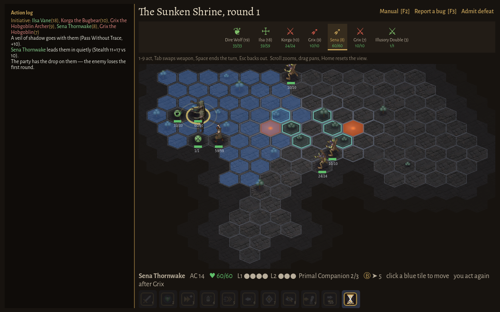

A Beast Master and a Trickery cleric, both tokens up: **Dire Wolf (19)** at the
head of the order and **Illusory Double (3)** at the tail — neither of them
next to its owner, which is the whole point of the change.

**Still not done**, and still for the reasons T-classes-c gave: Aura of
Alacrity (the 2024 wording, not guessed at), Portent (*which* d20 you replace
is the feature, and a no-prompt engine would auto-spend on the first roll it
saw), Arcane Ward (a fourth read in `_apply_damage` plus school-tracking the
engine does not do) and Wild Shape (a statblock swap whose open questions are
design ones). Two smaller simplifications also stand: a buff's `damage_type` is
authored and unread, and `power.gd` prices neither `reaction` nor `aura` — and
now not `summon` either, so a Beast Master's estimated power does not count the
beast.

## drive_random — a robot that has not been told what to do (2026-09-18)

`tests/drive_random.gd`. Eight `drive_*.gd` robots already press real buttons
end-to-end, and every one of them walks a script somebody wrote down. Between
them they cover the paths we thought of. A run of this game is not a path: it is
a few hundred small decisions about where to walk, what to buy, whether to
charge a band or slip round it, and which spell to burn on the third round of a
fight that is going badly. The bugs that survive the scripted suite live in the
joins between those decisions.

So this one decides for itself. It is a monkey **with taste**: every choice is a
weighted roll, but the weights are read off the game state the way a player
reads them — it rests when it is hurt, shops when it is rich, parleys with a
band it cannot take, walks its melee characters into reach before it swings, and
aims an area spell at the hex that catches the most foes. Orders are given the
way a player gives them: `center_on` then a real left-click on the map, a real
`pressed` on a real Button, a real mouse motion to set the board's hover before
an area spell commits. Nothing in it writes to the model behind the screen.

**Five dials, rolled off the seed** — bold, greedy, careful, curious, fidgety —
are what make two seeds two different *players* rather than the same player with
different dice. They decide how the approach card is answered, how long a visit
to town lasts before boredom wins, whether a lair gets searched or sneaked into,
and how often the session stops to re-zoom the camera and look in the pack.

**It asserts invariants, never outcomes.** "The party won" is not a fact about
this build; the fight is a dice game and it is allowed to lose. What is checked
on every one of the ~2,200 frames: the purse never goes negative, nobody sits
outside 0..max HP, the active party never over-fills or empties, a market and a
fight are never both up, the world clock never runs under a fight, and — the one
that catches what no assertion can name in advance — a fingerprint of everything
a frame may change, which must not sit still for 300 frames while the driver is
still pressing things. Plus a handful the driver is uniquely placed to make: a
click has to land where it was aimed (`_pix`/`_unpix` round-trip), a click on a
hex in a hero's own move field has to move them *somewhere*, closing an overlay
has to give the clock back, and backing out of aiming has to leave the board in
`idle`.

**The clock is not monotonic, and that is deliberate** — `core/travel.gd` pays
the party for a good day's road by winding `elapsed` *back* (TIME_SAVED,
WAYSTONE_SAVED). The first version asserted monotonicity and went red on a
seeded good-day event; the invariant is now "never back further than travel.gd
can refund", which still catches a reset to zero or a rewind nobody announced.

Two nudges are decisions rather than randomness with a thumb on the scale: a
session that has not seen a town by a quarter of the way through goes and finds
the nearest one, and one that has not had a fight by halfway marches on a
monster faction's gate — the one place on either map where a fight is a
certainty rather than a hope. Both are things players do, and they are why the
coverage assertions at the end (a settlement, a fight, a real order given) are
not a lottery.

`SORCMERC_SEED` pins the session, so CI (which pins it already) walks one fixed
game and a red CI replays exactly; the seed is printed at the top of the run and
again with the failure. `SORCMERC_RANDOM_RUNS=20` is the soak — what you point
at a branch before you believe a systems change. One session is ~23s.

### What it found on its first thirty seeds

**A soft-lock after a lost open-world fight.** `core/adapter.gd`'s `write_back`
persists the field verbatim, so a hero who went *down* rather than *died* lands
back on the map at 0 HP — alive, unconscious. `Party.auto_revive_all`, which the
retreat calls, only ever looked at `dead`, so it left them there. The next
encounter then opens with nobody on their feet and is over on round 1 — and
since `world.gd`'s `_retreat()` sets the beaten party down at the *nearest*
settlement, losing to a town's garrison wakes you up on that town's doorstep,
where the guards turn out again. The loop has no exit. `auto_revive_all` now
brings up the merely flattened as well as the dead, which is what both of its
callers already narrate ("they come to at %s").

**An acting hero who goes down mid-turn leaves their own bar up.** Walk into an
opportunity attack that drops you and `_after_hero_action` sees economy left, so
it rebuilds the menu for an unconscious character: every slot dead, and the only
live control is End turn behind its "action unspent!" confirm. A player gets out
in two presses — the driver now does the same — but the turn arguably ought to
end itself. Left as it is, deliberately: whether a hero downed and then revived
mid-turn should keep their action is a design call, not a bug fix.

## drive_completionist — the other kind of player (2026-09-18)

`tests/drive_completionist.gd`, the counterpart to last commit's
`drive_random.gd`. That one plays like a person: it wanders, takes what the map
offers, and over a session *samples* the game. Sampling is the right shape for
finding the bugs nobody wrote a case for and the wrong shape for answering
"does every door in this screen still open?" — a door the sampler did not
happen to walk past is a door nobody checked, and the sampler cannot tell the
difference between a door it skipped and a door that stopped existing.

So this one works a written checklist to the end: every control on the HUD,
every page of a settlement, every counter behind the market, both ways into a
lair, every way of meeting a band, every settlement on the map. Six chapters,
in the shape `drive_world.gd` already uses — a tour, not a planner — each
walking there with real march orders and pressing the real buttons.

**Two rules keep it from being a second, slower drive_random.**

*Every deed asserts its own contract, not just its press.* Buying moves gold
AND the pack; selling moves both back. A night at the inn spends the fee, eight
hours and the party's wounds. The healer's fee is exactly `HEAL_COST` and the
party comes out full. A job turned in pays and closes. A **second** theft in one
visit pays nothing — the only way to check O9 item 1 is to press twice and watch
nothing happen. The press is the setup; the assertion is the test.

*The ledger is the verdict.* Forty-two REQUIRED deeds and twelve OPPORTUNISTIC
ones are listed at the top of the file, each with the sentence it is checking. A
required deed the tour never reached fails the run **by name** — which is the
failure a driver that only asserts what it happens to touch can never report. A
deed ticked that is on neither list fails too, so the checklist cannot quietly
drift away from what the file actually does.

What is arranged rather than played for is listed in the header and nowhere
else: a working purse (this is not a test of the economy), an unidentified
trinket for the librarian, a scratch for the healer, a job forced to `complete`,
bands spawned for the four approach ways, mid-morning before those meetings
(#85: at night a band jumps you instead of asking, which is that rule working),
and the long-rest cooldown wound back before the camp kit. Everything else is
walked and pressed.

It runs in ~17s and ends on an early exit rather than a budget: the tour is
over when the list is.

### Three things building it turned up

**The lair Search button re-rolls nothing.** `WorldLairs.search()` seeds its RNG
off `hash("lair|" + lair.id)` when nobody hands it one, and `world.gd`'s
`_lair_action()` never does — so every search of the same lair by the same party
returns the identical d20, for ever:

```
goblin-warren  six searches: 12+3, 12+3, 12+3, 12+3, 12+3, 12+3
dragon-cave    six searches: 2+3 miss, 2+3 miss, 2+3 miss, 2+3 miss, 2+3 miss, 2+3 miss
```

The demo party can never find the Dragon's Cave by searching, however many times
it presses — while the button answers "Nothing **this time** (Survival 2+3 vs DC
13)", which promises another attempt that cannot land. Every neighbouring roll in
this codebase (the approach, road events, the camp) seeds off the clock precisely
so a repeat is a real repeat; this is the outlier. **Not changed here**, because
the fix is a design call with three reasonable answers: seed it off the clock
like its neighbours, charge world-time per search so the clock moves anyway, or
keep the fixed roll and say "these tracks are beyond you" instead of "not this
time". The driver routes around it the way a player would — it buys the lead at
the inn, which is the other door onto a lair and is deterministic.

**A fight can sit decided but unfinished.** Letting the AI move the party (this
file and `drive_campaign.gd` both do, because the fight is not what they are
about) goes *round* the combat screen rather than through it, and the screen only
notices a decided fight on its way out of a turn (`_after_hero_action` /
`_advance`). So the turn has to be handed back through the real End turn button
even once the last foe is down, or the board sits there with `cb.is_over()` true
and `result` empty. A driver gotcha rather than a bug — a player's every action
goes through the screen — but it cost an afternoon, so it is written down.

**A gate you are standing in front of does not open twice.** `world.gd`'s `_left`
stops the market reopening the frame after Leave, and clears only once the party
is out of range. A tour that ends a chapter inside the walls and starts the next
one walking *to* that settlement is already there, and nothing opens. Both
drivers now walk out and come back, which is what a player does and what makes
"walking in opens the market" a fact rather than a leftover.

## The Whole Guild — one achievement, and the levels that count toward it (2026-09-18)

A 140th achievement, and the smallest model change that makes it mean what it
says.

**The achievement.** `classes_all_5`, "The Whole Guild", in Legends beside
`classes_6`: *keep a veteran of every class in the barracks — five levels earned
in each, not handed over.* It reads a new `classes_5` set collected in
`core/leveling.gd`'s `milestones()`, goal 12, and the viewer draws it as a
`3 / 12` bar like every other threshold. `tests/test_achievements.gd` holds the
goal to `Progression.all_classes().size()`, so a thirteenth class cannot quietly
leave this one earnable a class short of what it claims.

**Five in one class, not level five.** A fighter 3 / rogue 2 is a level-5
character and a veteran of neither trade, which is the distinction the whole
thing turns on. `milestones()` counts per class, not per character.

**Earned, not handed over — the part that needed a model change.** The creator
mints a recruit at the party's own level (`creator.gd`'s `start_level`), so at a
level-5 party a brand new character arrives holding five levels in a class
nobody has played a round of. `Leveling.grant_levels()` already refused to fire
milestones for exactly this reason ("being handed level 5 is not reaching level
5") — but that only deferred it. The *next* level the character actually played
called `milestones()`, which looked back at a full five and handed the class
over for one level's work.

So a level now remembers which kind it is. `Character.add_level()` takes a
`granted` flag, written into the level dict only when true (so an earned level
looks in a save file exactly as it always did) and carried through
`character_save.gd` both ways — a file written before the key existed loads as
all-earned, which is the only kind answer: nothing here is ever locked back.
Three places hand levels over and now say so: a preset hero's opening levels,
`Party._demo_barbarian`, and `grant_levels()`'s catch-up levels. Everything that
comes through `Leveling.add_level()` — which is to say, the level-up screen — is
earned. Nothing else reads the flag: a granted level is a level in every rule
that matters, including the other achievements, and this is deliberately the
smallest blast radius that closes the hole.

**Why no gate on creating characters.** The obvious alternative was to constrain
the creator instead — a cooldown, a roster cap, a fee. None of them were needed
once the levels themselves carried the distinction, and all of them would have
cost a player something at a screen that is not where the problem was. A
real-time cooldown in particular buys nothing here: it is an offline
single-player game, so it reads as an annoyance rather than a pace, and the
system clock defeats it anyway.

Four tests cover it: four earned levels is not a veteran, the fifth is, a 3/2
multiclass is neither, and — the leak itself — five granted levels plus one
played does not buy the class, while five played does. Plus a round-trip: a
granted level is still granted after a trip through the barracks, or the flag is
worth nothing the moment a character is saved.

## Seven open issues, worked through (2026-09-18)

Every issue open on the tracker, none of them started. One test each, and each
test fails against the code as it was. What each one turned out to be:

**#119, "tried to level up to 9 and expertise choice is bugged"** — the choice
could not show its own answer. `pass_profs` grades a skill an expertise choice
picked `"expert"`, not `"prof"`, and `creator.gd`'s `options_for` filtered the
expertise pool on `"prof"` alone. So a *decided* expertise row — T34 keeps
those on the page and editable — drew every skill the character had NOT spent
expertise on and none of the two it had. The heading read "✓ Expertise — pick 2
(2 chosen)" over a row of buttons with not one mark on it, and pressing any of
them fed `toggle()`, which is capped at two, so it silently evicted a pick the
player could not see. `options_for` takes the current picks now and admits a
skill that is expert *because of this choice*; a skill some other grant spent
stays off the list, because expertise twice over buys nothing.

**#120, "feats, and background points spent in previous levels should not be
able to change. only the spell choices"** — the level-up screen iterated the
whole of `sheet.choice_points`, which is every choice the build has ever
reached. The feat taken at 4 and the background's skills taken at 1 were as
live there as the ones the level just raised. It now snapshots which keys were
already answered when the screen opened and locks those: they are still drawn,
with what they took still marked, but their buttons are dead and `_pick()`
refuses them. Spell choices are the one exception the reporter asked for, and
5e grants it anyway — and in this game a prepared caster's real picking happens
on the prepare page, which was never part of this screen.

**#118, "there should be huge level up pop up that leads to party view, and
level up button per character should not be overlapped"** — three things.

A level used to arrive as one chime in `Campaign._split_xp()` and a number two
screens away, so parties walked around owing themselves levels. It gets the
after-action page's own treatment now: `world.gd` raises a gilt panel naming
whoever is ready, with the trip to the party screen as its button. It rides the
map's own `_process`, which does not tick while combat owns the screen, and it
is behind `_overlay_up()` — so it cannot appear over a fight, a road event, a
delve, a settlement or the spoils page, which is the "wait for the campaign
map" half of the ask. `_levelup_told` stamps who was told at what level, so
"Not now" is respected and the next level says so again.

*Overlapped* was literal. The party screen opened the profile and floated a
"← Back to party" Button anchored to the top-right corner over it — the same
corner the profile's header ends in, which is where "Level up" sits. The
profile carries `exit_label` / `exit_requested` now and draws the way out as
the last control in its own header row, which is exactly what `party.gd` does
for its own exit and for the same reason (it says so in a comment dated to the
last time this happened).

*Per character* was missing. A level is spent one character at a time, so the
roster row is where the button belongs: it is on every row, live for whoever
has the XP and greyed with the reason for everyone else — the same idiom the
Spells button next to it already used — and it opens that character's sheet
with the level-up page already on it.

**#121, "fix hp bars showing on manual screen"** — T-hud put the HP bars,
barks, damage numbers and the odds chip on a `CanvasLayer` above `Board` and
everything `Board` parents. A full-screen overlay is an ordinary child on layer
0, so the manual opened *underneath* the HUD and wore a row of HP bars across
its index. The tutorial card hit this first and answered it by moving onto the
HUD layer itself; the manual, settings and bug-report overlays are shared
screens opened over five different hosts and cannot. So the layer stands down
instead: `main.gd` hides it while one of the three is up, which is honest —
they are modal, and the screen underneath is asleep anyway.

**#122, "add images of spells to the prepare spell page"** — the page was a
list of names, and the action bar it feeds is nothing but art. Each row (and
each "always yours" line) now wears the spell's own badge, through the same
`Icons.skill_icon` the bar uses — `assets/icons/skills/<spell>.svg`, falling
back to the school disc, and nothing at all in a build with no icons imported,
where the row is a row of text exactly as before. All 27 entries on a level-8
cleric's page resolve to real art. While in there: the summon summary read
`Catalog.monster(mid).get("name")` and both monster files spell it `cname`, so
that line had always printed the raw id.

**#123, "check spiritual weapon creating a minion in control of player"** — it
was not. It was modelled as a one-shot melee spell attack at 60 ft costing an
Action; the 2024 spell is a Bonus Action that leaves a weapon standing there
for a minute, swinging where you send it. That is a summon on the caster's
team, and a summon on the party's team is driven from the action bar like any
hero — so it is one now, with a stat block in `data/monsters.json` beside the
Illusory Double. Two deliberate departures, both the engine's shape rather than
the spell's: it takes its own initiative count like every other summon instead
of riding the caster's Bonus Action, and it can be attacked, because nothing
here can be both untargetable and able to swing, and swinging is the spell.

It is also the first summon concentration does not hold, which turned up a gap:
`_spell_verb` never copied `rounds` onto a summon verb, because every summon
before it was a concentration spell. A summon with neither clock stands there
for the rest of the fight. And since a bigger slot calls the same creature, a
summon spell with no authored upcast stops offering tiers — the same rule
reaction spells already had, for the same reason.

**#124, "use the full spellbar even if they dont have numbers from keyboard
assigned"** — a submenu page was nine entries long because nine is how many
number keys there are, while the bar has room for `BTN_COLUMNS * BUTTON_ROWS`
= 33 badges. A caster read their spell list eight at a time, across three
pages, in front of two empty rows. The keys and the page are two different
things now: a page is as many badges as the bar can show, `[1]`..`[9]` land on
the first nine, and everything past the ninth is click-only — which is what the
badges were drawn for. Paging survives for a list longer than the bar, on Tab,
because every number is spoken for by the page it would be turning.

## Objectives — the same fight, asked a different question (2026-09-20)

Sub-project 1 of the content batch (objectives → landmarks → threat clocks and
reclaiming → faction ladder and renown → callings with party relations →
downtime → the lodge). Spec: `docs/superpowers/specs/2026-09-20-encounter-objectives-design.md`;
plan: `docs/superpowers/plans/2026-09-20-encounter-objectives.md`.

Every fight was "kill everyone". Five objectives now ride the encounter spec
(`spec["objective"] = {kind, ...}`, absent = the fight as it was) and change
what the fight is for on the same board, roster, AI and dice: **hold** (the
top of round N+1 with anyone standing is a win; waves from the far side),
**rescue** (a bound captive at the deepest hex; adjacency frees it; the
captors kill it on the deadline; foes never target it), **breakout** (the
party in the middle, foes both ends, every conscious hero on the far-edge
road ends it), **hunt** (the roster's strongest is the quarry; it runs for the
treeline unless a hero is within QUARRY_CORNERED; on the edge it is gone; down,
the rest scatter), **escort** (a carter in the huddle; the AI already hits the
weakest adjacent target, so the puzzle is body-blocking). Outcomes stay
two-valued: "Victory, objective failed" is a real spoils row.

One reward rule: an objective done pays half the whole roster's worth in XP on
top of the kills — the batch's "XP for deeds" rule in its first form. Gold and
loot stay kills-only; an escaped quarry drops nothing.

One world source per kind, so all five are reachable from this PR: the *gate*
site room (hold), the *pens* room and a `rescue` board job posted only about a
lair whose pens the party has not fought past (rescue), a failed camp watch at
the tier's hard roster (breakout), `hunt_party` jobs — a chief that gets away
keeps the band on the map and the job open (hunt), `deliver_goods` jobs — the
carter dead loses the crate (escort).

Measured, `tests/test_objectives.gd` `test_sweep`, 80 seeds a kind, presets at
level 3, normal roster, the autopilot with `ai.gd`'s one movement rule per
kind (the grid is also in `core/objectives.gd`'s header):

| kind | done | won | knob it was tuned by |
|---|---|---|---|
| hold | 51/80 | 51/80 | `WAVE_SCALE` = 0.8 (from 0.4) |
| rescue | 55/80 | 68/80 | `RESCUE_DEADLINE` = 4 (untouched) |
| breakout | 41/80 | 79/80 | `EXIT_W` = 3 (from 4) |
| hunt | 33/80 | 79/80 | `QUARRY_CORNERED` = 4 (from 3) |
| escort | 38/80 | 73/80 | `CARTER_HP_BASE` = 10 (from 6), per level 2 |

Breakout needed one more rule the sweep exposed: a plain rout at a normal
roster made "done" 99% of the time, so the deed is reaching the road, and a
rout is a win the kills already paid for.

The band is 40–75%: an objective that is nearly free is a modifier, one that
is nearly impossible is a trap. Nothing in `scaler.gd` moved; a spec without an
objective is the fight it was, and the 200-seed sweep's numbers are unchanged.

Co-op needed no wire change: the objective is a key on the spec `setup`
already carries, bystanders and waves are built from the seed on both peers,
and `test_coop.gd` replays each kind to the same hash.

### Still open

- A story cannot yet author an objective — the M9 seam, one key away.
- Raids (C1) will be the second source for hold; callings (B3) the second for rescue.
- The freed captive is a line, not a person who walks home with the party.
- ~~A bystander is still listed in the co-op host's who-plays-whom menu
  (`_split_menu`)~~ — fixed in the whole-branch review's fix wave, along
  with the road never being narrower than the party (`EXIT_W` had been
  tuned to 3 with a four-hero cap), the carter throwing opportunity
  punches, and bystanders counting for achievements.

### Pictures

`tests/shot_objectives.gd` renders these (it needs a display; not part of
the suite).

| | |
|---|---|
| 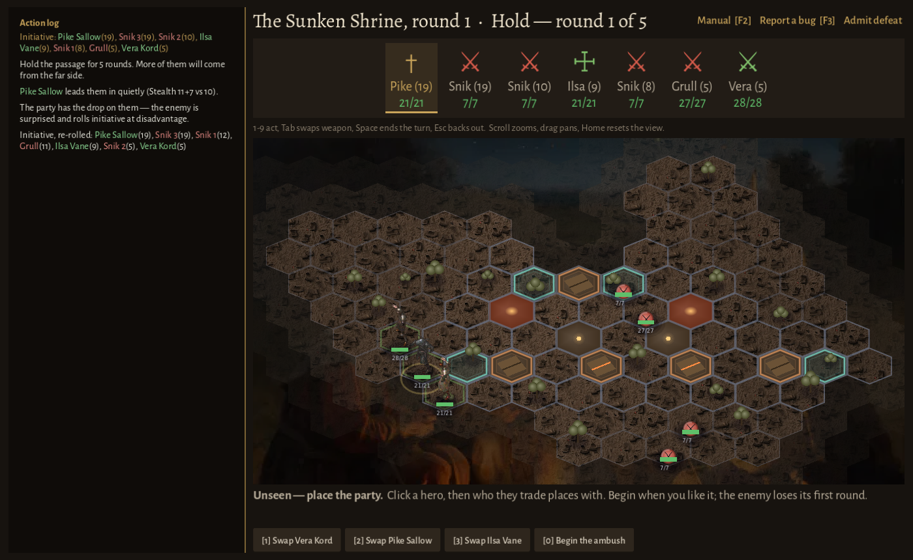 *hold — the brief is the fight's first line, the status rides the header* | 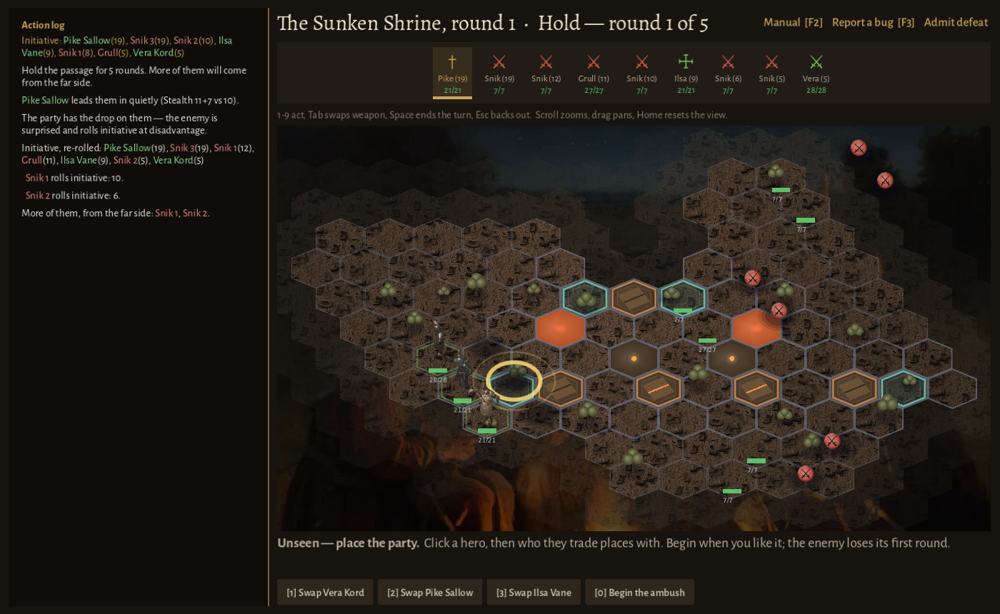 *round 2 — "More of them, from the far side", at the far edge* |
| 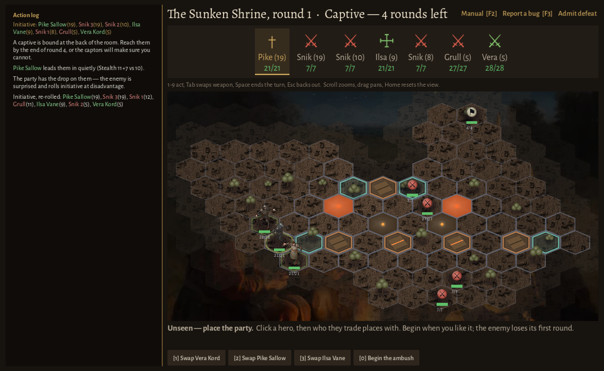 *rescue — the captive (⚑, 4 HP) at the deepest hex, the deadline counting down* | 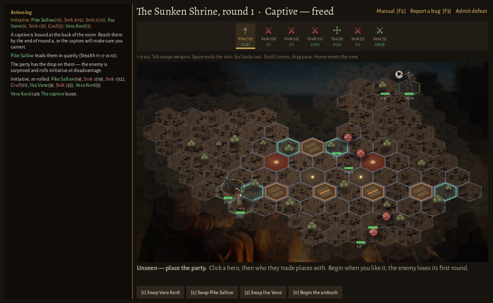 *a hero adjacent cuts them loose — no action spent* |
| 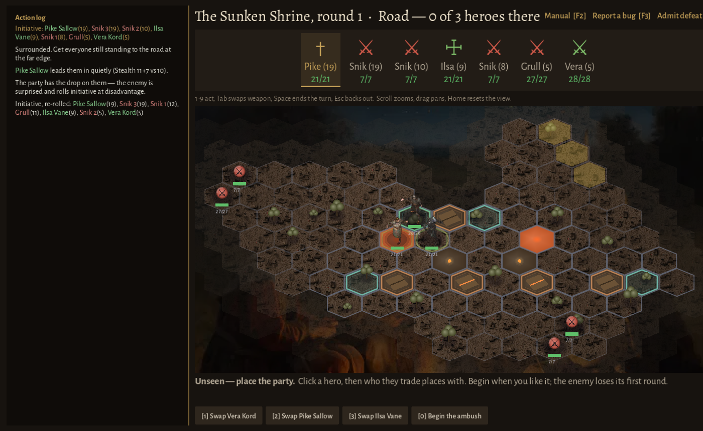 *breakout — the party in the middle, foes both sides, the road painted at the far edge* | 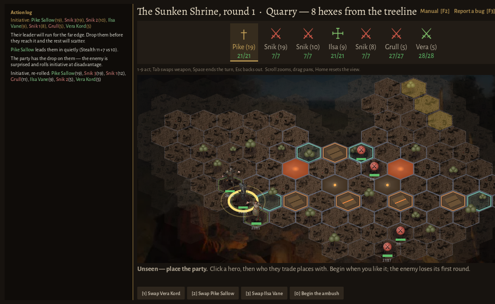 *hunt — the strongest foe is the quarry; the header counts its hexes to the treeline* |
| 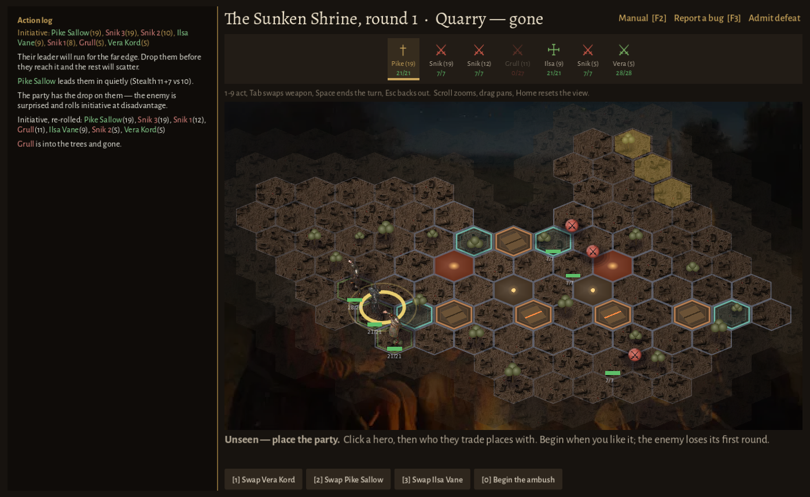 *ending its turn on the treeline, it is gone — the fight goes on against the escort* | 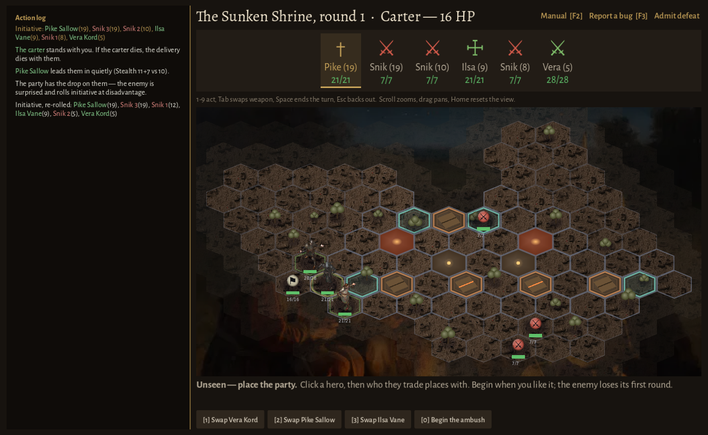 *escort — the carter in the huddle, the AI's favourite target* |
| 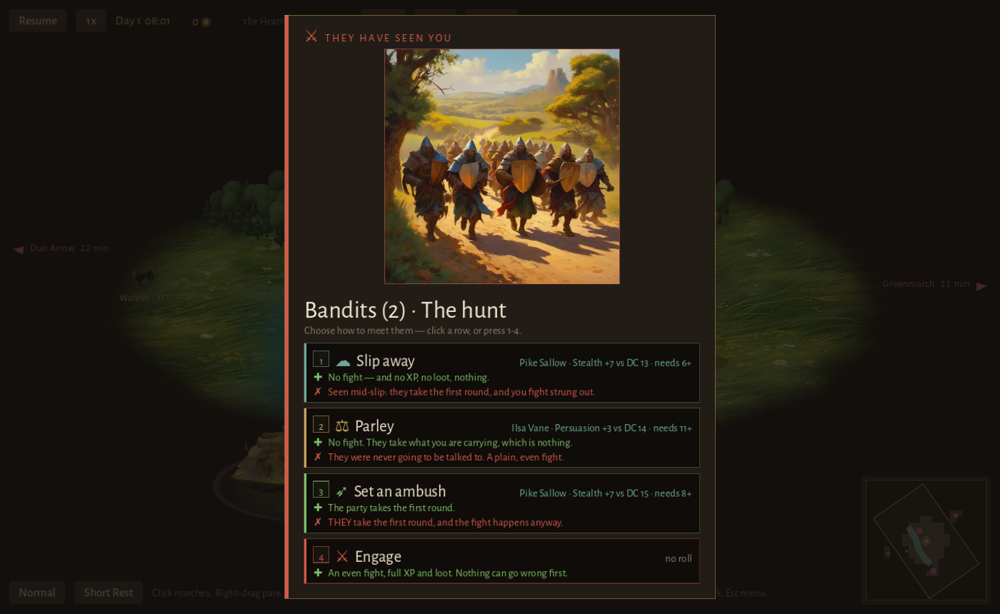 *a band a job names: the approach card says which question the fight will ask* | 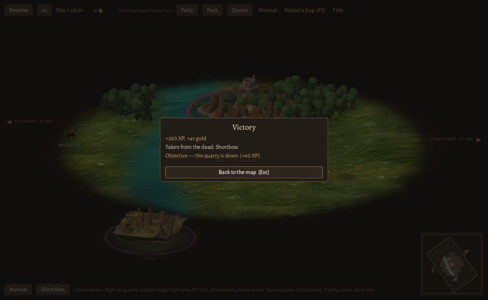 *the deed done — the objective row and its own XP* |
| 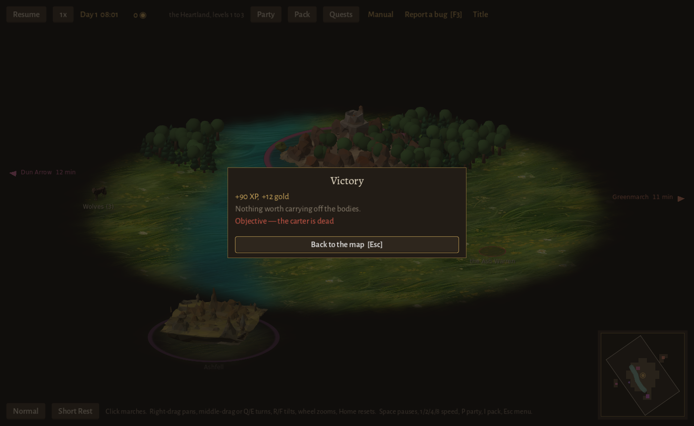 *"Victory, objective failed" is a real result — and the delivery is lost with the carter* | 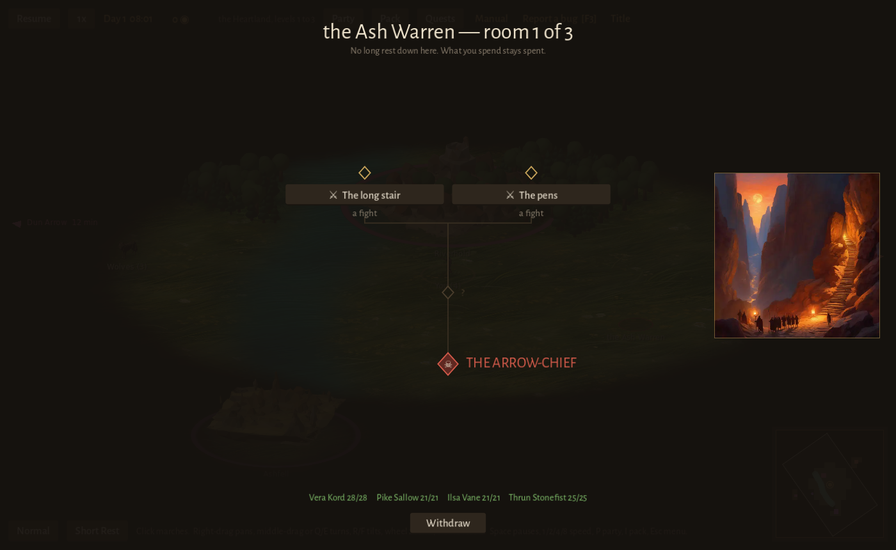 *a site's room card — the pens, one of the ways in* |
| 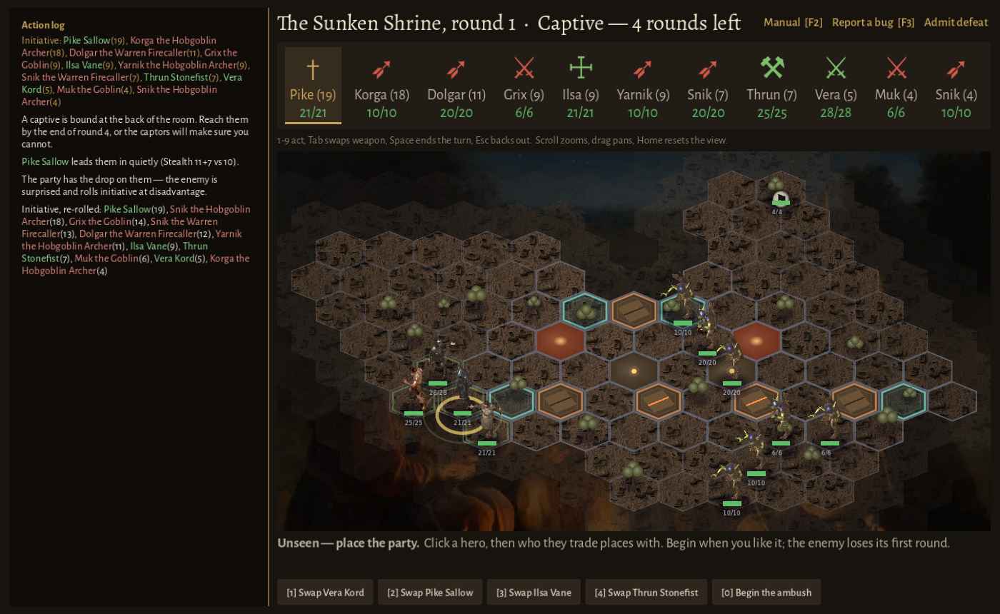 *the pens from the inside: a warren roster, the captive at the back* | |
## Three co-op issues, and the save bug under two of them (2026-09-20)

The first three reports filed against co-op after it shipped: a desync (#132),
a guest whose map moved twice a second (#133), and "same combat but killed
enemies arent updated and the combat result ends up bugged" (#134). The first
and the third are one bug seen from two ends; the middle one is its own.

**The party that crossed the wire was not the party.** `CharacterSave.to_dict`
carries `pools` — per-rest uses remaining — and did not carry `slots_used`,
the spell slots a caster has already spent. Every trip through that format
handed the caster their slots back. Co-op sends the party as exactly those
dictionaries, so the host built its fight from the party it had been playing
and the guest built the same fight from a party whose casters had a full
spell list. Different boards from the same seed, and lockstep has nothing to
reconcile with: `state_hash` differed from the first `end_turn`, which is the
"⚠ DESYNC" the player saw on #132, and the enemies the host had killed were
still standing on the guest's screen, which is #134's first half.

It is not only co-op's bug. `core/world_save.gd` and `core/campaign_save.gd`
save the roster through the same function, so every autosave and every resume
was quietly refilling the party's spell slots — a free long rest's worth of
casting, in single player, since the day the open world's autosave landed.
`slots_used` is in the format now, absent meaning "nothing spent", which is
what the files already out there say.

**And the first round was the host's alone.** The seed, the encounter spec and
the party build the same board on both ends. How the fight *opens* does not:
`scouted_ahead` (the road read the ground ahead, so the party comes in unseen)
and `forced_ambush` (a camp watch that failed) are set on the combat screen by
whoever put the fight up, and `scenes/game/game.gd` builds the guest's screen
with both at their defaults. A scouted node opened unseen for the host while
the guest rolled its own Stealth check and opened an ordinary fight; an ambush
gave the host's foes a free round the guest never gave them. The setup carries
an `opening` now. `tutorial` rides along with them for one reason: it is what
makes `_open_fight()` skip the deployment phase, and a host that skips it never
presses Begin — so a guest that did not skip it waited out the fight on
"waiting for the host to place the party".

**The verdict read a dictionary that is deliberately empty.** #74 holds the
result behind a tinted wash the player clicks through, and `result` is not
filled in until they do. `_finish()` read `result["xp"]` anyway — so every
played Victory threw "Invalid access to key 'xp'" and lost the rest of the
function with it: the spoils line and the loot line never printed. Headless
and `SORCMERC_FAST` skip the wash and fill `result` at once, which is why the
whole suite was blind to it. That is #134's second half.

**#133, the guest's map.** The host sends where everyone stands twice a second
and the guest wrote each delta straight onto the map, so the road moved at the
rate the packets arrived: a step, half a second of nothing, another step. What
crosses the wire is the right amount; the frames between arrivals are the
screen's to draw. A delta is a target now, and `_spectate()` walks the map
toward it over the interval the last two arrived in — so the mirror moves at
the speed the host's party is actually moving, stretches instead of stuttering
on a slow link, and never draws the party anywhere the host has not been.

### What now checks it

`tests/test_coop.gd` built both peers with `Coop.party_from()`, so anything the
save format dropped was dropped identically on both and stayed invisible. It
builds one side from the host's own party object now, across a party per class,
which is the check that catches `slots_used` — and would have caught it the day
it was written.

`tests/test_coop_screens.gd` is new and is the bigger gap closed: two real
`scenes/main.tscn` screens in one process, wired to each other through a
stand-in for `tools/coop-relay` that obeys the same rules the Worker does, with
`drive_coop.gd`'s robot pressing whichever screen owns the hero that is up.
Everything `scenes/main.gd` decides for itself — which is where both halves of
#132 lived — is in front of it now, and unlike `tools/coop_smoke.sh` it needs
no relay, no second process and no network, so it runs on every pull request.

`tests/test_coop_mirror.gd` checks the frames between two deltas, and
`tests/test_victory_summary.gd` turns the wash back on so the verdict is read
the way a player reads it.

Also, while in the log: `region_at` returns "the treeline" on five boards and
"Brazier Hall" on the sixth, and the move line wrote "the" in front of whichever
it got — "Thokk the Orc moves to the the treeline", which is in the log quoted
on #132 itself. It asks for the article now instead of assuming it is missing.

## Landmarks — places on the map that are not a fight (2026-09-20)

Sub-project 2 of the content batch. Spec:
`docs/superpowers/specs/2026-09-20-landmarks-design.md`; plan:
`docs/superpowers/plans/2026-09-20-landmarks.md`.

The map had towns, lairs and bands, and every one of them ended in a menu or
a fight. It now has a fourth thing: six kinds of landmark — ruins, a shrine,
standing stones, a hermit's hut, a wreck, a watchtower — each a place the
party walks up to and answers with a skill the world barely used (History,
Religion, Arcana, Nature, Performance, Insight, Perception, Athletics,
Investigation). Two choices a kind and *Leave*, on the approach card as it
is; the event card names the check and the roll; one visit each. Rewards
that are not fights: a cache, a blessing (temp HP at the next fight), a
lead, a scouted fight, a safe camp, a quicker road, the map opening from a
tower, marked bands, a camp kit, a free identification. The deed pays
`LANDMARK_XP` × (ring + 1); DC and cache climb with the ring.

A third row rides every card too, gated by who you are: each kind carries
one more choice that appears only when a party member *is* the right kind
of person — an acolyte or cleric at the shrine, a sage or scribe in the
ruins, a druid or an elf at the stones, a hermit, guide or ranger at the
hut, a merchant, sailor or artisan at the wreck, a soldier, guard or
fighter at the tower — answered in their own name, no roll, opening a door
a rolled row already opens: flavour, not power. The roller for the rolled
rows stays the party's best at the skill, the road's own rule.

Visible kinds are found by walking; the hut and the tower the way lairs are
— the same Survival roll (`WorldLairs.search_roll`, split out so there is
one), on their own button, or bought at the inn at half a lair's price. The
three builders place 1.5 per lair; a pack's `world.json` declares its own
under `landmarks`, validated at scan time; a story's `near` can name one.
Saved under `landmarks`; an old save loads with none.

### Still open

- Trainers belong to downtime (B2); a landmark that wakes something to threat
  clocks (C1).
- A landmark never restocks.
- The bottom bar's hint label already fills 1400px, so "%s — a landmark, on
  the map now." runs under the minimap — as every `_lair_msg` does. Older
  than this batch; the bar wants a fix of its own.

### Pictures

`tests/shot_landmarks.gd` renders these (it needs a display; not part of
the suite).

| | |
|---|---|
| 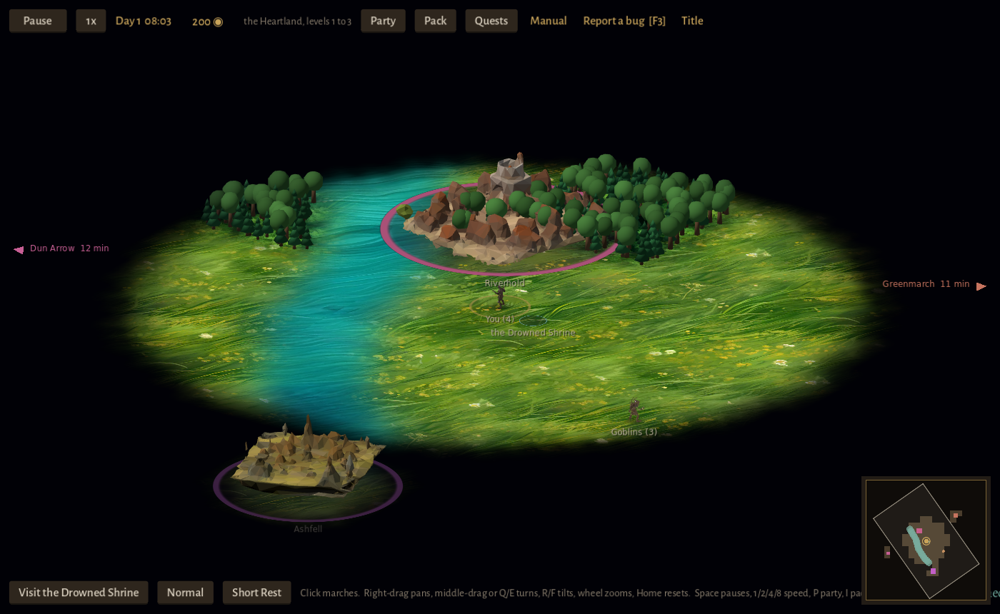 *a shrine on the map, and the button that walks up to it* | 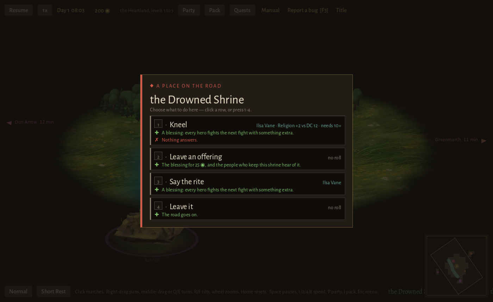 *the card — two rolled rows, the cleric's own row with no roll, the offering priced, and Leave* |
| 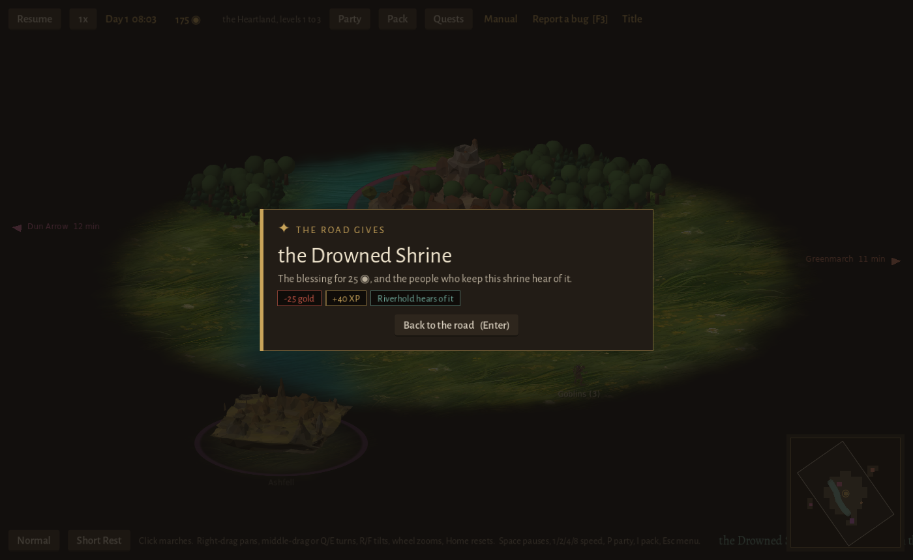 *the outcome card — the blessing bought, the faction hears of it, the deed's XP* | 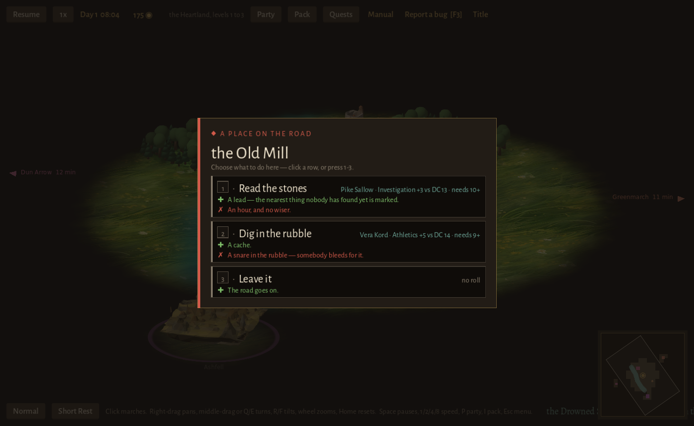 *ruins — the party's best at each skill rolls, named on the row* |
| 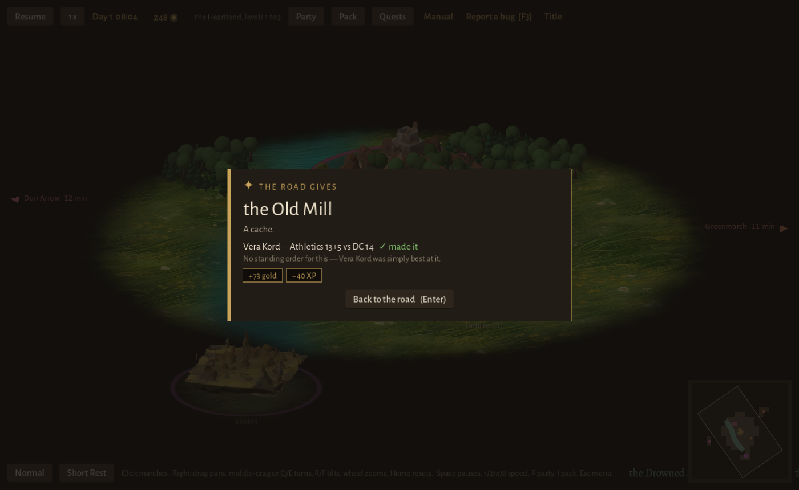 *a cache, or a snare — the roll named on the outcome* | 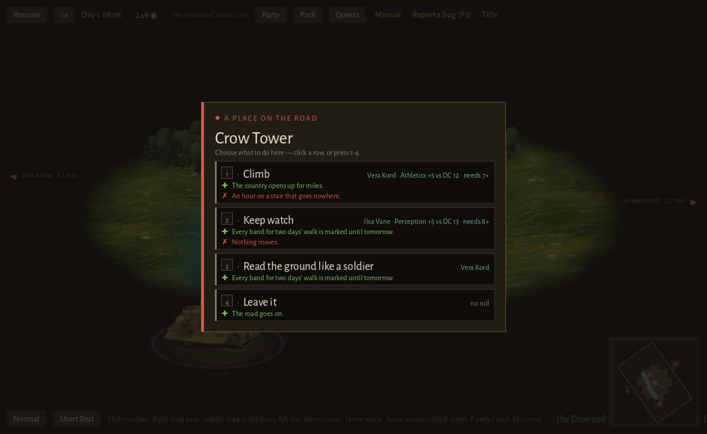 *the tower — a fighter reads the sightline without a roll* |
| 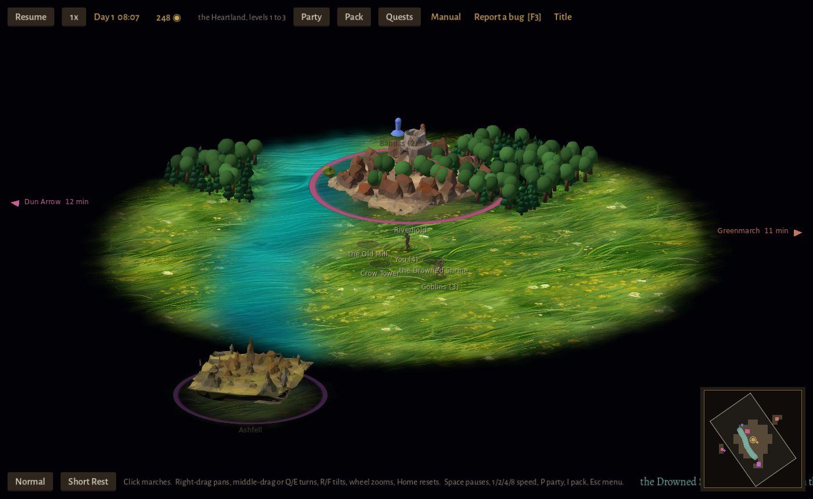 *the tower's watch: bands marked on the map while it holds, the fog opened around it* | 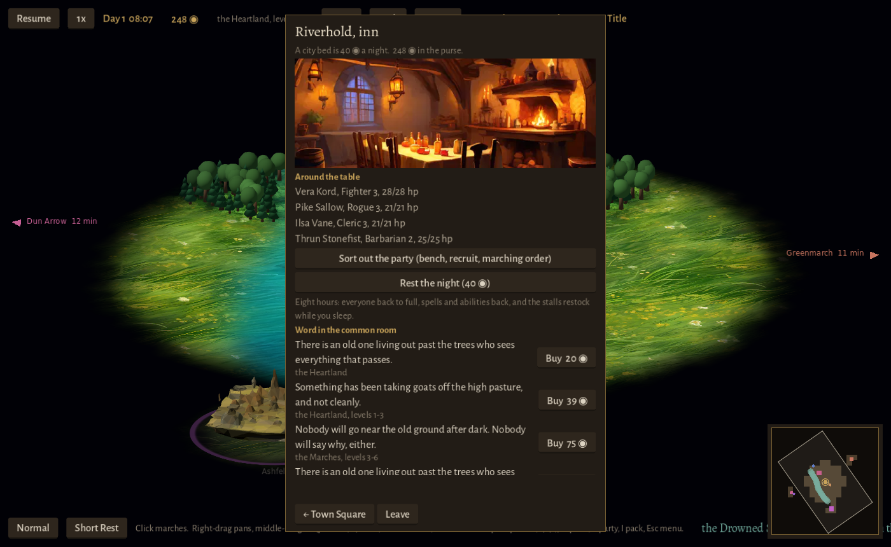 *the inn sells the hidden kinds at half a lair's price* |
## One cache for the big files, and a loader that starts early (2026-09-20)

`assets/figures`, `assets/troops`, `assets/beasts` and `assets/lairs` are about
220 MB of Meshy exports — a hero rig is ~3 MB, `goblin_std.glb` is 23 MB — and
every one of them was read by a bare `load()` on the main thread, out of two
private dictionaries that knew nothing about each other: one in
`scenes/figures3d.gd` (the board), one in `scenes/world/props3d.gd` (every
overworld layer). Two costs came out of that, both of them paid on the frame a
screen opens.

**The models were read one at a time.** A `reset()` walked its list and loaded
each file where it reached it, so opening the overworld paid for a settlement
model per (faction, kind) and a troop model per band in series, and starting a
fight paid for a class figure per hero and a faction figure per foe the same
way. Godot's loader is a thread pool; nothing was using it.

**And the same file was read twice, and kept twice.** The player's figure
walking the map and that same hero standing on the board are one
`wizard_idle.glb`, and a beast band marching and that beast in the fight are
one `wolf.glb` — but with a cache per layer, entering a fight re-read from disk
what the map already had in memory, and held both copies until the screen died.

`scenes/model_cache.gd` is one cache for all of them, static on a RefCounted
the way `core/rules/catalog.gd` is, so a test can drive it with no SceneTree.
`get_scene()` keeps exactly the contract the two dictionaries had — the
PackedScene, or null when there is no such file, which is not an error but how
a class or faction the art has not covered yet falls through to the vector or
pawn tier. What is new is `prefetch()`: every layer's `reset()` now hands the
loader its whole list before it builds the first thing on it, and `get_scene()`
collects each one when the loop reaches it, waiting out only what is left. A
path already in memory from another screen costs nothing at all.

It has a ceiling, which the per-layer dictionaries did not need: they died with
their screen, and a shared one does not, so `MAX_KEPT` (40, LRU) bounds it at
roughly 120 MB rather than letting a long session accumulate all of `assets/`.
The number clears a whole screen's hot set on purpose — twelve settlement
models and twelve troop models can be live at once, plus what the fight
launched from there adds — because a cap that fits the average would evict
inside a single `reset()` and re-read what it had just dropped. Evicting is
cheap either way: an instantiated figure does not need the PackedScene it came
from to stay alive.

Two smaller things fell out of reading those paths carefully. `lairs3d.gd`
loaded every lair's GLB and *then* asked whether the kit was going to build it
instead — and the kit is the default source, so every lair on the map read
several megabytes nothing ever drew. It asks first now (`_wants_model()`, which
is also what the prefetch filters on, in both the lair and settlement layers).
And `figures3d.gd`'s beast lookup called `ResourceLoader.exists()` once per
combatant per roster to decide whether a bestiary id has its own model; that
answer cannot change while the game runs, so the cache remembers it.

`tests/test_model_cache.gd` asserts the parts that are otherwise invisible —
a figure looks the same whether its file was read once or twice, so the claim
is made on the cache's own counters: the second ask for a path is a hit that
touches no disk, a prefetched path is collected from its background request
rather than re-read, a missing path is answered from the negative cache, an
abandoned prefetch is drained rather than left in flight, and the cap clears
the hot set it is supposed to.

## O13x, finished: one Resume per run, and a run that takes its own slot (2026-09-20)

`96789cf` landed the multi-slot autosave half-built, and `master` went red on
`tests/drive_game.gd` with it. `core/world_save.gd` got the slot machinery
(`new_slot()` / `set_active_slot()` / `list_slots()`, plus the migration that
carries a pre-slots `world.json` forward as a "legacy" slot), and the driver
got the walk that checks two playthroughs do not share a file — but
`scenes/game/game.gd` got only the new signature. `_resume_world(slot_id)` was
still wired to a `pressed` signal, which hands a callable no arguments:

```
ERROR: 'game.gd::_resume_world': Method expected 1 argument(s), but called with 0.
```

and nothing outside `tests/` ever called `new_slot()`, so a second run still
marched over the first one's save. The two other failures in that run were the
same press: with the map never reopened it was never left either, and the rest
of the walk ran with a live world screen still mounted.

**The title screen draws the list now.** One "Resume the open world" per slot,
newest first, each with its own line of who and when and where — the same
words the single button carried, per run. The gilt goes to the newest, because
the title's rule is that the one thing you are most likely to do next is the
one in gold. "New run" no longer warns that it writes over anything, because
it does not: it mints a slot first (`begin`, and `_start_pack` for a content
pack's run, which is a new run like any other). The co-op lobby keeps a single
Resume, for the newest — the lobby is about the room, and picking an older run
is the title's job.

**A row is a summary.** `list_slots()` used to return `id`/`elapsed`/`gold`/
`mtime`, which is not enough to label a button the way the old one was
labelled, so both readings come out of one `_facts()` now: the picker's row and
the line under the active slot cannot say different things about the same save.

**And the order is deterministic.** A file's mtime is whole seconds, leaving
one run and starting the next writes twice inside one second, and `sort_custom`
is not stable — so "newest first" was a coin flip exactly when it mattered, in
the driver and for a player. A slot id carries the microsecond clock it was
minted at, so that is the tie-break.

`tests/drive_game.gd` also pressed `"Begin — Small World"` for its second run,
a button that has read `"Begin, small world"` since T-worlds; `press()` matches
on substring, so it never matched. Fixed to the button's own words.
`tests/test_world_save.gd` now also checks that a row carries the summary's
fields, reads them from its own file rather than the active one, and that two
slots written in the same second still come back newest first.

## Threat clocks and reclaiming — a lair left alone does something about it (2026-09-20)

Sub-project 3 of the content batch. Spec:
`docs/superpowers/specs/2026-09-20-threat-clocks-design.md`; plan:
`docs/superpowers/plans/2026-09-20-threat-clocks.md`.

A lair the party never touched used to be a red dot that waited. Now every
lair on heartland or marches ground runs a clock (`core/raids.gd`) against
the nearest town inside 800: two days in, plus under a day of its own
jitter, a band sets out — a `RoamingParty` like any other, with a `raid`
behaviour on the world AI — walks to the town's edge, stands there eight
hours (and comes for anyone who comes near), and then the raid lands: the
town's market is the halved battle shelf for as long as the raid stands,
its board pays half again for that lair's own job, its rescue names the
people taken, and refugees walk the roads of the settled country — whose
pass puts the raiders' lair on the map. The second landing digs a child
lair in beside the parent, once. Clearing the lair, however it is cleared,
lifts every town it raided; a raid met on its way in is *hold the line*,
and turning one is worth two bands put down to the town. Measured on the
shipped maps, two lairs a map raid — the goblin warren and the Sunken
Ruins; the giant, the graveyard and the dragon sit in country that is
nobody's problem until you make it yours.

And the other direction: a cleared lair on settled ground can be bought
inside the respawn's own day — *Settle it*, 120 in the heartland, 240 in
the marches — and is gone for good, a `camp` settlement of the nearest
town's faction standing where it was, with a name off a list and a fresh
market. The `camp` kind had existed all along; nothing had ever put one on
the map mid-run.

### Still open

- No pictures yet.
- ~~A gate fight's waves for a lair faction with no theme of its own (a pack's orcs,
  say) come from `encounter_spec`'s default forest theme, not the raiders'
  own kin: `_hold_waves` reads the stamped theme. Two lines when it shows —
  stash the raw theme and seed on the spec.~~ — fixed 2026-09-22 (see "Two the
  road got wrong" below). It was not two lines: the seed had to stop being
  walked off its faction as well.
- A raid band carries nothing home; the halved market is what it took.
- Towns are never taken. A town that falls is the faction ladder's war (#4).

## The ladder and renown — standing with a people, and a name across the map (2026-09-21)

Sub-project 4 of the content batch (objectives → landmarks → threat clocks and
reclaiming → faction ladder and renown → callings with party relations →
downtime → the lodge). Spec: `docs/superpowers/specs/2026-09-21-ladder-renown-design.md`;
plan: `docs/superpowers/plans/2026-09-21-ladder-renown.md`.

Two tracks now sit beside faction opinion (`core/faction_opinion.gd`), which
stays exactly what it was: this week's mood, moving prices and the gate, and
drifting back to nothing while the party is away. The ladder
(`core/ladder.gd`) is what the party has *done* for a people, counted per
civilized faction and never lost — read as four rungs, Stranger, Known,
Trusted, Sworn. Renown is the same deeds summed across every people, read as
one title, Nobodies to Legends. Neither drifts, and neither is opinion under
another name: a faction can be furious with the party this week and still
owe them the standing of a hundred deeds.

A deed is a job turned in (the faction that paid it), a fight won near one of
its settlements (a fight at the gate — `FactionOpinion.credit_fight`, every
civilized faction close enough to hear about it), a raid lifted by clearing
the lair behind it (two deeds), a lair settled into a waystation (three, the
biggest going), or an offering left at a landmark (one). `Ladder.deed()`
credits the faction and hands back the new rung only the frame it changed, so
a caller says so once. Each rung opens a door a stranger does not get: Known
passes on a neighbour's job once a settlement's own work is taken, and halves
the price of a room; Trusted opens the back room (uncommon stock, where there
is a smith) and, at the chief settlement, lets the patron post the far
country's work instead of just its own; Sworn makes the room free, adds two
rare items to the back room's uncommon ones, and opens a once-per-people
audience with the lord — a rare item and a milestone's XP, held once and
never offered again. Renown's title puts a flat premium on every job's pay
(`Ladder.pay_mult()`, +10% a title above Nobodies), and both numbers show
where a player already looks: the HUD line under the party's name, the log
line the moment a title changes or a rung is gained ("Known among the humans
now."), the settlement door's own text ("Sworn to this people. Their doors
are yours.", with the title named once it reaches Famous), the quest log's
Standing section (the title with its count and next threshold, then a line
per people), the market's Back room tab, the town square's audience button,
and the board's pay line.

The four achievements (`core/achievements.gd`) read two high-water marks the
world screen records every frame — `best_rung` (the best rung held with any
civilized faction, kept only for the achievement) and `renown_title` — plus
the `audiences` set: Known Faces, Sworn, Famous, An Audience. `tests/drive_random.gd`
now seeks an audience itself when the button is up and watches renown for the
one direction it is not allowed to move.

### Still open

- No pictures of the screens yet — only the audience event card has art
  (`event-audience-<faction>.png`); the ladder and renown lines on the HUD
  and the door text draw without any of their own.
- The audience's gift is seeded per faction — the same item every run. A list
  of a lord's gifts per people, rolled instead of fixed, would be the next
  step.
- Standing has no downward path, by design: a deed done for a people is never
  taken back, whatever opinion does in the meantime.
- The premium rides into turn-in XP as well — a famous company's jobs are
  bigger jobs; decided, not changed.
- A story hook mirroring `opinion` (a `standing` condition, a `deeds` effect)
  so a pack can gate a beat on standing.
- `steal()` values the back-room shelf; clamped by STEAL_GOLD_MAX.

## Callings, and the party's own opinions — a quest per hero, and the people beside them (2026-09-21)

Sub-project 5 of the content batch (objectives → landmarks → threat clocks and
reclaiming → the ladder → **callings and relations** → downtime → the lodge).
Spec: `docs/superpowers/specs/2026-09-21-callings-relations-design.md`. Two
things on one branch, because they share a fireside.

The first is the spike's party opinions (`core/party_opinion.gd`,
`docs/spike-party-opinions.md`), which had sat complete and unused since
2026-09-16. Its seven call sites are wired, with the numbers measured then:
the pair scores round-trip in the world save and the campaign save beside
the party; the party page carries a Relations block ("Vera Kord and Pike
Sallow — rivals (−44)", one line per active pair); every road check takes
`travel_bonus` and shows the term on its roll line, and the roller's pairs
move on the result; the scores drift toward each pair's baseline while the
world clock runs; the safe night and the inn ask `camp_moment` — a warming
or a quarrel already resolved on the night's card, or a courtship on the
approach card with two rows, `accept` and `decline`, applied only when
answered; and the fight reads `shoulder_bonus` on AC, `bicker_penalty` on
to-hit, `rally` when a partner goes down, and records `saved`,
`friendly_fire` and `fought_beside`. Nothing in the module changed but one
constant, `CALLING_BOND` (15).

The second is the calling (`core/callings.gd`): the past a hero's background
hands them, systemic because every companion is player-made. Sixteen
templates, one per background, each pointed at something the live map
already holds. The acolyte's defiled shrine, the artisan's master's cart,
the guide's tower, the hermit's stones, the merchant's and the sailor's
wrecks, the scribe's ruins and the wayfarer's hut are landmarks, done by
answering any row there; the farmer's steading and the sage's library are
lairs, done by clearing them; the criminal's debt, the guard's one that got
away and the soldier's deserters are monster bands, done by beating them;
the charlatan's old mark is a town and the noble's rival envoy a city, done
by visiting; the entertainer's hall is the ladder's audience, any lord's.
`assign()` runs every frame and takes the nearest thing of the kind — a
band of people (bandits, goblinoids, orcs, gnolls, kobolds, cultists) before
a beast pack, never a band raiding a town — no such thing on this map, no
calling yet; and the same pass re-points any calling whose target the world
has since lost (a shrine spent before the telling, a band beaten by someone
else, a lair the map dropped), or holds it with no target until one
appears. The fireside's order is: a calling's telling (once per hero, ever
— the target is marked as it is spoken, a hidden landmark found, a lair
discovered, the ground it stands on revealed so the mark draws), then a
resolution the road could not show, then the opinion moment; one card a
night; a past told at the inn of the very town it names is done as the
party leaves. Done, a calling is paid the frame the thing is done — in the
same save the doing makes, so a quit at the outcome card loses only the
card — with `CALLING_XP` (120) split, an uncommon heirloom named by the
template identified into the stash, and the bond — +15 with the one who did
the thing, or, when that was the hero themself (the acolyte is the party's
best at Religion, so at her own shrine it usually is), with whoever stands
closest to them: the active companion they already think most of. It shows
on the party page's Relations block (a Callings line per told hero), in the
quest log's Standing section under a Callings header, and on its own event
card with a picture of the target as the hero sees it
(`event-calling-<background>.png`, sixteen of them). A pack can add or
replace templates through `callings.json` (`docs/modding.md` §5.2),
validated at scan time like its map. Two achievements read the `callings` set: A Past and Four
Pasts. `tests/drive_random.gd` answers a courtship the way its persona would
(yes only when careful), acks a calling's cards, and checks the heirloom is
in the stash the frame a calling turns done.

### Still open

- A hero who dies in the fight that beats their band is still paid (the check runs before the deaths are applied).
- One calling per hero, then done. A second — a different past, or the
  same one coming back — would need a reason the sheet does not give.
- Relations are between active pairs only, as the spike says; the bench
  neither warms nor sours, and a benched lover is still a lover.
- The spike's appendix-A4 ideas — positional vectors, conditions that
  cleanse a pair — are not built.
- No art of its own for the camp's fireside card or the courtship card; both
  ride on `camp-night`.
- The courtship rows are priced "no roll" like an engage row, which is true
  (nothing is rolled) and reads oddly on a card that is asking a question.

## Downtime — what a company does in town when it is not working (2026-09-21)

Sub-project 6 of the content batch (objectives → landmarks → threat clocks
and reclaiming → the ladder → callings and relations → **downtime** → the
lodge). Spec: `docs/superpowers/specs/2026-09-21-downtime-design.md`. Plan:
`docs/superpowers/plans/2026-09-21-downtime.md`. Three tasks on one branch:
the module (`core/downtime.gd`), the screen, then the robot, the pictures
and this record.

A town before this was a market, a board, a bed and four one-shot rows —
work the healer's ward, steal from the stall, investigate the battle,
haggle — every one of them a moment, and nothing in a town took *days*, so
the raid clocks, the lair windows and a calling's road never traded against
anything a player could spend at the inn. Five activities fix that, from
the table 5e keeps for exactly this question. **Training** (inn page, city
or town): pick a hero and a `general`-category feat they lack, level 4 or
better, for `150 + 50 × level` ◉ and five days; the feat's +1 is decided
for them (the highest of the scores it allows), and a feat that asks for a
skill, an expertise or a feature — only the level-up screen can pick those
— is not on the trainer's list; once per hero, ever — a second pass, or a
retrain, is the lodge's own training yard (#7), not the trainer in town. **Carousing** (*A night on the town*): 30/20/10 ◉ by
settlement kind and one day for the party's best at Persuasion or
Performance against DC 13; a pass is a contact (`FactionOpinion.raise`, +5)
and a free rumour, or, with none left, a round on the house (+15 ◉); a nat
20 is both; a fail draws a complication, and a nat 1 draws the complication
and the tab on top; the roll is seeded off the visit and the clock, so each
night of a stay is its own. **Gambling** (*Sit in on a game*): a stake of
25/50/100/200 ◉ capped at the purse, no day spent, once a visit — the
party's best at Insight, Deception or Sleight of Hand against DC 12 pays 3×
on a nat 20, 2× at DC+5, 1.5× at DC, loses the stake under DC, and loses it
plus an insult on a nat 1. **Crafting** (*Brew*/*Scribe*, at the
alchemist's and librarian's own counters): half list price and a day,
anyone can brew what the alchemist has on the shelf, only a party with a
caster can scribe the librarian's own two scrolls — once per item per
visit, into the stash identified. **The pit** (inn page, city only): a
bracket of three named champions seeded per city per week (`EnemyNames`),
each the city roster's strongest humanoid alone at `PIT_MULT` 1.3/1.7/2.2,
fought one at a time as an ordinary encounter in `city-square` with no
objective; a win banks what a fight banks (XP, the kill's gold, loot) and
pays 60/120/240 ◉ and a deed on top, a won bout also counts its kill toward
a kill job, like any fight, the third unlocks *Champion of the Pit*; a loss
carries the party out (everyone revived) for that bout's purse and closes
the bracket until the next week. The week is read before the
bout, so a fight that runs past midnight on the week's last evening is
still that week's.

Every activity but gambling moves through `spend_days`: the clock advances
exactly `n × DAY`, the party takes one long rest, and the bed is paid up
front at `Visit.inn_cost(s)` a night (free at Sworn) — a short purse pays
nothing and no day passes. Days are the currency the batch's own clocks
eat: five days training is two raid clocks, and every stamp the market and
the board keep (`last_visited`, `battle_at`) stays exactly where it was, so
"once a visit" still means this visit even after a week spent at the
trainer's yard — and still means it across a rest at the inn, or the inn
reopening behind a bout or a brawl, each of which re-reads the shelf
(`Downtime.restamp` carries the game's and the bench's stamps over). What
the bench made sells for no more than it cost: `sell_price` caps the shelf's
markup at one, since a thin shelf is dear to buy from and pays no premium
for your goods.

A fail at carousing, or a nat 1 at the table, draws one of four
complications, seeded off the roll and shown as an event card (art
`event-downtime-<kind>`, matching the pit's own `event-downtime-pit`): the
**tab** (twice the activity's cost, gone by morning), a **brawl** (a
`bandit` roster at `easy` fought at the inn with the road's rules kept off
it — no objective, no opinion, no deed; a win pays what a fight pays, a
loss is the ordinary `_retreat`, and the inn reopens behind the spoils
page), an **insult** (`FactionOpinion.lower`, −5), and a **bad lead**
(`Rumors.dud` — a rumour that names nothing). Each is a card the size of a
story, never a quest. Two good evenings are cards too — *Schooled* after
the trainer, *A night on the town* for a contact made; the game and the
bench stay lines under their rows.

It shows on the inn page's new Downtime section, under the bed and above
the rumours (Train, A night on the town, Sit in on a game, and at a city
the pit), on the alchemist's and librarian's counters as Brew/Scribe rows
beside their stock, on the party page's hero card (a trained feat reads
like any other), and in four new achievements under the `road` group:
*Schooled*, *Friends in Low Places*, *The House Loses*, *Champion of the
Pit*. `tests/drive_random.gd`'s visit beat presses these rows by their own
shape rather than by a button's name (two "Go" buttons on the same page
read the same) — a night on the town, the smallest stake at the table, a
hero the purse can afford to send to the yard, the pit at `_me`'s
curiosity — and acks the cards the way it acks any other; the purse-never-
negative and no-hero-with-a-duplicate-feat invariants run every frame,
downtime included.

### Still open

- No tools, no languages: the sheet carries neither, so there is nothing
  here to train, brew or scribe toward.
- Retraining, and a second trained feat, are the lodge's own training yard
  (#7) — the trainer in town teaches once, ever.
- No wagers on somebody else's bout in the pit; only the party's own three
  ever pay out.
- The complication table is four kinds (a tab, a brawl, an insult, a bad
  lead), not a growing list.
- The bench cannot train: the trainer's row lists active heroes only. A
  choice, not an oversight — the yard is for who is fighting.
- A lone champion's balance is unmeasured: `PIT_MULT` 1.3/1.7/2.2 on one
  foe is a guess at "harder than a road fight", not a measured grid.
- The pit's loss revives everyone (the spec says carried out, not buried)
  while a win keeps its deaths — a bout won at a cost is paid for, a bout
  lost is not.

## The lodge — one house in a town, and what a company builds onto it (2026-09-21)

Sub-project 7, the last of the 2026-09-20 content batch (objectives →
landmarks → threat clocks and reclaiming → the ladder → callings and
relations → downtime → **the lodge**). Spec:
`docs/superpowers/specs/2026-09-21-lodge-design.md`. Plan:
`docs/superpowers/plans/2026-09-21-lodge.md`. Three tasks on one branch:
the module (`core/lodge.gd`), the screen and the diorama, then the robot,
the pictures and this record.

Everything the batch gave the party a way to earn — jobs, raids turned, the
pit, renown's premium — had somewhere to be spent already (the shelf, the
back room) but nowhere of its own. `Lodge.buy(party, world, s)` fixes that
at 400 ◉, and only where `Ladder.rung(s.faction) >= Ladder.KNOWN`: a house
is a relationship with a town before it is a building, and a company
nobody has heard of yet cannot buy one no matter how deep its purse. One
ever, on the whole map — `can_buy` refuses a second while `party.lodge`
already names a first — and the square knows which line to show for it:
*Buy a lodge here (400 ◉)*, disabled rather than silently doing nothing
while the purse is short; *Your lodge* once it stands; at any other town, a
line pointing home, *"The company's lodge is at Riverhold."* The deed
itself trips `lodge_bought`, *A Door of Our Own*.

Five rooms build onto the house at whatever pace the road affords, each
paid at once — the sink is the gold, not the wait, and the wait already
belongs to downtime. The training yard (300 ◉) is the trainer's second
chance: swap one general feat a hero already carries for another
`Downtime.trainable` offers, the old feat's ability choice forgotten and
the new one re-decided, `RETRAIN_COST` 100 ◉ and `RETRAIN_DAYS` three days
through `Downtime.spend_days` — once per hero per visit, re-armed the next
time the party walks back in. The herb garden (150 ◉) and the map room
(250 ◉) both run while the party is away and settle the moment it comes
home: a potion of healing every `GARDEN_DAYS`, capped at `GARDEN_CAP`; a
free lead every `MAPROOM_DAYS` off `Rumors.free_lead`, capped at
`MAPROOM_CAP`; both accrued and re-stamped the instant `_open_visit` reads
`Lodge.at` true, so a season away comes home to a full haul and not a debt
still owed. The shrine (200 ◉) is the cheapest room and the easiest to
forget about: `party.blessed` set the moment the company leaves its own
town, once a visit, spent the instant the next fight opens with it still
standing.

The strongroom (200 ◉) is worth its cost for what it stops reaching, not
for the storage. `_retreat`'s fifteenth and any tab a bad night runs up are
computed off `party.gold` alone; `deposit`/`withdraw` move coin between
`party.gold` and `party.lodge.gold` directly rather than through
`spend_gold`/`add_gold`, so banking the purse full does not quietly light
up *broke*. A company that banks before it marches keeps what it banked no
matter how the march goes — a lost fight, a bad haggle, a brawl it didn't
start — the strongroom does not move for any of it. `tests/test_world_lodge.gd`
drives `_retreat` for real against a stocked strongroom to prove it once;
`tests/drive_random.gd` checks the same thing on every frame of a whole
random session, stored gold never falling except by a withdraw the robot
itself just pressed.

The house shows on the map before it shows on any page. `settlement_kit.gd`'s
`lodge_plan` seeds a house off its own faction's palette that gains a part
per room the party builds: the strongroom an annex, the yard four posts
round a taller training post, the garden three stone discs, the shrine a
rock and an ember cone, the map room a box and a tower. `settlements3d.gd`
stands it beside the town, past the footprint plus its own `LODGE_OFFSET`
(30), and rebuilds it on every buy and every build; every room built trips
`lodge_full`,
*Every Room Built*. Six scenes (`event-lodge-house` on the lodge page
itself, one per room on its own Build row) put a picture under numbers that
were otherwise just a cost and a word. Total cost for the lot, retraining
aside, is 1 500 ◉ — 400 for the house, then 200+300+150+200+250 for the
rooms — a campaign's worth of jobs turned into something standing on the
map next to the town rather than a line in the purse.

### Still open

- A second lodge, anywhere: one company, one house, ever — `can_buy`
  refuses a second even at a fourth Known town.
- Moving the lodge: the house that gets bought is the house that stands;
  there is no way to sell it and buy again somewhere else.
- Hirelings, or any staff of its own: the rooms work themselves — nobody
  mans the strongroom's door or stands at the yard's post.
- The lodge as a raid target: a raid on its town halves the market same as
  ever — the strongroom and the diorama sit outside anything a raid
  touches.
- The bench cannot retrain: like the trainer's own row, the yard's pickers
  list active heroes only, a choice carried over from downtime rather than
  reconsidered here.
- The minimap's mark is a fixed pixel offset beside the town's square, not
  the diorama's own world position — sub-pixel at that scale, and not worth
  the reprojection.
- The blessing is "the next fight", whichever it is: a pit bout or a brawl
  fought from the lodge's own town spends the shrine's blessing on itself,
  and the road after gets nothing.
- A lodge town whose faction's opinion reaches the gate fight
  (`FactionOpinion.guards_attack`) locks the strongroom behind it — the
  guards come out where the square would have opened — until the opinion
  drifts back. A house is a relationship with a town, and it ends the way
  one does.
- `_settlements3d.reset` rebuilds every diorama on a buy or a build, not
  only the lodge's: a `rebuild_lodge` if it ever shows.

## What a monster model is connected to, and what is still a disc (2026-09-22, #158)

`scenes/figures3d.gd` decides what draws a combatant from three tables and a
naming convention: `HERO_MODELS` by class id, a file at
`assets/beasts/<bestiary id>.glb`, then `FOE_MODELS` by faction, then the
vector disc/glyph tier. Every one of those is a string matched against
something else — a class id out of `data/classes.json`, a bestiary id, a
faction — and nothing had ever checked that the two sides still agreed. A class
renamed, a monster id respelled, a `.glb` dropped from a batch: all three fail
the same silent way, where that figure quietly stops being 3D and nobody finds
out until a screenshot.

`tests/test_figure_models.gd` closes that. Every path named is on disk, every
class in the data has a figure, every `FOE_MODELS` key is a faction the
bestiary actually has, and every `.glb` in the model directory is named for a
real bestiary id — a file that is not is a model nothing will ever ask for. The
coverage counts have a floor under them, which is a regression guard and not a
target: raise it when a batch lands, never lower it to make a red run green.

It also prints the coverage by faction, because that readout is the answer to
"what should the next batch be" — and the 2026-09-22 batch is what it was
asked. Before it:

```
75 of 316 bestiary entries have a model of their own — 75 of the 87 beasts.
7 of 32 factions have a rig that stands in for the rest of them.
25 factions have neither, which is 182 entries and, because core/scaler.gd
draws a roster from ONE faction, a whole fight drawn in discs.
```

After it — 34 monsters for giant, gnoll, monstrosity and orc:

```
109 of 316 bestiary entries have a model of their own.
gnoll 2/2 and orc 1/1 are covered outright; giant is 7/14 and
monstrosity 24/34, so half a giant roster is still discs.
21 factions still have neither a model nor a rig, which is 126 entries:
  aberration, celestial, construct, demon, devil, dragon (22), drow, duergar,
  elemental (14), fey, fiend, grimlock, humanoid (22), lizardfolk, merfolk,
  ooze, plant, sahuagin, swarm (10), townsfolk, tribal
```

`dragon` (22), `humanoid` (22) and `elemental` (14) are now the three biggest,
and the rest of `monstrosity` (10) and `giant` (7) finish two that are started.

Nothing here guesses at a stand-in for the ones with nothing. An orc drawn with
the human soldier rig is not coverage, it is a wrong answer given confidently,
and the disc is the honest one until the art exists.

`tools/import_beasts.py` is the other half. Its name is historical — the first
batch was 81 animals — but nothing in it was ever beast-specific and neither is
the lookup it feeds: the by-id path is tried for EVERY foe before the faction
rig, so an ogre, a wyvern or a gelatinous cube named after its bestiary id is
drawn the moment its file lands. Three things it does that it did not:

- `SRC=` / `DST=` out of the environment, so a batch downloaded anywhere is one
  command away instead of a folder to move first.
- `--check`, which names what each download would become and converts nothing.
- **A name that does not resolve to an id in `data/bestiary.json` is refused
  rather than written.** The id is the whole of how the game finds the file, so
  `DragonRed.glb` -> `dragon-red.glb` would convert cleanly, commit cleanly and
  never be drawn by anything. `--force` writes it anyway, which is a real case
  for an id a content pack adds.

**The refusal earned its keep on the first batch through it.** The 2026-09-22
downloads came down with their words run together — `frostgiant`,
`gnollwarrior`, `hillgiantarcher`, `rustmonster`, `winterwolf` — none of which
resolve to a bestiary id. Every one of them would have converted cleanly,
committed cleanly and never been drawn by anything; instead they were refused
by name and became `FIXUPS` entries. The batch also found the case the guard
did not cover: a download with no albedo texture at all aborted the whole run
on `albedo_only`'s assert, so an untextured file is now named and skipped the
same way, since an untextured model draws as a white blob rather than not at
all.

### Not built
- Stand-in rigs for the uncovered factions (see above).
- A second directory for non-beast monsters. One directory keyed by bestiary id
  is what the lookup already reads, and splitting it would buy a provenance
  question — everything in there came from the same place — and cost a second
  path to keep in step.

## The after-action page, played instead of printed (2026-09-22, #157)

Issue #30 gave a won fight a page, so the haul stopped being paid in silence.
What that page *was*, was a receipt: a gilt box appeared with every line of it
already on screen — heading, painting, "+400 XP, +50 gold", what came off the
bodies, who did not get up, a tip and a button. Nothing moved and nothing
arrived, and the biggest moment in a run read exactly like the merchant's stock
list two screens over.

It is the same rows in the same order now, dealt out over about a second and a
half (`scenes/world/spoils.gd`). The verdict lands first, at `FS_TITLE + 6` in
gilt rather than as a section heading — the combat screen's own wash says
V I C T O R Y at 54 px about the same fight, and the word should not shrink on
the way out — punching down from oversized to its own size, with a rule opening
under it from the middle. The painting comes up beneath that. Then each line
arrives on its own beat out of a bright flash, the XP-and-gold row counting up
to what was won. The way on appears last.

Three things it is careful about, and each of them is a thing a later editor
can break without noticing:

- **Every label carries its final text from the first frame.** The stagger is
  opacity and colour, never text that has not arrived yet — so a screen reader,
  a test asking "does this page say +400 XP", and a player who clicked straight
  through all read the same page.
- **A counting row is its own final text with the digits wound back**, and at
  `k >= 1` the original string is returned rather than recomputed, so a counter
  cannot land on 399. `_wound()` scales every run of digits, so the row writes
  itself and nothing has to be passed in twice.
- **`Settings.anim()` zeroes the whole thing.** At Instant, and under
  `SORCMERC_FAST` — every headless run and the entire suite — the page is fully
  open on the frame it is built, button and all. An after-action page that had
  to be waited out would turn every UI robot into a timing test.

A click or a key anywhere on the page finishes the sequence at once. That is
deliberately not a button: the page has exactly one of those and it is the way
on, which is also what `tests/test_world_spoils.gd` counts.

Rows animate by opacity and colour rather than by sliding because they are
children of a `VBoxContainer`, and a container owns its children's positions —
an animated `position` survives only until something queues a sort, which an
autowrapping label inside a scroll does whenever the panel settles. The flash
is what is left of the motion and it is enough to make a line read as dealt.

`tests/test_spoils_page.gd` winds the sequence forward by hand rather than
waiting for it: that a plain row carries its final text at every frame, that
some row is faded out before its beat (so the page is staggered rather than
merely slow), that the tally only ever counts up and lands on the exact string
it started from, that the way on is not pressable while the page is still
talking, and that a click finishes everything without adding a second button.
`tests/shot_spoils.gd` renders three frames of it side by side, which is how an
animation gets into a PR that asks for one screenshot per feature.

### Not built
- The linear campaign's own end-of-fight screen (`scenes/campaign/`), which
  holds the fight up behind a "Back to the road" button and never had #30's
  problem.
- Per-hero rows — who landed the killing blow, who took the most, an XP bar
  filling per character. The page reports the party's haul, not the fight's
  statistics, and the character sheets are two clicks away.
- Sound. The page is silent; the fight's victory sting already played under the
  combat screen's wash a moment earlier.

## Height on the combat map — a board with a shelf on it (2026-09-22, #156)

The hex board has been flat since the zones became hexes: every tile the same
height, and the only thing the ground could say about itself was rough, cover,
or a hazard. Height is the fourth thing, and it is deliberately the cheapest
version of it that still changes where a player wants to stand.

`board["height"]` is `{Vector2i: level}`, absent meaning ground level. One
level is five feet — one hex radius — and three rules read it, chosen because
all three are answerable from the board at a glance:

- **Climbing costs.** A step up one level costs one extra, the same as rough
  ground; 5e charges a foot per foot climbed and on a hex board that is the
  same answer. Stepping down is free — you drop.
- **More than one level is a cliff.** Nothing walks it, in either direction:
  the scramble up is out of reach and the fall down is not a move, it is an
  accident. Go round.
- **The high ground is +2 to hit.** The mirror of the +2 AC half cover already
  gives, and the same size of thumb on the scale. sorcmerc's own rule, not the
  2024 PHB's, which has no general high-ground bonus.

And one that is about seeing rather than about rolling: ground higher than
*both* ends of a line is a ridge between them and blocks line of sight. Higher
than only one end is a slope somebody is standing on or under, and you can
always see up or down a slope.

The step cost is the one number that belongs to the *step* rather than to the
hex it lands on, which the pathfinder had no way to express, so `Hex.reachable`
and `Hex.path_to` take the height dictionary. It was a `Callable(from, to)`
first, which is the better-looking API and is what the rule reads as — but
measured on a 79-hex board that Callable, invoked once per edge, took
`reachable` from 353 us to 500 us, and it is the hottest thing in a fight:
every AI move scores its destinations off a flood fill and every hero turn
draws its move field from one. The rule itself moved to `hex.gd` beside the
loops that read it, and the loops hoist the level a step leaves from out of the
neighbour loop, so height costs two dictionary lookups per node and about 7%.

**The AI's appetite for it had to be measured too, and the first number was
wrong.** Every score callable in `ai.gd` is in HEXES — minus the distance to a
goal, or the distance from whatever is chasing you — so `HIGH_GROUND_DRAW`,
added to every destination per level, is denominated in hexes of approach. At
1.5 it bought the shelf at the price of a hex, *permanently*, because the
monster re-scores from up there next turn and the shelf still wins: monsters
climbed the nearest rise and stopped coming down, fights stopped converging,
and `drive_completionist` ran out of frames walking between towns with
unfinished fights behind it. Strictly under one is the whole rule — it can then
only ever decide between hexes that are otherwise equally good, which is what a
tie-break is. It is 0.35, and `test_height.gd` asserts both the bound and the
behaviour (a shelf one step short of the goal loses; with every hex otherwise
equal, the high ground wins) so the next person to reach for that number is
told in two seconds rather than twenty-four.

**The generator only ever raises ground one level.** `Encounter._grow` drops one
shelf of one or two rings onto the apron it grew — never on the authored room
and never on the party's starting hexes, so a fight always opens on the flat
and the high ground is somewhere to go rather than somewhere one side begins.
One level is the whole safety argument: a two-level step is a cliff, and a
generator that cut one would have to prove afterwards that the board still
joined up. One level cannot disconnect anything — it only ever costs a point to
climb — so the connected shape `_grow` already works to keep stays connected.
An authored board, or a content pack's, declares its own `height` and is left
alone; it is free to cut a real cliff and owes that proof itself.

**One shelf and not two is a balance number, and `test_scaler.gd` owns it.**
Ground that costs a point to climb taxes whoever is *approaching*, and at level
3 that is mostly the monsters while the party shoots and casts — so raised
ground moves the win rate the party's way. Measured, level-3 preset party on
hard, 200 fights per tier: flat **83.5%**, one shelf **85.0%**, two shelves
**87.5%**. The calibrated band is 65-85%, so two shelves puts the game outside
the difficulty it is tuned to and one keeps it inside. The margin at one shelf
is thin because master was already at 83.5, a point and a half under the
ceiling; anything that helps the party at all is close to it. Raising the shelf
count is a real option, but it means re-measuring `core/scaler.gd`'s knobs —
which is a balance pass, not a side-effect of a map feature.

**On the screen** a raised tile is drawn `RISE` hex radii up, with the cut earth
under the edges that face the camera and a bright rim line along them, and the
ground's tiles are painted back to front by their *flat* position so a shelf
covers the ground it stands on while the row in front still covers the shelf.
The physically honest rise is `ISO_GAIN·cos(45°) ≈ 1.3` radii, which reads as a
staircase where two shelves touch; `RISE` is that pulled back to where a shelf
still says "up" at a glance. `scenes/figures3d.gd` derives a figure's world lift
from the same constant — the token's screen position already carries the rise,
so the lift comes back out before the ground projection and goes on again in
world Y — which is what keeps a model welded to its tile at every zoom.

The rim had to be measured rather than eyeballed. It is what carries "there is
a step here" — the cut earth alone reads as a dark gap, and the top face's
`SHELF_LIT` brightening is too small to see against the board's own lighting
falloff — so it has to be brighter than `COL_HEX_GRID`, the line drawn between
any two ordinary tiles. The first gain did not clear that bar and nothing said
so: at `SHELF_RIM = 1.7` lerped toward `COL_GOLD_EDGE`, the shrine's rim came
out at luminance 0.32 against the grid's 0.45, because `COL_GOLD_EDGE` is
itself a dark gilt and the mix pulled the blue down faster than the gain lifted
it. The edge meant to announce a step was dimmer than every edge that announces
nothing, and on the proof shot for this feature the shelf was read as the cover
hexes three rows above it — cover's rim being the one loud thing on that board.
It is `3.0` toward `COL_GOLD` now, which puts every palette between 0.54 and
0.58 against the grid's 0.45. `shelf_face()`/`shelf_rim()` moved out of `Board`
to be static for the sake of the assertion; `tests/test_height.gd` holds the
floor across all six palettes, so the next person to tune those numbers is told
in two seconds instead of at a screenshot.

Two smaller consequences. Clicking is no longer a function: a point on a
shelf's top face and a point on the ground behind it are the same pixel, so
`_unpix` takes the naive inverse and then asks which nearby hex is actually
drawn nearest the cursor, preferring the higher one on a tie since that is the
one painted over the other. And the AI wants the high ground now, worth
`HIGH_GROUND_DRAW` per level on every destination it scores — enough to break a
tie and to pay back the step the climb costs, nowhere near enough to send a
monster up a shelf instead of at the thing it came to kill.

`tests/test_height.gd` pins the climb cost both ways, a full-width two-level
cliff cutting a board in half, the +2 appearing in `resolve_attack`'s roll, in
`hit_chance` (the odds chip and the swing have to agree) and in the log line, a
ridge hiding two people who are level with each other and not hiding two people
standing on shelves of their own, that a board with no `height` behaves exactly
as it did before, and — over six themes and four seeds each — that the
generator raises one level at most, never under the party, and always leaves
every walkable hex reachable with the climb rule applied.

### Not built
- Falling. Shoving somebody off a ledge does what a shove always did; there is
  no damage for the drop and no prone at the bottom.
- Climb speeds, and anything that ignores the climb cost — a spider does not
  walk a cliff.
- Height on the overworld, which has its own relief already and shares none of
  this code.
- Cover from being below a shelf: the +2 to hit is the whole of what height is
  worth to an attack, and low ground is not a penalty, just no bonus.

## Party speed from a stat — the slowest hero sets the pace (2026-09-22)

Issue #164. `World.SPEED` was one number for every party; the road now
listens to who is actually walking it. `Travel.speed_mult(party)`
(`core/travel.gd`) gains a second factor on top of the pace multiplier: the
slowest active, living member's `sheet().speeds["walk"]` over 30 — RAW's
"a group moves at its slowest member's pace" — with an empty marching
order reading 1.0 rather than dividing by nothing. `Travel.slowest_walker`
finds that hero; `Travel.walk_note` turns it into a sentence, shown on the
party screen's standing-orders row only when it says something ("The
company moves at 25 ft — Thrun's stride."), silent for the common case of
an all-30-ft company. A swift spell (Fly/Longstrider) still takes the max
over the slowed-down pace, same as it already did over a forced march's.

NPC bands read a flat multiplier off their faction instead —
`World.FACTION_SPEED`, set once in `RoamingParty._init` for anyone who
isn't the player (beasts and dragons outrun a soldier company, undead and
constructs shamble) — and it round-trips through a save/load unchanged,
since `core/world_save.gd` already carried `speed` as a plain field.

`tests/test_travel.gd` pins the formula: a party of 30-ft heroes still
reads ×1.0, a 25-ft straggler caps normal pace at 25/30 and stacks under a
forced march's 1.4, a swift spell still wins, an empty party doesn't
divide by nothing, and a saved-and-reloaded undead band keeps its 0.6.
`data/species.json` has no species under 30 ft today (goliath is 35, the
one exception), so the slow-walker case is exercised through a small
duck-typed stand-in rather than a real hero — the rule is ready for the
day a species or a wound gives one.
## Portraits — a face cut from the model that stands on the board (2026-09-22)

Issue #165. `scenes/portraits.gd`: `bust(path, px)` renders a
head-and-shoulders bust of a figure GLB into a transparent SubViewport
(orthographic, upper third of the bounds, the board's own ambient and key
light, MSAA 4x, `UPDATE_ONCE`) and keeps an `ImageTexture` copy for the
session under `path@px`. No PNGs. A render takes a frame, so the first ask
answers null and the caller keeps its glyph until its next rebuild; headless
answers null always. Which file a face comes from is
`Figures3D.model_path_for(sheet, src_id)`, now static, the same lookup the
board draws by. Used by the combat turn strip (a 28-px bust in the glyph's
place) and the party page's hero cards (48 px beside the name).

### Still open

- The after-action page (`_spoils_company` / `_spoils_fallen`, PR #161) is
  not on this branch; the same two lines go there when it lands.
- Beasts frame the top of their bounds — a quadruped shows its back. A
  per-model head offset if a beast portrait ever matters.
- Nothing warms the party page ahead of its first open; the first look at a
  hero card is the glyph, the second is the face.
## The roads are busy — a spawn table and a population cap (2026-09-22)

Issue #163: the shipped maps hand-placed four (small) or seven (large)
bands, and on a ~3000-unit map the party rarely met one. `core/world_bands.gd`
keeps every hand-placed band and fills the rest from a table. `KINDS` is
fourteen rows — bandit gang, goblin raiders, gnoll pack, orc warband, beast
pack, kobold skulk, undead shamble, cultist procession, giant, monstrosity,
a patrol per civilized race, and a merchant caravan — each a faction, a
troop template, a behaviour and a weight; the weight is the frequency.
Monster kinds are placed in a ring `Regions.HOMES` says their faction lives
in (no undead inside the marches), with troop levels from that ring; the
civilized kinds walk between towns (`WorldAI.patrol`, so a caravan reads as
a human/elf/dwarf band and is met the way a patrol is), spawned on the road
between two of them. Every spawn lands on dry ground, 120 clear of any
town and 60 from the player's start.

The cap is one number: `CAP_AREA` (250) — one band per 250×250 of the
map's extent squared, which is 62 on the large map and 10 on the small.
`seed(world, seed)` fills to it at build (`_small_world`, `LargeWorld
.build`, `ProceduralWorld.build`, all after the water is stamped);
`refill(world, now, rng)` is polled beside `WorldAI.respawn` and puts one
band back every `REFILL_MINUTES` (720) while the map is under, 400 from the
party and out of the explored trail — said out loud only when it lands
within 800. Raiders and the player never count. `World.bands_refilled_at`
rides in the save; a spawned band round-trips like a hand-placed one
(`ai.kind` names its row). Test: `tests/test_world_bands.gd`.

**Measured, the first road a new company walks** (`tests/test_road_trip.gd`,
the real screen, real fights played by the monsters' AI on the heroes' side,
every hostile band fought): Riverhold → Oakford (949 units) and Oakford →
Greenmarch (243), four runs with the bands reseeded each time — 8/8 legs
arrived, 1.5 bands met and 0.9 fought per leg, 86 % HP on arrival, nobody
died. The floors the test holds: ≤ 3 bands met per leg on average and ≥ 0.5,
four legs in five nobody dies, three in five arrive with half their HP.

### Still open

- Rosters in a fight still come from `Scaler` by faction: a "caravan" is
  fought as a human band, and carries nothing to rob.
- Hand-placed kinds do not deduplicate against the table: the small map
  may hold "bandits" and "bandit-gang-1" a field apart.
- Refill picks the spot blind to the rings' fill: a heartland stripped bare
  refills at the table's global weights, not where the gap is.

## Biomes on the combat board — deferred, and what it would cost (2026-09-22, design note)

**Nothing here is built.** This is the half of the biome design that was
deliberately left out of it, written down so the reasons survive the
conversation that produced them.

The shape biomes are planned in: `core/world.gd` grows a `biomes` array of
`{position, radius, kind}` blobs beside `waters` and one `biome_at(pos)`
reader, a blob names one habitat out of `data/bestiary.json`'s vocabulary
(`forest` 82 entries, `wild` 78, `any` 66, `dungeon` 48, `water` 26, `cave`
16), and that habitat reaches a fight through the seam `core/scaler.gd`
already has — `THEME_HABITAT`, which today holds exactly one row
(`forest-clearing` -> `forest`, added so a killer whale would stop turning up
in a wood). Biome picks the board and the roster; the ring
(`core/regions.gd`) still says how dangerous the country is.

The set is three, and `any` rides along in every one of them because
`_in_budget_and_habitat` already tests `habitat in [need_habitat, "any"]` —
so a biome names exactly one habitat and the generic pool is free:

| biome | `need_habitat` | admits | of those, distinctive | board |
|---|---|---|---|---|
| `downs` (the default fill) | `""` | 240 | — | new |
| `woods` | `forest` | 105 | 76 | `forest-clearing`, exists |
| `marsh` | `water` | 51 | 22 | new |

Counted over the factions a roster is actually built from (`Scaler.FACTIONS`,
240 of the bestiary's 316 — the rest are `humanoid`, `swarm`, `devil`,
`plant` and friends, which no roster can field), and "distinctive" is what is
left once the generic `any` humanoids are taken out. Only two of the three
need a board authored, which is why the floor below counts two: that is a
statement about authoring work, not about the size of the set.

**`crags` was cut, measured 2026-09-22.** `cave` admits 40, but 29 of those
are the generic `any` humanoids (bandit 12, soldier 8, cultist 6, gnoll 2,
orc 1) and the 11 that are left are goblinoid 5, cave-monstrosity 4 and
kobold 2 — which is the fight the `goblin-camp` board already fields. A
biome earns its place by changing what a fight there puts in front of you,
and crags would mostly have re-played a fight the game has. `cave` is an
INTERIOR habitat in the same way `dungeon` (48) is: its home is a lair's
rooms (`core/site.gd`), not open country.

`marsh` is the one that pays, and for the opposite reason: of its 22
distinctive entries, the 18 aquatic beasts are unreachable today — the
`forest-clearing` habitat filter keeps them out of the one themed board that
draws beasts, and nothing else selects `water`. It is the only biome in the
set that makes content that already exists reachable.

A correlation worth dismissing before it is noticed and mistaken for a bug:
`wild` holds the dragons, giants and monstrosities while `forest` holds the
low-tier beasts, so habitat looks like it leaks danger into biome. It does
not. The habitat filter runs *after* the ring has set the budget, and
`_in_budget_and_habitat` also drops anything scoring above `budget *
BIGGEST_SHARE` — so a `wild` roster in the heartland is simply the cheap end
of the wild pool. Danger stays the ring's job.

One implementation note that is not optional, because it fails quietly:
`_faction_order` (`core/scaler.gd:398-400`) picks the faction by seed
*before* the habitat filter runs. A seed landing on `construct` (all six are
`dungeon`) in a marsh empties the pool and falls through to `MIX` — the four
demo goblins, on the code path this file already records as swinging 6 % to
47 % win rate across two TIER retunes. The faction shortlist has to be
filtered by habitat before the seed indexes into it.

Measured 2026-09-22, this is not a corner case: of the fifteen factions in
`Scaler.FACTIONS`, **six** (construct, dragon, giant, goblinoid, kobold,
undead) have no `water`-or-`any` entry at all, so on a marsh board two seeds
in five would land on the goblins.

That first pass is **flavour-only on purpose**: board theme, palette,
`region_at` naming and roster habitat, and nothing that moves a number. Every
knob below is a real difficulty change wearing a terrain costume, and each one
costs a `tests/test_scaler.gd` sweep rather than a judgement call. They are
worth doing — a marsh that plays like a wood is a wasted biome — but as a
measured balance pass of their own, not as a side effect of painting the map.

### The knobs, and what each one actually moves

- **Rough density per biome** (a sticky marsh, clean downs). Rough is a
  movement cost, spent through `Hex.reachable` (`core/combat.gd:2865`), so it
  taxes whoever is *approaching* — and at the levels the scaler is calibrated
  at, that is mostly the monsters while the party shoots and casts. So "the
  swamp slows you down" reads as flavour and lands as *easier*. Unmeasured;
  the reasoning is `core/encounter.gd`'s own, borrowed from the shelf note
  below, which is the same shape of cost.

- **Height per biome** (broken ground gets two shelves, marsh none). `BOARD_SHELVES`
  is 1 and `core/encounter.gd:90-98` says in capitals that it is a balance
  number, not a taste one: measured at level 3 on hard, 200 fights a tier,
  flat 83.5 %, one shelf 85.0 %, two shelves 87.5 %, against a target band of
  65-85 %. Two shelves is already outside the difficulty the game is
  calibrated to. A biome that varies this is re-measuring `core/scaler.gd`,
  which is exactly what that comment forbids doing casually.

- **Cover density per biome** (dense woods, open downs). Half cover is +2 AC
  (`core/combat.gd:745`) and a saving-throw bonus (`:3148`), and it is worth
  more to whoever is being shot at. Same asymmetry as rough, opposite sign,
  and the two do not cancel in any way anybody has measured.

- **Which light sources a board carries.** A marsh with no campfire is not a
  darker *picture*, it is a darker *board*: `is_night()` / `lit()` /
  `can_see()` (`core/combat.gd:1833-1862`) turn an unlit hex into
  disadvantage to swing at what is in it and advantage to be struck from it.
  This one is the trap — **most monsters have darkvision and the party's edge
  is ranged attacks**, so an unlit biome is a systematic, one-sided gift to
  the monsters. Any fog or weather effect built on the same machinery inherits
  the same bias. It will not be obvious without a sweep; it will be obvious
  in play.

- **Biome-specific hazards and props** (a tar pit, a rockfall). New object
  types rather than new numbers on old ones, so this is the one that could be
  additive — but `objects` carry 2d6 hazards and explosives today, and a
  hazard the AI will shove into is a damage source the budget never priced.

### The floor, whenever it does get built

Even under flavour-only, **a new board is never free**. The two boards the
first pass needs (open downs, marsh) should carry cover, rough and object
counts comparable to the existing six — *including at least one light
source* — and go through `tests/test_scaler.gd` to confirm they land in band.
The goal is verified neutrality, not assumed neutrality.

The prize for getting there: `DEFAULT_THEME := "forest-clearing"`
(`scenes/world/world.gd:123`) finally dies, and open-country fights stop all
happening in the same clearing regardless of where on the map they started.

## Biomes, the terrain layer — what kind of country this is (2026-09-22)

The map had one kind of terrain: `waters`, a list of `{position, radius}`
discs. Everything else about how the ground LOOKED was invented by the
renderer — `scenes/world/world.gd` hashed each 8x8 block of cells against
`WOODED` (0.78) and called the 22 % that landed above it forest. Nothing read
that, nowhere on the map was any particular kind of place, and the woods came
out as a uniform speckle at the same rate from the starting town to the far
deeps.

`core/world.gd` grows a second disc layer beside the water: `biomes`, each a
`{position, radius, kind}`, with `biome_at(pos)` the single reader. Three
kinds — `downs` (the default fill), `woods`, `marsh` — argued from the
bestiary rather than picked for flavour; the note above this one has the
counts and why `cave` did not earn one. Only a point actually inside a disc
claims one, and overlaps resolve to the SMALLEST disc containing the point —
most specific wins — so a small marsh painted inside a big wood keeps all of
its own ground rather than a shrunken core of it, whatever order the discs are
in.

That rule was got wrong first, and `tests/test_world_biomes.gd` caught it on
the first CI run. The original was "smallest `distance / radius`", which reads
as whoever's middle the point is relatively nearest and looks equivalent until
it is measured: a 60-radius marsh inside a 400-radius wood only won where
`|x-100|/60 < |x|/400`, about 30 units of the 120 it should own, because at
130 the wood scores 0.325 against the marsh's 0.5. Painting a small biome
inside a big one is the thing the discs are for, so the test now pins the
whole radius rather than just the middle.

It is deliberately ORTHOGONAL to `core/regions.gd`'s rings, which is the whole
reason it can exist without a balance pass: the ring says how dangerous the
country is, the biome says what kind of place it is, and a marsh in the
heartland and a marsh in the deeps are the same kind of place at two different
levels. Nothing in a fight reads a biome yet — not the roster, not the board.
That is the next slice, and the note above it is why it is a separate one.

**The forest rule moved rather than being copied.** `scatter3d.gd`'s header
has always been explicit that a second copy of "which cells are forest" is a
wood that grows where the ground is grass, and it read `_rand`, `TILE_CLUSTER`
and `WOODED` off world.gd rather than restating them. Now that the threshold
varies with the disc under the block there is more rule than one constant, so
it is one function — `World.block_wooded(block)` — that both the ground mask
and the trees call. It takes a BLOCK, not a cell, which is what lets both
callers keep memoising per block: one biome lookup and one hash per 64 cells,
not per cell. That matters, because zoomed out the scatter walks tens of
thousands of cells per replant and `biome_at()` is a scan over every disc.

`WOODED_BY_BIOME` replaces the single threshold (downs 0.88, woods 0.32, marsh
0.90 — 12 %, 68 %, 10 %), with `WOODED` kept as the fallback for a kind this
build does not know. These are a LOOK and not a balance number; nothing in a
fight reads them. `scatter3d`'s tree budget used to derive the expected forest
fraction as `1.0 - WOODED`, which stopped being true the moment the threshold
varied, so it reads a named `FOREST_FRACTION_EST` instead — it only sizes a
thinning loop that is quantised to powers of two and corrected for by `grow`,
so it wants to be roughly right, never zero, and over-estimating is the safe
direction.

All three builders paint discs: the small and large maps by hand (the elf
towns wooded, the river's lower reach gone to marsh), the procedural one
seeded — three woods scattered, and the marsh grown off the lake's edge,
because drowned ground beside open water is the one placement that explains
itself without a drainage model. The procedural draws happen LAST, after every
other placement decision, so every seed that ever generated a map still
generates the same settlements, lairs, bands and lake it did before biomes
existed; only the discs are new. The HUD bar names the ground after the
country when it is not the default ("the Marches, levels 3 to 6 · marshland");
the downs go unsaid, because naming the absence of a biome on most of the map
is noise.

Saves round-trip the discs beside the waters, with the same missing-key
contract every layer added since lairs has: a save with no `"biomes"` key
loads as a map that is entirely `DEFAULT_BIOME`, which is exactly what such a
map always was. An unknown kind round-trips unchanged rather than being
dropped or corrected — a later slice or a content pack may name one this build
has never heard of, and everything that reads a kind keys a table with a
default. Test: `tests/test_world_biomes.gd`.

### Still open

- Nothing in a fight reads a biome yet: the roster still comes from the foe's
  faction and the board still falls back to `DEFAULT_THEME`
  (`forest-clearing`) for every unthemed fight in the open world.
- Lairs and roaming bands are still placed blind to the ground they land on —
  a marsh lair and a downs lair are the same lair.
- The minimap draws water but not biomes, so the ground reads as one colour
  there while the main map has three.
- The worldgen climate option (`origin["climate"]`, biasing how the discs are
  distributed) is designed but not built.

## What the level tables are missing — an audit, not a fix (2026-09-22, measurement only)

Designing a screen that draws the whole 1-20 ladder meant asking whether the
data has twenty levels in it. It does not. `tools/audit_levels.py` counts the
holes and writes `docs/audit-class-levels.md`; the numbers there are the
report, and this entry is only why it exists and what it does not claim.

The measurement worth repeating: **the rogue's class table stops at level 10
and the fighter's at 16.** Rogue gains nothing at all from 11 on — no Reliable
Talent, no Elusive, no Stroke of Luck, and not even the Ability Score
Improvements at 12 and 16 that every class gets. Fighter loses its ASIs at 12
and 16 the same way. That is not obscure content: `core/regions.gd`'s Far
Deeps band is levels 10-20, so the campaign already sends parties there.

Across all twelve classes: 23 class levels with no grant of any kind, and 40
missing subclass tiers. Most of the empty class levels are the same hole
counted twice — a class whose four paths all lack their level-14 feature shows
an empty level 14 — so filling the path tiers closes them without touching the
class table. Fighter and rogue are what is left.

Two false positives were removed from the count before it was written down. A
caster's "empty" level is not empty: a wizard gains nothing named at 7, 9, 11,
13, 15 or 17, but the slot table opens a new rank there, which a ladder draws
as a rung. Counting slot growth as a grant took the figure from 43 to 23.
Sorcerer, wizard, bard and paladin come out whole.

Expectations are not invented here. The subclass milestones, the ASI levels
and the Epic Boon level are transcribed from dnd-maintainer's own
`coverage-matrix.ts`, which is careful about what it proves: that a level is
*shaped* right, never that it matches the book. A level the audit calls whole
may still hold the wrong feature. A level it calls empty is empty for certain.

The same run counts the art the ladder would need, since it walks every
feature anyway: 286 features are granted by a class or a path, 270 of them
have no badge under `assets/icons/skills/` (the existing 199 badges were
authored for the action bar, which only ever needed the features you can
press), and 253 have no entry in `data/effects/features.json`.

### Still open

- Filled the same day by the entry below. The inventory stands as the record
  of what was missing and `tools/audit_levels.py --markdown` regenerates it.
- The audit is structural only. No entry in it is verified against the 2024
  Player's Handbook, and `coverage-matrix.ts`'s `GOLDEN_VERIFIED` set is
  empty upstream for the same reason.
- Fighter and rogue subclass tiers (13/17 for rogue, none missing for
  fighter) are counted, but the *contents* of every missing tier are not
  listed — the audit says which slots are empty, not what belongs in them.
- The progression screen this was measured for is designed but unbuilt: the
  ladder replaces the level-up screen and the creator's class step, with
  levels past current+1 drawn as silhouettes.

## The level tables reach 20 — the holes, filled (2026-09-22)

64 grants, written by `tools/fill_levels.py`, which holds the table of what was
added and re-runs with `--check` to prove it stayed added. The audit that
counted the holes now reads zero of both kinds.

What went in: the rogue's entire back half (Reliable Talent at 11, Devious
Strikes at 14, Slippery Mind at 15, Elusive at 18, Stroke of Luck at 20), the
fighter's (Extra Attack twice at 11 and three times at 20, Studied Attacks and
the second Indomitable at 13, the second Action Surge at 17), the cleric's
Improved Blessed Strikes at 14, and the seven Ability Score Improvements those
two classes had lost — fighter at 12, 14, 16 and 19, rogue at 12, 16 and 19.
Then 42 subclass features: every barbarian path's 14, every bard college's 14,
every cleric domain's 17, every druid circle's 14, monk 11 and 17, ranger 11
and 15, rogue 13 and 17.

Choice keys are stable slots (`core/rules/choice.gd` — "F1 emits them; never
regenerate one"), so the new ASIs took the next free index per class rather
than renumbering anything: `asi:class:fighter:3` through `:6`, and
`asi:class:rogue:3` through `:5`.

One correction rather than an addition. The Path of the Berserker's tiers all
sat a rung early — Mindless Rage on level 3 beside Frenzy, Retaliation on 6,
Intimidating Presence on 10 — where the book puts them at 6, 10 and 14. They
were moved. This is exactly the failure the audit warned it could not catch:
shape-checking proves a tier exists, never that it holds the right thing.

`tests/test_subclass_features.gd` refused the change until all 42 new features
had an inventory note, which is the contract working as designed — the repo
will not let a feature into the catalog without one line saying what the book
says it does and whether the board can do it. 40 of the 42 are marked `[C]`:
mechanics the board does not have. Two are `[P]`, carried by the sheet.

### Still open

- The names are from the 2024 book, not transcribed from a machine source —
  neither repo has one. `coverage-matrix.ts`'s `GOLDEN_VERIFIED` set is empty
  upstream for the same reason. Good, not golden.
- None of the 64 has a mechanic. 307 of the catalog's 340 features have no
  entry in `data/effects/features.json`, so they behave like the majority: the
  sheet lists them and nothing in a fight reads them.
- **Do not run `npm run export:sorcmerc`.** `data/SCHEMA.md` tells you to, and
  measured 2026-09-22 a clean re-export deletes `magic-missile`,
  `healing-word`, `shield`, `eldritch-blast` and `vicious-mockery` from
  `data/spells.json`, plus two scrolls from `data/magic-items.json` — content
  added downstream that exists nowhere upstream. The export is lossy in this
  direction and the warning is now in `tools/fill_levels.py`'s header.
- The warlock's level 18 stays bare, which is correct: Mystic Arcanum lands on
  17 and 19 and the pact slots stop growing at 17. `EXPECTED_BLANK` in
  `tools/audit_levels.py` records it so nobody fills it by mistake.

## The climb — the whole ladder, 1 to 20, on one screen (2026-09-22)

The character screens only ever drew the level you were standing on. You could
not see that Extra Attack waits at 5, or what taking the Berserker at 3 buys at
14, without leaving the game. `core/climb.gd` reads the whole track and
`scenes/creator/climb_view.gd` draws it: twenty rungs down the left, what the
selected one gives on the right.

It is a reading problem, not a rules one — the data was always twenty entries
deep in `data/classes.json`. The one real piece of work is the merge, because a
class level that looks empty is usually a level where the *path* grants: the
barbarian's 14, the monk's 11, the rogue's 9. `Climb.build()` folds
`subclasses.json`'s `classLevel` tiers into the class array, which is why a
Thief's level 9 says Supreme Sneak instead of nothing.

Three states, and the middle one is the point. A rung at or below your level is
taken and set in gilt; the one above it is next; everything higher is **veiled**
— its name, its marks and its level stay legible, but the panel will not read
out what it does until you are one level away. That is the whole difference
between a plan and a spoiler, and it is computed in core so both screens agree
on it rather than each deciding for itself.

The level-up page now carries it under its gains card: the card says what this
level brings, the climb says where the level sits. Before Confirm the build is
still on the old level, so the rung marked "next" is exactly the one the card is
describing.

`Effects.humanize()` was fixed on the way. It title-cased every word, which is
right until an id has a small word in it — the restored `rogue-stroke-of-luck`
came back "Stroke Of Luck" and `zealot-rage-of-the-gods` came back "Rage Of The
Gods". Small words are left down now, which reads as a name rather than a
headline, and the climb puts a great many of these on one screen at once.

And twelve class emblems (`assets/icons/classes/`, `tools/gen_action_icons.py`'s
new `classes` group), because the only thing standing in for a class until now
was a text glyph. Each is one motif, not a scene: an emblem sits at 28-46 px
beside a class name that is already on screen, so it identifies rather than
illustrates. Where two classes would reach for the same motif the tie breaks on
what the class does — the barbarian's fist against the monk's open hand, the
sorcerer's flame against the wizard's worked orb.

That generator had been failing its own `--check` on all 161 icons in the repo:
its template wrote `compress/mode=0` where Godot 4.7's importer writes 1. The
template was corrected to match what Godot actually produces, so `--check` is
clean again at 360 files. Exactly seven sidecars had held `mode=0` — and five
of them are `magic-missile`, `healing-word`, `shield`, `eldritch-blast` and
`vicious-mockery`, the same five the export deletes. They were added by hand
downstream and never went through the editor, which is what left them behind.

### Still open

- The creator's class step is untouched. The design is for it to open the same
  widget at level 0 so a class is chosen by reading where it goes, and
  `Climb.build(id, "", 0)` already returns exactly that track — it is the
  wiring that is missing, not the model.
- 324 of the catalog's 340 features still have no badge of their own. They no
  longer fall back to the generic spark, though: see the entry below.
- The ranger's emblem is an arrow without the bow arc behind it — the `band`
  did not render at that radius. It reads distinctly enough beside the rogue's
  dagger to ship, and wants one more pass.
- Multiclass shows the first class's track only (`ponytail:` in
  `core/climb.gd`), which matches the resolver's own single-class assumption
  (`data/SCHEMA.md` gap #6).
- The detail panel reads mechanics straight out of `data/effects/features.json`,
  so on most rungs it says nothing. That is honest rather than broken: the sheet
  lists the feature and no fight reads it yet.

## Forty-eight path emblems, and a badge on every rung (2026-09-22)

The twelve class emblems left the other half of the fork bare: the ladder draws
four branches at level 3 and had four identical text marks to draw them with.
`assets/icons/paths/` is one emblem per subclass, a new `paths` group in
`tools/gen_action_icons.py`, and the fork now shows each branch wearing its own
with the taken one marked as well as lit — a colour alone is not a choice a
reader can see.

Distinctness is judged *within* a class, not across the set. The four on screen
at the fork are the four a player is comparing, so no two of a class share a
motif; across classes a motif repeats freely in another element, because the
Berserker's fangs are fire, the Beast Master's are wood, and they are never on
screen together.

Five had to be redrawn after looking at them. `heart()` fills near-black at
badge size, which cost the Life Domain and the Oath of the Ancients, and
`beam()` is a pale slab with no silhouette, which cost the Light Domain and the
Oath of Glory. The Gloom Stalker's eye in the shadow element disappeared into
its own disc. Neither motif is used in this set now, and the registry says why
where the next reader will look.

The more useful half is the fallback. A rung's badge is now the most specific
art that exists: the feature's own, then the path's emblem, then the class's,
then the generic spark. Only 16 of the catalog's 340 features have a badge —
the 199 that exist were drawn for the action bar, which only ever needed the
features you can *press* — so before this nearly every rung showed the same
spark and the panel read as unfinished. Now a rung without its own art still
says which class and which path it belongs to. `Icons.feature_icon()` exists
for exactly that: unlike `skill_icon()` it returns null rather than the spark,
so a caller can tell "no art" from "the generic one".

### Still open

- Per-feature badges are still 324 short, and that is a drawing job rather than
  a wiring one. The fallback makes their absence cost a reader information
  rather than legibility.
- The Wild Heart's claw and the Light Domain's burst are the weakest two of the
  48; both read, neither sings.
- The creator's class step is still unwired, and `Climb.build(id, "", 0)` still
  returns exactly the track it wants.

## Master went red on the climb's open rung (2026-09-22, repair)

The ladder shipped with `tests/drive_buttons.gd` failing, and the merge carried
that failure onto master:

```
FAIL: levelup/preview: pressing '' changed nothing — silent no-op
FAIL: levelup/committed: pressing '' changed nothing — silent no-op
```

The sweep's whole job is to catch a button wired to a handler that does nothing
(`e3cc910`), so an empty-labelled button doing nothing is exactly what it is
built to shout about. Here it is right about the observation and wrong about the
verdict. `_climb_panel()` hangs twenty label-only rungs under the level-up card;
a rung press moves the right-hand panel to that level, and the panel opens on
the level being taken. Nineteen rungs per page rewrite it. The twentieth is the
one already showing, and re-picking it is the same legitimate no-op as the
creator's lit step in the outline bar, which the sweep has excused since #82.

So the excuse is written the way that one is: per control, with a reason, found
by the mark the widget itself uses. `climb_view._mark_selected()` gives the open
rung — and only the open rung, it clears every other — a `normal` stylebox
override. The sweep does not fingerprint theme overrides, so if that marking
ever moves the excuse goes with it and the rung fails again rather than passing
quietly, which is the direction this sweep should fail in.

`drive_buttons` reads 894 passed, 0 failed, 795 presses with 19 inert by design
— two more than before, which is the two rungs and nothing else. Full suite 142
passed, 0 failed.

### Still open

- The failure was visible on #172's own run before the merge. Nothing in the
  repo makes a red required check block a merge; that is a branch-protection
  setting, not a code change.
## Two the road got wrong — the raiders' own kin, and a past paid to the dead (2026-09-22)

Two bugs in the open world's fight hand-off, both of them ordering rather than
mechanism, and both of them the code failing to do a thing it already says in
its own comments that it does.

**The waves at the gate were somebody else's people.** Meeting a raid on the
town it is marching on is *hold the line* (the threat-clocks note above), and a
hold is built round reinforcements: `Objectives.waves_for()` draws one easy
roster per `WAVE_ROUNDS` entry at `WAVE_SCALE` of the budget. `scenes/world/
world.gd`'s `_hold_waves()` asked for those off `spec["theme"]` — and the board
a fight is drawn on is not the same question as whose band this is.
`encounter_spec()` stamps `theme` for the board and leaves the variable it
built the roster from as `""` on purpose for the ten factions with no board of
their own (orc, gnoll, kobold, cultist, soldier, monstrosity, fey, elemental,
construct, dragon): those fight on `DEFAULT_THEME`, `forest-clearing`, and
`core/scaler.gd`'s `_faction_order` reads their faction off the SEED instead,
`FACTIONS[seed % size]`. `forest-clearing`'s faction is `beast`. So an orc
siege was answered, wave after wave, by the wildlife of the board the orcs
happened to be standing on.

The threat-clocks note called this two lines — stash the raw theme and seed on
the spec — and it is not, which is the more interesting half. `waves_for` gives
each wave its own roll with `seed + 17 * (i + 1)`, and 17 is not a multiple of
`FACTIONS.size()`, so the offset that makes a wave its own roster also walks it
onto a different people: handed the raw pair and nothing else, an orc band's
three waves came back drawn from cultists and monstrosities. Nearer, and still
not orcs.

So the rule is written down once rather than open-coded: `Scaler.pin_faction
(seed, faction)` rewrites a seed so the themeless route picks that faction,
touching only the remainder that carries it and leaving everything else the
seed decides alone. `encounter_spec()` uses it where it did the arithmetic
inline; `waves_for()` re-applies it per wave, which is exactly what makes the
roll free and the people fixed. The pair rides the spec as `roster_theme` and
`roster_seed` beside the stamped `theme` — NOT under `spec["seed"]`, which is
`core/encounter.gd`'s board seed and is overwritten by `scenes/main.gd` with
the fight's own seed before the board is built.

Nothing measured moves. The waves spend the same budget at the same
`WAVE_SCALE` on the same tier; what changes is which people that budget is
spent on, and it changes it to the people the fight's FIRST roster was already
drawn from. `core/scaler.gd`'s per-faction spread (fey 53% … construct 100%,
in its own header) is the measurement that would care, and this moves the
waves onto the band's own number instead of a number picked by where it was
standing.

**A past was paid to a hero who did not walk away from the fight.**
`core/callings.gd` has always refused a dead hero's calling — "a dead hero's
past does not complete: the bond and the line are theirs to have" — and
`tests/test_callings.gd` has always asserted it. Out on the map it never got
the chance to say so: `_launch_combat()` ran the `band_beaten` check inside its
victory branch, some thirty lines ahead of `_apply_deaths()`, so nobody in the
fight was dead yet when `Callings.check()` looked. The one hero who fell
putting down the band their own past named was paid the XP, handed the
heirloom, and given the bond.

The check moves below `_apply_deaths()` and stays above the autosave, so the
save a fight makes still carries whatever it decided — the property
`tests/test_world_callings.gd` pins. The same reorder fixes the bond as a side
effect: `_apply_deaths()` benches the fallen, so `_leader()` and
`Callings._closest()` now read the party that walked away rather than possibly
naming a corpse.

Non-visual, both of them: no screenshot, `tools/run_tests.sh` is the evidence.
Tests: `tests/test_world_raids.gd` (an orc band's own roster and its waves are
both orc, the warren's both goblinoid), `tests/test_world_callings.gd` (the
hero who falls beating their own band is not paid; the one who does not, is).

### Still open

- ~~**A lair whose faction has no board of its own draws a different people in
  every room.**~~ — fixed in the next pass, below ("A lair is its own people").
  The same root cause one floor down, deliberately not fixed in this one. `core/site.gd`'s `_build()` calls `theme_for_faction(lair.faction)`,
  which returns `""` for those same ten factions, and each room then seeds its
  roster with `rng.seed_value + hash(room.id)` — so `_faction_order` picks
  `FACTIONS[seed % size]` afresh per room and a dragon's cave is six rooms of
  six arbitrary peoples. The fix is the same one call (`pin_faction` on the
  room seed), but unlike the waves it changes WHO a lair is full of, and the
  measured per-faction win rates run from fey 53% to construct 100% — so
  pinning a lair to its own people moves that lair's difficulty off the
  average of a random draw and onto its faction's own number. That is a
  balance pass with a sweep behind it, not a side effect of this one.
- ~~A site's own gate room (`core/site.gd`'s `"hold"` objective) therefore still
  passes no faction to `waves_for()` and keeps today's behaviour. Its room
  roster is drawn by the bullet above; pinning its waves while the room itself
  stays unpinned would only make the two disagree. Both move together, or
  neither does.~~ — they moved together, below.
- `Scaler.pin_faction()` is only reachable where a faction is known and a theme
  is not. A faction that later earns a board of its own (a `THEME_FACTION`
  entry) stops going through it, which is correct and worth knowing when
  reading the two call sites.

## A lair is its own people, all the way down (2026-09-22)

The note above left this one open on purpose, because it is the half of the
bug that changes WHO you fight rather than only which of them arrive second.

`core/site.gd`'s `_build()` asks `theme_for_faction(lair.faction)` for the
board a lair's rooms are fought on, and that returns `""` for ten of the
fifteen factions — orc, gnoll, kobold, cultist, soldier, monstrosity, fey,
elemental, construct, dragon. For those, `core/scaler.gd`'s `_faction_order`
reads the faction off the seed instead, and the seed in here is per ROOM
(`rng.seed_value + hash(room.id)`). So every room rolled a fresh arbitrary
people, and which one was decided by a string hash: a dragon's cave was six
rooms of six unrelated peoples, and the faction the lair is labelled with —
the thing that sets its depth, its loot tier and its boss — described nothing
that was actually in it.

The fix is `Scaler.pin_faction()` on the room seed, the same call the road's
hold waves got in the note above, plus `lair.faction` into the gate room's
`waves_for()`. Pinning the room alone would only have made a gate room and
its own reinforcements disagree, which is exactly what the note left in that
file said was not yet true.

### The sweep

`tests/sweep_site_kin.gd`, committed with this. It autoplays a whole delve per
seed on ONE set of resources the way a real one runs — HP, slots and pools
carry room to room through `Adapter`, a rest room the only thing that gives
any of it back — and reports, per lair faction, how many rooms the party won
and how often it reached the bottom. The lair sits at the origin so
`core/regions.gd`'s band clamp is a no-op and the faction is the only thing
that moves; it always takes the first option at each depth, which is a fixed
policy on both sides rather than a model of how anybody plays.

**30 delves a faction, level-3 preset party** (rooms won / cleared):

| faction | board | depth | before | after |
|---|---|---|---|---|
| goblinoid | yes | 3 | 2.20 / 43.3% | 2.20 / 43.3% |
| beast | yes | 3 | 2.30 / 46.7% | 2.30 / 46.7% |
| undead | yes | 3 | 2.00 / 40.0% | 2.00 / 40.0% |
| bandit | yes | 3 | 2.00 / 53.3% | 2.00 / 53.3% |
| giant | yes | 4 | 2.50 / 30.0% | 2.50 / 30.0% |
| kobold | no | 4 | 2.10 / 20.0% | 2.10 / 13.3% |
| orc | no | 4 | 2.23 / 23.3% | 2.60 / 30.0% |
| gnoll | no | 4 | 2.37 / 23.3% | 2.23 / 16.7% |
| cultist | no | 5 | 2.67 / 13.3% | 1.07 / 0.0% |
| soldier | no | 5 | 2.27 / 10.0% | 3.00 / 6.7% |
| monstrosity | no | 5 | 2.90 / 23.3% | 2.90 / 26.7% |
| fey | no | 5 | 2.67 / 10.0% | 1.93 / 3.3% |
| elemental | no | 6 | 2.33 / 0.0% | 1.70 / 0.0% |
| construct | no | 6 | 2.47 / 0.0% | 3.43 / 6.7% |
| dragon | no | 6 | 2.87 / 16.7% | 1.93 / 0.0% |

**20 delves a faction, level-8 party** — because the deep factions floor at 0%
cleared down at level 3, and a floor hides whatever the change did:

| faction | board | depth | before | after |
|---|---|---|---|---|
| goblinoid | yes | 3 | 2.80 / 80.0% | 2.80 / 80.0% |
| beast | yes | 3 | 2.80 / 80.0% | 2.80 / 80.0% |
| undead | yes | 3 | 3.00 / 100% | 3.00 / 100% |
| bandit | yes | 3 | 2.45 / 45.0% | 2.45 / 45.0% |
| giant | yes | 4 | 3.25 / 25.0% | 3.25 / 25.0% |
| kobold | no | 4 | 4.00 / 100% | 3.95 / 95.0% |
| orc | no | 4 | 4.00 / 100% | 4.00 / 100% |
| gnoll | no | 4 | 4.00 / 100% | 4.00 / 100% |
| cultist | no | 5 | 5.00 / 100% | 4.80 / 90.0% |
| soldier | no | 5 | 5.00 / 100% | 5.00 / 100% |
| monstrosity | no | 5 | 5.00 / 100% | 5.00 / 100% |
| fey | no | 5 | 5.00 / 100% | 4.95 / 95.0% |
| elemental | no | 6 | 6.00 / 100% | 5.55 / 65.0% |
| construct | no | 6 | 6.00 / 100% | 6.00 / 100% |
| dragon | no | 6 | 6.00 / 100% | 5.90 / 95.0% |

### What the numbers say

**The control holds.** Every faction with a board of its own is byte-identical
before and after, at both levels. The pin cannot reach them, and if the
harness had drifted under the measurement those rows would say so.

**Nothing in the early game moves at all.** `Regions.HOMES` puts bandit, beast
and goblinoid in the heartland and nothing else — all three have boards. A new
party's local lairs are exactly the unaffected ones; the marches add kobold,
orc and gnoll, and those move by 6.7 points or less, in both directions.

**It moves by faction, not in one direction.** orc +6.7 and construct +6.7
against cultist −13.3 and dragon −16.7. This is `core/scaler.gd`'s own
per-faction spread (fey 53% … construct 100%, in its header) arriving where it
always should have: before, a lair averaged over a random draw of all fifteen
peoples, which is a number that describes no faction in particular. After, it
lands on the number of the people whose lair it is. The mean across the ten
does drift down (14.0% → 10.3% cleared at level 3), and the factions doing
most of that are the frontier and deeps ones, met at a band where the clamp
raises the roster anyway and a level-3 party has no business standing.

**The level-8 grid found something else.** Before the change, every themeless
lair was a flat 100% walkover for a level-8 party while a giant hold cleared
25%. That is not the roster — it is the boss. See below.

Tests: `tests/test_site.gd` walks every room of six lairs and checks no room
draws a people other than the lair's. `Scaler.MIX` (`snik`, `vess`, `kritch`,
`grull`) is the documented fallback where nothing in a faction fits the budget
and carries no faction of its own, so the check skips it rather than failing on
it — and at the level-3 heartland budget no themeless faction needed it. A
content pack's unknown faction is handed back unpinned and keeps today's
behaviour.

### Still open

- **Ten of the fifteen factions have no boss at all.** `core/campaign.gd`'s
  `BOSS_POOL` is keyed by THEME and holds six entries, covering undead,
  goblinoid, giant, bandit and beast. `_boss_room()` matches on
  `b.theme == theme and theme != ""`, so for the other ten it falls through to
  a generic `"hard"` roster with no `lead` — no pumped elite, no measured win
  rate, and the title `"WHAT THE LAIR WAS BUILT AROUND"`, which is a
  description where every real boss has a name (`"THE ONI OF THE DEEP ICE"`,
  `"THE ARROW-CHIEF"`). That is what the level-8 grid is showing: a lair with
  a real boss is a fight at the bottom and a lair without one is not.
  `core/site.gd:263` says "A faction with no themed boss (dragon, currently)";
  it is ten, not one. Fixing it is authoring — a named lead per faction with
  its own swept win rate, the way the six existing ones were done — not a
  line of code.
- The sweep places every lair at the origin to isolate the faction. Real
  placement is `Regions.HOMES` plus the band clamp, so the absolute numbers
  above are a controlled A/B and not what a player meets. A per-band sweep is
  the follow-up if the boss work above ever changes these.
- Nothing about a room's PROSE knows its faction: `COMBAT_ROOMS` is
  deliberately faction-agnostic ("a collapsed gallery reads the same whether
  goblins or the dead are holding it") and that is still the call. But now
  that the roster is reliably one people, a per-faction room pool is a content
  seam that would actually pay — the `ponytail` at `core/site.gd:95` already
  names it.

## A boss for the ten factions that never had one (2026-09-22)

The note above closed on this: `core/campaign.gd`'s `BOSS_POOL` is keyed by
THEME and holds six entries, and a theme is a BOARD, so only five factions had
a climax. `_boss_room()` fell through for the other ten — orc, gnoll, kobold,
cultist, soldier, monstrosity, fey, elemental, construct, dragon — to a plain
`"hard"` roster with no lead at all and the title `"WHAT THE LAIR WAS BUILT
AROUND"`, a description where every real boss has a name (`"THE ONI OF THE
DEEP ICE"`, `"THE ARROW-CHIEF"`). Two thirds of the lairs in the game ended in
a slightly bigger version of the room before them, which is what the level-8
column of the previous entry's grid was saying when every themeless lair came
out a flat 100% clear and a giant hold with a real oni in it came out 25%.

`core/site.gd`'s `FACTION_BOSS` is the other ten, keyed by faction, in the
same two shapes `BOSS_POOL` uses and for the same reasons. `"bestiary"` is a
distinctive creature of the faction's own kin, pulled out of the ordinary pool
by `_boss_lead_exclusion()` so that meeting it is a reveal rather than the
third one today. `"elite"` is the faction's ordinary creature with a title and
an extra attack, for the three whose bestiary pool is one or two thin entries
— **orc has exactly one**, gnoll and kobold two — and there `boss_for`'s mult
knob does the work and the budget's remainder buys escort, exactly as the
arrow-chief's does.

`lead_features` is the special, and it is the point of the pass: one feature
out of `data/effects/features.json` that the base statblock does NOT already
carry, picked so the last room asks a question the rooms above it did not. The
ten are deliberately all different — a boss to reach fast (the mage's charm), to
out-damage (the hag's regeneration), to stand up to (the elemental's knockdown),
to out-last (the golem's relentless).

### The boss sweep

`tests/sweep_faction_boss.gd`, committed with this. Deliberately the same shape
`tests/test_scaler.gd`'s `_sweep_boss` uses for `BOSS_POOL`'s own published
numbers, so a new row is comparable to an old one: 40 seeds, one boss room per
seed, a level-3 preset party at FULL HP. That is the boss on its own terms, not
the boss at the bottom of four rooms of attrition — `tests/sweep_site_kin.gd`
measures that, and the two are not the same number.

The five themed bosses come through this harness unchanged by the pass and are
the control and the yardstick at once:

| faction | board | title | win |
|---|---|---|---|
| goblinoid | yes | THE ARROW-CHIEF | 70.0% |
| beast | yes | THE THING IN THE TREELINE | 80.0% |
| undead | yes | THE SUNKEN SHRINE | 90.0% |
| bandit | yes | THE KNIFE IN THE SQUARE | 90.0% |
| giant | yes | THE ONI OF THE DEEP ICE | 77.5% |
| orc | no | THE WARCHIEF | 67.5% |
| gnoll | no | THE ONE THAT EATS FIRST | 77.5% |
| kobold | no | THE SCALE-SINGER | 77.5% |
| cultist | no | THE VOICE THEY ALL ANSWER | 87.5% |
| soldier | no | THE CAPTAIN WITH THE SCALED ARM | 95.0% |
| monstrosity | no | THE THING WITH THREE HEADS | 92.5% |
| fey | no | THE GREEN MOTHER | 70.0% |
| elemental | no | WHAT THE HILL IS MADE OF | 55.0% |
| construct | no | THE THING SOMEBODY MADE | 85.0% |
| dragon | no | THE WYRM AT THE BOTTOM | 32.5% |

Nine of the ten are inside the control's own 70-90% spread or within a few
points of it. Two are worth naming rather than smoothing over:

**cultist** first measured 97.5%, softer than any boss in the game, and is
pulled to 87.5% with `lead_share: 0.25` instead of the default 0.40. Less of
the fight spent on the lead is more of it spent on bodies, and bodies are what
the action economy makes dangerous — `core/scaler.gd`'s own header says so, and
the arrow-chief's `mult_max` note is the same knob from the other end. The
cult's bodies happen to be other casters, which is the point of it.

**soldier** measures 95.0% and is left there. Its lead is already at `MULT_MIN`,
so `lead_share` cannot move it, and the cause is not this table: `power.gd`
prices a guard and a noble well above how they actually fight, so the escort
budget buys less fight than it thinks it does. That is the chaff-vs-chunk
ponytail in `core/campaign.gd`, and chasing it from here would be tuning a
number to hide a pricing bug.

**dragon** at 32.5% is the hardest thing in the game and is meant to be. It is
inside `test_scaler`'s 15-85% climax band, and it is measured at level 3 for a
faction `Regions.HOMES` only ever places in the deeps. The first cut reached for
`young-red-dragon` (CR 10) and measured 0.0% at every seed: `boss_for`'s mult
knob can raise a lead for the deeps and has no way to lower one, so a lead
priced above the boss band is a lead that is 0% at every level below it. CR 6
is the fix, and the dragon still out-carries every other lead here on features
alone — three attacks, an elemental rider and the greater breath.

### And the delve the boss is at the bottom of

`tests/sweep_site_kin.gd` again, the same two grids the entry above published,
re-run with the bosses in. Cleared %, 20 delves a faction, level-8 party — the
column where the gap showed, because down at level 3 most delves never reach
the last room at all:

| faction | board | depth | before | with a boss |
|---|---|---|---|---|
| goblinoid | yes | 3 | 80.0% | 80.0% |
| beast | yes | 3 | 80.0% | 80.0% |
| undead | yes | 3 | 100% | 100% |
| bandit | yes | 3 | 45.0% | 45.0% |
| giant | yes | 4 | 25.0% | 25.0% |
| kobold | no | 4 | 95.0% | 35.0% |
| orc | no | 4 | 100% | 20.0% |
| gnoll | no | 4 | 100% | 15.0% |
| cultist | no | 5 | 90.0% | 0.0% |
| soldier | no | 5 | 100% | 70.0% |
| monstrosity | no | 5 | 100% | 30.0% |
| fey | no | 5 | 95.0% | 15.0% |
| elemental | no | 6 | 65.0% | 10.0% |
| construct | no | 6 | 100% | 90.0% |
| dragon | no | 6 | 95.0% | 25.0% |

The controls are byte-identical a third time, which is the guard this pass has
leaned on throughout: nothing here can reach a faction that already had a boss.

The swing looks enormous read as a column and is mostly the depth curve read
the wrong way round. **Match the depths and it lines up with the reference it
was built against**: at depth 4 the giant hold with a real oni in it clears
25%, and the three new depth-4 lairs clear 35% (kobold), 20% (orc) and 15%
(gnoll). That is the same fight, priced the same way. There is no themed lair
at depth 5 or 6 to compare against, because `depth_for` scales depth by faction
index and every faction past the fifth is one of the ten that had no boss —
which is exactly why the hole was invisible until something was put in it.

Two rows to name rather than smooth:

**cultist, 0.0%.** Not the boss on its own terms — it measures 87.5% at full
HP, the softest of the ten. It is the five rooms in front of it: the party wins
4.00 of them and loses the fifth every time, arriving at a caster with nothing
left. A cult of casters is the roster that punishes an adventuring day hardest,
and depth 5 gives it four rooms to do it in.

**construct, 90.0%**, at the same depth as the dragon's 25%. Golems are AC 9-17
with no ranged option, so a level-8 party kites them; the boss went from
unkillable to nearly free in one change, and neither number was ever about the
boss's design.

Both of those are the pre-existing depth curve and `power.gd`'s pricing showing
through a hole that used to be plugged by "there is no boss". Neither is a
reason to retune ten bosses that land correctly at the one depth where a
calibrated comparison exists. A depth-aware pass — `depth_for` against the
measured clear rates, rather than against a faction's index in a list — is the
follow-up, and it is in Still open.

### Two bugs the measurement turned up

**Every golem in the bestiary was unkillable.** `core/adapter.gd` strips the
`" from nonmagical weapons"` clause and keeps the types it names, because
nothing in this game hands out a magical, silvered or adamantine weapon, so the
clause always holds. That reading is right on a RESISTANCE — 32 entries, the
specters and wraiths and elementals and most of the devils, halved damage, a
hard fight and nothing worse. On an IMMUNITY the same reading says the creature
cannot be hurt by a weapon AT ALL, by any party, ever — and 23 entries carry
one: all nineteen lycanthropes, the couatl, and all three golems. A level-3
trio put in a room with a flesh golem swung at AC 8 for six rounds, logged
`is immune to slashing — 0 damage` every time, and lost 40 of 40 seeds.

A qualified immunity is demoted to a resistance now. That is the honest reading
of the same sentence rather than a softening of it: the creature shrugs a
mundane weapon, which is what this engine's `resist` means, and RAW's own answer
to the golem is a weapon the party is allowed to go and find. "Immune" here
would be a statement the rules never make — that no weapon works — because the
qualifier the SRD uses to make it false is not modelled. The construct boss went
0% to 85% on that one change. Test: `test_qualified_immunity_is_resistance` in
`tests/test_monster_defenses.gd`.

Worth saying plainly: the previous entry's pin made construct lairs draw only
construct, which raised the odds of meeting this rather than causing it. It was
live on master for every roster that ever drew a golem.

**A boss whose faction has one creature stood alone in an empty room.**
`Scaler.boss_for` filters the lead out of its own escort, and it had to,
because two entries naming one id both spawned an UNSUFFIXED combatant and
`core/combat.gd` looks combatants up by id — statuses, concentration, a target
list would all have found whichever came first. `orc`'s bestiary pool is that
one entry, so the filter emptied the order, nothing was appended, and the whole
escort budget went unspent: a 100% "boss" that was one slightly larger orc.

Fixed at the bottom rather than patched at the top. `core/encounter.gd`'s
`build()` counts copies per ID across the WHOLE spec instead of per entry, so
the ids stay distinct however many entries name the same monster; the filter no
longer carries that weight, and the escort falls back to the lead's own kin when
there is nobody else to send. Unchanged for every spec that names an id once,
which is all of them until now — the first copy of a lone single-count entry
still spawns unsuffixed and a count > 1 entry still numbers 1..n — and it closes
the same trap for a content pack authoring two groups of one monster.

### Still open

- **`power.gd` misprices the soldier faction**, which is why that boss sits at
  95% with its budget fully spent. Same family as the chaff-vs-chunk ponytail
  in `core/campaign.gd` and `core/scaler.gd`'s own note that the win-rate spread
  is a pricing ceiling rather than a mapping. A re-priced `estimate()` is a
  balance pass of its own and would move every number in this file.
- **No lair boss pays anything extra for being harder.** `campaign.gd`'s
  `_xp_mult()` turns a boss's `win_rate` under `BOSS_REF_WIN_RATE` into bonus
  XP, and it is read by the linear run only; a site's XP is `Site.clear_xp`,
  which is flat. So the dragon at 32.5% and the captain at 95.0% pay the same.
  The measured numbers above are what such a bonus would be built from.
- **Magic weapons.** They are the SRD's own answer to a golem, and the note in
  `core/adapter.gd` says what has to change when they become gear: the qualified
  list moves back to `immune` for anyone still swinging plain steel.
- The lycanthropes and the couatl carry the same qualified immunity and are
  fixed by the same change, but nothing rosters them today — `humanoid` and
  `celestial` are not in `Scaler.FACTIONS`. A content pack naming one directly
  would have hit the same wall.
- ~~**`depth_for` scales a lair's depth by its faction's index in a list**~~ —
  investigated the same day and NOT what is wrong; see "What a room of depth
  costs" below. That mapping agrees with the authored `Regions.HOMES` ordering
  on 11 of 15 factions, and the depth curve turned out to be a symptom of
  something a good deal larger in `core/rules/power.gd`.

## What a room of depth costs — and what the scaler can see (2026-09-22, measurement only)

No code changed. The entry above closed on "a depth pass measured against clear
rates rather than against a list index", and that turned out to be the wrong
suspect. `depth_for`'s faction-to-depth mapping agrees with the authored
`Regions.HOMES` ordering on 11 of 15 factions; the four it disagrees on (undead,
giant, soldier, fey) are worth a tidy one day and are not what anybody would
feel. What is wrong is underneath it.

### Taking depth apart from faction

`tests/sweep_site_kin.gd` reports whether a delve was CLEARED, per faction, and
that column cannot answer the question, because `depth_for` gives each faction
exactly one depth — "deeper lairs clear less" and "these peoples are harder"
are the same number. `tests/sweep_site_depth.gd` reports the CONDITIONAL rate
instead: of the parties that reached room d, how many won room d. Rooms at the
same index pool across factions, so the curve is the depth cost with the people
averaged out, and it prints what the party walked in with.

One correction had to come first. `core/site.gd`'s `_build` puts a COMBAT room
at `picks[0]` always — "at least one way on is always a fight" — so a rest or a
cache is only ever `picks[1]` or `[2]`. A robot taking `opts[0]` never rests and
never loots. That is a floor, not a reading, so the sweep takes a `POLICY` and
the two runs below bracket real play.

20 seeds a faction, the three 6-room factions (elemental, construct, dragon),
conditional win rate per room with HP and slots on entry:

| | d0 | d1 | d2 | d3 | d4 | d5 (boss) |
|---|---|---|---|---|---|---|
| **level 3, never rests** | 93.3% | 76.8% | 55.8% | 41.7% | 50.0% | **0.0%** |
| *hp / slots in* | 100/100 | 62/76 | 41/45 | 31/11 | 29/5 | 9/0 |
| **level 3, rests** | 95.5% | 82.5% | 74.3% | 71.0% | 62.5% | **29.2%** |
| *hp / slots in* | 100/100 | 70/80 | 64/67 | 59/49 | 61/41 | 52/26 |
| **level 8, never rests** | 100% | 100% | 100% | 98.3% | 100% | **23.7%** |
| *hp / slots in* | 100/100 | 85/88 | 72/75 | 63/67 | 57/58 | 49/50 |
| **level 8, rests** | 100% | 100% | 100% | 100% | 100% | **18.3%** |
| *hp / slots in* | 100/100 | 89/90 | 81/84 | 76/78 | 73/71 | 67/64 |

Two readings, and the second one is the finding.

**At level 3 the delve is a real gradient and at level 8 it is a corridor with
a wall at the end.** Every ordinary room at level 8 is a 100% win; all of the
difficulty is the boss. At level 3 every room carries risk. An earlier two-seed
run of this sweep said "depth adds no risk, only attrition" and that was a
level-8 artefact stated too early — at the level the content is designed for,
the rooms are content.

**And resting made the level-8 boss HARDER.** The party arrives at 67% HP
instead of 49%, and wins 18.3% instead of 23.7%. That is not noise and it is
not attrition. It is the scaler.

### What the scaler can see

`core/rules/power.gd`'s `estimate()` prices a combatant's effective HP off
`max_hp`:

```gdscript
var ehp := float(c.max_hp) * (0.55 / maxf(0.05, p_hit(REF_ATK, c.ac)))
```

`Scaler._budget` builds the party's budget from `Power.team_score` of exactly
those estimates, so the same dragon's boss room, built for the same level-8
party with one variable moved at a time:

| | party score | what the boss room fields |
|---|---|---|
| hp 20%, slots 64% | 129.8 | 5 bodies, dragon + 4 wyrmlings @0.75 |
| hp 49%, slots 64% | 129.8 | 5 bodies, identical |
| hp 67%, slots 64% | 129.8 | 5 bodies, identical |
| hp 100%, slots 64% | 129.8 | 5 bodies, identical |
| hp 67%, slots 0% | 80.1 | 3 bodies, dragon + 2 MIX |
| hp 67%, slots 26% | 114.3 | 4 bodies @0.70 |
| hp 67%, slots 50% | 117.7 | 4 bodies @0.85 |
| hp 67%, slots 64% | 129.8 | 5 bodies @0.75 |
| hp 67%, slots 100% | 145.3 | 5 bodies @0.95 |

**HP is worth nothing at all.** A party at 20% and a party at 100% get a
byte-identical roster. **Unspent slots are worth everything** — an 81% swing in
the budget, three bodies against five.

So the difficulty system's entire read on "how is this party doing" is how many
spell slots the casters have left, and it reads it backwards for the situation
a site creates:

1. **HP attrition is unpriced.** Five rooms of damage change nothing about what
   is waiting in the sixth. A fighter at 1 HP and a fighter at full are the
   same party.
2. **Slot attrition is priced the wrong way.** Spending slots makes the next
   fight smaller; recovering them makes it bigger. The one recovery mechanic
   inside a site — the rest room, the thing the design leans on — raises the
   budget of the fight it is preparing the party for, and at level 8 it raises
   it by more than the healing is worth. At level 3 the rest still wins,
   because down there the party is near the floor of that curve (80.1) and the
   HP is survival-critical, which is the whole crossover.
3. **Only the caster has a condition the game can see.** A party of three
   fighters is priced identically all the way down.

This is also, retroactively, why `core/world_threat.gd` exists at all as a
separate bolt-on multiplier with a measured grid of its own, and why its header
says "tests/test_scaler.gd's sweep starts every party at full HP by
construction, so it can never see the case this file exists for". It is a patch
over this blindness, applied on the road and — by its own note — never reaching
a boss.

### Still open

- **The root fix is `ehp` reading `c.hp`**, and it is not a small change.
  Monsters spawn full so nothing moves for them, but every party budget in the
  game would start falling as the party takes damage, which is what
  `core/world_threat.gd` is already doing on the road — they would
  double-count. It moves `test_scaler`'s bands, `core/regions.gd`'s grid,
  `world_threat`'s own grid, `BOSS_POOL`'s six win rates and `FACTION_BOSS`'s
  ten. A full re-tune, not a line.
- **A site-local fix that is a line**: price a lair for the party that WALKED
  IN. Snapshot the entry score in `Site.for_lair` and carry the correction
  `pow(entry / current, CURVE)` on the `power_scale` knob `combat_spec` already
  passes. The perverse incentive disappears — resting is unambiguously good,
  spending is unambiguously costly — and no global number moves, because a
  party at a lair's mouth is the full-HP party every existing sweep already
  measures. This is the recommendation.
- Applying `WorldThreat` inside a site is the option NOT to take: it makes the
  lair get easier the worse the party is doing, which is the opposite of what
  `core/site.gd` says it is for ("the adventuring day IS the design"), and it
  would compound with the slot effect rather than cancel it.
- **`depth_for` vs `Regions.HOMES`**, the original suspect, is now a tidy
  rather than a fix: undead and giant are placed shallower than the band they
  live in, fey deeper, and `soldier` is in no `HOMES` band at all so
  `home_band` falls through to the deeps for it.
- The level-8 corridor (every ordinary room a 100% win) is a separate shape
  from all of the above and stays open: an over-levelled party walks five free
  rooms to reach the only fight in the building.

## A lair is priced for the party that walked in (2026-09-22)

The site-local fix the investigation above recommended, built and measured.

`Scaler.party_score()` is the reading `_budget` was already taking, extracted
and made public — the same three lines, no behaviour change.
`Scaler.held_at(then, now)` is `pow(then / now, CURVE)`, which is exactly the
`power_scale` that makes a budget computed from `now` come out the size it
would have been at `then`. `Site.for_lair` takes the reading once, at the
mouth; `combat_spec` multiplies the correction onto the band knob it already
passed. Withdrawing and coming back calls `for_lair` again, which re-takes it,
because they walked in again.

Verified by construction rather than by a win rate: the same dragon boss room,
entered fresh and met at 100/100, 49/50, 67/64, 67/0 and 20/100 HP/slots, now
fields a byte-identical roster while the correction itself moves 1.000 to
1.985. `tests/test_site.gd` pins that.

### The floor goes on the composed scale

The first cut wrote `maxf(1.0, band) * held` and turned the level-8 boss into
a 0-of-48 wall — 1.8% even for a party that took every rest, against 23.7%
before any of this. Two upward corrections were stacking.

Finding that needed the sweep to stop asserting what it should have been
measuring. `tests/sweep_site_depth.gd` printed `lair at the origin (band 1.0)`
for every run, and the level-8 column was read against that claim twice. The
band is measured and printed now, and **at the origin a level-8 party reads
0.320, not 1.0**.

Which exposes something in master worth its own look. An outgrown lair prices
its ROOMS at the band — 0.320 — while T92's rule floors its BOSS at 1.000. The
last room is a **3.1x jump** over every room before it. That the climax is
never scaled down by the country is deliberate and right; that the step is 3.1x
is not obviously anybody's decision, and it is most of why a level-8 delve
reads as five free rooms and a wall.

So the floor belongs on the composed scale, `maxf(1.0, band * held)`. At the
origin a level-8 party composes `0.320 * ~1.2 = 0.384`, still under the floor,
so an outgrown lair's climax is exactly the fight it always was; at level 3 it
composes `1.0 * ~1.2` and `held` bites, which is the case it was built for.

### Measured

`tests/sweep_site_depth.gd`, 20 seeds a faction, the three 6-room factions,
conditional win rate at the boss:

| | never rests | takes the rests |
|---|---|---|
| level 8, master | 23.7% | **18.3%** |
| level 8, now | 18.8% | **26.8%** |
| level 3, master | 0.0% | 29.2% |
| level 3, now | never reaches it | 29.4% |

**The incentive is the right way round now, at both levels.** On master a
level-8 party that used the rest rooms did WORSE at the boss than one that
ground straight through, because resting handed back slots and the scaler
priced the fight up by more than the healing was worth. It is 26.8% against
18.8% now. At level 3 it is starker: of 60 delves the resting party reaches
the boss 17 times and wins 5, and the never-resting party reaches it none.

What it cost: level-8-never-rests is 18.8% against master's 23.7%, and the
whole path is harder (d4 84.2% where master was 100%), because the drained
party's discount is gone. That was the trade, named before it was built — a
drained party now meets the fight the lair actually is. Level 3 is the cleaner
read, because there the climax is untouched (29.4% against 29.2%) while the
path to it got harder: the fix bit where it was meant to and left the
calibrated endpoint alone. Worth one caveat on that pair — only 17 parties
reach the boss now against 24 before, so it is a smaller and more
self-selected sample than the number it is set beside.

No global number moves. A party at a lair's mouth is the full-HP party every
existing sweep already measures, and `test_scaler` is unchanged at 212.

### Still open

- **The 3.1x boss cliff**, above. An outgrown lair's rooms take the band's
  discount and its boss refuses it, so `d0`-`d4` are 100% wins and `d5` is
  19-27%. Whether the floor should be a floor or a taper is a balance question
  with a sweep behind it, and this pass only stopped making it worse.
- The root fix is still `ehp` reading `c.hp` rather than `max_hp`, and still a
  re-tune of everything — it would double-count against `core/world_threat.gd`,
  which exists as a patch over exactly this blindness. What changed here is
  that a site no longer needs it to be coherent.
- `held` is unclamped in both directions. A party that levels mid-delve (the
  world screen banks XP per room) pulls it under 1.0, which is the same
  statement read the other way: the lair does not get harder because the party
  got stronger halfway down it. Nothing measures that case yet.
- Only a SITE prices this way. The road still prices every fight off the
  party's live condition through `core/world_threat.gd`, which is a different
  answer to the same blindness, and the two have never been compared.

## The ground a fight stands on reaches the fight (2026-09-22)

The biome layer shipped in #169 with a reader nobody read. `core/world.gd`
grew three kinds of country and one `biome_at()`, its header already said what
each kind meant — downs no filter, woods `forest`, marsh `water` — and nothing
between the map and the board ever asked. Every open-country fight was drawn
on `DEFAULT_THEME`, so a moor, a marsh and a wood were the same wood with
different foes standing in it.

Built exactly as the deferred design note specified and no further: the biome
picks the board and names one habitat for the roster; the ring
(`core/regions.gd`) still owns how dangerous the country is. Those two axes
stay orthogonal, which is what keeps every measured number in `regions.gd`
meaning what it says.

Two boards authored, `downs_board()` and `marsh_board()`, with the same counts
as the six before them — three cover, three or four rough, one light source
each. The light is not decoration: `lit()`/`can_see()` give an unlit hex
disadvantage to swing into and advantage to be struck from, and most monsters
have darkvision while the party's edge is ranged, so a dark board is a
one-sided gift to the foes. The marsh is the kind that pays for itself: 18
aquatic beasts that no roster could reach while `forest-clearing` was the only
board that ever drew a beast.

`_viable_faction` is the half that fails quietly without it, and the design
note said so a day in advance. The faction is picked by seed BEFORE the habitat
filter runs, and six of the fifteen (construct, dragon, giant, goblinoid,
kobold, undead) have no `water`-or-`any` entry at all — so two marsh seeds in
five emptied the pool and fell through to the hand-tuned MIX, four demo goblins
on the code path `scaler.gd` records as swinging 6% to 47% across two TIER
retunes. The walk starts AT the seeded index rather than re-indexing a filtered
list, so `pin_faction`'s promise survives intact. In the other direction, a
BUILT place beats the ground it stands on: a goblin camp pitched in a marsh is
still a goblin camp, so a themed board falls back to its own habitat.

Two things found on the way, both off the previous pass's Still-open list.
**The map's peoples are not roster factions** — `data/bestiary.json` has no
human, elf or dwarf, its settled power is `soldier` — so `pin_faction()` found
no index for "human", handed the seed straight back, and a town patrol fielded
`FACTIONS[seed % 15]`. Reproducibly, because the seed is the band's own id: the
same patrol met twice was the same dragon twice. And **a caravan carries its
cargo** now, through `cb.purse`, a gold-only multiplier off the spec. Gold
only: XP is what a fight taught you and a cart of cloth teaches nothing.

Verified neutrality rather than assumed, which is the floor that note set. 200
seeds a board against an unthemed sweep of the same size, and measured against
the SET's own hard rate rather than TARGET, since the set already sits at the
top of TARGET's band. Baseline 85.0%, downs 85.0% — an identical roster mix, so
that figure is the board and nothing else — marsh 88.5%.

### Still open

- The marsh's 3.5 points are inside two sigma at 200 seeds but are not
  obviously ONLY noise: it also ends 1.4 rounds sooner on a pool of 26 against
  240. Worth re-measuring if the water half of the bestiary grows.
- Every knob that would make a marsh PLAY differently from a moor — rough
  density, shelves, cover, what is lit — is still deferred, and still a
  measured balance pass rather than a taste call.
- Lairs and roaming bands are still placed blind to the ground they land on.
- The minimap still draws water but not biomes.
- `downs.wav` came back from ElevenLabs; `marsh.wav` is `tools/gen_audio.py`'s
  synthesized fallback, because the account's quota ran 20 credits short of it.
  It is the one bed in `assets/audio/music/` that is not a recorded take, and a
  synthesized bed next to eleven others is audible. `beds --only marsh` on a
  funded account replaces it under the same name.

## The class step shows the class, not three lines about it (2026-09-22)

The climb was built to replace the level-up page AND the creator's class step.
It did the first in #172; the second was left as "the wiring is missing, not
the model", and `Climb.build(id, "", 0)` already returned exactly the track it
wanted. So: the same widget, on the class step, in the middle column under
the prose, where the page then reads left to right as one sentence — which
classes there are, what this one is, where it goes. Not a second widget built
to look like it: one model, one set of rules about what a reader may see, two
screens that cannot drift apart.

Opened at the level the character actually stands on rather than always at 0,
which matters for the case the creator already had: a recruit joining a party
at level 6 sees six rungs taken, the same as they will after their first fight.

**And it found a bug in the widget that had been there since #172.** A rung is
a `Button` with its content anchored inside it, and a Button does not grow to
fit its children — so a rung was 46px tall whatever was in it, and anything
taller was drawn straight over the rung below. It went unseen because the
level-up page is wide and a rogue's chips fit on one line. Put the same widget
in a narrower column, or give it a monk — six grants at level 2 — and every
rung from the second down overlapped its neighbour.

`_fit_rungs` measures the content after layout and writes the height back,
which is the whole trick: a wrapping container only knows how many lines it
needs once it knows how wide it is, so asking for a minimum up front gets one
line's worth. The first attempt measured to the content's BOTTOM, and since
`col` is SHRINK_CENTER, growing the rung moved the content down and it measured
bigger every pass — it grew until the message queue ran out of memory and the
engine aborted. It measures the content's SPAN now, which does not move when
the box around it does, and it is capped at three passes: a layout that will
not settle should draw slightly wrong, not take the process down.

### Still open

- The creator's class step is the last screen the climb was specified for.
  Nothing else is waiting on it.
- Multiclass still shows the first class's track only (`ponytail:` in
  `core/climb.gd`), matching the resolver's own single-class assumption.

## Which features to author a mechanic for, counted rather than guessed (2026-09-22)

289 of the catalog's 340 features do nothing on a board. Taken alphabetically
that is an unbounded grind; taken in the order play meets them it is a ranked,
finite list. `tools/audit_features.py` counts the order and writes
`docs/audit-features.md`.

The measure is character-levels of play: a feature granted at 3 is carried
through eighteen of the twenty levels a character passes, one granted at 17
through four. A class feature scores that in full; a subclass feature scores it
divided by the class's path count, because exactly one path is taken. No
popularity weighting — nothing here measures which class anybody picks, and
inventing a distribution would dress a guess as a number.

**The first run was wrong, and usefully so.** It put thirteen level-1 class
features at the top and most were already implemented: the mechanic arrives as
a different GRANT TYPE on the same level (`armor-class`, `resource-pool`,
`weapon-mastery-choice`, `feature-choice`) or as code keyed off the class
level. Unarmored Defense is `pass_defense.gd`, Martial Arts is `resolve.gd`,
Improved Critical is `adapter.gd`. `COVERED_ELSEWHERE` is that correction,
hand-verified with the file named per row, and it moved the count from 307 to
289 and cleared the entire top of the list.

Six authored, and the choice of six is the finding: every one reuses a shape
the file already carries — `attacks_per_action` 3 and 4 for the fighter's
second and third Extra Attack, `init_adv` for Feral Instinct the way
Assassinate carries it, a `reaction`/`halve_damage` for Deflect Attacks, an
`aura`/`cond_immune` for Aura of Courage, `passive_damage` 1d8 radiant for
Radiant Strikes.

What stopped the list at six is not authoring time. The effect vocabulary is a
CLOSED one and most of the high-reach features need a primitive it does not
have: `save_modifier` hardcodes `vs == "magic"`, so Danger Sense's advantage on
DEX saves cannot be written down; `requires` has no `target_is_undead`, so
Smite Undead cannot; `heal_ally` is dice-and-pool, so Lay on Hands' flat pool
cannot; Wild Shape needs a transform the engine has no word for at all.

### Still open

- **283 features still have no mechanic**, and the report now says per row what
  each is waiting on. The next real step is not more authoring — it is four or
  five new primitives in the closed vocabulary, each of which then unlocks a
  batch.
- Deflect Attacks is an approximation and is marked as one: RAW reduces by
  1d10 + DEX + monk level, which at the level it lands usually negates the blow
  outright, and halving is the conservative reading of the two options.
- Class features have no hand-written inventory the way subclass features do
  (`tests/test_subclass_features.gd`), so 94 of the 289 carry no tag at all.

## Furniture on the combat board, built instead of modelled (2026-09-22, #167)

Issue #167 asks for more and different environment objects in the combat view,
with 3D models. The board had six object types — torch, brazier, campfire,
lamp, barrel, fountain — every one a flat shape drawn in `Board._draw_object`
while the figures standing between them were real 3D. Cover and rough, on every
board and the two things a player most needs to read, were a hash-picked 2D
leaf blob.

`scenes/board_props.gd` builds twenty kinds out of `kit_parts.gd`'s seven
primitives. Not GLBs: a barrel is not worth a Meshy round trip, the kit already
builds every settlement and lair in the game at ~1-2k triangles against a GLB's
~82k, and a crate IS a box. Cube placeholders were offered and are kept as the
fallback for a kind with no plan — the same contract `kit_parts` keeps, where a
typo draws something visibly wrong rather than crashing a fight — but nothing
ships as one.

The bigger half is that cover and rough now ARE something. Each board palette
names its own: a wood has trees, the marsh reed clumps, the downs leaning
standing stones, the shrine pillars, the ice icicles, the camp stakes, the shop
shelves, the city a barricade. Rough gets bramble, tussock, gorse, rubble, ash,
floe — all knee-high, none of it ever mistakable for something to hide behind.

They stand in the figures' own 3D world, for the reason `props3d.gd`'s header
gives for the overworld: one camera, one depth buffer, so a hero walking behind
a tree is behind the tree. Placed by the same projection arithmetic including
#156's height lift, and nudged off the hex centre by a seeded offset — a cover
hex is a hex you may stand IN, and a tree drawn dead centre swallows whoever is
there.

No mechanic moved. Cover, rough, hazards, what blocks and what can be smashed
stay `core/encounter.gd`'s boards and `core/combat.gd`'s rules; this file reads
a hex's role and draws something that looks like it. That separation is the
whole reason scenery could be added without re-running the balance sweep.

Four things the renders refused, each fixed and recorded where the next reader
will look: the city's single crate stood 0.80 units and read as a mark on the
floor at this board's isometric (it is a barricade now — RAW half cover is
waist-high, but a board has to say "cover" at the angle it is actually seen
from); three big gems of scrub read as cut paper (six small ones instead —
scrub is a count, not a shape); the menhir went up pale and clean and read as a
headstone; and the lamp's flame was drawn at the centre of its own housing, so
the one thing a lamp is for was completely enclosed.

### Still open

- Bramble, gorse and tussock are the same six-clump shape in three hues. They
  are never on screen together — one per board palette — but that is an
  argument for why it is affordable, not for why it is good.
- The shelf reads as a stack of planks and the icicle as a plain cone.
- No prop is destructible or interactive in its own right; `objects` carry
  every mechanic there is, and scenery carries none.

## The character card, on the left and staying there (2026-09-22, #173)

Issue #173: a card for whoever is hovered, on the left, with stats -/+ and the
special spells and traits, sticky until clicked to close — and the log smaller,
at the bottom, scrollable.

What it replaces is `Board._stat_card`: four lines in a box that floated beside
the token and vanished the moment the mouse moved off it. You could read a
foe's AC or you could reach for a button, never both. It showed no ability
score at all, and every verb a creature had went into one comma-separated run,
which is how a dragon's Frightful Presence read like a cantrip.

`scenes/combat_card.gd` is a real panel at the top of the left column. Sticky
is the whole point: a hover fills it and leaves it filled, a hover over somebody
else swaps it, the ✕ empties it, the next hover fills it again. That is what
makes it usable for the thing it is for — reading a statblock while choosing
the verb that answers it.

On it: the name in its side's colour, where they are standing, a health bar, AC
as the fight would actually roll against it, speed and proficiency. Then the
six, signed — ability scores for a hero, who has a sheet that carries them, and
save bonuses for a monster, which has none in this catalog, with the heading
saying which you are looking at rather than pretending they are the same thing.
Then conditions, then what the damage types do to it, then spells and traits
under separate headings — **one chip each, explaining itself on hover**. A
comma-joined run of names tells a reader that a Bugbear has Surprise Attack and
nothing whatever about what Surprise Attack does. The explanation already
existed, as the text the action bar puts under a verb's badge, so the card
reuses `main.gd`'s own `_verb_tooltip` rather than writing a second account of
the same rules that could drift from it. Chips rather than prose because a
reader has to be able to SEE that there is something to hover.

The log moves under it at `FS_SMALL`, bounded to 220px, keeping its own
scrollbar. When the column is short the log is what gives way: it is what
already happened, and the card is the decision in front of you.

And the header names the board. It had said "The Sunken Shrine" since the MVP,
when the shrine was the only board there was; with eight of them that is wrong
seven times in eight.

**And the whole figure on it**, not the bust the turn strip and the party page
use. A bust answers "who is that", which this card already answers in gilt at
the top; a full figure answers what the thing actually looks like — how big it
is, what it is carrying, whether it is armoured — which is most of what you
want to know about something you have never fought before and none of which a
head shows. `scenes/portraits.gd` grew a `figure()` beside its `bust()`: the
same renderer, the same cache, the same headless fall-through, and the only
difference is where the camera stands. Centred on the model's middle rather
than its head, and nearly level rather than angled down, because a full figure
seen from a portrait's downward angle foreshortens into a head on a pair of
boots.

That framing cost an hour to a lesson worth writing down: the shared helper
behind both was first called `_get`, which is `Object`'s own property-getter
virtual. A static method of that name with any other signature fails to COMPILE
the whole script — and a test script that never compiles never reaches
`quit()`, so it presents as a hang rather than a failure, exactly as
`CLAUDE.md` warns a failed `assert()` does.

### Still open

- The figure is the FACTION's model for a foe, not the creature's, so "Snik the
  Bugbear" is drawn with the goblinoid figure. That is `figures3d.gd`'s
  documented one-model-per-faction lookup and predates this card.
- One card at a time. The issue says "cards" plural and a second pinned card,
  side by side for a comparison, is a real reading somebody might want.
- Nothing on the card is clickable except the ✕ — no targeting, no selection.
  A card that could change the fight would need every guard the action bar has.
- Nothing on the card is clickable except the ✕ and the chips' tooltips.

## Board props from models, fitted to the kit (2026-09-23)

The downloaded batch for #167's twenty-two prop kinds — torch to crate-low,
with `bush` standing in for bramble — was 1.5 GB of Meshy output at 1-5M
triangles a file (the tree 2.2M, the bush 5.2M). `tools/import_beasts.py`
already did this job for monsters, so it did it here: `DST=assets/board
TRIS=10000 --force`, which gltfpacks each to 10k, keeps the albedo alone at
1024, and lands them at ~0.5 MB each. 10k rather than the settlements' 4k
because a fight zooms in on the props a settlement never gets close to.

`BoardProps.build()` draws the model when one exists and still builds the kit
every time — to measure it. The kit's box is the contract: cover and objects
keep the kit's HEIGHT and are held to `HEX_SPAN` (1.6) across, squeezed if
wider; rough keeps the kit's WIDTH and is squashed to its height. A uniform
"tighter of the two" fit was the first try and failed both ways: the gorse
came out 0.4 across a 1.3 hex (a speck), and the stakes 0.47 high, the reeds
1.06 and the crate-stack 0.9 — cover no longer worth hiding behind.
`test_board_props.gd` now asserts every model against the same height rules as
the plans, and a hex across.

The doppelganger, skipped in the 09-22 batch for having no texture, is in on
`--untextured`: a flat grey material, and smooth normals the importer now
computes — the download is POSITION only, Godot makes none, and the first
render was a grey cut-out silhouette.

### Still open

- Every hex of one kind is the same model under a seeded yaw; the kit varied
  per seed. Two alts per kind would do it where the download has them.
- The squeeze is non-uniform. Nothing looks wrong at board zoom, but the stakes
  are narrowed hardest and are the first place to look if something does.
- `tests/shot_board_props.gd`'s gallery frames the old kit sizes and draws the
  models small; the two board shots are the ones to judge by.

## Props sorted by height and durability: walls, breakables, cover (2026-09-23)

Cover was one rule for every prop — stand in the hex for +2 AC and +2 on
saves — and nothing on a board ever blocked a line of sight except its edge
and #156's ridges. A tree and a reed bank were the same thing to the rules.
`Encounter.SOLID_COVER` now sorts each palette's cover, applied by
`_solidify()` at the end of `board_for()`:

- **Solid** (full height, durable): tree, menhir, pillar, icicle. The cover
  hex becomes an object that blocks movement and sight, for good.
- **Breakable** (full height, wooden): crate-stack 10 HP, shelf 8, stakes 6.
  The same, until smashed — the barrel's existing rule, one action from
  beside it or any blast that catches it; `destroy_object()` opening the line
  needed no new code.
- **Screen** (tall, soft): the marsh's reeds stay cover and also block the
  line *across* them (`board["screens"]`), never into or out of them.
- Barrels and crates were already low breakables and are untouched.

A wall the board cannot afford stays cover: one on a `PARTY_STARTS` hex (the
forest's (2,0), the downs' (1,1), the city's (1,0)) or one whose removal
splits the floor (the frozen cave's crawl; the shrine's Alcove once mirrored).
`Encounter.board()` — the raw authored room 116 test sites stand on — is not
solidified, so its Alcove is still the half cover those tests measure; every
real fight goes through `board_for()`. Walls stand centred in their hex;
standable props keep #167's offset.

Measured, test_scaler at 200 seeds, hard: the set went 85.0% -> 80.5%
(TARGET 75 +- 10: closer to the calibration, not further), downs with it,
the marsh unchanged at 88.5% — now 8.0 points easier than the set against a
6-point BIOME_DRIFT, so test_biome_boards_are_neutral fails. Reed screens were
the proposed answer and measured at exactly nothing: 0 of 16,683
attacker/enemy pairs over the 200 marsh fights were out of sight because of a
reed alone, and the sweep came out 177W/23L to the fight either way. Five reed
hexes on ~110 are not where the lines run.

**What the full suite found, and the fixes (same day).** Walls were only
half a rule until the AI and the resolver knew about them:

- `resolve_attack()` never asked for a line of sight — the UI does, through
  `legal_target()`, but `ai.gd` and the autopilot call the resolver straight,
  so monsters shot through trees. It refuses now, for every caller.
- The AI archer counted a target in range as shootable; it wants one it can
  see, and moves when it has none.
- `AI._toward()` scored hexes by straight-line distance, so a wall between a
  monster and its target was a local minimum it never left. It floods walking
  distance out from the goal now, and a hex that can see the goal is worth a
  step and a half (`SIGHT_DRAW`), or a web-spitter stops one step nearer and
  blind.
- `_solidify()`'s connectivity guard judged the grown board, and grown ground
  always offers a detour: the shrine's Alcove and its mirror stood as two
  pillar columns straight across the hall, and test_coop's lockstep fight
  stalled at them for 30 rounds. It judges the room and its mirror as well
  now, so each column keeps one gap.

Re-measured after all of it: test_scaler holds (the biome rates within their
drift); test_objectives moved every kind and dropped escort to 38.8%, under
its 40% floor, because monsters now reach the carter round the camp's stakes.
Tuned by the kind's own knob as the spec requires — `CARTER_HP_BASE` 10 -> 12,
escort 41.2% — and the new table is in core/objectives.gd's header.

### Still open

- ~~The marsh drift.~~ Accepted, not tuned. test_scaler no longer holds the
  biome boards to the set's rate; it tracks each against its own
  measurement (BIOME_RATE: downs 80.5, woods 92.0, marsh 88.5, within
  BIOME_DRIFT 6), so a board that moves is caught and one that simply
  differs is not. Screens stay in, correct and inert.
- Areas ignore walls: a fireball still reaches round a pillar. Cones and
  bursts would need their own sight check per hex.
- The AI never smashes a breakable to open a line; it only walks round.
- docs/combat-design.md §7 still describes the Alcove as half cover; it is
  true of Encounter.board() and no longer of a real sunken-shrine fight.

## Personality traits — designed, and the three gaps under them fixed (2026-09-23, #176)

Issue #176 asks for character traits that a hero starts with and that events
give them. The owner points to Crusader Kings: buffs and debuffs keyed on
where a fight is, on the element a blow carries, on the kind of thing across
the board. The design is `docs/superpowers/specs/2026-09-23-traits-design.md`,
agreed with the owner the same day. The system is called **"Personality
traits"** on screen. The player picks a temperament and an origin at creation,
and a hero from an older save is offered that pick once. There is no stress
meter. Earned traits are rolled and applied, never asked. **An event is an
outcome table that every hero it touched rolls on separately**, weighted by
who they are. So the same fire giant can leave one hero Fire-tempered,
another Burn-shy, and the one who watched with nothing.

Traits live on the character (`ch.traits`, through `CharacterSave`). They come
in five families:
- temperament, in opposed pairs that feed `PartyOpinion.baseline()` the way
  CK's opinion does;
- origin, keyed on biome, board and night;
- marks, keyed on damage type;
- banes, keyed on a foe's bestiary faction or type;
- wounds, which heal.

Each trait is a row in `data/traits.json` with a closed `when`/`gives`
vocabulary and a cap of ±2 on any one roll. Almost every hook already exists:
- the potion path in `Adapter.to_combatant` for what is known at fight start;
- the four places `PartyOpinion` reaches into `core/combat.gd` for what is
  decided per roll;
- `Campaign.skill_bonus` on the road.

**Built: step 0, the three gaps the hook survey found**
(`tests/test_combat_credit.gd`, 26 checks):
- **A hero's own resistances reach the fight.** `to_combatant` copies
  `sheet.resistances` / `immunities` into `c.resist` / `c.immune`, as
  `from_monster` always did for a statblock. Before this, a dwarf's poison
  resistance showed on the profile page and a dwarf took poison in full. The
  presets are all human, so `Regions.ref_score` and every sweep anchored on
  them do not move.
- **The odds chip agrees with the roll.** `Combat.to_hit_bonus()` is now the
  one sum that `hit_chance` and `resolve_attack` both add. The chip used to
  count only the weapon's bonus and the high ground. It now also counts:
  - a `bonus_to_hit` status;
  - a condition's d20 penalty;
  - a rival's bicker.
  A rally shows as advantage. Only Bardic Inspiration is left off, because it
  is a die rolled when it is spent.
- **The fight says who did what.** `Combat.credit` is keyed by hero and holds
  three lists:
  - `kills`, by bestiary id;
  - `downed_by`, each entry giving the damage type and the attacker;
  - `revived_by`.
  `_apply_damage` now takes the blow's `source`. `resolve_outcome` returns a
  copy of the record as `result.credit`. `tests/sweep_party_opinion.gd`'s
  override of `_apply_damage` takes the new argument.

The combat card now shows a dwarf hero's "Resists poison", because the card
has always read `c.resist` and a hero's was empty.

### Still open

- Steps 1–5 of the spec's build order: the model, save and creation pick;
  the per-roll hooks with their sweep; the outcome tables; the road and the
  camp; the robots.
- Bond traits: when a lover or closest friend dies, something permanent. The
  owner said "possibly yes" and it is noted in the spec's §10, not designed.
- A summoned creature's kill credits nobody (a `ponytail:` in
  `core/combat.gd`). Credit its caller if a trait ever counts it.

## Triumphs on chance, scars on a save, and the moment that shows it (2026-09-23, #176)

This is the second round of the personality traits design, from the owner:
- **Triumph traits are the likelier kind.**
- **Whether a hardship scars a hero or tempers them is decided on a saving
  throw.**
- **Every such occasion gets a huge popup that makes it obvious something
  important is happening to the character.**

The spec (`docs/superpowers/specs/2026-09-23-traits-design.md`) §6 now has two
tables in place of one weighted roll.

**Triumphs** roll on chance, 35–50%, and only on notable wins: a flawless
hard fight, a boss killed, a lair cleared, an ally brought back, a killing
blow above your level. The company wins nine road fights in ten, so a trait on
every win would bury them. A permanent triumph trait still has a cost, and a
pure buff does not last.

**Hardships** are decided by a save that the event names:
- **WIS** for the mind (fire's fear, a haunting, a friend's death);
- **CON** for the body (cold, poison, death saves).

The DC is 10 + half the attacker's CR, plus 2 for each aggravation, capped at
20. The degree of the result decides the outcome:

| The roll | What it leaves |
|---|---|
| Nat 20, or made by 5+ | a resilience trait |
| Made | nothing |
| Failed | a scar |
| Nat 1, or failed by 5+ | a scar and a wound |

Temperament rides the save:
- **Brave:** advantage on a fear save.
- **Craven:** disadvantage on a fear save.
- **Calm:** +2 on WIS.
- **Wrathful:** a failed faction save turns fear into a grudge.

A cure is the same save, asked again when the hero beats the thing that
scarred them.

**Built: the moment** (`scenes/world/trait_moment.gd`). It is the whole
screen: a near-black scrim with the kind's colour rising from the floor (gilt,
verdigris, red, amber, green). The hero's full figure stands at 300×520 off
the board's model. A d20 ticks and lands on the save the rules made. Then the
trait's name is pressed in at 84px, the largest text in the game, with a
sting. Any press during the ~2.5 s show finishes it rather than skipping, so
nobody misses a scar by accident. Several heroes queue up. `Settings.anim()`
scales the show and SORCMERC_FAST lands it in its end state.

It is built ahead of the traits so the design can be judged on screen. It is
fed a dict and owns nothing but the ceremony. `tests/test_trait_moment.gd`
(24 checks) covers what it says, the order, skip-then-advance, `finished`
exactly once, the fallbacks and a nat 20. `tests/shot_trait_moment.gd` renders
the three pictures in `docs/shots/trait-moment-*.png`.

The first render sat in the top-left corner of a dark screen, because
`set_anchors_preset` without offsets gives a zero-size rect under a Window.
`set_anchors_and_offsets_preset` is what `event_card.gd` has always used.

### Still open

- Nothing opens the moment yet. Step 3 of the build order (earning) is what
  hands it dicts, after the spoils page and on the camp card.
- The DC formula, the triumph chances and the degree thresholds are
  placeholders until `tests/sweep_traits.gd` measures how often each fires
  over a run.

## Personality traits, step 1 — picked, saved, and counted where the fight is (2026-09-23, #176)

This is step 1 of the build order in
`docs/superpowers/specs/2026-09-23-traits-design.md`. A hero now has
personality traits: one **temperament** (Brave, Craven, Wrathful, Calm,
Greedy, Generous, Curious, Cautious) and one **origin** (Marsh-bred,
Woods-born, Downs-rider, Cave-dweller, Street-raised, Night-owl). The rows are
in `data/traits.json` and `core/traits.gd` holds the rules.

**Picked.** The creator's Skills & Background step has a Temperament row and
an Origin row. The background's defaults are pre-selected and the player can
change them. When the background changes, a default follows it; a trait the
player chose stays. Each row spells out what the trait does. Effects this
build applies in a fight are shown plainly, and the rest are marked "(not yet
in play)", so nobody picks a line of text believing it is a bonus. Confirm
fills in any family still empty, so a preset loaded into the creator also
leaves with traits.

**Saved.** `ch.traits` (`[{id, why}]`) and `ch.traits_offered` go through
`CharacterSave`, which carries them to the barracks, presets, world and
campaign saves, and co-op. A file written before this has no traits and was
never offered them. The first time the party page opens with such a hero, it
asks **"Who is Owen Marsh?"**, once (`scenes/party/trait_offer.gd`):
- **Keep these** writes the two picks.
- **Leave them as they are** writes nothing.
- Either way the hero is never asked again.

In co-op each player is only offered their own heroes.

**Counted where the fight is.** `world.gd`'s `_run_combat` stamps
`spec["where"]`:
- the biome under the company;
- the region band;
- the site: road, camp, lair or town.

`Encounter.build` copies it onto the board. The board theme and the night are
always known, so a board- or night-keyed trait fires even in the demo fight.
`Traits.stamp` writes each hero's live terms where the engine already reads
them. AC and to-hit go into a status dict that `_buff_sum` sums. A save goes
onto the fight's copy of the saves, and initiative goes onto `init_mod`. Each
number is capped at ±2. One line per hero leads the log, for example "Pike
Sallow — Cave-dweller here: +1 to hit." The first cut stamped after
`Combat.new` and missed initiative, because Combat rolls it in its
constructor. The stamp now runs first, and a test holds the roll itself.

**Shown.** The profile has a Personality traits panel, with each effect in
verdigris if it applies and muted if it is still to come. The combat card has
a Personality traits row, gilt where this board makes the trait count. The
roster card on the party page has a ✦ line naming the traits.

The presets (and the party page's standalone demo roster) carry no traits and
are never offered them. They are what `Regions.ref_score` and every balance
sweep measure against, so no measured number moves.

Tests: `tests/test_traits.gd` (136 checks) and `tests/test_trait_pages.gd`
(24 checks). `tests/drive_buttons.gd` knows the two new creator groups, and
its snapshot of the hero includes the traits. Pictures:
`docs/shots/traits-*.png`, from `tests/shot_traits.gd`.

### Still open

- Step 2, the per-roll half: bloodied, first round, the foe's faction or
  type, and damage type in and out. That covers most temperament effects
  (Craven, Wrathful, Cautious) and the sweep that measures every number in
  `data/traits.json`.
- Step 4, the road: Survival, forage, travel and Persuasion from origins and
  temperaments, and the opinion terms (§7).
- `data/traits.json` is not yet a thing a content pack can add rows to. The
  loader reads the one file.
- The encounter budget (`Power.estimate`) does not see a trait's status yet;
  the win-more note in the spec wants it to.

## Personality traits, step 2 — what only the roll knows (2026-09-23, #176)

Step 2 of the build order in `docs/superpowers/specs/2026-09-23-traits-design.md`.
Step 1 stamped what a fight knows before its first roll: the biome, the board,
the night. This step answers what only the roll itself knows:
- whether the hero is **under half HP**;
- whether it is the **first round**;
- whether no ally stands **beside them**;
- the other side's **bestiary faction and type**;
- the **damage type** coming in or going out.

`Traits.roll(c, key, cb, other, dtype, ability)` returns the term and the
names behind it. `core/combat.gd` asks it in four places:
- `to_hit_bonus`, so the odds chip and the roll still agree, and a ray
  spell's attack too;
- `effective_ac(c, attacker)`, which grew the attacker it needs for a
  foe-keyed AC;
- `_saving_throw(..., vs)`, which grew the conditions a failure would bring,
  so Brave rolls with advantage against being frightened;
- the damage sink: a trait's damage rides a hit as a named extra
  ("+1 wrathful"), and a **ward** comes off after resistance and
  vulnerability.

The ±2 cap now covers the stamp and the roll together, so a stamped +2 and a
rolled +1 make +2. A ward is a flat reduction per hit rather than a roll, so
it sits outside the cap: the spec's Fire-tempered is 3. Each trait says so in
the log the first time it counts in a fight ("Pike Sallow is Craven: +1 AC.").
The combat card lights a per-roll trait wherever it can count.

**Now live:** Craven (+1 AC under half HP, −1 to hit in round 1), Wrathful (+1
damage under half HP), Cautious (+1 AC in round 1) and Brave (advantage against
being frightened). The foe, element and ward vocabulary has no row in the data
yet; step 3's earned marks and banes use it. It is tested now on test-only rows
(`tests/test_traits_roll.gd`, 30 checks).

**Measured** (`tests/sweep_traits.gd`, 300 seeds each, the preset trio all
holding one trait, `normal`). The baseline wins 88.7%, and no trait moves it
by more than 3 points:

| Trait | Win % | Change |
|---|---|---|
| Craven | 91.7% | +3.0 |
| Calm | 91.3% | +2.7 |
| Night-owl | 91.3% | +2.7 |
| Wrathful, Downs-rider, Cave-dweller | — | +1.0 |
| Cautious, Street-raised | — | +0.7 |
| Marsh-bred | — | +0.3 |
| Woods-born | — | +0.0 |
| Brave | — | 0 (never fired: no fear save in these rosters) |

Calm and Night-owl produce identical rows. The −1 initiative both carry by day
only reshuffles the fight, which puts the seed noise floor at about 3 points.
The cap stays at ±2, and each live trait's `_measured` line carries its row.

### Still open

- Brave's advantage never fired in the sweep. Fear saves are rare in the
  rosters it fights. Measure it against a fear-heavy roster when step 3 adds
  the hardship saves that lean on it.
- `save_fail_chance` (the UI's save odds) does not count traits, or the other
  save bonuses it already skipped before this.
- A summoned creature's hits carry no traits of its summoner.

## Live rolls, part 1 — the road's card rolls the die before it says what happened (2026-09-23)

The owner: "these trait rolls, and campaign map rolls, settlement interactions
rolls need to be all rolled live to hype up interest". Until now, every check
off the fight board was rolled and applied in `core/` and then reported as a
finished line: "Vera Kord · Survival 14+5 vs DC 13 ✓ made it". The rules
already keep the natural on every result dict, and the roll is seeded off the
thing it belongs to. So a screen can replay the real roll without rolling
anything, and reloading still cannot reroll it.

**The die** (`scenes/dice_roll.gd`) is a Control that draws a d20 the way
every table knows it: a hexagon with its facets and the number on the front
face. It plays in four beats:
1. It tumbles for about three quarters of a second at normal speed, clicking
   on every face. The faces it passes through are counted off the tick, not
   drawn from an RNG, so the show is the same every time it is watched.
2. It lands on the face the rules rolled, with a bounce and a sting:
   `save_made`, `save_failed`, or `crit` on a natural 20.
3. The tally comes up: "16 + 5 = 21 vs DC 13 — made it".
4. It holds for a beat so that line can be read.

The verdict is always the caller's `ok` and never re-decided. The road ignores
naturals and a carouse honours them, and the die must not disagree with the
rules. A roll with advantage or disadvantage can pass both dice, and the other
one is drawn beside the kept one. `Settings.anim()` scales the timing, and
SORCMERC_FAST lands it on the first frame, which is what every test and robot
sees.

**The card** (`scenes/world/event_card.gd`) is what the road, the approach's
result, a landmark and now a camp's watch all report on. It rolls in two
stages:
- **While the die is in the air**, the card shows only what was known before
  the dice: the caption, the title, and "Vera Kord rolls Athletics (+5)
  against DC 13." It holds back the picture (the outcome's own frame), the
  prose (what happened) and the chips (what it cost).
- **When the die lands**, the card opens as it always was.

A press or a click while the die is in the air lands it and never skips the
result. The next press is the way back to the road. An event with no check,
and every run under SORCMERC_FAST, gets the open card on the first frame,
exactly as before.

**The camp's watch** used to keep its roll inside the prose, as "(Survival
14+5 vs DC 13)", so its card drew no roll line. It now hands the card the roll
(`_watch_roll` in `world.gd`) for the live die, and the card's prose drops the
parenthesis. The HUD line keeps the numbers. The Alarm spell's automatic
wake-up is not a roll and stays prose.

Tests: `tests/test_dice_roll.gd` (21 checks). It covers the die fast and live,
the card holding the outcome back, a press landing the die rather than
skipping it, and the open card under SORCMERC_FAST. `tests/test_event_card.gd`
now sets SORCMERC_FAST itself, because it checks the open card and failed when
run by hand without it. Pictures: `docs/shots/live-roll-*.png`, from
`tests/shot_live_roll.gd`.

### Still open

- Part 2: the settlement's actions (persuade, haggle, investigate, work at the
  healer's, steal) and downtime (carouse, gamble). They report into the visit
  log, not on a card.
- Part 3: the quick checks on the map (forage, a lair's or a landmark's
  search, sneaking past a lair), and the linear campaign's identify and
  opportunity checks.
- There is no dice-rattle sound. The tumble clicks the UI tick. A proper
  rattle is an entry in `tools/gen_audio.py` and `tests/test_audio.gd`'s
  `BASE_SFX_IDS`.
- `SettlementVisit.check_preview`'s odds assume a natural 1 always misses and
  a 20 always hits. The rolls it previews do not follow that rule, so its "%
  to make it" is off by up to 5 points at either end.

## Live rolls, parts 2 and 3 — a town's actions and the map's quick checks roll where their line goes (2026-09-23)

Part 1 put the live die on the road's card. The owner asked for every roll
off the board to be live, and the checks that don't report on a card still
rolled in silence: the settlement's actions and downtime (in the visit panel's
log line), and the map's quick checks (in the HUD bar). Both now use the same
`DiceRoll`, replaying the roll `core/` already made. Nothing on screen rolls
anything, and a reload still cannot reroll a result.

**In town** (`_say_rolled` in `scenes/world/world.gd`), steal, persuade,
haggle, investigate, working at the healer's, carouse and gamble roll the die
in a popup over the shop page. It first rolled inline, in the log line's
place, and the page jumped under it. The owner preferred "a dice popup in shop
screen rather than moving the elements in the shop page", so the page now
stays exactly where it was. The popup has no frame or background of its own
("no background color, only darken everything except the dice and result"):
the whole screen darkens, and only the die and its tally stay bright in the
middle (`_dice_popup`).
- While it is in the air the action buttons wait. A click anywhere, Enter,
  Space or Esc lands it and never skips the result.
- After it lands comes the line, the success sting, and anything that would
  give the roll away: a contact met, a complication's card, the haggled
  prices (`apply_haggle` itself now runs on landing).
- A panel rebuilt under a die still in the air (a page change, closing the
  visit) says the held line rather than losing it (`_flush_visit_roll`).
- Achievement toasts wait while any die is in the air (`DiceRoll.in_air()`),
  because "Talked Down" popping up mid-tumble told the player the haggle had
  worked.

`core/`: every result names its skill and roller (`skill`, `cname`). Persuade
and haggle keep both dice under advantage, so the die can draw the one that
didn't count. `SettlementVisit.check_preview`'s odds now follow the plain
`nat + bonus >= DC` rule the checks actually use. Part 1's still-open note
said the preview assumed a natural 1 always missed and a 20 always hit.

**On the map** (`_map_roll`), foraging on the march, a lair's search, a
landmark's search and sneaking past a lair roll their own way. The owner: "in
the campaign map, the background darkening shouldnt work, and the dice should
be more to the bottom, popping up, showing the result. and disappearing after
2-3 seconds by fading".
- Nothing is darkened. The die pops up from the bottom, just above the HUD
  bar (scale and fade in over `MAP_POP`, 0.25 s).
- It rolls without the town's drop from above (`DiceRoll.drop_in = false`).
- On landing, the HUD line (and its sting and follow-up) is said. The die
  stays up with its verdict for `MAP_LINGER`, then fades out over
  `MAP_FADE`: about 2.5 s of result in all.
- A click on the die lands it. The die doesn't pause the clock or take the
  mouse: a forage rolls while the party marches, and a click on the map still
  gives a march order.
- A new check replaces a die that is still fading at once.

`docs/shots/live-roll-map.gif` is recorded from the real world scene by
`tests/gif_map_roll.gd`, under Godot's movie maker at a fixed 25 fps. Only one is in the air at a time; a second check lands the first. A
failed sneak's follow-up, the lair's own prompt, waits for the landing too, so
the die says "missed" before the lair notices you. `WorldLairs.sneak_past`'s
result now names its skill.

**Bigger and flashier** (the owner: "make the dice larger and animations
flashy"). The die is 150 px, up from 92. Everything runs off one clock
(`_t`, stepped by the tween, 2.55 s at normal speed):
- **The tumble** (1.05 s): the die drops in from above, spins fast and spins
  down, wobbling, with a motion trail. The faces tick slower as it settles,
  and it never shows the face it will land on before it lands.
- **Touchdown:** the die slams, springs back, and flashes white. Two
  shockwave rings go out, rays spear from it, and sparks fly off.
  - A miss shakes, and its sparks are red shards that fall.
  - A natural 20 that counted is gold and keeps a slow sunburst turning
    behind it.
- **The verdict:** a big word ("MADE IT!", "MISSED", "NATURAL 20!",
  "NATURAL 1") slams in from twice its size, and the arithmetic slides up
  under it.

The angles, the shake and the faces are all counted off the clock and the
natural, never an RNG. `DiceRoll.HEIGHT` is what a caller sizes it to; the
road's card and the popup both use it. The GIF is `docs/shots/live-roll.gif`,
from `tests/gif_dice_roll.gd`, which steps the clock by hand one frame at a
time.

`DiceRoll` used to set its size and mouse filter in `_ready()`, which runs
after the caller's own settings and quietly undid them. Both popups collapsed
to a thin strip while they still had frames, and a click on the map's die
never landed it. The defaults
are now set in `_init()`.

Under SORCMERC_FAST (every test and robot), and at the Instant pace, every one
of these says its line on the first frame, exactly as before.

Tests: `tests/test_dice_roll.gd` gains the verdict words and the no-early-face
check (28 checks). `tests/test_live_rolls_world.gd` (22 checks, renamed from
`test_live_rolls_town.gd`), covering both halves:
- an investigate's die holds back the line, and the buttons wait for it
- Enter lands it: the line is said, the buttons come back, and the visit's
  log is the line
- the die is in a popup, not in the page, and the popup goes when it lands
- a panel rebuilt under a steal's die in the air keeps the held
  line
- a lair search's die holds the HUD line, darkens nothing, and sits near the
  bottom; landed, it says the line, stays up, then fades out on its own
- the FAST path is the old behaviour

Pictures: `docs/shots/live-roll-town-{rolling,landed}.png` and
`docs/shots/live-roll-map.png`, from `tests/shot_live_roll_town.gd`.

### Still open

- The linear campaign's (`SORCMERC_LINEAR_CAMPAIGN=1`) identify and
  opportunity checks return a bool, not a roll, so there is nothing to replay.
  Making them live means those checks returning the result dict first.
- The HUD's gold and the visit panel's purse update when the rules apply the
  result, which is before the die lands. A success that pays gold therefore
  shows in the corner a beat early. Holding the purse display is the fix.
- A lair found by a search is marked on the map at once, under the die.
- Still no dice-rattle sound (see part 1).

## Update notes — a twice-weekly changelog for players (2026-09-23)

`.github/workflows/update-notes.yml` runs Wednesday and Saturday at 18:00 UTC
(21:00 Istanbul) and posts the major gameplay changes and fixes merged to master
since the last note as a GitHub Release, `Update notes — <day date>` on a tag
`update-YYYY-MM-DD`. A shell step lists the merged PRs; Claude, with read-only
tools, sorts out what a player would notice (dropping tests, CI, docs, tooling
and refactors) and writes `## New` / `## Changes` / `## Fixes` bullets with PR
links; a second shell step publishes. Nothing player-facing merged, and the
slot posts nothing and rolls into the next one, because the window always opens
at the previous note's publish time. `gh workflow run update-notes.yml` posts
one on demand.

The tag shape is chosen to stay out of everything else: `update-*` triggers
neither of release.yml's `v*`/`test*` channels, `tools/build_version.sh` only
describes against `v[0-9]*`, and `--latest=false` leaves the "Latest" badge on
real releases. Not visual; no game code changed.

### Still open

- Notes are posted on GitHub only. An itch.io devlog has no API butler can post
  to, so mirroring there (or to a Discord webhook) is a manual copy for now.

## Personality traits, step 3 — what a fight leaves on the people in it (2026-09-23, #176)

Step 3 of `docs/superpowers/specs/2026-09-23-traits-design.md`. Until now a
hero's personality traits were only what the player picked at creation. Now
the road writes on them. Every fight, and every lair cleared to the bottom,
asks each hero in it what it did to them, and each hero rolls on their own. The
same fire can temper one of them, scar another and leave a third as they were
(the owner: "when an event happens, there might be different outcomes for a
person").

**Triumphs, on chance** (the likelier kind, by the owner's call). A notable
win, not every win: the company wins nine road fights in ten, and a trait on
each would bury them by level five.

| triumph | who rolls | chance | outcomes |
|---|---|---|---|
| a boss killed | the killer | 50% | Renowned or Arrogant |
| a kill above your level | the killer | 35% | Giant-killer |
| a downed ally brought back | the reviver | 35% | Protector or Steady hands |
| a hard fight nobody went down in | everyone | 40% | Emboldened (3 days) or Overconfident |
| a lair cleared | everyone standing | 40% | Delver or Reckless |

The boss is the fight's highest-CR kill, when that is at least the company's
level. The hero's temperament leans which outcome they get: a Cautious hero
comes out of a flawless fight Emboldened more often, a Wrathful one
Overconfident. A permanent triumph trait trades something (Overconfident gives
up AC in round 1, Arrogant is disliked, Reckless flinches less at traps). A
pure buff lapses, like Emboldened. So a party that wins more does not simply
get stronger for it.

**Hardships, on a save.** A WIS save for the mind, CON for the body, on the
hero's own save bonus. The DC is 10 + half the attacker's CR, +2 if the boss did
it, +2 if a death save was failed, capped at 20.

| hardship | save | tempered (made by 5+, or a nat 20) | scarred (failed) |
|---|---|---|---|
| downed by fire | WIS | Fire-tempered (3 less fire damage per hit) | Burn-shy (−1 to hit vs a fire-dealer) |
| downed by cold | CON | Frost-hardened | Chilled |
| downed by lightning or thunder | WIS | Storm-struck (+1 DEX saves) | Storm-shy |
| downed by one faction twice | WIS | Grudge: <faction> | Haunted by <faction> |
| an ally died | WIS | Hardened (+1 WIS saves) | Shaken (a wound) |
| two death saves failed | CON | Hard to kill (advantage on death saves) | Maimed (a wound) |

- **Made:** nothing happens — the commonest result, on purpose.
- **Failed by 5 or more, or a nat 1:** Shaken on top of the scar.
- **Temperament rides the save:** Brave rolls a fear save with advantage,
  Craven with disadvantage, Calm gets +2 on WIS, and a Wrathful hero's failed
  faction save turns into a Grudge rather than a haunting.
- **Cures:** a scar is cured by the same save asked again. A Burn-shy hero who
  beats a fire-dealer rolls the save once more at the old DC, and on a made
  save the scar is gone, with its own moment.

**Counted, not rolled:**
- Ten kills of one faction make a bane (three for dragons): +1 to hit and +1
  damage against them, two banes at most.
- Twenty won fights make a Veteran.

**Wounds:**
- **Wounded** comes from being downed and failing a death save. It lasts three
  days or until a night at an inn.
- **Shaken** lasts five days, or two for a Calm hero.
- **Maimed** takes a hex of movement for ten days, or until a long rest in a
  city.

**On screen.** Each change is one line on the after-action page, in gilt ("Pike
Sallow is now Burn-shy (WIS 6 + 1 vs DC 14)."). Once the page is closed, each
change gets the full-screen moment built earlier
(`scenes/world/trait_moment.gd`): one hero at a time, the save rolled in front
of them. Moments queue like a calling's card, wait for the map to be clear and
for any live die to land, and hold the clock. A trait that lapses is said on
the HUD line. A night at an inn says what it mended. The profile's Personality
traits panel adds a "Mends:" line under a scar or a wound — what cures it, and
for one that lapses, how many days are left (`Traits.mend_text`).

Pictures: `docs/shots/traits-earned-{spoils,bane,scar,profile}.png`, from
`tests/shot_traits_earned.gd`, which plays a real earned outcome through the
world screen: the seeded minute is found, not forced.

**Plumbing:**
- `core/traits.gd` has the earning section (`after_fight`, `after_lair`,
  `grant`, `expire`, `heal_rest`, the cures).
- Instanced ids: `grudge@goblinoid` is the `grudge` row with its `$arg` tokens
  filled.
- New `when` keys: `guarding`, `vs_size`, `vs_deals`. New `gives` keys:
  `speed`, `death_save_adv`.
- `Combat.credit` gains `death_fails`.
- `Character.trait_counts` and the earned keys (`since`, `until`, `event`,
  `dc`, `cure`) go through `CharacterSave`. An older save reads with none.
- `world.gd`'s `_run_combat` calls `_earn_from_fight`; both lair-cleared paths
  call `_earn_from_lair`; `_check_moments` shows the queue.
- The robots (`drive_random`, `drive_world`, `drive_completionist`,
  `drive_coop`, `test_road_trip`) read a moment and press on, the way they close
  the spoils page. The completionist's ledger has the deed as opportunistic.

Tests:
- `tests/test_traits_earn.gd` (59 checks) covers:
  - the instanced rows
  - the flawless rate (about 40% over 400 minutes)
  - one story per hero
  - every degree landing exactly as its own dice say
  - Brave, Craven and Calm on the save
  - the Wrathful grudge
  - banes, Veteran, cures, lapses and rest, and the profile's mend line
  - the save round trip
  - Maimed in a fight and the death-save credit
  - determinism
- `tests/test_world_traits.gd` (14 checks) drives the real screen: the line on
  the page, the moment after it with the clock held, a lapse on the HUD, the
  inn mending a wound, and a lair's triumph.

### Still open

- **Unmeasured numbers.** The chances, the DC formula and the degree thresholds
  are the spec's, not measured. The next sweep should count how many traits a
  run of N days leaves on the preset party, and how many of those are scars.
  The presets carry no traits at the start but do earn them in a long robot
  run. `tests/sweep_traits.gd` measures fights with traits held, not what a
  run earns.
- **Poisoned a third time** is not built: nothing counts poisonings yet.
- **The bonded ally's +2** is not built: the aggravation for a bonded or
  loving ally's death waits for step 4's opinion terms.
- **Road-only triumph traits are shown but do nothing yet.** Renowned's
  persuasion, Steady hands' medicine and Delver's search are step 4's road
  checks. Arrogant's opinion cost is step 4's opinion term, and Renowned's
  "their bands seek you out" is not designed.
- **Bond traits** (the owner's "possibly, later") are still not designed.

## Personality traits, step 4 — the road, the purse, and how the company gets on (2026-09-23, #176)

Step 4 of `docs/superpowers/specs/2026-09-23-traits-design.md`. Steps 1 to 3
made traits count in a fight and be earned in one. This step makes them count
everywhere else the game rolls, and in how the heroes feel about each other,
which is the Crusader Kings part the owner asked about.

**Where the party is.** `world.gd` now stamps `party.here` every frame — the
biome under the party, the country (band), the kind of place (road, town while
visiting, lair while delving) and the night. It is the same place a fight
there would be stamped with, and the same way `party.world_now` is stamped.
`Campaign.skill_bonus` adds `Traits.skill_term(ch, skill, party.here)`, so
every overworld skill check gets a trait's term in one place: the road's
events, the approach, a lair's and a landmark's search, the town's persuading,
haggling and investigating, and the inn's downtime. The linear campaign's
`here` is `{}`, so only a trait with no `when` counts there. A term is capped
at ±2 like a fight's.

- **Marsh-bred:** +2 Survival in the marsh, −1 on the downs.
- **Street-raised:** +2 Persuasion anywhere, −2 Survival out of town.
- **Wrathful:** −2 Persuasion. A Street-raised Wrathful hero talks exactly as
  well as anybody.
- **Woods-born:** −1 Perception in town, +2 to forage in the woods
  (`WorldForage.check`).
- **Downs-rider:** −1 Stealth in the woods.
- **Downs-rider, Cautious:** +1 and −1 on the road's events, for whoever rolls
  them (`Travel.check`). The card's roll line names it the way it names
  morale: "Survival 14+6 vs DC 13 (Downs-rider +1)".
- **Brave:** −2 on slipping past a band (`Approach._way_term`, keyed by the
  way).
- **Curious, Delver:** +2 on a lair's search, on top of its Survival.
- **The watch:** kept at camp whatever the map says, so a Street-raised hero is
  as lost on watch as on the road.
- **The purse:** a Greedy hero in the company takes +10% of a fight's gold
  (the after-action tally shows what was banked). A Generous one lets things
  go 10% cheaper at market. One holder is enough, and two do not stack.

**How the company gets on (spec §7).** `PartyOpinion.baseline` gains
`Traits.opinion_terms`. The existing drift pulls every pair toward the
baseline, so this needs no new machinery: two Wrathful fighters warm to each
other on the road, and a Greedy rogue and a Generous cleric will not.

| trait term | pull |
|---|---|
| a temperament two heroes share | +5 |
| an opposed pair (Brave and Craven) | −10 |
| Greedy, with a hero who is not Greedy | −5 |
| Arrogant, with everyone | −5 |

- **Generous:** a pair with a Generous hero warms twice as fast. It cools no
  faster.
- **Wrathful:** friendly fire from a Wrathful caster costs half again, because
  it looks deliberate.
- **The party page:** the Relations line names the traits behind a pull: "Vera
  and Pike — cold (−18): Brave and Craven".

**At the fire.** Every earned trait row carries a `camp` line. The next fire
within three days says it once — "Pike Sallow sits well back from the fire
tonight, and doesn't eat." The trait is marked `told`, and that is saved. A
calling's telling still outranks it (one card a night), and it outranks the
opinion moments, since it is news.

Tests:
- `tests/test_traits_road.gd` (50 checks) covers every term above, the
  checks that read them, the purse, the opinion terms and the Relations line,
  the drift and friendly fire, and the camp beat (once, remembered through a
  save, old news after three days, never for a chosen trait, and naming an
  instanced trait's faction).
- `tests/test_world_traits.gd` (17 checks) drives the real screen:
  `party.here` stamped on the road and in town, and the fire saying a burn.

### Still open

- **Unmeasured numbers.** The road terms are the spec's numbers, not measured.
  A sweep of the road's event pass rate with and without an origin would say
  whether ±2 is right there. The presets carry no traits, so
  `Regions.ref_score` and every fight sweep are unchanged.
- **`save_vs_hazard`** (Curious, Reckless) is shown but not in play: the
  board's hazards burn without a save today.
- **Renowned's "that faction's bands seek you out"** is not designed.
- **Step 5** (the robots playing with traits held from the start) is next.

## Relations web — the party page draws who gets on with whom (2026-09-23)

The owner asked for opinion between characters to be "less text oriented".
The party page used to list one line per active pair, e.g. "Vera Kord and
Pike Sallow — rivals (-44)", which is six lines for a party of four. It now
draws a web instead (`scenes/party/relations_web.gd`).

The page's layout changed with it, in three owner requests: "split relations
and marching orders", then "minimize orders tab to the bottom" and "relations
tab should match the active squad tab horizontal dimension".
- **Relations** now have a card of their own under the Marching column, as
  wide as it, since the card is about the same four people. It is hidden
  for a party of one.
- **The bottom strip** is kept to two lines. The first holds the purse,
  stash and map figure. The second holds the standing orders, with the pace
  note beside them, cut to one line with the whole sentence on hover.
- **The Callings** add a third line only once one has been told, also cut
  to fit, each on its own line in the tooltip.

- **Faces.** The marching party's busts sit in a ring, in marching order,
  with a first name on each face's outer side. Two members stand side by
  side, three form a triangle, four form the corners of a box. Headless,
  the class glyph stands in for a bust.
- **Lines.** There is one line per pair, and it shows the band three ways:
  - Colour: red rivals, frost-blue cold, grey neutral, green warm, gold
    bonded, rose lovers.
  - Shape: a zigzag, dashes, dots, a solid line, and a double line for
    lovers, so the band still reads without colour.
  - Weight: |score|.
- **Badges.** A mark sits on each line (⚡ ❄ ☀ ∞ ♥; neutral gets none). A
  gilt spark is added when a personality trait is part of the pull (#176
  step 4's `opinion_terms`). On the two crossing diagonals, the badge sits
  at 30% of the way along, so the two never overlap.
- **Hover.** The text is still there on hover:
  - Over a line, the tooltip is that pair's `describe()`, with the band,
    the score and the traits behind it.
  - Over a face, it lists every pair that person is in, and the rest dims.
- **Key.** A short key of the six strokes runs along the bottom.
- **Callings.** The Callings are still text, one line in the bottom strip
  (`CallingsRow`).

**The bench first.** The owner also asked to "make substitute characters
easier to see on the left". The Roster column used to list everyone in
roster order, so the marching four came first and the substitutes sat below
the fold. It now has two groups:
- **"On the bench · N"** comes first. Each substitute's row has a verdigris
  bar down its left edge; the picked row keeps the gilt one. While a
  marching slot is free, the row's To party is the primary button. An empty
  bench says where a new face comes from.
- **"Marching · N"** follows, in marching order, a step quieter, since the
  right-hand column already shows them.

The web only reads from `PartyOpinion` and writes nothing, so no rule
changed.

Screenshots: `docs/shots/relations-web.png` (every band at once),
`relations-web-hover.png` (Pike hovered) and `party-bench.png` (three on the
bench, heading the column), from `tests/shot_relations_web.gd`.
Tests: `tests/test_party_screen.gd`'s new `_bench_first` checks the bench's
head and count, the substitutes straight after it, the marching head and
order, the primary To party, the Relations card under the marching column
and as wide as it, and the one-line pace note. Its relations section
now reads the web.
It checks one edge per pair, the soured pair's band, that the tooltip on a
line equals `describe()`, that a face's tooltip lists each of its pairs, and
that a party of one draws no block. `test_world_callings` reads
`CallingsRow`.

### Still open

- **Only the party page draws it.** The profile could show one hero's lines
  on their own, and the fireside card could flash the line that just moved.
- **No history.** The web shows where a pair stands, not which way it is
  heading. `party.relations` keeps no past scores to draw an arrow from.
- **Bench members aren't drawn,** because only the marching party is.

## Personality traits, measured — what fights earn, and traits on the road (2026-09-23, #176)

Steps 3 and 4 both ended with "unmeasured numbers" as their first still-open
line. Two sweeps now measure them. Neither changed a number: the owner's rule
(triumphs are the likelier kind) holds, and every origin moves the road less
than the pace does. The measurements are in `core/traits.gd` (the earning and
road sections) and in `data/traits.json`'s `events._measured`.

**What fights earn** (`tests/sweep_traits_earn.gd`). Real fights are built by
`Encounter.build`, played by the AI and resolved by
`Encounter.resolve_outcome`, then passed to `Traits.after_fight`. The preset
trio holds no traits, with 200 seeds at each difficulty. Changes per 100
hero-fights:

| difficulty | win% | triumph | resilience | scar | wound |
|---|---|---|---|---|---|
| easy | 98 | 3.8 | 4.7 | 1.8 | 14.5 |
| normal | 94 | 4.8 | 6.2 | 3.7 | 19.7 |
| hard | 89 | 16.5 | 8.0 | 4.3 | 22.5 |
| deadly | 94 | 16.0 | 6.3 | 2.8 | 20.7 |

- **Triumphs vs scars.** Triumphs outnumber scars at every difficulty: two to
  one on easy fights, and four to six to one where "flawless" can fire.
- **Wounds.** Wounded (downed with a death save failed, gone in three days)
  is the commonest change of all: 242 of the 800 fights.
- **Hardship saves.** Of 480 saves, 31% tempered, 24% shook it off, 28%
  scarred, and 17% scarred and Shaken.
- **A 30-day run.** 20 runs, each with a road fight a day at easy and a lair
  every fourth day (normal, normal, hard). Each hero gains 5.1 triumphs, 1.8
  resiliences, 1.2 scars, 5.0 wounds and 0.75 cures. Each ends holding 8.0
  earned traits: 0.5 scars, 0.75 wounds, and 6.8 of the rest (Veteran, two
  banes, grudges, Delver, Hardened).

**Traits on the road** (`tests/sweep_traits_road.gd`). `Travel.check` was run
in each biome, with 1,500 seeds per biome and all three presets holding the
trait. The road's rolls pass 57.4% of the time with no trait. Change in the
pass rate:

| trait | effect |
|---|---|
| Downs-rider | +4.8 everywhere (its +1 travel has no place in the spec) |
| Cautious | −3.9 |
| Marsh-bred | +2.8 in the marsh, −1.3 on the downs |
| Street-raised | −3.1 |
| Woods-born, Cave-dweller, Night-owl | 0 |

The Careful pace is +2 on every roll, twice Downs-rider's term.

**Found by the run:** "Haunted by monstrositys". `Traits.FACTION_PLURAL` now
has monstrosities, duergar and sahuagin, the three the "+s" default got wrong.
`tests/test_traits_earn.gd` checks every bestiary faction's plural.

**The owner's answers** to what the sweeps turned up, the same day:
- **Four of a kind at most** (`Traits.KIND_CAP`). A hero can hold at most 4
  triumphs (banes count as triumphs), 4 resiliences and 4 scars. `grant`
  refuses a fifth, the way `BANE_CAP` and `WOUND_CAP` already refuse theirs.
  A tempering save made while at the resilience cap still lifts the scar.
- **Downs-rider's +1 travel is the downs' only**, like its initiative.
- **"Watched a friend die" is asked half the time.** Its event carries a
  `chance` of 50, rolled apart from the save.

Re-measured with all three in:

| difficulty | triumph | resilience | scar | wound |
|---|---|---|---|---|
| easy | 3.8 | 3.5 | 1.8 | 13.5 |
| normal | 4.8 | 4.5 | 3.7 | 17.3 |
| hard | 16.5 | 5.2 | 4.3 | 19.5 |
| deadly | 16.0 | 4.7 | 2.8 | 18.8 |

- **Witnesses.** "Watched a friend die" asked 163 times before the change and
  69 after. Shaken fell from 167 to 117.
- **The 30-day run.** Each hero now ends it holding 6.1 earned traits, down
  from 8.0.
- **Downs-rider** is +4.8 on the downs and 0 in the woods and the marsh.

`tests/test_traits_earn.gd` checks the cap, a bane counting toward it, the
scar lifted at the resilience cap, and about half the witnesses being asked.
`tests/test_traits_road.gd` checks Downs-rider on and off the downs.

### Still open

- **Both outcomes of one event.** Over two lairs, one event can still leave
  both of its outcomes on the same hero (Delver and Reckless) while there is
  room under the cap. This is marked `ponytail:` in `core/traits.gd`.
- **Heroes die often in the run:** 123 hero deaths in 880 fights, 14 per 100
  fights (the sweep raises them for the next fight). That is a combat number,
  not a trait one.

## An audit pass — the player reports, and what four sweeps of the code found (2026-09-23)

The morning's playtest filed fourteen issues (#188–#201), and four read-only
audits went over combat, the map, the party and build rules, and the screens.
This entry is what came of both: the bugs a player can reach, fixed with a test
each, plus two missing pieces the audits turned up (a way to delete a saved run,
and the dice's own sound).

**From the playtest:**
- **#199, a heal went to the wrong hero.** A fighter could end his move on the
  rogue bleeding out under him. `move_field()` kept a mover off allies on their
  feet only (`allies_of()` skips the downed). With two tokens on one hex, the
  cleric's click took the first in the list. Now nobody stops on anyone who is
  not dead, and `_hex_free()` says the same for shoves, summons and waves. A
  corpse is an object and can still be stood on.
- **#198, right-drag cancelled the aim.** The board cancelled on the right
  button's *press*, so panning with it threw away an open spell list. It now
  cancels on the release, and only if the button moved no more than a click's
  wobble (`RMB_CLICK_SLOP`, 6 px).
- **#193, the wheel zoomed the map through a menu.** A ScrollContainer at its
  end, or too short to scroll, lets the wheel bubble up to the map. The map now
  ignores the wheel when the pointer is over any panel or scrolling list
  (`_wheel_over_ui()`).
- **#201, long town pages ran off the screen.** Each page's lists scrolled, but
  the page did not. The page body now scrolls as a whole, fitted a frame after
  it is built to the smaller of its content and the window's height. Leave is
  always on screen.
- **#200, presets skipped the unlocks.** On a fresh profile, Vera (Fighter) and
  Pike (Rogue, Thief) loaded straight into a class the list beside them showed
  as locked. `Creator.build_lock_note()` asks the same gate of a whole build
  (species, every class, every subclass). A locked preset is greyed with its
  price, and `_load_preset()` refuses it. The player's own presets are gated
  the same way.
- **#192, a wizard's shelf held one crossbow.** The export names the wizard,
  sorcerer and druid weapons one by one (`dagger`, `quarterstaff`), while a
  dagger's `weaponProficiencyId` is `simple`. Read that way, the druid had
  nothing but the scimitar. This was not only the shelf: the sheet swung their
  own quarterstaff **without the proficiency bonus**. `PassGear.weapon_proficient()`
  is now the one reader for the creator, the attack list and both mastery
  lists. The creator's armour shelf reads `PassGear.proficient()` too, so the
  druid's `medium-nonmetal` and `shields-nonmetal` open it.

**From the audits:**
- **Cover helped every save.** It is +2 AC and +2 to DEX saves (RAW, and
  combat-design.md's Alcove). It was being added to every save: a caster by a
  stall held concentration on CON saves more often, and a wall helped a mind
  against Hold Person. It is DEX only now.
  **This moves fight numbers** that were measured with the bug in (the
  win-rate table in `core/regions.gd`, the trait sweeps). The effect is small
  but not zero. The next balance sweep should re-run them rather than trust the
  old tables.
- **The save odds on a target were a different save.** `save_fail_chance()`
  counted the bonus, cover and Dodge. The roll also counts Bless-style buffs,
  auras, exhaustion, traits, condition disadvantage, auto-fails and Magic
  Resistance. Both now read one `_save_terms()`. The preview peeks: it logs
  nothing and counts an inspiration die at its average instead of spending it.
- **Goods jobs paid with the goods gone.** `turn_in()` paid in full and then
  ignored `stash_remove()` failing, so ears sold at a stall or lost to a wiped
  delve were still paid for. `can_turn_in(quest, party)` now wants the goods
  in the pack. `record_stash()` also pulls a `collect_item` tally *down* to
  what is in hand (never up: that tally is what bodies dropped).
- **Two bands under one name.** A new band's number was "live bands of this
  kind, plus one". With bandit-1 dead and bandit-2 alive, the next spawn was a
  second bandit-2, and a fallen band respawns under its old id. `hunt_party`
  lookups take the first match. `WorldBands._fresh_id()` now takes the first
  number held by neither a live band nor a fallen one. A freshly seeded map
  comes out the same as before.
- **The pit printed a signed, nominal stake.** A loss read "The house keeps
  its stake: -60 ◉" even from a purse of 50. It now reports the coin that
  moved, and says "all the party had" when that is less than the stake.
- **A multiclass caster's slots came off the total level.** A Wizard 2 /
  Fighter 3 got the level-5 wizard row. The slot and pact tables now read the
  casting class's level when there is a second class. A single-class build
  keeps the character level, because `Bundles.class_level()` reads the highest
  level that granted a feature and could read one short. There is no UI for a
  second class yet, so this could not be reached in play. Marked `ponytail:`.

**Two pieces that were missing:**
- **Deleting a saved run.** Every New run mints a slot, and nothing removed
  one. `_confirm_delete_world_save()` was built and never given a door. Each
  run on the title now has **Delete…** beside it. `WorldSave.delete_slot()`
  also removes the legacy `world.json` behind the `legacy` slot, since
  otherwise the next listing copies it straight back. Settings' "Clear
  autosave" only ever knew the linear run's save, and it reported "No autosave
  to clear." even after clearing one (`clear()` returns nothing). It now shows
  only in the linear mode and tells the truth. The open-world settings point
  to the title instead.
- **The die's rattle** (the first two live-roll entries both left it open).
  `sfx_dice_rattle` in `tools/gen_audio.py` is one strike and eleven bounces,
  closer and quieter as the die spins down, plus a last flutter. It is
  rendered at 44.1 kHz like the rest. `scenes/dice_roll.gd` plays it once as
  the tumble starts, in place of the UI click on each of 14 face changes.
  There is an ElevenLabs prompt beside it for a recorded take.

Screens: `tests/shot_audit.gd` (needs a display).

### Still open

- **Three death-save successes stand the hero up at 1 HP.** RAW, three
  successes leave you stable and still unconscious; only a natural 20 wakes you.
  The engine has a complete "stable" status that nothing ever sets
  (`is_stable()`, the `heal()` erase, `end_turn()`'s skip). Every balance
  measurement stands on the revive, so this is the owner's call, not a fix.
- **Two lairs raiding one town.** `Raids.land()` has one `raided_by` slot, so
  the second raider overwrites the first. Clearing either lifts the town, and
  the first lair's job loses its raid premium. Fix it with a raider list, or
  by not setting out for a town already raided.
- **`SettlementVisit.check_preview`'s natural-1/20 note** (live rolls, part 1)
  is stale. The preview already reads plain nat + bonus.
- **Not touched here:** #179 (new heroes joining at level 1 again) is a
  balance decision. #191 (merging duplicate choice lists), #188–#190 (the
  creator's layout) and #194–#197 (the combat board's rendering) are each
  their own piece of work.
- `Regions.describe()` is only called by its test.

## The owner's calls on the audit — RAW death saves, one raider a town, merged picks, a board you can see (2026-09-24)

The owner's answers to the last entry's open items: do the calls (all but new
heroes joining at level 1, #179, which stays as it is), and build items 1, 2
and 4 of the suggested next work.

- **Three death-save successes: stable, not standing.** RAW, and what the
  field manual always told the player. The hero stays down at 0 HP and stops
  rolling. Their turn is skipped (`end_turn` already skipped `is_stable()`;
  nothing ever set it). A hit knocks them off stable, adds its failure(s), and
  they roll again from their next turn. Healing, First Aid, or the fight
  ending (`Adapter.write_back`: 1 HP) brings them round. The token and the
  combat card read "stable" in place of the save tally. This is items 1 and 2
  on the owner's list: the call and the "stable state" feature were the same
  work.
- **One raider a town.** `Raids.target_for` skips a town another lair has
  raided and not been cleared from, or is marching on, or is camped outside.
  The lair makes for the next town in reach, or waits for its next due time.
- **#191, duplicate choice lists.** Lists of the same kind with the same
  options (a human soldier's language from the species and one from the
  background) show as one list whose count is the sum
  (`Creator.choice_groups`). The picks are still stored under each grant's own
  key (`toggle_group` fills the first with room). Lists that only overlap
  (the human's any-skill and the fighter's eleven) stay apart, and
  `taken_elsewhere` greys, in each list, what the other took and what the
  build already has from a grant that asked nothing (a background's skills,
  Common). It never greys a list into one it cannot finish: when too few
  options are left, the already-known ones come back. The level-up screen
  greys the same way.
- **#194, the floor that vanished on a zoom.** Two causes, both fixed:
  - The cached ground layer (#140) was a zero-size Control, and Godot culls
    a Control by its own rect. Zoom in, then pan so that rect's origin leaves
    the window, and the whole floor was culled with every tile of it still
    on screen. The layer is a Node2D now, culled by what it draws.
  - A repaint re-based the layer (`_ground_at = _origin`), but only the
    board's own `_draw()` moved it. Nothing queued that when auto-fit changed
    the zoom inside `_layout()`, or while nothing on the board was animating,
    so the new ground sat at the old offset until something redrew the
    board: "corrects after a few seconds". `tick()` now places it too.
    `tests/test_board_ground.gd` asserts this without calling `_place_layers`
    itself, which is how the old check had hidden it.
- **#197 (and #156's follow-up), height on the board.**
  - A raised tile now reads the floor texture at its footprint rather than
    where it is drawn. Before, its pattern ran straight on from the lower
    tile behind it and the step vanished into one flat picture.
  - The cut earth under a shelf's edge is textured rock, lit at the lip,
    dark at the foot, a shade brighter on the side turned to the board's
    light, with a dark line where it meets the ground. Before, it was a flat
    near-black band, which read as a hole.
  - `tests/shot_height_close.gd` frames it close.

**Measured** (`tests/sweep_tier.gd`, 200 seeds a tier, level-3 presets, master
e50d6c6 against the branch, identical rosters): easy 97.5% → 96.0%, normal
91.0% → 87.0%, hard 79.5% → 76.5%. That is cover-on-DEX-only and RAW stable
together. Every move is within about one and a half standard errors and in
the predicted direction, and test_scaler's bands hold. TIER did not move. The
numbers are in `core/scaler.gd`'s header.

The one band this broke: escort's done rate fell to 35.0%, under the
objective sweep's 40% floor (`tests/test_objectives.gd`). With the old revive
put back it is 41.2% again, so RAW stable alone moved it: a hero who used to
stand back up beside the carter now stays down. Per the objective spec, the
kind's own knob fixes it, never the roster. `CARTER_HP_BASE` went 12 → 15:
57.5%, and every other kind is unchanged. 14 measured 37.5% and 16 measured
58.8%, so 15 is the smallest step back into the band (the carter surviving one
more goblin hit).

### Still open

- **Re-run since, and it had drifted on master.** `core/regions.gd`'s table
  (2026-09-13, 80 seeds a cell) has a committed script now,
  `tests/sweep_regions.gd`. This branch moves each row 0–5 points. Master was
  already far off the table: one band out is 11.2% (was 37.5%), the deeps at
  level 3 are 0.0% (was 27.5%), and in band at level 10 is 66.2% (was 95.0%).
  Cause: `Regions.power_scale` reads scaler's `CURVE`, which went 0.90 → 1.15
  in scaler's 2026-09-15 retune, and nothing re-ran this table. Whether
  regions keeps its own 0.90 exponent is the owner's call. The full table and
  the options are in the header, marked `ponytail:`.
- **Level 10 in band, found and half fixed.** `Power.estimate` credited every
  leveled spell with its level's whole slot count and summed every spell's
  control, so a caster's score grew with the length of the prepared list. A
  built level-10 cleric scored 416 (20 without spells). The budget bought
  against a built level-10 party won 6.7% of easy fights; against the
  preset-only one, 60%.
  - **Fixed:** each slot is one cast of the best spell it pays for, at most
    ROUNDS casts a fight, and control is the best spell's, not the sum.
    `test_rules` checks it, and the check fails on the old estimator (four
    first-level spells priced at 36.8 against the best one's 16.8).
  - **Measured after the fix:** level 10 in band 61.2% → 81.2%; one band out
    17.5%; the deeps 2.5%. Level 3 easy/normal/hard (sweep_tier) is
    96.5/90.0/79.5, back to about master's numbers. Full suite 155/155.
  - **Was open (settled below):** the rest of the level-10 gap is spell control.
    A built level-10 party wins 33% at easy. With its spells' control priced
    at zero it wins 92%. Hold Person alone is priced as a lockout every round,
    while the party autopilot never casts a spell without dice. Options are
    in `core/regions.gd`.
  - **Settled the same day: spell control is one concentration lock, capped.**
    The owner picked a concentration lock. A lock lasts until the target saves;
    a one-round spell lasts one round; one with no repeat save lasts the whole
    fight. Priced that way it went the wrong way (built L10 23.3%), because the
    trouble was the lock's weight, not its length: the multiplier was set for a
    monster locking one of three heroes. Six pricings, built L3 / built L10:
    | pricing | built L3 | built L10 |
    |---|---|---|
    | uncapped lock | 81.7% | 23.3% |
    | lock, bonus capped at +50% | 83.3% | 56.7% |
    | lock / 4 | 91.7% | 68.3% |
    | lock as the damage the locked foe won't deal | 93.3% | 70.0% |
    | **lock, bonus capped at +25%** | **95.0%** | **73.3%** |
    | not priced | 95.0% | 91.7% |

    Shipped: +25% (`Power.SPELL_LOCK_CAP`). Teaching the autopilot to cast
    its locks made things worse (built L10 13.3%): a failed save-or-nothing
    spell costs a turn of damage. So it still never casts one, and what stays
    between 73% and 92% is the sweep charging the party for a lock nobody
    throws. The preset ruler has no control spell, so sweep_tier (96.5 /
    90.0 / 79.5) and sweep_regions are unchanged. Full suite 155/155.
  - Found on the way: `test_rules`' `test_power_ranks_the_heroes` and the tail
    of `test_adapter` had not asserted anything since the summon statblocks
    joined `monsters.json`. The helper threw on them, and the file still
    reported green. 14 checks run again, all passing.
- The #197 report's screenshot could not be fetched from here. This fixes what
  its text describes, which is also what the close shot showed. If the
  owner's board shows a different gap, it wants that board's seed.
- A hero at 0 HP between fights still can't be stabilised by Medicine or
  Spare the Dying. There's no verb for it; Help (First Aid) and healing do it.

## Each country keeps its own level range — the band pin (2026-09-24)

The owner's call on the regions exponent, which was the last open item under
*The owner's calls on the audit*: "keep level scaling in between the zones. so
heartlands shouldn't scale beyond its max level. that way keep regions stick to
their own scalers."

What `Regions.power_scale` did: when the party's level was outside a band, it
multiplied the budget by (ref_score(band level) / ref_score(party level))^CURVE.
That's a ratio of two *ruler* parties (the presets), applied to the real one.
Any party that isn't the ruler brought its difference across the border:

- A built level-10 party (choices made, full prepared list) prices at 1.32× the
  ruler. It met 1.32× of the Heartland's level-3 fight and 1.32× of the
  Marches' level-6 fight.
- Four level 10s met 1.35× of the Heartland's fight. Two met 0.45× of it.
- A lone level 1 in the Deeps met 0.44× of the Deeps' fight.
- Inside a band nothing capped at all. A built level-3 party at home met 1.13×
  of the Heartland's top fight.

Now (`core/regions.gd`):

- **Out of band, the fight is pinned to the band's edge.**
  `Scaler.held_at(ref_score(edge level), fresh_score(party))` lands the budget
  on exactly what scaler builds for the ruler at that level, whoever walks in.
  The Heartland is scaler's level-3 fight and the Deeps its level-10 fight.
- **The ceiling is read in power as well as in levels.** A party inside a band
  by level that prices above the ruler at the band's top meets that top fight
  and no more. The floor stays levels only: a thin party inside its band
  still gets a fight its own size, which is what scaler's measured numbers
  assume.
- **`fresh_score`** is the party at full slots. The pin divides by it, so spent
  slots still thin the fight in the same proportion they do in band. Wounds
  are still `WorldThreat`'s, multiplied on top as before.
- **The exponent question goes away.** Regions keeps no exponent of its own: a
  country is scaler's fight at a level inside it, so it follows `CURVE`
  wherever `CURVE` goes. For the ruler party, the pin and the old ratio are the
  same number. `tests/sweep_regions.gd`'s table therefore stands as re-measured
  on 2026-09-24 (L3 in band 96.2%, L10 in band 81.2%, one band out 17.5%, the
  Deeps at L3 2.5%). The sweep now calls `held_at` directly.

Measured on the built party (`tests/sweep_built.gd`'s build, 60 seeds, easy),
with the budget pinned at the top of a band:

| built party | before | pinned |
|---|---|---|
| L3 at the top of the Heartland (1.13× → 1.00×) | 95.0% | 95.0% |
| L10 at the top of the Frontier (1.32× → 1.00×) | 73.3% | 95.0% |

Budgets for a built party, as a share of the ruler's fight at the band's level:

| built party | Heartland | Marches | Frontier | Deeps |
|---|---|---|---|---|
| L3 | 1.13 → **1.00** | 1.13 | 1.13 → 1.00 (L6) | 1.13 → 1.00 (L10) |
| L6 | 1.27 → 1.00 (L3) | 1.27 → **1.00** | 1.27 | 1.27 → 1.00 (L10) |
| L10 | 1.32 → 1.00 (L3) | 1.32 → 1.00 (L6) | 1.32 → **1.00** | 1.32 |

Bold: capped inside the band. The Deeps' top is level 20, so nothing is capped
there, and a built L10 in the Deeps still meets its own 1.32×.

`test_regions` checks each case: two level 10s, four level 10s and the ruler in
the Heartland; a lone level 1 in the Deeps; four level 3s at home against the
Marches; and a party with its slots spent. The first three fail on the old
formula (0.447×, 1.352×, 0.444×).

### Still open

- The level-10 party at the top of the Frontier (95.0% capped) and at the
  bottom of the Deeps (73.3%, not capped) now differ by 22 points at the same
  level. That seam overlap is intended ("a level 10 party can work either"),
  but it's wide. If it reads badly in play, narrow it by lowering the
  Frontier's top, not by adding an exponent back.

## Ready-made heroes start at level 2 (2026-09-24)

The owner's call: "readymades should start at level 2." Vera, Pike and Ilsa
are level-3 builds, and level 3 is the Heartland's top (the band pin above).
Loaded as they were, a run that started with them had outgrown home before
its first fight. A custom hero already starts at level 1 and keeps doing so.

- `scenes/creator/creator.gd`: `PRESET_START_LEVEL = 2`. A preset loads at
  `clampi(start_level, 2, 3)` and is topped up from there, so it still joins a
  higher-level party at that party's level.
- The subclass decision stays on the build unused and answers the level-3
  choice when it comes. A new Vera is still a Champion, just not yet: no
  pending choice at 2, and Champion / Thief / Light Domain at 3.
- `Presets.party_at()`, the ruler every sweep stands on, is untouched.
  Measured anyway (`tests/sweep_built.gd`, LEVELS=2, 80 seeds, easy): the
  trio at level 2 wins 98.8%, beside 96.2% at level 3.
- Order matters. The creator hands a new hero the party's highest level, so a
  custom hero made after a preset joins at 2, and one made before it at 1.
- Tested in `test_leveling` (level 2, finished, 100 XP banked, subclass arriving
  at 3).
- Found on the way: the creator's Review page listed the cantrip Light as
  "Light armor". Spell names went through `humanize()`, whose `PLAIN` table
  also holds armour categories under bare ids. Spells now read their name from
  the catalogue (`Creator.spell_name`); `test_creator` checks both labels.

## The Frontier stops at level 9 (2026-09-24)

The owner's call on the last *Still open* item of the band pin: "lower
frontiers top level." `core/regions.gd`'s Frontier goes from levels 6–10 to
6–9. The Deeps stay 10–20.

With the Frontier at 6–10, a level-10 party was inside its band on both sides
of the Frontier/Deeps seam, and the two sides built different fights. At the
Frontier's top, the band pin caps the fight at the preset party's level-10
fight. At the Deeps' bottom (top 20) nothing caps, so a built party meets its
own full score. Same level, both bands "yours", 95.0% against 73.3%.

At 6–9, level 10 has outgrown the Frontier and belongs to the Deeps alone.
Measured (`tests/sweep_built.gd`'s build, 60 seeds, easy):

| built party | where | fight | win |
|---|---|---|---|
| L9 | top of the Frontier (capped) | preset L9 | 93.3% |
| L9 | uncapped, for comparison | own score | 81.7% |
| L10 | the Frontier, outgrown | preset L9 | 96.7% |
| L10 | bottom of the Deeps | own score | 73.3% |

**The step at that seam is no smaller.** A level-10 party still wins about 97%
on one side and 73% on the other. The change is what the step *means*: it's
now the ordinary border every band has (outgrown behind you, in band ahead),
not two in-band readings of one level. The last seam is the only one that
meets without overlapping. Every level is still someone's.

`test_regions`: a level-10 party is in band in the Deeps, has outgrown the
Frontier (built for level 9), and the band reads "levels 6-9". Proof:
`docs/shots/frontier-6-9.png`, the crossing card on a real map.

### Still open

- The Deeps' bottom is still uncapped for a strong build. Top 20 means the band
  pin's ceiling never bites there, so a built level-10 party meets 1.32× of the
  preset level-10 fight. If that step reads badly in play, the lever is the
  ceiling (cap every band at the preset party's score for the party's own
  level, not only at the band's top), not the seams.

## Paladins and rangers cast from level 1 (2026-09-24)

The owner's call from the skills pass: keep the 2024 slot tables as the book
has them, and fix the one row the export got wrong. `data/classes.json` carried
the 2014 half-caster table. A paladin and a ranger had no slots at level 1, so
a level-1 paladin picked spells in the creator and could never cast them. The
ranger's Spellcasting itself sat at level 2.

The fix lives in `tools/fill_levels.py` beside the other hand-filled level
tables, so `--check` keeps it applied after any future edit:

- `CLASS_SLOTS`: level 1 is `[2]` for both classes, two 1st-level slots. Levels
  2–20 of both tables were compared against the book and already matched.
- `CLASS_GRANT_MOVES`: the ranger's `spellcasting` grant and its spell pick
  (`spell-choice:class:ranger:0`) move from level 2 to level 1. That is the
  paladin's existing shape. Choice keys are unchanged, so a saved ranger keeps
  its pick.

Balance: the level-3 preset party that every win-rate sweep uses contains no
paladin or ranger, and levels 2–20 are unchanged, so no measured number moves.
Only a hero *created* at level 1 as a paladin or ranger gains anything: two
slots. Ready-made heroes start at level 2, where the table was already right.

`test_rules`: paladin and ranger at levels 1/2/3 have 2/2/3 first-level slots,
and a level-1 one carries both into a fight (`Adapter.slots_left`). Not visual.

### Still open

- The rest of the 2024 half-caster level 1 is still 2014-shaped in places.
  Divine Smite is a level-2 feature here, where 2024 makes it the always-prepared
  *Divine Smite* spell. The ranger's Favored Enemy (free Hunter's Mark casts) is
  catalogue text. Neither blocks casting at level 1.

## Spent slots no longer buy an easier road fight (2026-09-24)

The owner's call from the skills pass: **wounds thin a fight, spent slots do
not.** Pillar 3 is "magic is powerful but costly", and the open world was
refunding the cost.

`core/rules/power.gd` prices a party off max HP and the slots it has *left*.
So `Scaler.roster_for()` sent a party that had cast everything a smaller
roster, and a smaller roster pays less. `core/site.gd` already corrected for
this inside a lair: every room is priced off the party at the mouth. The open
world never did.

`core/world_threat.gd` gains `slot_hold(party)`. It is
`Scaler.held_at(Regions.fresh_score(party), Scaler.party_score(...))`, the same
correction a site makes, taken against the party with every slot back.
`assess()` multiplies it into the `power_scale` it already returns, so every
caller picks it up unchanged: `encounter_spec()`, the gate hold's waves, the
pit bouts. It is exactly 1.0 for a party that has spent nothing, so every
number measured before this still stands. Wounds still thin the fight through
the condition curve, which is untouched.

Measured with the new `tests/sweep_spent_slots.gd` (level-3 presets,
wilderness baseline, 200 seeds a cell, fight seed pinned). *Unheld* is exactly
what master passed:

| slots left | HP | hold | unheld foes | unheld win | held foes | held win |
|---|---|---|---|---|---|---|
| all | 100% | ×1.000 | 4.0 | 99.5% | 4.0 | 99.5% |
| none | 100% | ×1.429 | 3.3 | **100.0%** | 4.0 | 94.5% |
| all | 50% | ×1.000 | 3.5 | 95.0% | 3.5 | 95.0% |
| none | 50% | ×1.429 | 3.2 | 99.5% | 3.5 | 90.0% |

Before this, a party with nothing left to cast won *more* often than the same
party fresh. The budget the spent slots handed back was worth more than the
spells. Now a drained party meets the fresh party's roster body for body, and
casting costs something on the road too.

`test_world_threat`: the hold is exactly 1.0 with nothing spent and above 1.0
with everything spent. A drained party's roster matches the fresh party's on
all 10 seeds, where the unheld one was smaller. A drained, hurt party is thinned
by its wounds alone. Not visual.

### Still open

- The payout follows the roster, so a drained party now also earns a fresh
  party's XP and gold for the same fight. That is the point, but it is worth
  watching in play for whether "fight on empty" starts to read as a farm.
- The campaign's linear mode (`core/campaign.gd`) still prices off the current
  reading. It has its own per-run rest budget and is not the open world. Leave
  it alone unless `SORCMERC_LINEAR_CAMPAIGN` comes back into use.

## The sorcerer's own two: Innate Sorcery and Font of Magic (2026-09-24)

The owner's call from the skills pass: sorcerer features follow the 2024 book
as real combat mechanics. Until now `sorcerer-innate-sorcery` and
`sorcerer-font-of-magic` were catalogue text. `data/effects/features.json` had
no entry for either, so the sheet listed them and the board never saw them,
while `core/manual.gd` told players Font of Magic worked. This is the first
half. Metamagic is the second and gets its own PR.

**Innate Sorcery** is a `self_buff`: a Bonus Action, two uses per **long** rest
(added to `Adapter.LONG_REST_ONLY_FEATURES`, or it would have come back on a
short one), lasting ten rounds.

- A `self_buff` may now carry `rounds`. It gets an `until_tick` and lapses
  through `_expire_conditions` like a condition. Only Innate Sorcery has one,
  so Rage and every other self-buff behave exactly as before.
- **+1 spell save DC.** `Combat.spell_dc(caster, v)` is the one function for it.
  `cast()` stamps it onto the verb, so a zone or a held Hold Person keeps the DC
  it was cast at. The action bar's tooltip and hit-chance readout read the same
  function, so the number on the button is the number rolled against.
- **Advantage on spell attack rolls.** `_spell_hit` rolls 2d20-keep-high while
  the buff is up.

**Font of Magic** is a new button kind, `font_of_magic`. One authored entry is
expanded by `Effects._font_verbs` into buttons each way:

- `…-burn@L`: spend a level-L slot for L sorcery points. **No action.**
  Refused whole if it would overflow the Sorcery Points maximum (`ponytail:`).
  It never tops up to the cap, so no slot is ever spent for points it loses.
- `…@slotL`: a **Bonus Action**, spending points for a slot on the Creating
  Spell Slots table (2/3/5/6/7 points for levels 1–5, from sorcerer level
  2/3/5/7/9). Pools can now cost more than one use (`pool_cost`).
- **A made slot outlives the fight.** `Adapter.write_back` no longer floors
  `slots_used` at zero: an unspent made slot leaves as a *negative* entry, and
  every reader already works in "full less used". A long rest clears it, which
  is RAW's "vanishes when you finish a Long Rest". Saves take the negative int
  as it is. The `character_save.gd` header says so.
- The two directions wear different badges: burn is the `font_of_magic` kind's
  cycle, make is the feature's own orb (`tools/gen_action_icons.py`).
- The party autopilot (`AI._font_up`) makes the biggest slot it can afford once
  it has none left. It never burns slots.

**Balance.** `core/rules/power.gd` prices neither feature: a `self_buff` with no
`bonus_damage`, and a kind it has no arm for. The preset trio has no sorcerer,
so `test_scaler` and `sweep_tier` cannot see this. The new
`tests/sweep_sorcerer.gd` puts a built sorcerer in the cleric's seat beside the
preset fighter and rogue, and fights each seed with the two features stripped
(exactly what master fields) and as shipped. Easy, 200 seeds, pinned:

| level | without | rounds | with | rounds |
|---|---|---|---|---|
| 3 | 89.5% | 7.5 | 88.5% | 7.5 |
| 10 | 96.5% | 9.7 | 96.5% | 9.3 |

Inside one standard error at both levels. Under the autopilot the two features
are worth about nothing, so leaving them unpriced moves no budget. A player
using them well gets more out of them than the autopilot does. That is the
same gap every class feature has.

`test_sorcerer` (new, 56 checks): buttons by level and the cost table,
Innate Sorcery's DC, Advantage (Fire Bolt against AC 20, 103 against 170 hits
of 300) and its ten-round clock, both conversions with their refusals, the
made slot surviving write-back and a short rest but not a long one, Innate
Sorcery back on a long rest only, and the autopilot's one use.
`test_class_abilities` presses every new button on its sorcerer teams
(11677 → 11809 checks). Shots, from `tests/shot_sorcerer.gd`:
`docs/shots/sorcerer-bonus-bar.png` and `docs/shots/sorcerer-after-font.png`.

### Still open

- **Metamagic.** The option picks at 2/10 are in the creator, and none of
  them do anything yet. Next PR.
- **The export files three sorcerer features on the wrong level.** Sorcerous
  Restoration is at 20 (2024: 5), Arcane Apotheosis at 18 (20), and the third
  pair of Metamagic picks at 18 (17). Fix in `tools/fill_levels.py` with the
  Metamagic PR, since the picks are what moves.
- **Sorcerous Restoration** (short-rest points) and **Sorcery Incarnate**
  (Innate Sorcery for 2 points, two Metamagics on one spell).
- **Font of Magic on the road.** Only in a fight for now. A road conversion
  would follow `Adapter.arcane_recovery`'s shape, and the profile's road panel
  is where it would sit.
- **Spell attacks read no other advantage or disadvantage.** Prone, dodging
  and invisible still never reach a spell attack roll (`ponytail:` at
  `_spell_hit`). Innate Sorcery's Advantage is the only source wired.

## Factions post contracts: who hires the company (2026-09-24)

The owner's call from the skills pass: factions and towns offer merc jobs, and
standing with each faction decides who hires you. Most of the jobs already
existed:

- **Clear a lair** was `clear_lair`.
- **Escort** was `deliver_goods`, the carter's run.
- **Raid** was `raid_settlement` against a monster hold.

What was missing was whose job it was.

**The job knows who posted it.** `core/contracts.gd` stamps every job with its
`issuer` (the people of the settlement that posted it) and, when it is aimed at
somebody, who it is `against` (the world job's `chain_faction`). `Quest.turn_in`
credits the issuer's opinion and a ladder deed **wherever the job is handed
in**. Before this it credited the hand-in town: a human bounty cashed at an
elven inn pleased the elves and taught the humans nothing. A job posted before
contracts has no issuer and credits the hand-in town exactly as before.

**Standing opens the work** (`Contracts.GATE`), on the two readings the game
already keeps:

- **The ladder** (deeds, never lost: what you have done for them). War work,
  meaning a raid on a settlement, waits for **Known** (4 deeds).
- **Opinion** (their mood, which drifts). Bounty and war work wait for at least
  **neutral**. Everything else stays open down to the board's own floor
  (`QUEST_MIN`), as it was.

A closed kind is not a greyed button. It is a note under the board's header:
"War work goes to those the humans know — Known, at 4 deeds (you have 0)."
The robots press the first *Take* they find, and a job you can't take isn't a
job on the board.

**Regard pays.** `Contracts.pay_mult` scales a job's gold with their opinion:
+25% at +100, −6% at the floor. It sits on top of the renown premium every job
already gets. `STANDING_PAY` is a TUNING taste number: gold sits outside every
sweep, as `world.gd`'s `PURSE` ponytail says of a caravan.

**Two bugs fixed on the way.**

- The hand-in crediting above.
- The `quest_chain` achievement counted the hand-in town's faction, a civilized
  people no chain is ever against. It could not be earned in the open world.
  It now counts the job's own `chain_faction`.

`test_contracts` (new, 42 checks) covers:

- the gates opening across Known and neutral, and closing at the floor;
- pay at neutral, loved, and below the floor, and stacking on the real board;
- every offer stamped with its issuer, and closed kinds listed only where
  they'd be posted;
- turn-in crediting the issuer, not the hand-in town;
- a pre-contracts job still crediting the hand-in town;
- a job against a people costing you with them.

`test_quest_posting`: the city posts its raid only once it knows you.

Shots, from the new `tests/shot_contracts.gd`: `docs/shots/contracts-board-stranger.png`,
`docs/shots/contracts-board-known.png`.

### Still open

- **Raiding a rival people**, and **faction warfare**: the owner's call
  (2026-09-24) is that the player *and* the factions can fight each other. That
  lifts the "never civilized-vs-civilized" rule from the Post-T91 gap note. Next:
  - a `raid_caravan` contract against another people's caravan or patrol, with
    an Attack option on the friendly approach card when the band is a contract
    target;
  - then NPC factions fighting each other.

  `against` and `Contracts.AGAINST_COST` are already in place for it: every
  current target is a monster faction, so today it never fires.
- **Factors.** Other peoples' agents posting their own contracts on a city's
  board, gated by each people's standing.
- **Turn-in.** Whether it should be limited to the issuer's own towns.
- **Co-op.** A guest sees the host's standing and gates, since the offers are
  the host's.

## Enemy casters: real slots for the cult, and what the ruler can't price (2026-09-24)

The owner's call from the skills pass: **enemy magic is rare and named.**
Ordinary foes keep their limited-use innate abilities, and a slot-based caster
is an occasional elite or boss, so an enemy caster is an event. It must be
priced by `Power.estimate` on the same "each slot is one cast of the best
spell" rule the party is priced on.

**What is built.**

- `data/effects/casters.json` gives three cult statblocks a real spell list
  and slots:
  - cult fanatic: WIS, DC 11, 4/3 slots;
  - priest: WIS, DC 13, 4/3/2;
  - mage: INT, DC 14, 4/3/3/3/1, from Fire Bolt up to Cone of Cold.

  Each block `replaces` the innate bolt, the old stand-in for Spellcasting, so
  the magic isn't counted twice.
- `core/enemy_casters.gd` turns a spawned statblock into the caster. It builds
  the spell buttons through the **same** `Effects.spell_verbs_for` a hero's come
  from, via a five-field stand-in sheet. A scaled caster's DC and spell attack
  rise with its multiplier, the way `_scale` raises its swing.
- `Encounter.spawn(…, caster, caster_cap)`.
- The fight log opens with "Othmar the Magister is a spellcaster — up to Cone
  of Cold."
- `core/ai.gd` `_caster_turn` works in this order:
  1. an area or cone that catches two or more heroes (the autopilot's aims, the
     cone half now shared as `_best_cone`);
  2. then control, but not a second concentration lock;
  3. then the biggest single-target spell, highest slot first.

  A hero in reach: a caster whose swing beats its best spell melees, and one
  whose swing doesn't steps clear first.
- `Scaler` has two ways in:
  - a seeded caster-elite roll in `roster_for` (`caster_rolls`,
    `_caster_elite`), where the lead is bought at mult 1.0 and the rest buys
    its escort, as `boss_for` does;
  - `lead_caster` on a boss, which the cult's lair boss now carries.

**The rule the owner chose, and what it bought.** The first sweep
(`tests/sweep_caster.gd`, cultist rosters, 200 pinned seeds, the roll forced
off and on) found the ruler wrong both ways:

- a caster fanatic or priest priced above its worth, so its warband lost a
  body and got **easier**: level-5 hard 56% → 89.5%;
- a Magister priced far below its worth: level-8 hard 54% → 14%, the level-8
  lair boss 63% → 22%.

Two fixes were chosen and built:

1. **Area spells are counted against the other side's actual size.**
   `Power.area_targets(opponents)`: 2 when unknown, as before, and the party's
   size when a foe is priced against the party it is bought to fight, capped at
   4. Heroes are priced before their foes exist, so every hero price is
   unchanged.
2. **Caster tiers by band.** `EnemyCasters.SLOT_CAP` limits how far up the
   spell levels a caster reaches:

   | band | highest spell level |
   |---|---|
   | Heartland, Marches | 2nd |
   | Frontier | 3rd |
   | Far Deeps | anything |

   On the map it's read off the fight's own country (`world.gd`'s
   `encounter_spec`, `site.gd`'s rooms). Off the map it's the band the party's
   level belongs to.

It still wasn't enough. Priced like its plain statblock, a Magister won 90–98%
of level 5–8 fights, and with both fixes:

| cult warband, caster forced on | normal | hard |
|---|---|---|
| level 3 (off → on) | 86.5 → 99.5% | 68.0 → 99.0% |
| level 5 | 86.0 → 93.0% | 56.0 → 86.0% |
| level 8 | 81.0 → 59.0% | 54.0 → 27.0% |

The remaining error is structural. The ruler's `sqrt(dpr × ehp)` and its
four-cast `ROUNDS` cap can't see a glass cannon that flattens a party from
range. So it ships where it measured in line, and nowhere else:

- **Casters are fielded only from the Frontier tier up** (`MIN_FIELD_CAP`).
  Below that tier the statblock fights exactly as on master.
- **The cult's lair boss casts at the Frontier tier.** The new
  `tests/sweep_caster_boss.gd` (150 seeds; the boss sweep's one-town map reads
  as all Heartland, so it can't ask this) measures level 6 at 79.3% → 63.3% and
  level 8 at 72.7% → 60.0%. That is a harder climax, inside the 15–85% band and
  beside `BOSS_POOL`'s own low-60s.
- **The warband caster roll ships at 0%** (`CASTER_ELITE_CHANCE`). It is built
  and tested, and a sweep forces it on with `caster_chance_override`.

Shot, from the new `tests/shot_caster.gd`: `docs/shots/enemy-caster-announced.png`,
showing "Sable the Magister is a spellcaster — up to Fireball."

`test_scaler` is byte-identical to master. `tests/sweep_faction_boss.gd` gained
`LEVEL=` to sweep a boss at the level a party meets it.

`test_enemy_casters` (new, 196 checks) covers:

- the data;
- the spawn (slots, buttons, the innate bolt replaced, the title);
- scaled DCs;
- the band caps and the least fielded tier;
- pricing above the plain statblock;
- the roll: seeded, at most one caster, cultist-only, forced on and off, and
  near the shipped rate;
- the Frontier boss as a caster, the Heartland boss as its statblock;
- the announcement;
- the AI: areas first, stepping clear, holding one lock.

### Still open

- **Price a glass cannon** (`core/rules/power.gd`), then raise
  `CASTER_ELITE_CHANCE` and lower `MIN_FIELD_CAP`. Both are marked `ponytail:`.
- **More casters.** Casters leading other factions (a mage with bandits, a
  priest with soldiers), and the druid and the acolyte.
- **Shield, Counterspell, heals and buffs for foes.** Power doesn't price them
  and the AI doesn't use them.
- **Breath weapons** are areas too and still priced as one target. That's a
  separate pass over ~30 statblocks.

## Keeping co-op and the modding API stable through heavy features (2026-09-24)

The owner's ask: skills and checks that keep co-op and the modding API stable
while big features land. Both are promises, and neither is visible from the
feature being built:

- two co-op peers stay in lockstep;
- a pack written against an API level keeps loading.

Until now each was held by tests that only exercised a narrow slice.

**Co-op.**

- **`Coop.state_hash` sees more.** It now covers resource pools and every
  status *payload*, not just status names. A sorcery point spent on one peer
  only, or a Metamagic armed with a different option, rolls no die until later,
  so it was invisible to a hash of the rng. A payload that names a Combatant is
  written as its id (`_plain()`), since its printed form differs on every peer.
- **The lockstep harness is shared.** It moved out of `test_coop.gd` into
  `tests/coop_harness.gd`, which `test_coop.gd` now calls.
- **New `tests/test_coop_kits.gd`.** It covers all 48 (class, subclass) pairs,
  built the way a player builds them, dealt into four-hero parties at levels 4
  and 8, and fought in lockstep. Every hero turn presses every button its bar
  offers, 60 distinct intents through the JSON codec. It also tests the
  detector itself: a pool or a payload alone must change the hash.
- **It found a real rules bug on its first run.** `perform()` paid the action,
  and for a teleport or a summon the slot, *before* `cast()` checked whether
  the spell could be cast. So a refused cast cost its caster the turn: a War
  domain cleric's second spell against the bonus-action spell rule, a Misty Step
  at a taken hex, a summon with nowhere to stand. `Combat._cast_refusal` now
  asks first, and `test_coop_kits` checks that every kit's refused cast leaves
  its economy, slots and pools untouched. Players rarely met it, because the
  bar only offers legal buttons. The AI and the co-op harness both rely on
  "a refused intent changed nothing".
- **It found a second one when metamagic was merged onto it as a trial.**
  `perform()` asked about the pool, a smite's slot and a Font of Magic
  conversion only *after* paying the economy. Font of Magic's slot-making
  button was pressed after Metamagic had drained the points, and the sorcerer
  lost the Bonus Action and made no slot. On a co-op host that is a desync:
  the host paid, and the guest never heard of it. These are now asked before
  the spend too, checked by `test_a_drained_pool_changes_nothing`.

**The modding API.**

- **New `tests/test_mod_api.gd`** holds a snapshot, `tests/fixtures/mod_api.json`.
  It covers:
  - every vocabulary a pack can write (manifest kinds, access and data files;
    effect kinds, feature keys (now the explicit `Effects.VERB_KEYS`) and
    reaction triggers; quest kinds and target fields; story beat kinds,
    conditions, effects and quest states; world kinds, behaviours, roles,
    factions, bands and themes; calling completions);
  - every id a pack can name, across 15 files.
- **What fails:**
  - **A term removed** is a break. Bump `Manifest.API`, keep reading the old
    form, and write the migration.
  - **A term added** must be documented in `docs/modding.md` and the snapshot
    regenerated (`SNAPSHOT_WRITE=1`).
  - **An id removed** strands packs.
- **A third party's canary pack**, `tests/fixtures/mods/api-canary/`, is written
  against API 1. It has:
  - a monster, a spell, a potion, and four features of four kinds;
  - a map with every AI behaviour and troop role;
  - a story using every condition and effect key.

  It must load clean, apply, and fight to a finish.
- **Docs drift found on the first run.** `rescue` was a quest kind a story could
  use, and `docs/modding.md` did not list it. It does now.
- **It held on the first merge.** Master brought in the sorcerer's
  `font_of_magic` kind and the `spell_dc_bonus`/`spell_attack_adv` keys, and
  the check refused them until they were written into `docs/modding.md`
  (§5.1, with an example). The snapshot was then regenerated.

**The skill.** `.claude/skills/sorcmerc-compat/SKILL.md` lists the co-op
lockstep rules (the rng, refusals, the hash, verb ids, what travels with the
party), the modding promise (add freely if documented, never remove without an
API bump, never touch the canary to pass), and a checklist for a heavy PR.
`CLAUDE.md` points at it.

**Enemy casters in co-op.** After the enemy casters landed, `test_coop_kits`
gained a lockstep fight for each cult caster at each band cap: a foe's AI
picks its spell, target and hex on each peer by itself, so this is where a
caster that read anything but `cb.rng` would show. They cast (slots spent),
and they stay in lockstep.

### Still open

- **Packs in co-op.** Both peers must run the same pack set; the build stamp
  doesn't include it yet.
- **World-map lockstep** (the guest's mirrored map) is covered only by
  `test_coop_mirror`'s one scenario.
- **The spell-mechanics keys** a pack can write (`shape`, `upcast`,
  `cantrip_scale`, ...) are read inline in `_spell_verb` and not yet held by
  the snapshot. Lift them into a constant the way `VERB_KEYS` was.
- **A runtime script error inside a test function does not fail the test.**
  The function stops, its checks never run, and the script still exits 0. One
  slipped through while this check was being written. `tools/run_tests.sh`
  could treat `SCRIPT ERROR` in a test's output as a failure. That is a runner
  change for every test, so it is left for its own PR.

## The action bar's hover card — two voices, drawn dice, colour-coded types (2026-09-24)

The owner: "tidy up the action bar and spell explanations when hovered. there
should be a set amount of width so overflows go to next line. tag the effect as:
single target, cone, or aoe. split the lore-ified explanation and the mechanical
parts of the explanations with different fonts. show the dice rolled with their
static image as used in the live rolls. damage types and status effects can have
their color codes for the whole game."

**The card.** A badge's hover used to be the engine's plain tooltip, as wide as
its longest line: Scorching Ray's SRD paragraph was one 1080 px line across the
whole board. `scenes/skill_card.gd` builds a card instead, `CARD_W` (340) wide
at chrome scale 1, every line wrapping inside it. Head: the name in the serif (a
spell's in its school colour), then school, cost, range and concentration in a
sans caption. Then one tag for the shape: **Single target**, **Cone**, **AoE**
(sphere, line, emanation, "your side"), or **Self** for what touches nobody
else (Dash, Misty Step). Every bar button is a `SkillCard.HoverButton`. Its
`tooltip_text` is unchanged, because the tests and the drive robots read it,
and the card is built from the same verb.

**Two voices.** An SRD description opens with a picture and turns into rules.
`split_prose()` cuts it at the first sentence that names a die, a save, damage,
hit points, a condition or a distance. The lore half is set in a slanted
Alegreya (`Icons.serif_italic()`, a 0.2 shear, since the italic file isn't
shipped). The rules half and every number are in Alegreya Sans. Cure Wounds is
rules from its first word, so it simply has no lore half. The martial verbs
never had SRD prose, so each gets one dry line (`main.gd` `KIND_LORE`) over the
rules blurb it always had.

**The dice.** Each roll is a row: the dice it rolls, drawn, then the notation.
A d20 for a to-hit or a save, three d6 in fire's orange for Burning Hands, up to
six dice and then "+N". `scenes/die_icon.gd` is the one die painter.
`dice_roll.gd`'s live d20 now calls it too, so the still icon and the tumbling
one are the same drawing. d4 triangle, d6 square, d8 diamond, d10 kite, d12
pentagon, d20 the hexagon it always was. The live d20 keeps its exact strokes
(they only thin below 60 px).

**Colour for the whole game.** `Icons.DAMAGE_COLORS` (13 types plus healing)
and `CONDITION_COLORS` (the 15 conditions plus the runtime flags), grouped by
family. Physical damage stays near-neutral steel, because it is most of every
log. Every colour clears 4.5:1 on both dark grounds (worst 5.12:1).
`Icons.term_spans()` / `tint_terms()` find the words in running text. They are
used by the hover card, the combat log's colorizer (after names, so a name keeps
its team colour), the token status strip (each glyph in its condition's colour),
the combat card's "Right now" and resist/immune lines, the profile's attack
rows, and the item hover card's body.

`test_skill_card` (73 checks): the palette and tinting, the four tags, the prose
split on real SRD text, every die outline fits its box, Burning Hands' card
(Cone, 3 d6 in fire, a DEX-save d20) built through the real bar, the card
holding its width against 200 words, every bar button carrying a card. Proof:
`docs/shots/hover-card-*.png` (`tests/shot_actionbar.gd`).

### Still open

- The rules half of a spell repeats numbers the roll rows state exactly
  ("takes 3d6 Fire damage" over the 3d6 row). It stays, because the prose also
  carries what the rows can't (cover, repeated saves, who it can't affect).
  Revisit if a playtest reads it as clutter.
- A class feature (Second Wind, Rage) has no lore line. `KIND_LORE` is per
  verb kind, and one line per kind isn't true of every feature of that kind.
  That wants the feature prose SCHEMA gap #4 is waiting on.
- The floating damage numbers over a token still use the one gold band. They
  could wear the damage type's colour, but `_spawn_float` isn't handed the type.

## Metamagic: five of the ten, on the board (2026-09-24)

The second half of the sorcerer pass. The Metamagic picks at levels 2, 10 and
17 have always been in the creator, and none of them did anything.

**One button per option known, not a copy of every spell per option.** A
Metamagic button *arms* the next spell. That is the precedent Divine Smite
already set, a once-buff sitting beside the swing it rides on, and it keeps the
bar at one button per option.

- Arming pays the sorcery points through the ordinary pool spend (`pool_cost`).
- The next spell the option can apply to takes it (`combat._take_metamagic`).
  A spell it can't apply to leaves it armed for the next one.
- If it's still armed when the turn ends, the points come back
  (`_refund_metamagic`). RAW spends them as the spell is cast, and a spell never
  cast spent nothing.
- Only one option is armed at a time.

Built, at their 2024 costs:

| option | points | here |
|---|---|---|
| Quickened | 2 | An action spell costs a bonus action instead (`_cast_view`, so the bar's affordability and the spend agree). No leveled spell after it this turn, cantrip or not. |
| Twinned | 1 | A spell that upcasts for more targets gets one more. |
| Careful | 1 | Up to CHA-mod (min 1) allies caught in the area are spared outright. |
| Subtle | 1 | It can't be Counterspelled. |
| Seeking | 1 | A missed spell attack rolls its d20 again, once. |

**The level table.** The export filed three sorcerer grants on the wrong level.
They are fixed in `tools/fill_levels.py`'s new `CLASS_FEATURE_MOVES`, so
`--check` keeps them applied:

- Sorcerous Restoration: 20 → 5;
- Arcane Apotheosis: 18 → 20;
- the third pair of Metamagic picks: 18 → 17.

**Balance.** The autopilot never arms Metamagic, so no sweep sees it, and
`power.gd` prices none of it: the same state Innate Sorcery and Font of Magic
shipped in. A player who uses it well gets more than the ruler charges. If a
sweep that arms it ever measures above noise, price it then.

`test_sorcerer` (now 81 checks) covers:

- the level table;
- arming and refunding;
- Quickened's bonus-action cast and its leveled-spell lock;
- Twinned's extra target, and staying armed through a spell that can't take it;
- Careful sparing a friend in Burning Hands;
- Subtle taken by any spell;
- Seeking's reroll (Fire Bolt against AC 20).

`test_class_abilities` presses the new buttons on its sorcerer teams
(11,841 checks). Shot: `docs/shots/sorcerer-metamagic-bar.png`, the Bonus list
with Careful Spell.

### Still open

- **Distant, Empowered, Extended, Heightened, Transmuted.** Still catalogue
  text.
  - Distant needs the targeting preview to read the doubled range.
  - Heightened needs a per-target disadvantage on the first save.
  - Empowered needs per-die rerolls.
- **Hiding unbuilt options.** The creator still offers the five unbuilt options
  as picks; it should grey them or say so.
- **Sorcerous Restoration** (short-rest points at 5) and **Sorcery Incarnate**
  (two options on one spell at 7) are still flavour.
