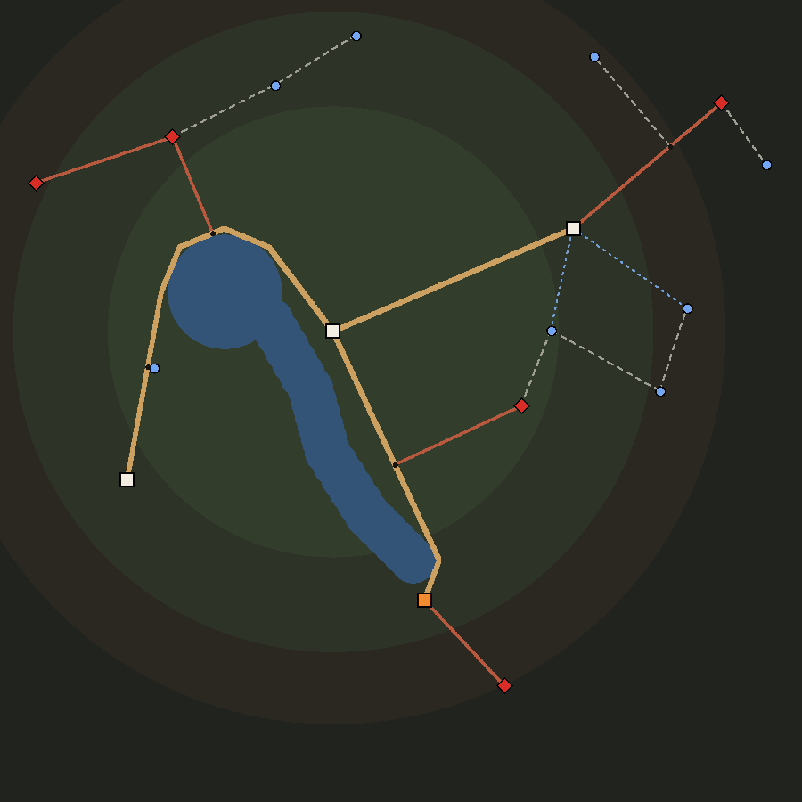
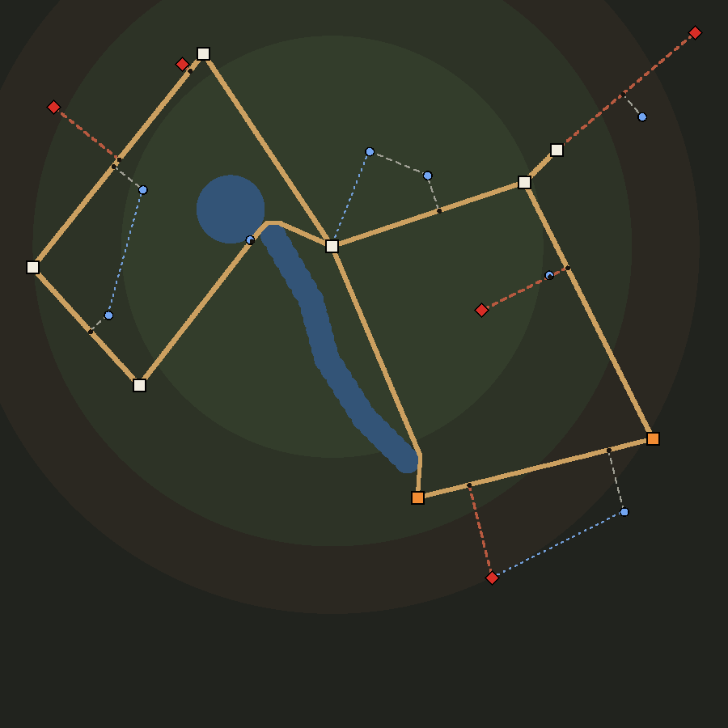
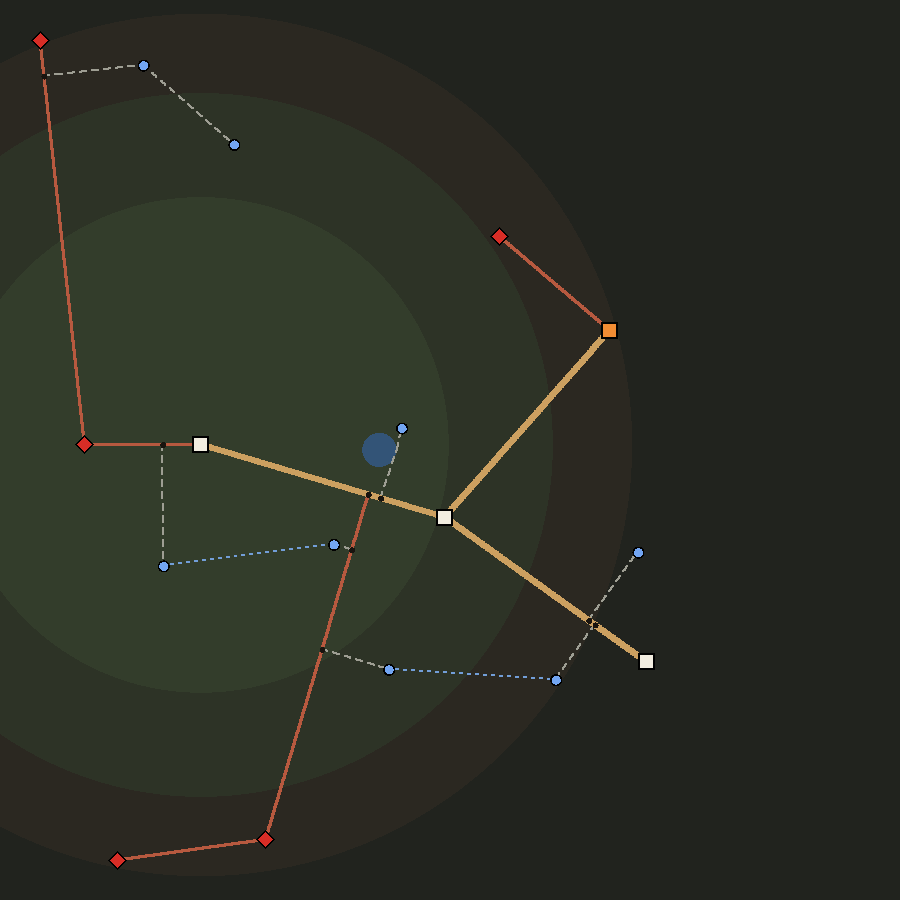
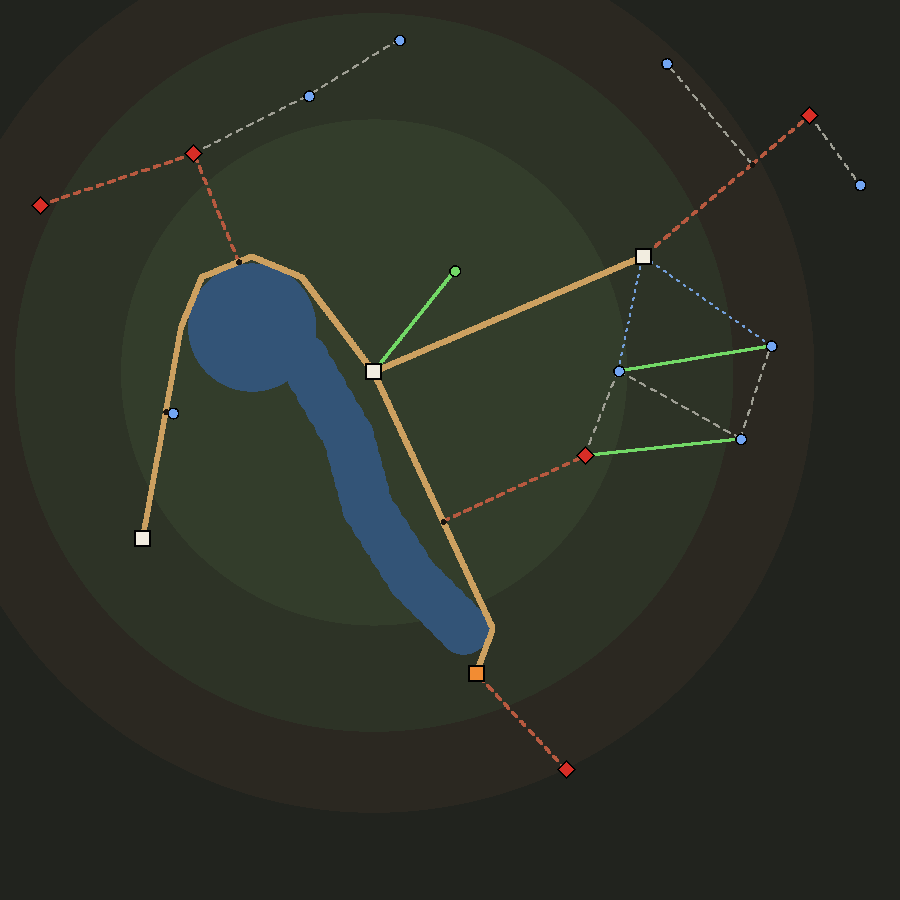

# Spike: roads instead of a free plane (#231)

2026-09-25. A feasibility spike, not a feature: **nothing in the shipped game
reads any of this yet.** What exists on the branch is the network
(`core/world_routes.gd`), the encounter odds (`core/route_encounters.gd`),
the monster peoples' grudge (`core/grudges.gd`), a headless test of each
(`tests/test_world_routes.gd`, `tests/test_route_encounters.gd`,
`tests/test_grudges.gd`), a sweep that measures today's free-roaming
map so the new odds start from the density the game already has
(`tests/sweep_route_travel.gd`), and a picture of the network on each shipped
map, plus the small map after play has opened trails on it
(`tests/shot_routes.gd` → `docs/shots/route-network-*.png`). §6 is the
order the rest lands in; §7 is what the owner decided on 2026-09-25, and what
that changed here.

## 1. What #231 asks

Four things, in the issue's own order:

1. **Scrap travelling to anywhere on the map.** Keep the map.
2. **Distinct, determined paths between the points of interest.** Some
   obvious from the start — settlements and lairs — and some that "will be
   available while taking the route and show themselves as we did in
   landmarks". (Lairs: the owner's later call is that they stay hidden the
   way they are today, §7.) A follow-up: landmarks and decisions can also
   **create** routes that were never on the map (§3.1).
3. **Enemy parties stop spawning, and stop showing on the map.**
4. **What you meet is decided by where you are**: the area, the faction you
   are close to, and the opinion of all factions toward the company shape the
   chance of meeting a monster party, and what it is made of.

Three sub-issues hang off it and are not this spike: #232 (the decisions pop
up when they happen, two or three choices, not always a fight), #234 (a lot
of events, chained, with story attached) and #233 (the same idea inside a
settlement — "can be left for later"). §6 places each.

## 2. What the free plane is today, and what leans on it

The map is a plane you click anywhere on. `World.set_goal` walks the
company there, `WorldPath` (O16) routes it round the water, and the fog
remembers where it has been. Every monster on the map is a figure standing
on it: `WorldBands` fills the map to a population cap and refills it every
half day, `WorldAI` walks each band toward the nearest thing it hates (or
patrols, or raids, or flees — `WorldFlee`), `WorldBattle` fights band against
band off-screen, `WorldAI.respawn` brings a beaten band back in two days, and
the player meets one by letting it close inside `ENCOUNTER_RADIUS` or by
clicking it and giving chase (`WorldChase`). A lair is hidden until a
Survival check finds it; two landmark kinds are too.

That machinery is five of the dozen `core/world_*.gd` files (bands, AI,
battle, flee, chase) and the encounter half of `scenes/world/world.gd`, and a
surprising amount of the rest of the game reads it. The inventory, because it is what decides the phasing:

| Reads the bands or the free plane | What it does with them | Under routes |
|---|---|---|
| `scenes/world/world.gd` click-to-move | a goal anywhere | a place on the network (§6, phase 1) |
| `_check_encounter`, `_seek`, `_chase`, `_night_jump` | contact, click-to-meet, run it down, jumped in the dark | a roll per stretch of road; the night jump stays, on the met band |
| `WorldBands`, `WorldAI`, `WorldBattle`, `WorldFlee`, `WorldChase` | the population | retired with the bands (phase 2) |
| `core/raids.gd` | a raid is a band that walks to a town | the raid becomes a town state plus a pull on its roads — `RouteEncounters` already reads `raided_by` |
| `core/quest.gd` `hunt_party`, `core/callings.gd` | a job or a calling names a band by id | a *pinned* encounter: the named band lives on a set of edges, undrawn, and is what those edges field (phase 2) |
| story `spawn_party`, `world.json` `parties[]` (the mod API) | a pack puts a named band down | the same pin — the vocabulary stays, what it does changes (phase 2) |
| `core/world_camp.gd`, `core/world_rest.gd` | nobody camps with a hostile band in reach; the night steps the bands | the camp keeps its own ambush roll; "in reach" becomes the road's rate (§7) |
| `core/travel.gd` road events, `core/world_forage.gd` | on a world-clock cadence | the same cadence, counted only while walking; #232 turns them into asked cards |
| `core/coop.gd` map share | ships every party's position | the network is deterministic off the map, so the guest builds the same one; only `known` flags and the met band travel |
| minimap, `Party3D`, the fog | draw bands, draw where you have been | draw the known network; the fog stays for the ground |

None of it has to break at once. The network and the odds are pure models
over a `World`, so phase 1 can run them behind a flag while every system above
keeps doing what it does.

## 3. The network — `core/world_routes.gd`

Four tiers built from a rule rather than by hand (a fifth, §3.1, is laid in
play), so every map the game
builds — the two hand-placed ones, every procedural seed, and a pack's — gets
one:

1. **Roads**, known, between the settlements: their *relative neighbourhood
   graph* — two towns get a road when no third town is closer to both of them
   than they are to each other. It is the graph people draw when asked to join
   towns by road: sparse, never crossing itself, loops only where a loop is
   the short way round, and connected by construction (it contains the
   minimum spanning tree).
2. **Tracks**, hidden, to the lairs. Each hangs off the network at a **fork**
   cut into the road nearest it, and — the owner's call, §7 — stays hidden the
   way a lair is today: walking past the fork does not show it; the Survival
   check, made at the fork, does (`searchable()` / `reveal()`). A lair
   already found starts on the map with its track. (The first cut built one
   neighbourhood graph over towns *and* lairs, which put the goblin warren on
   the only road from Riverhold to Greenmarch and left the small map two town
   roads out of eleven edges. A lair is somewhere you go on purpose.)
3. **Paths**, hidden, to the landmarks, hung the same way. Walking past the
   fork reveals the path and the place at its end (`notice()`). The hut and
   the tower — hidden today — keep that: their path is found like a lair's
   track, by the Survival check.
4. **Byways**, hidden: a straight dry shortcut between two places the network
   otherwise makes you walk at least 1.8× the crow's distance to join, noticed
   from either end. One per six places. Finding one is a reason to have gone
   out there.

Two rules hold across all four: every edge is walked over dry ground
(`WorldPath` bends a road round a lake — the small map's road from Riverhold
to Dun-Arrow does), and **nothing crosses** without a node where it does. Spurs
hang Prim-style, nearest first, so a landmark beyond another hangs off the
other's path rather than off a road twice as far away; that is also what
makes discovery chain.

A lead — the ruins' "read the stones", a rumour, D3's scout — reveals a place
*and* the hidden stretch between it and the known roads (`reveal_node()`), so
a place you are told about is a place you can walk to. A place added after the
build (a raid's child lair) hangs off the existing network (`attach()`)
instead of re-running the graph, which would move roads the player has
walked. The whole network is a plain dictionary (`to_dict()` / `from_dict()`);
a save without one rebuilds the same network, because `build()` reads nothing
but the map.

What it looks like (roads thick, lair tracks red, landmark paths pale,
byways dotted blue, anything still hidden dashed; white squares are towns,
orange orc holds, red diamonds lairs, blue dots landmarks; the rings behind):

| Small | Large | Procedural, seed 1 |
|---|---|---|
|  |  |  |

`tests/sweep_route_travel.gd`, part C, on the six maps it walks:

| Map | Nodes (forks) | Road | Track | Path | Byway | Known length / all | Town-to-town detour, mean (worst) |
|---|---|---|---|---|---|---|---|
| small | 21 (4) | 6 | 6 | 8 | 2 | 1746 / 4626 | 1.47 (2.30) |
| large | 32 (11) | 18 | 7 | 8 | 3 | 9293 / 14461 | 1.21 (1.82) |
| procedural 1 | 25 (8) | 7 | 9 | 8 | 2 | 4405 / 17130 | 1.12 (1.49) |
| procedural 2 | 24 (7) | 6 | 9 | 8 | 1 | 3154 / 11461 | 1.16 (1.60) |
| procedural 3 | 26 (9) | 9 | 8 | 8 | 2 | 4401 / 12998 | 1.16 (1.56) |
| procedural 4 | 22 (5) | 6 | 7 | 8 | 0 | 3303 / 9920 | 1.07 (1.25) |

Known length is what the company can walk on the first day: the towns' roads.
Everything else — lair tracks, landmark paths, byways — is found. A build is
5–20 ms. The small map detours most: four towns make a tree of
roads with no loop in it, and two of its three roads bend round the lake and
down the river's bank.

### 3.1 Routes nobody laid

The four tiers are all there on the first day; finding them is walking. The
owner's follow-up on #231 (2026-09-25) asks for more: **a landmark and a
decision can create a route that was not on the map at all** — not revealed,
created. The hermit shows you the goat track over the ridge; the smugglers'
cut runs where no road does; following the tracks leads to a camp that was
not there yesterday. That is a fifth tier, the **trail**, laid at runtime:

- `open_route(world, from, to, why, known)` lays a trail between two nodes,
  dry, round the water. A trail goes where the outcome says rather than where
  the graph would have put a road, so it is the one tier allowed to cross
  another edge — and where it does, it **makes a crossroads** there (both
  edges cut, a node where they meet), so the rule the rest of the network
  keeps still holds: nothing crosses without a node. Laid known by default,
  and both ends become known with it; laid hidden, it is noticed from where
  it starts, like a path. An edge already joining the two is revealed rather
  than laid twice.
- `lead_target(world, from, key)` is where a lead should point: a place
  within half the map's extent that the known roads join at least 1.4× worse
  than the crow flies, or not at all — worst first, seeded among the best
  three by the key (the landmark and its answer, the event and its choice),
  so two leads need not point the same way.
- `scout_spot(world, from, key)` and `open_place(world, kind, ref, pos, from,
  why)` put a **place nobody placed** on the network: a dry spot 200–450 units
  out, 120 clear of every node (a landmark's own gap), with a trail to it.
  The place's world object — a `World.Landmark`, a `World.Lair` — is the
  caller's; the network only needs the node.

Every trail and new place carries its `why` ("landmark:…", "event:…"), and
only the save keeps them: `build()` re-derives the map's own network and
cannot re-derive what a decision did. The small map after two landmarks'
leads and one decision (trails green, the new place a green dot north-east of
Riverhold):

Which doors open trails is the phases' business (§6): a landmark answer in
phase 1, event and meeting outcomes in phase 3, and a pack's story effect
with them.

## 4. Who you meet — `core/route_encounters.gd`

The odds are **per distance walked**, not per world-minute: under routes a
company is only met while it walks a road (the camp keeps its own roll), so a
stretch of road is what carries the danger. One roll per 100 units
(`STEP`), chance `1 − e^(−rate · 100/1000)`.

    rate = BASE × cover × lure  +  hunt  +  grudge

- **BASE** — how busy a road is, 0.34 contacts per 1000 units (0.6 when the
  spike measured it; re-measured in phase 1, §4.1). Measured, not
  chosen, and the same in every ring (§4.1 says why).
- **cover** — each civilized town within 350 units takes up to 60% off at its
  gate, fading to nothing at the radius, *scaled by what that people thinks of
  the company*: nothing from a people at `FactionOpinion.HOSTILE` or worse,
  half from a neutral one, all of it from one at +50. This is where "the
  opinion of all factions" reaches the monsters: the peoples who keep the
  roads keep them for the company they like.
- **lure** — each live lair (and each monster people's hold: an orc town is a
  lair with a market) within 350 units adds up to +100%, and pulls its own
  people into the mix even in a country that is not theirs. A raided town
  (`core/raids.gd`) has the raiders' people on its roads at half a lair's pull
  — the raid no longer needs a figure walking to the gate to be felt.
- **hunt** — a people at or under `HOSTILE` sends its own patrols after the
  company, up to 1.5 contacts per 1000 units near each of its towns, within
  500. Added, not multiplied: a town that hates you does not make the goblins
  keener.
- **grudge** — a monster people with a grudge (`core/grudges.gd`, §4.2) comes
  looking: up to 1 more contact per 1000 units at a full grudge, all of it in
  its own country and near its lairs and holds by their pull. Added, like the
  hunt.

A **second stream**, rolled apart with its own seed (`meet()`), brings the
people who are not a fight: near every civilized town not hostile to the
company, its patrol and its caravans, up to 0.4 meetings per 1000 units at
the gate and none past 500 — split by `WorldBands.KINDS`' own weights. It
never replaces a fight the measured `BASE` promised and never adds one. What a
meeting offers (news, trade, a job) is #232's card, phase 3.

**Who** is the rate split by source — the country's own factions
(`Regions.HOMES`, weighted by `WorldBands.KINDS`, so the mix a player has
learned stays the mix), each nearby lair's people (a hidden lair's too: a
road that keeps turning up gnolls is how a company learns there is something
out there to search for), each hunting people, each people with a grudge.
**What they are made of** is that faction's `KINDS` troop template at the
ring's levels (the rule `WorldBands.spawn_one` already places a band by); a
hunting people sends one more heavy per 20 points it sits below `HOSTILE`,
and a people with a grudge one more per 40 points of it, two at most. `RouteEncounters.band()` turns the result into an ordinary
`World.RoamingParty`, so the approach card, `encounter_spec`, the fight and
the spoils need no second path.

**Opinion, all of it.** The issue says "the opinion of all factions". The
civilized peoples' opinion reaches the monsters through the roads they keep
(cover) and reaches the peoples themselves through the hunt. Monster peoples
keep no opinion of the company in this codebase and never have —
`Approach.parley_costs_opinion`, `Contracts.credit` and world.gd's
`KILLED_THEIRS` all say so on purpose — and the owner's call is to give them
a grudge and only a grudge (§4.2).

**Determinism.** A roll is seeded off the edge and the road's odometer — how
far the company has walked, ever, which the save keeps (`step_key()`): a
reload cannot reroll a road the player did not like, and every stretch walked
is a roll of its own. (The spike first keyed it on the stretch and the
world-day, so the same stretch walked twice in a day met the same thing — a
band beaten on the way out waiting again on the way back. Phase 1 changed it;
its build log entry says so.)

### 4.1 BASE is today's density, measured

`tests/sweep_route_travel.gd` walks today's free-roaming map the way the
world screen runs it — bands seeded, steered by `WorldAI` every tick,
respawned, refilled, raids on the clock — along random itineraries between
places on six maps (small, large, procedural 1–4; 4 itineraries of 30 000
units each), and counts every hostile band that closes to `ENCOUNTER_RADIUS`,
putting it down on the spot as a won fight would. Then it walks the same
itineraries along the network and samples the model every 100 units, every
opinion neutral. Measured 2026-09-25:

| Ring | Today, per 1000 units | Today's mix | Model, `BASE` 0.6 | Model's mix |
|---|---|---|---|---|
| Heartland | 0.81 (280 contacts) | beast, bandit, goblinoid, gnoll, kobold | 0.64 | goblinoid, beast, bandit |
| Marches | 0.71 (154) | goblinoid, bandit, beast, gnoll, orc | 0.66 | beast, bandit, goblinoid, orc, gnoll |
| Frontier | 0.25 (29) | goblinoid, bandit, orc, cultist, kobold | 0.75 | orc, undead, gnoll, cultist, giant |
| Deeps | 0.43 (18) | bandit, beast, monstrosity, goblinoid | 0.78 | undead, elemental, giant, monstrosity, fey |
| **All** | **0.67** (481 in 720 136 units) | | **0.67** (seeded rolls: 0.66) | |

Two things in that table:

- **The total is held.** The mean cover × lure along the itineraries is 1.12,
  so `BASE` = 0.67 / 1.12 = 0.60, and the model delivers today's 0.67 —
  switching it in changes *where* the danger is, not how much.
- **Today the far country is quieter than the near one, and full of the wrong
  people.** 0.25 in the Frontier against 0.81 in the Heartland, and the
  Deeps' contacts are bandits and beasts that followed the company out. A
  hunting band makes for the nearest hostile thing anywhere on the map
  (`WorldAI._hunt_step`); the towns are in the middle, so that is where the
  bands pile up. Copying the per-ring numbers would have built that accident
  into the new model, so `BASE` is flat: the ring already sets the fight's
  level (`Regions.power_scale`) and now sets who is in it. The model's own
  gentle rise outward is the lairs' lure, most of which stand out there.

**Re-measured in phase 1** (2026-09-25, same sweep, same itineraries), after
"a lair for every people" and the Unmapped (#257) changed the maps: today's
free roam delivers 0.47 per 1000 units (340 contacts in 720 113 units), and
with a lair for every people the mean cover × lure along the network rose to
1.38 — so `BASE` = 0.47 / 1.38 = 0.34. The per-ring shape is still upside
down (heartland 0.51, marches 0.41, frontier 0.32, deeps 0.18). The table
above is the spike's measurement, kept as it was taken.

What the sweep leaves out of "today": band-against-band fights
(`WorldBattle` — every one is a full autoplayed combat, and they thin the map,
so today's figure is if anything a little high), fleeing (`WorldFlee` needs
the world screen's gauge of the party), and the time a fight takes.

### 4.2 The grudge — `core/grudges.gd`

One number per monster people, 0 to 100. Putting down one of its bands adds
10, emptying one of its lairs 25; it cools 2 points a world-day, the rate a
town's opinion drifts back to neutral. It is its own model, not
`FactionOpinion`: that one's scores feed the renown ladder, the markets and
the achievements, and a monster people must stay out of all three. There is
no other side to a grudge — no truce, tribute, trade or parley bonus. Phase 1
calls `add()` where world.gd already credits a won fight and
`WorldLairs.loot` empties a lair, and saves it beside `"opinion"` in
`core/world_save.gd`.

## 5. What is measured and what is taste

| Number | Where | Status |
|---|---|---|
| `BASE` 0.34 | `route_encounters.gd` | **measured**, §4.1 (0.6 before #257) |
| `COVER` 0.6, `COVER_RADIUS` 350 | `route_encounters.gd` | taste — first thing phase 1 measures |
| `LURE` 1.0, `LURE_RADIUS` 350, `LAIR_MIX` 3, `RAID_PULL` 0.5 | `route_encounters.gd` | taste |
| `HUNT` 1.5, `HUNT_RADIUS` 500, `GRUDGE_STEP` 20, `GRUDGE_MAX` 2 | `route_encounters.gd` | taste |
| `GRUDGE_HUNT` 1.0, `GRUDGE_HEAVY` 40 | `route_encounters.gd` | taste |
| `BAND` 10, `LAIR` 25, `DECAY_PER_DAY` 2 | `grudges.gd` | taste; the decay is `FactionOpinion`'s |
| `MEET` 0.4, `MEET_RADIUS` 500 | `route_encounters.gd` | taste; the second stream leaves `BASE`'s measurement alone |
| `STEP` 100 | `route_encounters.gd` | a resolution, not a balance number: halving it halves the chance per roll |
| `FORK_SNAP` 40, `NOTICE_RADIUS` 30 | `world_routes.gd` | geometry, sized off `VISIT_RADIUS` 34 and `ENCOUNTER_RADIUS` 24 |
| `BYWAY_DETOUR` 1.8, `BYWAY_REACH` 0.35, `BYWAY_PER` 6 | `world_routes.gd` | taste; the counts they give are in §3 |
| `LEAD_REACH` 0.5, `LEAD_DETOUR` 1.4, `LEAD_PICK` 3 | `world_routes.gd` | taste |
| `SPOT_NEAR` 200, `SPOT_FAR` 450, `SPOT_GAP` 120 | `world_routes.gd` | the gap is `Landmarks.LANDMARK_GAP`; the reach is taste |

The taste numbers cannot be measured before a player walks the roads,
because what they trade is where on a trip the danger sits, not how much of it
there is — the calibration holds the total. Phase 1's drive robot is where
they get their sweep.

## 6. The order it lands in

- **Phase 0 — this spike.** The two models, their tests, the sweep, the
  pictures. Nothing wired.
- **Phase 1 — behind `SORCMERC_ROUTES=1`. Landed 2026-09-25**
  (`core/route_travel.gd`, build log `docs/plan/2026-09-25-route-travel-phase1.md`).
  A map built with the flag set is born a route world, and the save keeps it
  one (`world.routes`, the odometer and the grudges ride in
  `core/world_save.gd`). The known network is drawn on the map; a click on a
  known place walks `path_from()`, and a click on open ground gives no order —
  the company never leaves the road. `notice()` runs every frame, and the lair
  button is the Survival check at a fork. No band is seeded, refilled or
  respawned. `RouteEncounters.roll()` runs once per `STEP` walked and hands its
  band to the existing approach card (or the night's watch), `meet()` hands a
  meeting to the friendly card, and the met band is gone when the meeting is.
  `Grudges.add()` runs on a won fight and an emptied lair. A camp can be made
  anywhere on a road, and its ambush roll reads that stretch's rate. The
  ruins' "read the stones" lays a trail to `lead_target()` — the first door
  that creates a route (§3.1) — and a place marked found by any other door (a
  rumour, the road scout, a story) has its hidden way revealed. A town the
  march only passes through is passed through; the one at the end opens.
  What it left for later is in its build log entry: the taste-number sweep,
  raids and bounty jobs (phase 2), the minimap's roads, roads as ground
  decals, and co-op.
- **Phase 2 — route worlds complete, still behind the flag. Landed
  2026-09-26** (`core/route_pins.gd`, build log
  `docs/plan/2026-09-26-route-travel-phase2.md`). The owner's call: finish
  route worlds before making them the default, and keep free roam as an
  opt-out. A band something names is **pinned**: it stands at one point of a
  road, undrawn, and is met when the company walks past it — a town's bounty
  (the towns on settled ground price one band each on their roads, and the
  boards post them as `hunt_party` jobs, marked on the road), a story's
  `spawn_party`, and a pack's `world.json` `parties[]` when a pack's map is
  born with the flag. A raid is the town state plus the pull, with its band
  pinned at the town's gate for its siege instead of walking there. The mod
  API's vocabulary is unchanged (`sorcmerc-compat`).
- **Phase 2b — routes by default. Landed 2026-09-26** (build log
  `docs/plan/2026-09-26-routes-by-default.md`): a new map is a route world
  unless `SORCMERC_ROUTES=0`, which keeps the free plane. When the free plane
  is gone for good: `WorldBands`, `WorldAI`'s
  hunt, `WorldBattle`, `WorldFlee`, `WorldChase` and click-to-meet retire; a
  free-roaming save adopted into routes pins its named bands and drops the
  rest (`RouteTravel.adopt(world, true)` already does the pinning), and an
  optional `routes` block in `world.json` lets a pack draw its own roads.
- **Phase 3 — #232 and #234.** A met band's card grows past fight / parley /
  slip / ambush into what a road meeting can be (trade, news, tribute, an
  escort job); D3's road events stop resolving themselves and ask, two or
  three choices each — the `options` key `core/travel.gd`'s own `ponytail:`
  has been waiting for; an outcome may pin a follow-up event or encounter on
  a node or edge, which is what makes events chain, and may **open a trail
  or a new place** (`open_route`, `open_place`) — a decision that changes the
  map, each outcome saying whether its trail is shown at once or only
  noticed when the company passes where it starts. The table moves to data (`data/road_events.json`) so packs can add to
  it, and story packs get the same door as an effect beside `reveal_lair`
  (additive vocabulary, through `sorcmerc-compat`).
- **Phase 4 — #233.** The same network at the scale of a settlement: its
  districts, shops and hidden corners as nodes, found by walking.

## 7. The owner's calls (2026-09-25)

Asked at the end of the spike, answered the same day. What each one changed:

1. **Lairs stay hidden, like today.** Not "obvious" after all: a lair's track
   is a `search` edge, found by the Survival check at its fork (§3). A lair's
   lure still thickens its roads while hidden.
2. **The company never leaves the road.** Clicking open ground does nothing
   (phase 1). Discovering paths, byways and trails is the only way to widen
   where you can go.
3. **Friendly meetings are a second stream**, apart from the threat odds
   (§4, `meet()`).
4. **Monster peoples hold a grudge — only a grudge** (§4.2,
   `core/grudges.gd`). No truce, tribute or trade side.
5. **A camp can be made anywhere on a road**; the camp's ambush roll reads
   that stretch's rate (phase 1).
6. **The far country is as busy as the near one.** `BASE` stays flat; the
   ring sets who you meet and how strong the fight is (§4.1).
7. **A new trail is shown at once or not by the outcome that opens it**
   (`open_route(…, known)`, §3.1, phase 3).
8. **Next is phase 1, behind the flag** (§6).
9. **Phase 2 completes route worlds first** — raids, bounties, a story's and a
   pack's bands — still behind the flag; routes by default is its own PR
   after (§6, phase 2b).
10. **Free roam stays, as an opt-out**, for now.

Nothing is open. Phase 3 will need its own calls on what a meeting and a road
event can offer, and those belong to #232 and #234.
